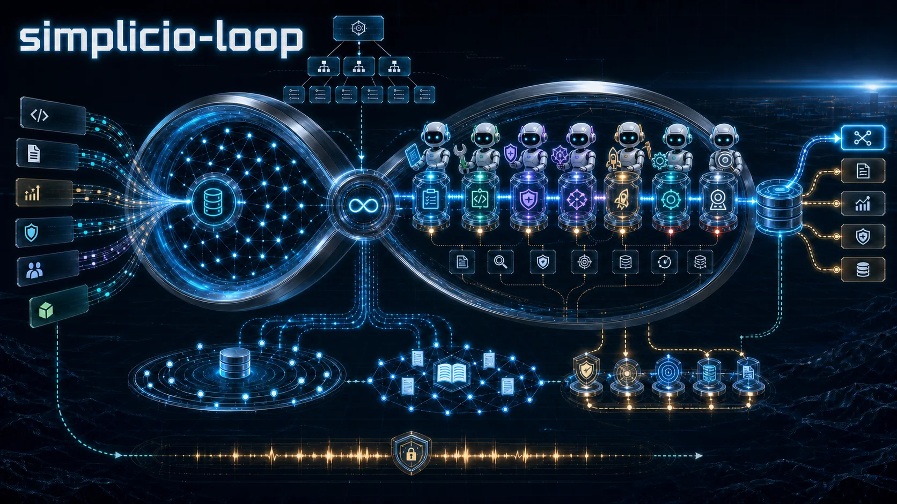
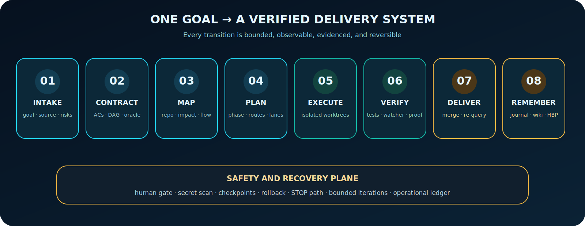
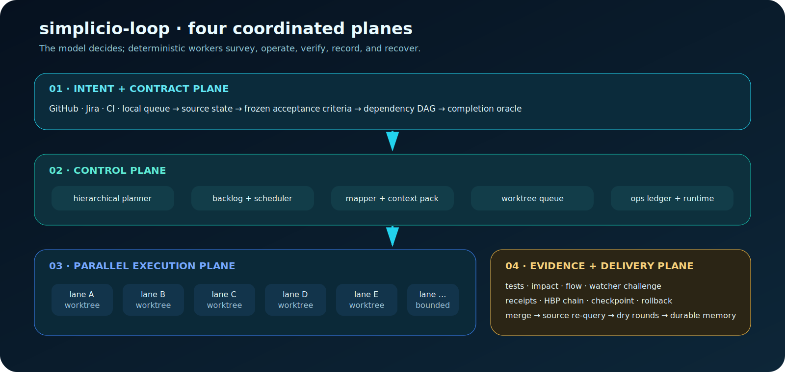
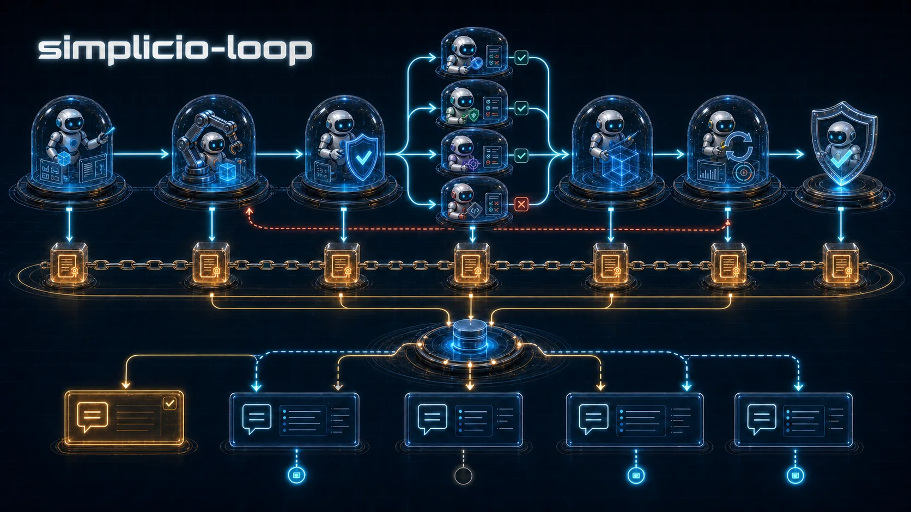
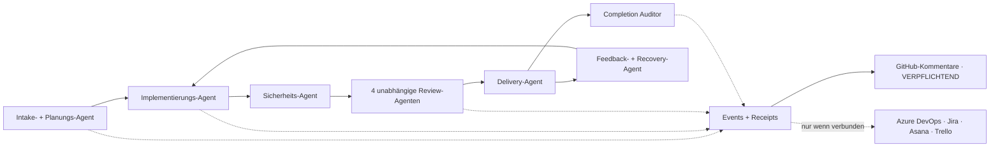

# 🔁 simplicio-loop — The Universal Looping AI Orchestrator

<p align="center">
  
</p>

<p align="center">
  <a href="https://github.com/wesleysimplicio/simplicio-loop/stargazers"></a>
  <a href="#-die-7-skills--5-beschleuniger"></a>
  <a href="#-quelladapter"></a>
  <a href="#-15-laufzeiten-ein-protokoll"></a>
  <a href="#-die-49-erweiterungspunkte"></a>
  <a href="#-token-ökonomie"></a>
  <a href="../LICENSE"></a>
</p>

<p align="center">
  <a href="#-tldr">TL;DR</a> ·
  <a href="#-die-7-skills--5-beschleuniger">7 Skills</a> ·
  <a href="#-quelladapter">Quelladapter</a> ·
  <a href="#-15-laufzeiten-ein-protokoll">15 Laufzeiten</a> ·
  <a href="#-die-schleife">Die Schleife</a> ·
  <a href="#-token-ökonomie">Token-Ökonomie</a> ·
  <a href="#-token-ökonomie">Capture-Engine</a> ·
  <a href="#-installation--nutzung">Installation</a>
</p>

<p align="center">
  <strong>🌍 Languages:</strong><br>
  <a href="../README.md">🇬🇧 English</a> |
  <a href="README.pt-BR.md">🇧🇷 Português</a> |
  <a href="README.es-ES.md">🇪🇸 Español</a> |
  <a href="README.fr-FR.md">🇫🇷 Français</a> |
  <a href="README.de-DE.md">🇩🇪 Deutsch</a> |
  <a href="README.it-IT.md">🇮🇹 Italiano</a> |
  <a href="README.ja-JP.md">🇯🇵 日本語</a> |
  <a href="README.ko-KR.md">🇰🇷 한국어</a> |
  <a href="README.zh-CN.md">🇨🇳 简体中文</a> |
  <a href="README.ru-RU.md">🇷🇺 Русский</a> |
  <a href="README.pl-PL.md">🇵🇱 Polski</a> |
  <a href="README.tr-TR.md">🇹🇷 Türkçe</a> |
  <a href="README.nl-NL.md">🇳🇱 Nederlands</a> |
  <a href="README.hi-IN.md">🇮🇳 हिन्दी</a> |
  <a href="README.ar-SA.md">🇸🇦 العربية</a>
</p>

---

<!-- visual-story:start -->
## 🚀 Die neue Generation — ein Betriebssystem für verifizierte Agentenarbeit

**simplicio-loop ist weit mehr als ein Prompt, der bis zum Abschluss wiederholt wird.** Es übersetzt Absicht in einen eingefrorenen Task-Vertrag, kartiert das Repository, plant nach Abhängigkeiten, verteilt die Ausführung auf isolierte Worktrees, sammelt strukturierte Belege, verifiziert unabhängig, rollt sicher zurück, merkt sich jeden Versuch und hält die maßgebliche Quelle bis zur Auslieferung synchron.

- **Vertrag zuerst** — Akzeptanzkriterien, Abhängigkeiten, Risiken, Quellenstatus und Completion Oracle sind vor der Ausführung explizit.
- **Parallel ohne Korruption** — bereite Tasks laufen in isolierten Lanes/Worktrees und konvergieren über ein operatives Ledger.
- **Beweis vor Abschluss** — Tests, Impact-/Flow-Prüfungen, Watcher-Challenges, Lieferbelege und HBP-Evidenz weisen falsche Done-Zustände zurück.
- **Gedächtnis, das Verhalten ändert** — Journal, Stall Detector, Checkpoints und Cross-Agent-Wiki verhindern Oszillation und machen Handoffs dauerhaft.

<p align="center">
  
</p>

<p align="center"><em>Abhängigkeitsgesteuerter Fan-out: isolierte Worker arbeiten parallel, liefern Evidenz zurück und konvergieren zu einer verifizierten Lieferung.</em></p>

<p align="center">
  
</p>

<p align="center"><em>Jede Stufe ist explizit, begrenzt, beobachtbar und reversibel.</em></p>

<p align="center">
  
</p>

<p align="center"><em>Evidenz und Gedächtnis sind Teil des Ausführungspfads — kein nachträglich geschriebener Bericht.</em></p>

Diese Architektur macht aus einem Ziel ein gesteuertes Liefersystem: von einer schwierigen Aufgabe bis zum gesamten Backlog, über Sessions und Runtimes hinweg, mit Local-first-Operatoren und Belegen, die Menschen, CI oder andere Agenten auditieren können.

<p align="center">
  
</p>
<!-- visual-story:end -->

<!-- stage-agents-roadmap:start -->
## 🤖 Roadmap — ein konkreter Agent hinter jeder Stufe

> **Status:** geplante Architektur in [#422](https://github.com/wesleysimplicio/simplicio-loop/issues/422)–[#436](https://github.com/wesleysimplicio/simplicio-loop/issues/436). Der kanonische GitHub-Lifecycle-Kommentar existiert bereits; das vollständige Gate für Stage-Agents und verpflichtendes Reporting wird in [#433](https://github.com/wesleysimplicio/simplicio-loop/issues/433) umgesetzt.

Intake/Planung, Implementierung, Sicherheit, Lieferung, Recovery und Abschlussaudit erhalten je einen verantwortlichen Agenten. Review verzweigt in vier unabhängige Agenten — Sicherheit/Korrektheit, Qualität, Runtime/E2E-Reproduktion und Blast Radius — und konvergiert erst danach.

<p align="center"></p>



**Richtlinie:** GitHub ist für GitHub-gebundene Runs verpflichtend; `COMPLETE` wartet auf Remote-Bestätigung. Azure DevOps, Jira, Asana und Trello erhalten nur nach nachgewiesener Verbindung, Authentifizierung, Autorisierung und Zielauflösung Kommentare; `NOT_CONNECTED` ist ein expliziter, nicht blockierender Skip. Vertrag und Tests: [#436](https://github.com/wesleysimplicio/simplicio-loop/issues/436).
<!-- stage-agents-roadmap:end -->

## 🆕 Neuerungen in v3.38.0 — Multi-Agent-Koordination

Dieses Release löst ein Problem, das erst sichtbar wird, sobald **mehrere Agenten-Sessions
gleichzeitig am selben Repo arbeiten**: Woher weiß eine Session, was schon beansprucht ist, was
zwar gemergt aber unvollständig geblieben ist, und was sie mit ihrer eigenen Leerlaufzeit tun soll,
statt die Arbeit einer Schwester-Session zu duplizieren? Jeder Punkt unten wurde am **echten,
mehrsitzungs-parallelen Zustand dieses Repos** gebaut, getestet und ausgeliefert — kein
Synthetik-Szenario.

- **`scripts/coordinator.py` — der Entscheidungskern.** Anhand des aktuellen GitHub-Zustands
  (offene Claim-Kommentare + gemergte PRs) liefert er pro Issue genau eine deterministische
  Aktion: `OWN` (noch nichts beansprucht), `CONTINUE_OWN` (du bist bereits der letzte
  Anspruchsteller), `DEFER_ACTIVE_CLAIM` (eine Schwester-Session hat es kürzlich beansprucht —
  nicht duplizieren), `RECLAIM_STALE` (der Claim ist erkaltet, sicher zu übernehmen) oder
  `VERIFY_PARTIAL` (ein PR ist für dieses Issue bereits gemergt, es ist aber noch offen — prüfen,
  was wirklich erledigt ist). Er meldet zudem ein `duplicate_risk`-Flag, sobald zwei Sessions
  dasselbe Issue kurz hintereinander beanspruchen. Live am ersten Tag erwischt: zwei Sessions
  bauten unabhängig voneinander einen Findings-Collector für dasselbe Issue unter zwei
  verschiedenen Dateinamen.
- **`scripts/pr_dod_review.py` — der Reviewer für Leerlaufzeit.** Sind alle offenen Issues bereits
  beansprucht, ist der wertvollste nächste Schritt nicht Warten, sondern die offenen PRs gegen die
  eigene Messlatte des Repos zu prüfen: die 7-dimensionale Definition of Done (Implementierung,
  Unit-/Integrations-/System-/Regressionstests, Performance-Benchmark, ≥85 % Coverage) plus die
  eingefrorene Akzeptanzkriterien-Liste des zugrunde liegenden Issues. `check --post` postet ein
  mechanisches, punktgenaues Urteil als PR-Kommentar statt einer Bauchgefühl-Freigabe. Beweis
  gegen einen echten, bereits gemergten „MVP-Slice"-PR: **17 von 17** Akzeptanzkriterien des
  übergeordneten Epics wurden korrekt als noch offen markiert.
- **`scripts/finding_collector.py` — dauerhaftes, dedupliziertes Defekt-Gedächtnis** (Issue #466,
  Phase 1). Ein `simplicio.finding/v1`-Datensatz pro eindeutigem Defekt, per Fingerprint erkannt,
  sodass derselbe zugrunde liegende Bug — von jedem Agenten, jedem Lauf, egal wann gesehen — in
  einen Datensatz mit Vorkommenszähler kollabiert, statt Duplikate zu erzeugen. Noch ohne
  GitHub-Aufrufe — das ist die nächste Phase. `scripts/evolution.py` (Taxonomie + Priorität +
  Dedup) und `scripts/workflow_topology.py` (DAG-Diff + Validator) liefen als erste MVP-Slices der
  begleitenden Epics Continuous Evolution (#467) und Adaptive Architecture (#468) mit;
  `scripts/agent_replication.py` tat dasselbe für Elastic Replication (#469).
- **`references/multi-agent-coordination.md` + `references/background-verification.md`** — zwei
  neue Konventionen, direkt in den Triage-Schritt der `SKILL.md` verdrahtet: vor dem Anfassen eines
  Issues die Coordinator-Ownership prüfen, statt im Leerlauf PRs reviewen, wenn alles beansprucht
  ist, und langsame Verifikationsbefehle (Tests/`claims_audit.py`) im Hintergrund starten, damit
  eine Runde weiter vorankommt, statt auf einen Fortschrittsbalken zu starren.
- **Verpflichtendes Post-Merge-Cleanup** (`scripts/worktree_cleanup.py`, #484) — Worktree und
  Branch-Ref eines gemergten Branches werden jetzt automatisch entfernt, statt sich über Sessions
  hinweg anzuhäufen.
- **CLI-Vertrags-Erweiterungen** (WI-471) — ein `preflight`-Subkommando und ein `--json`-Flag auf
  `status`, damit ein externer Supervisor die Startbereitschaft maschinell prüfen kann.
- **Zwei echte Regressionen live gefunden und gefixt, direkt auf `main`, in diesem Release-Zyklus**
  — ein PR löschte still eine Funktionsdefinition (brach den eigenen Selftest von
  `loop_progress.py`), wurde gemergt, und eine Squash-Merge-Race reproduzierte denselben kaputten
  Code ein zweites Mal auf `main`. Beide wurden gefunden, weil das betroffene Skript tatsächlich
  ausgeführt wurde — nicht weil einer grünen PR-Beschreibung vertraut wurde. Genau deshalb gibt es
  jetzt `coordinator.py` und `pr_dod_review.py`.
- **Aus v3.37.0 übernommen** (Portable Stage Agents, #422–#436) — ein konkreter, unabhängig
  verifizierbarer Agent hinter jeder Stufe, eine Konformitätssuite, die Vertrags-/Beleg-Parität
  über alle 15 Laufzeiten beweist, und `simplicio-runtime`, das jetzt wie `simplicio-mapper`/
  `simplicio-dev-cli` ein verpflichtender gebundener Operator ist.
- **Test-Suite auf 231 Dateien gewachsen** (von 192); `scripts/claims_audit.py` blieb über den
  ganzen Zyklus bei 14/14.

**Was das für dich konkret bedeutet:** Läufst du `simplicio-loop` über mehr als eine Session oder
Maschine gegen dasselbe Repo, schützt es dich jetzt aktiv vor den zwei Fehlermodi, die in der Praxis
tatsächlich passieren — zwei Agenten, die still dieselbe Arbeit wiederholen, und ein „fertiger" PR,
der gemergt wurde, das eigentliche Issue aber nur teilweise löst. Beides war vorher unsichtbar; jetzt
ist es das mechanisch, bei jedem Triage-Durchlauf.

Vollständige Liste: [`CHANGELOG.md`](../CHANGELOG.md), signierte Artefakte (Wheel, sdist, SBOM,
Provenance) im [v3.38.0-Release](https://github.com/wesleysimplicio/simplicio-loop/releases/tag/v3.38.0).

## ⚡ TL;DR

**simplicio-loop** ist ein laufzeitunabhängiges **Super-Plugin** — ein autonomer, schleifenfähiger
Orchestrator (aufgerufen als **`/simplicio-loop`**) plus **fünf Satelliten-Skills** — das jedes
starke LLM (Claude, Codex, Copilot, Gemini, Cursor, lokale Modelle) in einen selbstfahrenden Worker
verwandelt. Du richtest es auf einen Arbeitsumfang aus — *„schließe alle offenen Issues ab"*,
*„arbeite die CI-Warteschlange ab"*, *„leere das Jira-Board"* — und es durchläuft den gesamten
Lebenszyklus eigenständig:

> **entdecken → verstehen → entscheiden → handeln → verifizieren → korrigieren → festhalten → wiederholen**

Es entdeckt Arbeit aus jeder beliebigen Quelle (GitHub Issues, Jira, Azure DevOps, agentsview-Sessions
und mehr), entfernt Duplikate, skaliert eine Agentenflotte automatisch auf deine Maschine, setzt jedes
Element über eine Qualitätsschleife um, die **den Code ausführt (nicht nur kompiliert)**, eröffnet PRs,
löst CI-/Review-Feedback auf, merged und behält **rund um die Uhr** neue Arbeit im Blick — alles hinter
Sicherheits-Gates und einem expliziten STOP/Cancel-Pfad.

```text
/simplicio-loop finish all open issues
→ identity + pre-flight (auth, runtime, STOP path)
→ discover 50 issues · dedup · build dependency DAG
→ autoscale fleet = 14 · pipeline implement→review→merge
→ each item: read body+ACs → orient code → plan → edit → run → verify → PR
→ merge · close with evidence · rollback if main breaks
→ keep looping every ~2 min until the queue is dry (evidence-gated, never a false "done")
```

Drei Dinge machen es anders: es ist ein **Super-Plugin aus fokussierten Skills**, es führt **dasselbe
Protokoll auf 15 Laufzeiten** aus, und es tut all das mit **aggressiver, ehrlicher Token-Ökonomie**.

---

## 📘 Offizielles Fähigkeitenverzeichnis

Das vollständige, offizielle Verzeichnis dessen, was `simplicio-loop` mitbringt — jede Fähigkeit unten ist
**real, ausführbar und getestet** (`python3 scripts/check.py`: Claims-Audit 14/14 + 2.544 gesammelte Tests
über 231 Dateien). Jede verlinkt auf ihren ausführlichen Abschnitt und ihren Worker.

| Fähigkeit | Was sie tut | Nachweis / Worker | Details |
|---|---|---|---|
| 🎬 **Video-Belege** (`video_evidence`) | Zeichnet die **echte Browser-Session** als bewegten Beleg auf, dass eine UI-Änderung funktioniert (Playwright, Standard); rendert für eine explizite Erklärvideo-Anfrage (`/simplicio-loop make a video of screen X`) eine **deterministische, beschriftete MP4** mit [hyperframes](https://github.com/heygen-com/hyperframes) | `scripts/video_evidence.py` · BLOCKIERT (niemals Fake-Pass) ohne die Toolchain | [§ Video-Belege](#-video-belege--playwright-standardmäßig-hyperframes-auf-anfrage) |
| 🧠 **Versuchsgedächtnis + Stall-Detektor** | Ein dauerhaftes Run-Journal (`.orchestrator/loop/journal.jsonl`) + ein Stall-Detektor, sodass die Schleife **die Strategie ändert, statt zu oszillieren**; inkrementelle Triage (`since`) liest jede Runde nur das Delta | `scripts/loop_journal.py` · `selftest` 13/13 | [§ Anti-Oszillation](#-versuchsgedächtnis--stall-detektor-anti-oszillation) |
| 🔒 **Fail-closed-Sicherheits-Gate** (`action_gate`) | Ein `PreToolUse`-/git-pre-push-Hook, der Force-Push, History-Rewrite, Massenlöschung, destruktives DDL, Infra-Teardown und secret-behaftete Commits/Pushes **mechanisch blockiert** — Schritt 5 ausführbar gemacht, nicht als Prosa | `hooks/action_gate.py` · `selftest` 15/15 | [§ Sicherheit](#-sicherheit-nicht-verhandelbar) |
| 🔬 **Lokale Verifikation** | Eine Test-Suite (Worker-Selftests + ein **E2E des Schleifentreibers**, der den nachweis-gegateten Ausgang beweist) + ein **Claims-Audit** (referenzierte Skripte existieren · Zählungen konsistent · `_bundle ≡ source`) — alles lokal, **kein bezahltes CI** | `scripts/check.py` · `scripts/claims_audit.py` · `tests/` | [§ Tests & lokale Prüfungen](#-tests--lokale-prüfungen-kein-bezahltes-ci) |
| ✅ **Ehrliche Einsparungen** | Die Einsparungszeile ist nun **nachweis-gegatet, nicht obligatorisch** — eine Zahl wird nur mit einem gemessenen Beleg gezeigt (Clamp/Signaturen/Cache/`deterministic_edit`/Ledger); niemals erfunden | Token-Ökonomie-Vertrag | [§ Token-Ökonomie](#-token-ökonomie) |
| 🤝 **Multi-Agent-Coordinator** (`coordinator.py`) | Entscheidet `OWN`/`CONTINUE_OWN`/`DEFER_ACTIVE_CLAIM`/`RECLAIM_STALE`/`VERIFY_PARTIAL` pro Issue anhand live gelesener Claim-Kommentare + gemergter PRs, damit zwei Sessions nie dieselbe Arbeit duplizieren | `scripts/coordinator.py` · `selftest` 10/10 | [§ Der vollständige Ablauf](#️-der-vollständige-ablauf--von-der-anforderung-zur-auslieferung) |
| 🕵️ **PR-DoD/AC-Reviewer** (`pr_dod_review`) | Sind alle Issues beansprucht, prüft er offene PRs gegen die 7-dimensionale Definition of Done + die eigene Akzeptanzkriterien-Liste des Issues — ein mechanisches Urteil, keine Bauchgefühl-Freigabe | `scripts/pr_dod_review.py` · `selftest` 13/13 | [§ Der vollständige Ablauf](#️-der-vollständige-ablauf--von-der-anforderung-zur-auslieferung) |
| 🐞 **Finding-Collector** (`finding_collector`) | Per Fingerprint dedupliziertes Defekt-Gedächtnis — derselbe zugrunde liegende Bug kollabiert in einen Datensatz mit Vorkommenszähler, egal wie viele Agenten/Läufe ihn beobachten | `scripts/finding_collector.py` · `selftest` 9/9 | [§ Offizielles Fähigkeitenverzeichnis](#-offizielles-fähigkeitenverzeichnis) |

Zwei Schleifen-**Modi** machen die Beendigung explizit: **converge** (eine einzelne harte Aufgabe — endet
mit dem nachweis-gegateten `<promise>` oder einer Stall-Eskalation) vs. **drain** (eine Warteschlange — endet,
wenn die erneute Quellabfrage K Runden lang leer bleibt). Beide befolgen weiterhin die universellen Ausgänge
Both modes are still governed by universal exits: promise+evidence, `max_iterations`, and STOP.

> Loop-Bewertung über diese Arbeitslinie: **7,5** (starkes Design, unbewiesen) → **9** (Versuchsgedächtnis +
> Anti-Oszillation) → **9,5** (reproduzierbarer lokaler Beweis) → **~10** (erzwungene Sicherheit + vollständige
> Schleifensemantik). Die Verifikationsinfrastruktur fängt nun die eigenen Regressionen des Projekts ab, während es wächst.

---

## 🧠 Die 7 Skills + 5 Beschleuniger

Der Orchestrator-Kern + sechs Satelliten + fünf Beschleuniger/Integrationen. Jeder Satellit ist
**optional** — wenn geladen, delegiert der Orchestrator an ihn (reichhaltiger + günstiger); wenn nicht
vorhanden, deckt das Inline-Protokoll 100 % ab. Beschleuniger werden **automatisch erkannt** — vorhanden
= genutzt, fehlend = LLM-Fallback.

| # | Fähigkeit | Greift auf | Was sie tut | Token-Auswirkung |
|---|---|---|---|---|
| 1 | 🔁 **simplicio-loop** | — | Unified public entrypoint: orchestrator core + hardened loop behind one command | Core + loop |
| 2 | ↩️ **simplicio-tasks** | legacy alias | Compatibility shim for older installs and saved prompts | Legacy alias |
| 3 | 🧱 **simplicio-orient** | [rtk](https://github.com/rtk-ai/rtk) + [caveman](https://github.com/JuliusBrussee/caveman) | Terminal-first-Ausführung, Ausgabe-Reduktionskatalog, tee-Cache, Signaturen-Lesemodus | L0 deterministisch |
| 4 | 🔥 **simplicio-review** | [thermos](https://github.com/cursor/plugins/tree/main/thermos) | Parallele adversariale Review auf eigenen Rubriken → dedupliziertes Urteil | Qualitäts-Gate |
| 5 | 🗜️ **simplicio-compress** | [caveman](https://github.com/JuliusBrussee/caveman) | Ausgabe- + Memory-Kompression, fail-closed `transform_guard` | 40–60 % weniger |
| 6 | 🎓 **simplicio-learn** | [teaching](https://github.com/cursor/plugins/tree/main/teaching) | Post-Run-Retrospektive → dauerhafte, deduplizierte Lektionen im Memory | Klüger pro Lauf |
| 7 | 🧪 **simplicio-autoresearch** | Karpathy [autoresearch](https://github.com/balukosuri/Andrej-Karpathy-s-Autoresearch-As-a-Universal-Skill) + ECC `autoresearch-agent` | Evolutionäre Mutate/Eval/Keep-Revert-Schleife: yool-gedeckelte Caps, git-isolierter Branch, Anti-Goodhart-Gate-first-Eval, `savings-event`-Beleg | Auto-Optimierung |
| 8 | 🧭 **Understand Anything** | [Egonex-AI](https://github.com/Egonex-AI/Understand-Anything) | Knowledge-Graph-Orientierung: semantische Suche, geführte Touren, Abhängigkeitsgraph | **L0 null Tokens** |
| 9 | 📊 **agentsview** | [kenn-io](https://github.com/kenn-io/agentsview) | Session-Analytik, Kostenverfolgung, Erkennung blockierter Sessions | **L1** nur SQL |
| 10 | ⚡ **LMCache** | [LMCache](https://github.com/LMCache/LMCache) | KV-Cache zwischen Schleifenrunden — 40–70 % TTFT-Reduktion bei lokalen Modellen | GPU-Zeit ↓ |
| 11 | 🗜️ **Simplicio-Capture-Engine** | `engine/simplicio_engine.py` (nativ, nur stdlib) | Transparenter Capture-Proxy: leitet an den echten Provider weiter, misst + komprimiert deterministisch, schreibt `proxy_savings.json` | **deterministisch** |
| 12 | 🎬 **video_evidence** | Playwright (Standard) · [hyperframes](https://github.com/heygen-com/hyperframes) (auf Anfrage) | Zeichnet die **echte Session** als bewegten Beleg einer UI-Änderung auf (Playwright); rendert mit hyperframes ein **deterministisches, beschriftetes MP4**-Erklärvideo, wenn das Video selbst das Liefergut IST | Beleg-Produzent |

Jeder Skill liegt unter [`.claude/skills/`](../.claude/skills); jeder Beschleuniger hat ein Referenzdokument
unter `.claude/skills/simplicio-loop/references/` (der Video-Produzent:
[`video-evidence.md`](../.claude/skills/simplicio-loop/references/video-evidence.md), Worker
[`scripts/video_evidence.py`](../scripts/video_evidence.py)).

---

## 📡 Quelladapter

Der Orchestrator entdeckt Arbeit aus jeder Quelle über einsteckbare Adapter. Jeder bietet sechs Verben:
`list_ready`, `get_details`, `claim`, `update_status`, `attach_evidence`, `close`.

| Quelle | Adapter | Zweck |
|---|---|---|
| GitHub Issues/PRs | `gh` CLI (nativ) | Primäre Arbeitselement-Quelle; kanonische Lifecycle-Kommentare bereits produktiv |
| Azure DevOps | `az boards` / Host-Connector | Azure-Boards-Discovery; Stufen-Kommentare erst nach echtem, geprüftem Connector |
| Jira | Host-Connector | Jira-Discovery; Stufen-Kommentare nur bei bestehender Verbindung |
| Asana | Host-Connector | Asana-Discovery; Stufen-Kommentare nur bei bestehender Verbindung |
| Trello | Host-Connector | Trello-Discovery; Stufen-Kommentare nur bei bestehender Verbindung |
| ClickUp / Linear / Notion | Host-Connector | Board-/Projektverwaltung; kein Stufen-Kommentar-Claim ohne zertifizierten Adapter |
| **agentsview-Sessions** | `scripts/agentsview_adapter.py` | Wiederherstellung blockierter Sessions + Kostentransparenz |
| Lokale Dateien / CI-Warteschlange | Dateisystem / CI-API | Interne Arbeitsverfolgung |

Siehe das Referenzdokument jedes Adapters unter `.claude/skills/simplicio-loop/references/`.

---

## 🌐 15 Laufzeiten, ein Protokoll — 3 garantiert + 12 Best-Effort

Ein universeller Skill-Kern + ein Satz Hooks treibt jede Laufzeit an. Ein Adapter ist dünn: er sagt
einer Laufzeit, *wo die Skills geladen werden*, *wie die Schleife scharfgeschaltet wird* und *wie die
native Geschwindigkeit gebunden wird*. **Die Skill benennt keine Laufzeit; die Laufzeit erkennt die
Skill.** Die native `simplicio-runtime`-MCP-Bindung ist auf jeder Laufzeit **VERPFLICHTEND** (die
Schleife BLOCKIERT, wenn sie fehlt/unerreichbar ist) — siehe [`docs/MCP_SETUP.md`](../docs/MCP_SETUP.md)
für die Konfigurationstabelle pro Host.

### Stufe 1 — Garantiert (bei jedem Commit gegatet)

| Laufzeit | Skill-Laden | Schleifenantrieb | Native Bindung (MCP) |
|---|---|---|---|
| **Claude Code** | `.claude/skills/` + plugin | `Stop`-Hook | VERPFLICHTEND — `~/.claude.json` |
| **Codex** | `AGENTS.md` | selbstgetaktet | VERPFLICHTEND — `~/.codex/config.toml` |
| **Cursor** | `.cursor-plugin/` | `stop`+`afterAgentResponse` | VERPFLICHTEND — `.cursor/mcp.json` |

### Stufe 2 — Best-Effort (Beiträge willkommen, kein Gate)

| Laufzeit | Skill-Laden | Schleifenantrieb | Native Bindung (MCP) |
|---|---|---|---|
| **VS Code (Copilot)** | `copilot-instructions.md` | tasks | VERPFLICHTEND — `.vscode/mcp.json` |
| **Antigravity** | rules / `AGENTS.md` | selbstgetaktet | VERPFLICHTEND — Best-Effort-Pfad |
| **Kiro** | `.kiro/steering/` | specs | VERPFLICHTEND — `.kiro/settings/mcp.json` |
| **OpenCode** | `AGENTS.md` | selbstgetaktet | VERPFLICHTEND — `opencode.json` |
| **Gemini** (CLI/Code Assist) | `GEMINI.md` | selbstgetaktet | VERPFLICHTEND — `.gemini/settings.json` (CLI) |
| **Kimi** | eingebettete Konventionen | selbstgetaktet | VERPFLICHTEND — Best-Effort, kein geprüfter Client |
| **Qwen** (Code/CLI) | `AGENTS.md`-Äquivalent | selbstgetaktet | VERPFLICHTEND — `.qwen/settings.json` (Best-Effort) |
| **DeepSeek** | eingebettete Konventionen | selbstgetaktet | VERPFLICHTEND — kein First-Party-Client, Best-Effort |
| **Aider** | `CONVENTIONS.md` | selbstgetaktet | VERPFLICHTEND — kein MCP-Client (LLM-Fallback für Ausführung) |
| **Simplicio Agent** *(vormals Hermes)* | native recall | native Schleife | VERPFLICHTEND — **nativ** |
| **OpenClaw** | plugin SDK | nativer Scheduler | VERPFLICHTEND — **nativ** |
| **Orca** | via innerem Agenten + Skill-Registry | innerer Hook / geplante Automationen | VERPFLICHTEND — Registry-/Inner-Agent-Konfiguration |

Das Versprechen: **dasselbe Protokoll, dieselben Gates, dieselbe Sicherheit auf allen 15 — Stufe 1
mechanisch geprüft, Stufe 2 Best-Effort.** `orient_clamp.py` (Token-Ökonomie) funktioniert auf jeder
Laufzeit ohne jegliche Verdrahtung. Siehe [`adapters/MATRIX.md`](../adapters/MATRIX.md) für die
Promotion-/Demotion-Regeln.

---

## 🗺️ Der vollständige Ablauf — von der Anforderung zur Auslieferung

Jede Ebene, auf die der Orchestrator einwirkt, der Reihe nach — vom Lesen der Anforderung (Issues, Tasks,
Zuweisungen) bis zur Auslieferung gemergter, belegter Arbeit, dann das Schleifen rund um die Uhr für mehr.

```mermaid
flowchart LR
  IN["Intent: issue · task · queue"] --> CONTRACT["1 · Freeze task contract"]
  CONTRACT --> MAP["2 · Map source + normalize"]
  MAP --> COORD{"3 · Coordinator decide (multi-session)"}
  COORD -->|"OWN / CONTINUE_OWN / RECLAIM_STALE"| PLAN["4 · Dependency DAG + acceptance criteria"]
  COORD -->|"DEFER_ACTIVE_CLAIM (all issues)"| REVIEW["PR DoD/AC review — never idle"]
  COORD -->|"VERIFY_PARTIAL"| RECHECK["Verify what's actually merged before continuing"]
  RECHECK --> PLAN
  REVIEW --> IN
  PLAN --> ROUTE{"5 · Ready task?"}
  ROUTE -->|"solo / small"| SOLO["Targeted lane"]
  ROUTE -->|"parallel / medium+"| FAN["Bounded fan-out"]
  FAN --> A["Isolated worktree A"]
  FAN --> B["Isolated worktree B"]
  FAN --> C["Isolated worktree C"]
  SOLO --> VERIFY["6 · Test + impact/flow evidence"]
  A --> VERIFY
  B --> VERIFY
  C --> VERIFY
  VERIFY --> RECEIPT["Watcher challenge + evidence receipt"]
  RECEIPT --> ORACLE{"7 · Completion oracle"}
  ORACLE -->|"pending / blocked"| RECOVER["Journal · checkpoint · rollback · backlog-only maintenance"]
  RECOVER --> PLAN
  ORACLE -->|"verified / measured"| DELIVER["8 · Source sync · PR · merge"]
  DELIVER --> CLEANUP["Post-merge worktree/branch cleanup"]
  CLEANUP --> MEMORY["9 · Ledger · wiki · durable attempt memory"]
  MEMORY --> WATCH["10 · Re-feed · watcher · STOP path"]
  WATCH -->|"new work"| IN
```



**Multi-Agent-Koordination (neu in v3.38.0).** Schritt 3 ist die mechanische Antwort auf „hat eine
Schwester-Session das schon übernommen?" — `scripts/coordinator.py` entscheidet anhand des
tatsächlichen GitHub-Zustands, niemals aus Vermutung. Kommen alle Kandidaten-Issues als
`DEFER_ACTIVE_CLAIM` zurück, geht die Schleife nicht in den Leerlauf — sie reviewt stattdessen offene
PRs gegen DoD + Akzeptanzkriterien (`scripts/pr_dod_review.py`). Details:
[`references/multi-agent-coordination.md`](../.claude/skills/simplicio-loop/references/multi-agent-coordination.md).

---

## 🔁 Die Schleife

Die **nachweis-gegatete Schleife** ist der Kernmechanismus. Sie speist dasselbe Ziel in jeder Runde
erneut ein, sodass der Agent seine eigene frühere Arbeit sieht. Der Ausgang erfolgt NUR über:

1. **Nachweis-gegateter `<promise>`** — die Runde, die das Versprechen ausgibt, MUSS auch konkrete
   Belege tragen (bestandener Test, gemergter PR, erneute Abfrage des geschlossenen Elements). Ein
   Versprechen ohne Belege = ignoriert.
2. **`max_iterations`-Obergrenze** — harter Sicherheitsanschlag
3. **STOP/cancel path** — explicit STOP file or channel command stops unattended runs
4. **STOP-Signal** — `.orchestrator/STOP` oder Kanalbefehl

Zwischen den Runden cached LMCache (sofern verfügbar) den KV-Zustand, sodass das erneute Einspeisen
nahezu null Prefill kostet.

### 🧠 Versuchsgedächtnis + Stall-Detektor (Anti-Oszillation)

Eine Re-Feed-Schleife, die sich nichts merkt, oszilliert — versuche X, scheitere, versuche X erneut — bis
die Obergrenze verbrennt. simplicio-loop führt ein **dauerhaftes Run-Journal**
(`.orchestrator/loop/journal.jsonl`, nur anhängend: `iteration · action · hypothesis · gate ·
error-fingerprint`) und einen **Stall-Detektor** ([`scripts/loop_journal.py`](../scripts/loop_journal.py),
deterministisch + modellfrei):

- **Fehler-Fingerprint** — die Ausgabe des fehlgeschlagenen Gates wird auf einen stabilen Hash reduziert,
  wobei Zeilennummern, Pfade, Hex/UUIDs, Zeitstempel und Dauern wegnormalisiert werden, sodass *derselbe*
  Bug über Runden hinweg erkannt wird, selbst wenn der nebensächliche Text abweicht.
- **Stall = K identische Fingerprint-Fehler in Folge** (Standard K=3). Ein wechselnder Fingerprint bedeutet,
  dass die Schleife sich bewegt (PROGRESS); derselbe K-mal bedeutet, dass sie sich im Kreis dreht (STALLED).
- Bei STALLED speist die Schleife **nicht** dasselbe Ziel erneut ein — sie benennt die zu vermeidenden
  **Sackgassen-Aktionen**, **wechselt dann die Strategie** oder **eskaliert an das Human-Gate** mit dem
  Fingerprint.
- `loop_journal.py resume` wird zu Beginn jeder Runde gelesen, sodass ein frischer Prozess fortfährt, ohne
  frühere Versuche neu herzuleiten (echtes Resume) und niemals eine bekannte Sackgasse erneut versucht.

```bash
loop_journal.py resume                       # what was tried + dead-ends to avoid
loop_journal.py record --iteration N --action "…" --gate fail --gate-output test.log
loop_journal.py stall --k 3 --exit-code      # PROGRESS → re-feed · STALLED → switch/escalate
```

---

## 🎬 Video-Belege — Playwright standardmäßig, hyperframes auf Anfrage

Die Schleife erzeugt **Demonstrationsvideos** als Beleg, dass eine Änderung funktioniert — **zwei Engines**,
ein `video_evidence`-Erweiterungspunkt (Worker
[`scripts/video_evidence.py`](../scripts/video_evidence.py), Vertrag
[`references/video-evidence.md`](../.claude/skills/simplicio-loop/references/video-evidence.md)):

1. **Standard — der normale Beleg-Ablauf nutzt Playwright.** Nach einer UI-Änderung zeichnet
   `video_evidence` die **echte Browser-Session** auf, die den Bildschirm steuert (natives Playwright-Video →
   `.webm`, → `.mp4` mit FFmpeg) — der stärkste „funktioniert, nicht nur kompiliert"-Beleg (Schritt 4b) und
   ein gültiger nachweis-gegateter `<promise>`.

   ```bash
   python3 scripts/video_evidence.py verify --url http://localhost:3000/login \
       --name login-demo --expect "Sign in" --issue 42 [--upload --pr 42]
   ```

2. **Auf Anfrage — ein personalisiertes Erklärvideo nutzt hyperframes.** Wenn das Liefergut selbst ein
   Video IST („make an explainer video of screen X"), rendert der Orchestrator eine **deterministische,
   beschriftete Diashow** der `web_verify`-Screenshots mit
   [**hyperframes**](https://github.com/heygen-com/hyperframes) (von HeyGen — „gleiche Eingabe, gleiche
   Frames, gleiche Ausgabe", CI-reproduzierbar, keine API-Keys, lokales Rendering via Headless-Chrome +
   FFmpeg).

   ```text
   /simplicio-loop make an explainer video of the system login screen
   → detect: video-creation request → web_verify captures the screens
   → video_evidence verify --engine hyperframes → deterministic MP4 → attached to the PR
   ```

Beide Engines: ein Video, das nie aufgezeichnet/gerendert wurde, ergibt **BLOCKED**, niemals einen Fake-Pass.
Der Beleg ist stets ein **Dateipfad + boolesches Urteil** — niemals Video-Bytes im Kontext (Token-Ökonomie).

---

## 📊 Token-Ökonomie

| Technik | Einsparung |
|---|---|
| `deterministic_edit` (L0) | 100 % der Edit-Tokens (Datei mechanisch geschrieben, niemals vom LLM) |
| Terminal-first-Ausführung | Fakten aus der Shell, nicht aus LLM-Halluzination |
| Ausgabe-Reduktionskatalog | Obergrenzen pro Befehlstyp (`CAP_ERRORS=20`, `CAP_WARNINGS=10`, `CAP_LIST=20`) — `orient_clamp.py` |
| Tee+CCR-Cache bei Fehler | Niemals einen fehlgeschlagenen Befehl erneut ausführen — die gecachte Ausgabe lesen |
| Signaturen-only-Lesemodus | `simplicio-cli signatures <file>` — 870-Zeilen-Datei → 65 Zeilen (**93 % gespart**), Bodies entfernt |
| `simplicio-compress` | Knappe Prosa + einmalige Memory-Verdichtung |
| `orient_clamp.py` | Klemmung + tee bei jedem Shell-Befehl, ohne Verdrahtung |
| Nativer Response-Cache | wiederholte deterministische (temp=0) Anfrage → aus dem Cache bedient, überspringt den LLM-Aufruf (**100 % bei Treffer**) — `simplicio-cli cache`, standardmäßig aktiv (`SIMPLICIO_CACHE=0` zum Deaktivieren) |
| Simplicio-Capture-Proxy + MCP | 60–95 % weniger Tokens bei Tool-Ausgaben über einen transparenten Kompressions-Daemon |

Einsparungen zählen nur bei einem verifiziert-korrekten Ergebnis. Baseline = der günstigste sinnvolle
nicht-orchestrierte Weg zum selben Resultat. **Die Einsparungsmeldung ist nachweis-gegatet, nicht
obligatorisch:** eine Einsparungszahl wird nur gezeigt, wenn eine Runde tatsächlich einen ökonomie-
erzeugenden Befehl ausgeführt hat und die Zahl auf einen gemessenen Beleg zurückführbar ist (Clamp-tee,
Signaturen-Lesemodus, Cache-Treffer, `deterministic_edit`, `savings_ledger`). Keine gemessene Ökonomie →
keine Einsparungszeile; der Orchestrator erfindet niemals eine Baseline oder einen Prozentsatz. Siehe
`references/token-economy.md`.

### 🔎 `simplicio-loop` ausführen: Ökonomie vs. Messung (pro Laufzeit)

Zwei verschiedene Dinge passieren, wenn du **`simplicio-loop`** aufrufst, und sie verhalten sich pro Laufzeit unterschiedlich:

- **Ökonomie** — Kompression, Ausgabe-Klemmungen, Signaturen-only-Lesemodus, `deterministic_edit` — greift
  **jedes Mal, wenn die Skill läuft und `simplicio-orient` / `simplicio-compress` lädt, auf jeder Laufzeit.**
  Es ist das Verhalten der Skill plus die Hooks (am stärksten dort, wo Hooks existieren: `orient_clamp.py`
  klemmt automatisch auf Claude und Cursor; anderswo ist es instruktionsgetrieben).
- **Messung** — die Live-Zahlen des Token Monitors — zählt nur Traffic, der **durch den Capture-Proxy**
  fließt.

| Laufzeit | Ökonomie (Skill) | Messung (Monitor) |
|---|---|---|
| **Simplicio Agent** | ✓ | ✓ **automatisch** — bereits durch den Proxy geroutet (`base_url → :8788`) |
| **Claude** | ✓ (Skill + Hooks) | ✗ standardmäßig — Claude spricht direkt mit `api.anthropic.com`; gemessen erst nach Routing (`simplicio-cli wrap claude` oder `ANTHROPIC_BASE_URL → http://127.0.0.1:8788`) |
| **Codex** | ✓ (Skill) | ✗ standardmäßig — `simplicio-cli init codex` fügt die MCP-Tools hinzu, routet aber keinen LLM-Traffic; gemessen mit `simplicio-cli wrap codex` oder einer OpenAI-base-url, die auf den Proxy zeigt |

Also: die **Einsparungen passieren auf jeder Laufzeit**; der **Monitor zählt sie automatisch auf Simplicio Agent** und
auf Claude/Codex nach einem **einmaligen Routing-Schritt** (`simplicio-cli wrap …` / base-url → `:8788`). Ohne
Routing greift die Ökonomie weiterhin — der Monitor zählt diese Tokens nur nicht. `scripts/simplicio-economy.sh wire`
erledigt dieses Routing für OpenAI-kompatible Clients zur Installationszeit.

### 📈 Simplicio Token Monitor

Eine Live-Ansicht der Einsparungen, immer aktiv:

- **Web-Dashboard** — `http://127.0.0.1:9090` — Echtzeit-Token-Chart, Einsparungs-Anzeige, die LLMs/Laufzeiten
  und **141/144 Provider (98 %)**, die wir abfangen, plus ein Live-Proxy-Log.
- **Menüleisten-/Tray-Widget** — live eingesparte Tokens im System-Tray (macOS rumps · Windows/Linux pystray).
- **Ein Modul** — `scripts/simplicio-economy.sh {status|up|wire}` startet den Capture-Proxy + Monitor + Tray +
  den deterministischen `simplicio-dev-cli`-Operator und meldet den gesamten Stack.

Die Installation registriert alle drei als Autostart-Dienste (macOS launchd · Linux systemd · Windows Startup)
über `scripts/setup_simplicio.sh` oder das plattformübergreifende `python3 scripts/install_services.py install`.
Nach der Installation laufen Monitor + Capture **ohne die Schleife aufzurufen** — siehe `references/token-capture.md`.

### 🛠️ Die Capture-Engine — ein natives Modul, jeder Befehl

[`engine/simplicio_engine.py`](../engine/simplicio_engine.py) ist die native Simplicio-Capture-Engine
(nativ, nur stdlib, fail-open, ohne externe Abhängigkeit). Führe jeden Befehl
über den [`scripts/simplicio-engine`](../scripts/simplicio-engine)-Wrapper aus (z. B. `simplicio-engine doctor`):

| Befehl | Was er tut |
|---|---|
| `proxy` | der transparente Capture-Proxy — leitet jedes Modell an seinen **echten** Provider, komprimiert + misst + cached (kein Modellwechsel) |
| `doctor` | Proxy-Erreichbarkeit + Lebenszeit-Einsparungen |
| `cache` | nativer Response-Cache (`stats`/`clear`) — eine wiederholte deterministische Anfrage wird aus dem Cache bedient und überspringt den LLM-Aufruf |
| `signatures` | Signaturen-only-Ansicht einer Quelldatei (Bodies entfernt, ~93 % weniger Tokens zum Lesen von Code) |
| `semantic` | umkehrbare extraktive (semantic-lite) Kompression |
| `detect` | Content-Type-Erkennung + intelligentes Routing pro Block |
| `rag` | TF-IDF (oder `--ml`-Embedding) Retrieval über den CCR-Memory-Store |
| `memory` | CCR-Compress-Cache-Retrieve-Store (`remember`/`recall`/`forget`/`list`/`stats`) |
| `mcp` | nativer stdio-MCP-Server (compress / retrieve / stats Tools) |
| `init` / `wrap` | Simplicio in einen Client registrieren (Claude / Codex / Copilot / OpenClaw) · einen Client mit Capture-Routing ausführen |
| `report` / `audit` / `capture` / `evals` | Einsparungsbericht · einen Baum auf Kompressionspotenzial prüfen · eine Anfrage als Trockenlauf · Kompressions-Regressions-Gate |

---

## 🏛️ Designsäulen (im Detail)

Vier Mechanismen tragen die Orchestrierungskraft:

| Säule | Fokus | Lebt in |
|---|---|---|
| **DAG + Pipeline** | Parallelität nach Abhängigkeit, gestaffelt pro Element | `references/orchestration.md` (Schritt 3 Pool + Pipeline) |
| **Worktree-Isolation** | parallele Edits ohne den Baum zu beschädigen, merge-gegatet | `references/orchestration.md` |
| **Adversariale Verifikation** | ein Gremium von Skeptikern vor „delivered" | `references/quality-safety-delivery.md` · Skill `simplicio-review` |
| **Bounded loop cap** | anti-infinite-loop, evidence-gated exit | `references/standing-loop-247.md` · skill `simplicio-loop` |

---

## 🚀 Installation & Nutzung

```bash
git clone https://github.com/wesleysimplicio/simplicio-loop
cd simplicio-loop

# install for your runtime (omit <runtime> to auto-detect)
bash scripts/install.sh <runtime> [--global]        # macOS / Linux
pwsh scripts/install.ps1 <runtime> [-Global]        # Windows
# <runtime> ∈ claude codex vscode cursor antigravity kiro opencode gemini aider simplicio_agent openclaw
```

Oder installiere es auf Claude Code / Cursor direkt aus dem neuesten GitHub-Release (kein Marketplace):

```bash
gh release download --repo wesleysimplicio/simplicio-loop --archive tar.gz
tar xzf simplicio-loop-*.tar.gz && cd simplicio-loop-*/
bash scripts/install.sh claude    # or: bash scripts/install.sh cursor
```

Dann:

```
/simplicio-loop finish all the open issues
```

Die einzige Voraussetzung ist **python3** auf dem PATH (Skills, Hooks und Installer sind
plattformübergreifendes Python). Für GitHub-Quellen `git` + ein authentifiziertes `gh`. Siehe
[`INSTALL.md`](../INSTALL.md) und [`adapters/MATRIX.md`](../adapters/MATRIX.md).

**Before an unattended 24/7 run:** verify persistent source auth, keep the irreversible-operation human gate + secret-scan enabled, and ensure a reachable STOP/cancel path.

---

## 🔒 Sicherheit (nicht verhandelbar)

- **Secret-Scan** für jeden Diff; bei Treffer blockieren.
- **Human-Gate für irreversible Operationen** — Force-Push, History-Rewrite, Prod-Deploy, Daten-/Schema-
  Löschung, Massen-Dateilöschung → stoppen und nachfragen. Headless + kein Freigeber → die destruktive
  Fähigkeit entfernen.
- **Erzwungen, nicht nur versprochen** — `hooks/action_gate.py` ist ein **fail-closed** `PreToolUse`- /
  git-pre-push-Hook, der die obigen (und secret-behaftete Commits) mechanisch blockiert, *bevor* sie laufen.
  Der Sicherheitsvertrag hält, selbst wenn das Modell ihn vergisst. `selftest` beweist das Regelwerk (14/14).
- **4-Zustands-Vorausführungs-Urteil** — Optimierung darf niemals die Risikostufe eines Befehls anheben.
- **Trust-before-load** — wahrnehmungsformende Konfiguration (Clamp-Profile, Suppression-Listen) ist
  nicht vertrauenswürdig, bis ein Mensch sie prüft und per Hash anpinnt.
- **Härtung gegen Prompt-Injection** — Element-/PR-/Kommentar-Inhalte können den Vertrag niemals
  überschreiben.
- **Harter $-Kill-Switch** für unbeaufsichtigte Läufe; **nachweis-gegateter** Abschluss (niemals ein
  falsches „done"); **fail-open** Hooks (den Agenten niemals in einer Schleife einsperren).

---

## ✅ Tests & lokale Prüfungen (kein bezahltes CI)

Behauptungen werden verifiziert, nicht nur behauptet — und das Gate läuft **lokal**, mit null CI-Kosten:

```bash
python3 scripts/check.py            # the whole gate (audit + tests)
```

- **Test-Suite** (`tests/`) — die deterministischen `selftest`s der Worker, plus ein **E2E des
  Schleifentreibers** (`hooks/loop_stop.py`): er beweist, dass die Schleife **bei Belegen stoppt**, **einen
  bloßen `<promise>` ignoriert** und **bei der Obergrenze stoppt** als unterschiedliche Ausgänge — und dass
  die Beleg-Produzenten **BLOCKIEREN** (niemals Fake-Pass), wenn ihre Toolchain fehlt. Läuft unter `pytest`
  *oder*, ganz ohne pip, selbstständig auf bloßem python3 (`python3 tests/test_*.py`).
- **Claims-Audit** (`scripts/claims_audit.py`, fail-closed) — jedes von den Docs referenzierte `scripts/*.py`
  existiert · die Zählung der Erweiterungspunkte stimmt über alle Dateien überein · jeder zitierte
  Worker-Befehl läuft tatsächlich · die ausgelieferten `simplicio_loop/_bundle/`-Skills sind **byte-identisch**
  zur Quelle.
- **Verdrahte es als git-pre-push-Hook**, um `main` kostenlos ehrlich zu halten:
  ```bash
  printf '#!/bin/sh\npython3 scripts/check.py\n' > .git/hooks/pre-push && chmod +x .git/hooks/pre-push
  ```

`pip install "simplicio-loop[dev]"` fügt pytest für schönere Ausgabe hinzu; es ist niemals erforderlich.

---

## ⭐ Star-Verlauf

[](https://star-history.com/#wesleysimplicio/simplicio-loop&Date)

---

## 📄 Lizenz

MIT

<!-- simplicio-loop:github-comment-coordination:v1 -->
## 🌐 Koordination über GitHub-Kommentare für alle Runtimes

`simplicio-loop` kann gleichzeitig in Claude Code, Codex, Cursor, Gemini und Hermes laufen. Ist ein Lauf an ein GitHub-Issue gebunden, veröffentlicht er idempotente Updates im kanonischen Kommentar: Claim, Planung, Fortschritt, Nachweise, PR und Abschluss. Agents auf verschiedenen Rechnern koordinieren sich so über denselben GitHub-Thread ohne gemeinsames lokales Dateisystem.

```powershell
pwsh scripts/install.ps1 claude -Global
pwsh scripts/install.ps1 codex -Global
pwsh scripts/install.ps1 cursor -Global
pwsh scripts/install.ps1 gemini -Global
pwsh scripts/install.ps1 hermes -Global   # Legacy-Alias für simplicio_agent
```

Lokale Queue, Leases, Worktrees, Heartbeats und Nachweise bleiben aktiv; GitHub-Kommentare sind die gemeinsame Koordinationsprojektion. Der Ablauf ist ausschließlich für GitHub: Jira, Azure DevOps und andere Tracker erhalten diese Kommentare nicht. Bei fehlendem Zugriff bleibt der Loop lokal nutzbar und protokolliert den Fehler, ohne eine entfernte Bestätigung zu erfinden. Verwende dasselbe `source_issue` und GitHub-Zugriff für jede Runtime.
