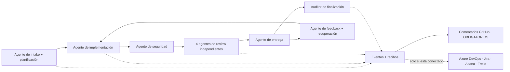
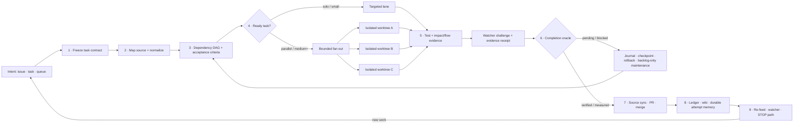

# 🔁 simplicio-loop — El orquestador de IA universal en bucle

<p align="center">
  
</p>

<p align="center">
  <a href="https://github.com/wesleysimplicio/simplicio-loop/stargazers"></a>
  <a href="#-las-7-skills--5-aceleradores"></a>
  <a href="#-adaptadores-de-fuente"></a>
  <a href="#-15-runtimes-un-protocolo"></a>
  <a href="#-los-49-puntos-de-extensión"></a>
  <a href="#-economía-de-tokens"></a>
  <a href="../LICENSE"></a>
</p>

<p align="center">
  <a href="#-tldr">TL;DR</a> ·
  <a href="#-las-7-skills--5-aceleradores">7 Skills</a> ·
  <a href="#-adaptadores-de-fuente">Adaptadores de fuente</a> ·
  <a href="#-15-runtimes-un-protocolo">15 Runtimes</a> ·
  <a href="#-el-bucle">El bucle</a> ·
  <a href="#-economía-de-tokens">Economía de tokens</a> ·
  <a href="#-economía-de-tokens">Motor de captura</a> ·
  <a href="#-instalación--uso">Instalación</a>
</p>

<p align="center">
  <strong>🌍 Languages:</strong><br>
  <a href="../README.md">🇬🇧 English</a> |
  <a href="README.pt-BR.md">🇧🇷 Português</a> |
  <a href="README.es-ES.md">🇪🇸 Español</a> |
  <a href="README.fr-FR.md">🇫🇷 Français</a> |
  <a href="README.de-DE.md">🇩🇪 Deutsch</a> |
  <a href="README.it-IT.md">🇮🇹 Italiano</a> |
  <a href="README.ja-JP.md">🇯🇵 日本語</a> |
  <a href="README.ko-KR.md">🇰🇷 한국어</a> |
  <a href="README.zh-CN.md">🇨🇳 简体中文</a> |
  <a href="README.ru-RU.md">🇷🇺 Русский</a> |
  <a href="README.pl-PL.md">🇵🇱 Polski</a> |
  <a href="README.tr-TR.md">🇹🇷 Türkçe</a> |
  <a href="README.nl-NL.md">🇳🇱 Nederlands</a> |
  <a href="README.hi-IN.md">🇮🇳 हिन्दी</a> |
  <a href="README.ar-SA.md">🇸🇦 العربية</a>
</p>

---

<!-- visual-story:start -->
## 🚀 La nueva generación — un sistema operativo para trabajo verificado de agentes

**simplicio-loop ha evolucionado mucho más allá de un prompt que repite hasta terminar.** Ahora convierte la intención en un contrato de tarea congelado, mapea el repositorio, planifica según dependencias, distribuye la ejecución en worktrees aislados, recopila recibos estructurados, verifica de forma independiente, revierte con seguridad, recuerda cada intento y mantiene sincronizada la fuente oficial hasta la entrega.

- **Primero el contrato** — criterios de aceptación, dependencias, riesgos, estado de la fuente y oráculo de finalización quedan explícitos antes de ejecutar.
- **Paralelo sin corrupción** — las tareas listas se ejecutan en lanes/worktrees aislados y convergen mediante un ledger operativo.
- **Prueba antes de completar** — tests, controles de impacto/flujo, desafíos del watcher, recibos de entrega y evidencia HBP rechazan falsos estados de terminado.
- **Memoria que cambia el comportamiento** — journal, detector de estancamiento, checkpoints y wiki cross-agent evitan la oscilación y hacen duraderos los handoffs.

<p align="center">
  
</p>

<p align="center"><em>Fan-out guiado por dependencias: workers aislados ejecutan en paralelo, devuelven evidencia y convergen en una entrega verificada.</em></p>

<p align="center">
  
</p>

<p align="center"><em>Cada etapa es explícita, acotada, observable y reversible.</em></p>

<p align="center">
  
</p>

<p align="center"><em>La evidencia y la memoria forman parte de la ejecución; no son un informe escrito después.</em></p>

Esta arquitectura convierte un objetivo en un sistema gobernado de entrega: desde una tarea difícil hasta un backlog completo, entre sesiones y runtimes, con operadores local-first y recibos auditables por personas, CI u otro agente.

<p align="center">
  
</p>
<!-- visual-story:end -->

<!-- stage-agents-roadmap:start -->
## 🤖 Hoja de ruta — un agente concreto detrás de cada etapa

> **Estado:** arquitectura planificada en [#422](https://github.com/wesleysimplicio/simplicio-loop/issues/422)–[#436](https://github.com/wesleysimplicio/simplicio-loop/issues/436). El comentario canónico de lifecycle en GitHub ya existe; el gate completo de agentes por etapa y reporting obligatorio sigue en implementación en [#433](https://github.com/wesleysimplicio/simplicio-loop/issues/433).

Intake/planificación, implementación, seguridad, entrega, recuperación y auditoría final tendrán un agente responsable. Review se abre en cuatro agentes independientes — seguridad/corrección, calidad, reproducción runtime/E2E y radio de impacto — antes de converger.

<p align="center"></p>



**Política:** GitHub es obligatorio para runs vinculados a GitHub y `COMPLETE` espera confirmación remota. Azure DevOps, Jira, Asana y Trello reciben comentarios solo tras probar conexión, autenticación, autorización y resolución del ítem; `NOT_CONNECTED` es un skip explícito y no bloqueante. Contrato y pruebas: [#436](https://github.com/wesleysimplicio/simplicio-loop/issues/436).
<!-- stage-agents-roadmap:end -->

## 🆕 Novedades en la v3.38.0 — la versión de coordinación multi-agente

Esta versión resuelve un problema que solo aparece cuando **varias sesiones de agente trabajan a la
vez sobre el mismo repo**: ¿cómo sabe una sesión qué issue ya está reclamada, qué PR ya mergeada
dejó el trabajo a medias, y qué hacer con su propio tiempo ocioso en lugar de duplicar el trabajo de
otra sesión? Todo lo de abajo se construyó y probó contra el **estado real y multi-sesión de este
mismo repo** — no un escenario sintético.

- **`scripts/coordinator.py` — el núcleo de decisión.** A partir del estado real de GitHub
  (comentarios de reclamación en issues abiertas + PRs ya mergeadas), devuelve una acción
  determinista por issue: `OWN` (nadie la reclamó), `CONTINUE_OWN` (ya eres el último reclamante),
  `DEFER_ACTIVE_CLAIM` (otra sesión la reclamó hace poco — no duplicar), `RECLAIM_STALE` (esa
  reclamación se enfrió, es seguro tomarla) o `VERIFY_PARTIAL` (ya hay una PR mergeada para esa
  issue pero sigue abierta — hay que comprobar qué está realmente hecho). También levanta una
  bandera `duplicate_risk` en cuanto dos sesiones reclaman la misma issue casi al mismo tiempo. Caso
  real, día uno: dos sesiones construyendo por separado un recolector de hallazgos para la misma
  issue con dos nombres de archivo distintos.
- **`scripts/pr_dod_review.py` — el revisor para el tiempo ocioso.** Cuando todas las issues abiertas
  ya están reclamadas, el movimiento de mayor valor de una sesión no es esperar: es revisar las PRs
  abiertas contra el propio listón del repo — la Definition of Done de 7 dimensiones
  (implementación, tests unitarios/integración/sistema/regresión, benchmark de rendimiento,
  cobertura ≥85%) y la checklist de criterios de aceptación congelada de la issue subyacente.
  `check --post` publica un veredicto mecánico, línea por línea, como comentario en la PR — no una
  aprobación de sensación. Probado contra una PR real ya mergeada ("MVP slice"): marcó correctamente
  **17 de 17** criterios de aceptación del epic padre como aún no resueltos.
- **`scripts/finding_collector.py` — memoria de defectos duradera y deduplicada (issue #466, fase 1).**
  Un registro `simplicio.finding/v1` por defecto distinto, con huella (fingerprint), de modo que el
  *mismo* bug — visto por cualquier agente, en cualquier run, en cualquier momento — colapsa en un
  único registro con un contador de ocurrencias en lugar de generar ruido duplicado. Todavía sin
  llamadas a GitHub; eso es la siguiente fase. `scripts/evolution.py` (taxonomía + prioridad +
  dedup) y `scripts/workflow_topology.py` (diff de DAG + validador) salieron como primeras
  entregas MVP de los epics hermanos Continuous Evolution (#467) y Adaptive Architecture (#468);
  `scripts/agent_replication.py` hizo lo mismo para Elastic Replication (#469) — control de admisión
  y selección de ganador para ejecución especulativa duplicada.
- **`references/multi-agent-coordination.md` + `references/background-verification.md`** — dos
  convenciones nuevas, cableadas directamente en el paso de triaje de `SKILL.md`: comprobar la
  propiedad del coordinador antes de tocar una issue, revisar PRs en vez de quedarse ocioso cuando
  todo está reclamado, y lanzar en segundo plano los comandos de verificación lentos (tests /
  `claims_audit.py`) para que un turno siga avanzando en vez de mirar una barra de progreso.
- **Limpieza obligatoria post-merge (`scripts/worktree_cleanup.py`, #484)** — el worktree local y la
  rama de una branch ya mergeada se eliminan ahora automáticamente en lugar de acumularse.
- **Ampliaciones del contrato CLI (WI-471)** — un subcomando `preflight` y una bandera `--json` en
  `status`, para que un supervisor externo pueda comprobar mecánicamente la disposición antes de
  armar un run.
- **Dos regresiones reales, detectadas y corregidas en `main` mismo, en vivo, este ciclo** — una PR
  que borró silenciosamente una definición de función (rompiendo el propio selftest de
  `loop_progress.py`) se mergeó una vez, y una carrera de squash-merge reintrodujo el mismo código
  roto en `main` una segunda vez. Ambas se detectaron ejecutando de verdad el script afectado, no
  confiando en una descripción de PR en verde — la razón misma de que existan `coordinator.py` y
  `pr_dod_review.py`.
- **Heredado de la v3.37.0 (epic Portable Stage Agents, #422–#436)** — un agente concreto y
  verificable por etapa (intake/planificador, implementación, panel de review de cuatro vías, gate
  de seguridad, entrega, feedback/recuperación, auditor de finalización), una suite de conformidad
  que prueba paridad de contrato/recibo en los 15 runtimes, identidades de agente legibles, y
  `simplicio-runtime` promovido a operador vinculado obligatorio igual que `simplicio-mapper`/
  `simplicio-dev-cli`.
- **La suite de tests creció a 231 archivos** (desde 192), todos clasificados según la convención
  unit/integration/system/regression de `docs/SCRIPTS_INVENTORY.md`; `scripts/claims_audit.py` se
  mantuvo en 14/14 en cada merge de este ciclo.

**Qué significa esto en la práctica:** si ejecutas `simplicio-loop` en más de una sesión o máquina
sobre el mismo repo, ahora te protege activamente de los dos fallos que ocurren de verdad — dos
agentes rehaciendo en silencio el mismo trabajo, y una PR "hecha" que se mergeó pero dejó la issue
real solo parcialmente resuelta. Antes ninguno era visible; ahora ambos lo son, mecánicamente, en
cada pasada de triaje.

Consulta [`CHANGELOG.md`](../CHANGELOG.md) para el listado completo y la
[versión v3.38.0](https://github.com/wesleysimplicio/simplicio-loop/releases/tag/v3.38.0) para los
artefactos firmados (wheel, sdist, SBOM, procedencia).

## ⚡ TL;DR

**simplicio-loop** es un **super-plugin** independiente del runtime — un único orquestador
autónomo en bucle (invocado como **`/simplicio-loop`**) más **cinco skills satélite** — que
convierte cualquier LLM potente (Claude, Codex, Copilot, Gemini, Cursor, modelos locales) en un
worker que se conduce solo. Lo apuntas a un cuerpo de trabajo — *«termina todas las issues
abiertas»*, *«vacía la cola de CI»*, *«drena el tablero de Jira»* — y ejecuta todo el ciclo de vida
por sí solo:

> **descubrir → entender → decidir → actuar → verificar → corregir → registrar → repetir**

Descubre trabajo desde cualquier fuente (GitHub Issues, Jira, Azure DevOps, sesiones de agentsview y
más), elimina duplicados, autoescala una flota de agentes según tu máquina, implementa cada elemento
a través de un bucle de calidad que **ejecuta el código (no solo lo compila)**, abre PRs, resuelve el
feedback de CI/revisión, hace merge y sigue vigilando **24/7** en busca de trabajo nuevo — todo ello
tras barreras de seguridad y una ruta explícita de STOP/cancelación.

```text
/simplicio-loop finish all open issues
→ identity + pre-flight (auth, runtime, STOP path)
→ discover 50 issues · dedup · build dependency DAG
→ autoscale fleet = 14 · pipeline implement→review→merge
→ each item: read body+ACs → orient code → plan → edit → run → verify → PR
→ merge · close with evidence · rollback if main breaks
→ keep looping every ~2 min until the queue is dry (evidence-gated, never a false "done")
```

Tres cosas lo hacen diferente: es un **super-plugin de skills enfocadas**, ejecuta el **mismo
protocolo en 15 runtimes** y hace todo esto con una **economía de tokens agresiva y honesta**.

La skill se instala **de forma independiente**: no necesitas `simplicio-runtime` ni ningún
componente nativo obligatorio solo para usar `simplicio-loop`. Los enlaces nativos, operadores,
servicios de captura y el resto de la pila Simplicio son aceleradores opcionales sobre el paquete
básico de skills.

---

## 📘 Registro oficial de capacidades

El listado completo y oficial de lo que incluye `simplicio-loop` — cada capacidad de abajo es
**real, ejecutable y testeada** (`python3 scripts/check.py`: claims-audit 14/14 + 2.544 tests
recopilados en 231 archivos). Cada una enlaza con su sección detallada y su worker.

| Capacidad | Qué hace | Prueba / worker | Detalles |
|---|---|---|---|
| 🎬 **Evidencia en vídeo** (`video_evidence`) | Graba la **sesión real del navegador** como prueba en movimiento de que un cambio de UI funciona (Playwright, por defecto); renderiza un **MP4 determinista con subtítulos** con [hyperframes](https://github.com/heygen-com/hyperframes) para una petición explícita de vídeo explicativo (`/simplicio-loop make a video of screen X`) | `scripts/video_evidence.py` · BLOQUEADO (nunca fake-pass) sin el toolchain | [§ Evidencia en vídeo](#-evidencia-en-vídeo--playwright-por-defecto-hyperframes-bajo-demanda) |
| 🧠 **Memoria de intentos + detector de estancamiento** | Un run-journal duradero (`.orchestrator/loop/journal.jsonl`) + un detector de estancamiento para que el bucle **cambie de estrategia en lugar de oscilar**; el triaje incremental (`since`) lee solo el delta de cada turno | `scripts/loop_journal.py` · `selftest` 9/9 | [§ Anti-oscilación](#-memoria-de-intentos--detector-de-estancamiento-anti-oscilación) |
| 🔒 **Gate de seguridad fail-closed** (`action_gate`) | Un hook `PreToolUse`/git-pre-push que **bloquea mecánicamente** force-push, reescritura de historial, borrado masivo, DDL destructivo, teardown de infra y commits/pushes con secretos — el Paso 5 hecho ejecutable, no prosa | `hooks/action_gate.py` · `selftest` 15/15 | [§ Seguridad](#-seguridad-innegociable) |
| 🔬 **Verificación local** | Una suite de tests (selftests de workers + un **e2e del driver del bucle** que prueba la salida ligada a evidencia) + una **claims-audit** (los scripts referenciados existen · counts consistentes · `_bundle ≡ source`) — todo local, **sin CI de pago** | `scripts/check.py` · `scripts/claims_audit.py` · `tests/` | [§ Tests y comprobaciones locales](#-tests-y-comprobaciones-locales-sin-ci-de-pago) |
| ✅ **Ahorro honesto** | La línea de ahorro ahora es **ligada a evidencia, no obligatoria** — solo se muestra un número con un recibo medido (clamp/firmas/caché/`deterministic_edit`/ledger); nunca se fabrica | contrato de economía de tokens | [§ Economía de tokens](#-economía-de-tokens) |
| 🤝 **Coordinador multi-agente** (`coordinator.py`) | Decide `OWN` / `CONTINUE_OWN` / `DEFER_ACTIVE_CLAIM` / `RECLAIM_STALE` / `VERIFY_PARTIAL` por issue a partir de comentarios de reclamación en vivo + PRs mergeadas, para que dos sesiones nunca dupliquen el mismo trabajo | `scripts/coordinator.py` · `selftest` 10/10 | [§ Novedades v3.38.0](#-novedades-en-la-v3380--la-versión-de-coordinación-multi-agente) |
| 🕵️ **Revisor de DoD/AC en PRs** (`pr_dod_review`) | Cuando toda issue está reclamada, revisa las PRs abiertas contra la Definition of Done de 7 dimensiones + la checklist de criterios de aceptación propia de la issue — un veredicto mecánico, no una aprobación de sensación | `scripts/pr_dod_review.py` · `selftest` 13/13 | [§ Novedades v3.38.0](#-novedades-en-la-v3380--la-versión-de-coordinación-multi-agente) |
| 🐞 **Recolector de hallazgos** (`finding_collector`) | Memoria de defectos deduplicada y con huella — el mismo bug subyacente colapsa en un único registro con contador de ocurrencias, sin importar cuántos agentes/runs lo observen | `scripts/finding_collector.py` · `selftest` 9/9 | [§ Novedades v3.38.0](#-novedades-en-la-v3380--la-versión-de-coordinación-multi-agente) |

Dos **modos** del bucle hacen explícita la terminación: **converge** (una sola tarea dura — termina
con el `<promise>` ligado a evidencia o una escalada por estancamiento) vs **drain** (una cola —
termina cuando la reconsulta de la fuente sigue vacía K rondas). Ambos siguen obedeciendo las
salidas universales: promise+evidence, `max_iterations` y STOP.

> Puntuación del bucle a lo largo de esta línea de trabajo: **7.5** (diseño sólido, no probado) →
> **9** (memoria de intentos + anti-oscilación) → **9.5** (prueba local reproducible) → **~10**
> (seguridad forzada + semántica de bucle completa). La infraestructura de verificación ya atrapa
> las propias regresiones del proyecto a medida que crece.

---

## 🧠 Las 7 skills + 5 aceleradores

El núcleo del orquestador + seis satélites + cinco aceleradores/integraciones. Cada satélite es
**opcional** — cuando se carga, el orquestador le delega (más rico + más barato); cuando está
ausente, el protocolo inline cubre el 100%. Los aceleradores se **autodetectan** — presente = usado,
ausente = fallback por LLM.

| # | Capacidad | Absorbe | Qué hace | Impacto en tokens |
|---|---|---|---|---|
| 1 | 🔁 **simplicio-loop** | — | Punto de entrada público unificado: núcleo del orquestador + bucle reforzado tras un solo comando | Core + loop |
| 2 | ↩️ **simplicio-tasks** | alias heredado | Shim de compatibilidad para instalaciones y prompts guardados antiguos | Alias heredado |
| 3 | 🧱 **simplicio-orient** | [rtk](https://github.com/rtk-ai/rtk) + [caveman](https://github.com/JuliusBrussee/caveman) | Ejecución terminal-first, catálogo de reducción de salida, tee-cache, lecturas solo-firmas | L0 determinista |
| 4 | 🔥 **simplicio-review** | [thermos](https://github.com/cursor/plugins/tree/main/thermos) | Revisión adversarial paralela sobre rúbricas distintas → veredicto deduplicado | Gate de calidad |
| 5 | 🗜️ **simplicio-compress** | [caveman](https://github.com/JuliusBrussee/caveman) | Compresión de salida + memoria, `transform_guard` fail-closed | 40-60% menos |
| 6 | 🎓 **simplicio-learn** | [teaching](https://github.com/cursor/plugins/tree/main/teaching) | Retrospectiva post-ejecución → lecciones duraderas y deduplicadas en memoria | Más listo en cada ejecución |
| 7 | 🧪 **simplicio-autoresearch** | Karpathy [autoresearch](https://github.com/balukosuri/Andrej-Karpathy-s-Autoresearch-As-a-Universal-Skill) + `autoresearch-agent` de ECC | Bucle evolutivo mutate/eval/keep-revert: topes yool-guardrailed, rama git aislada, evaluación anti-Goodhart gate-primero, recibo `savings-event` | Auto-optimiza |
| 8 | 🧭 **Understand Anything** | [Egonex-AI](https://github.com/Egonex-AI/Understand-Anything) | Orientación por grafo de conocimiento: búsqueda semántica, tours guiados, grafo de dependencias | **L0 cero tokens** |
| 9 | 📊 **agentsview** | [kenn-io](https://github.com/kenn-io/agentsview) | Analítica de sesiones, seguimiento de coste, descubrimiento de sesiones estancadas | **L1** solo SQL |
| 10 | ⚡ **LMCache** | [LMCache](https://github.com/LMCache/LMCache) | Caché KV entre turnos del bucle — 40-70% menos de TTFT en modelos locales | Tiempo de GPU ↓ |
| 11 | 🗜️ **Motor de captura Simplicio** | `engine/simplicio_engine.py` (nativo, solo stdlib) | Proxy de captura transparente: reenvía al proveedor real, mide + comprime de forma determinista, escribe `proxy_savings.json` | **determinista** |
| 12 | 🎬 **video_evidence** | Playwright (por defecto) · [hyperframes](https://github.com/heygen-com/hyperframes) (bajo demanda) | Graba la **sesión real** como prueba en movimiento de un cambio de UI (Playwright); renderiza un **MP4 explicativo determinista con subtítulos** con hyperframes cuando el vídeo ES el entregable | Productor de evidencia |

Cada skill vive bajo [`.claude/skills/`](../.claude/skills); cada acelerador tiene un documento de
referencia bajo `.claude/skills/simplicio-loop/references/` (el productor de vídeo:
[`video-evidence.md`](../.claude/skills/simplicio-loop/references/video-evidence.md), worker
[`scripts/video_evidence.py`](../scripts/video_evidence.py)).

---

## 📡 Adaptadores de fuente

El orquestador descubre trabajo desde cualquier fuente mediante adaptadores conectables. Cada uno
expone seis verbos: `list_ready`, `get_details`, `claim`, `update_status`, `attach_evidence`,
`close`.

| Fuente | Adaptador | Propósito |
|---|---|---|
| GitHub Issues/PRs | `gh` CLI (nativo) | Fuente primaria de elementos de trabajo |
| Jira / Asana / ClickUp / Linear / Notion | conector del host | Gestión de tableros/proyectos |
| Trello / Azure DevOps | adaptador `az boards` | Seguimiento de trabajo en Azure |
| **sesiones de agentsview** | `scripts/agentsview_adapter.py` | Recuperación de sesiones estancadas + observabilidad de coste |
| Archivos locales / cola de CI | sistema de archivos / API de CI | Seguimiento de trabajo interno |

Consulta el documento de referencia de cada adaptador bajo
`.claude/skills/simplicio-loop/references/`.

---

## 🌐 15 runtimes, un protocolo — 3 garantizados + 12 best-effort

Un único núcleo de skill universal + un único conjunto de hooks conduce cada runtime. Un adaptador es
fino: le dice a un runtime *dónde cargar las skills*, *cómo armar el bucle* y *cómo enlazar la
velocidad nativa*. **La skill no nombra ningún runtime; el runtime detecta la skill.** El enlace
nativo MCP de `simplicio-runtime` es **OBLIGATORIO** en todos los runtimes (el bucle se BLOQUEA si
falta o es inalcanzable) — consulta [`docs/MCP_SETUP.md`](../docs/MCP_SETUP.md).

### Nivel 1 — Garantizado (gated en cada commit)

| Runtime | Carga de la skill | Drive del bucle | Enlace nativo (MCP) |
|---|---|---|---|
| **Claude Code** | `.claude/skills/` + plugin | Hook `Stop` | OBLIGATORIO — `~/.claude.json` |
| **Codex** | `AGENTS.md` | self-paced | OBLIGATORIO — `~/.codex/config.toml` |
| **Cursor** | `.cursor-plugin/` | `stop`+`afterAgentResponse` | OBLIGATORIO — `.cursor/mcp.json` |

### Nivel 2 — Best-effort (contribuciones bienvenidas, sin gate)

| Runtime | Carga de la skill | Drive del bucle | Enlace nativo (MCP) |
|---|---|---|---|
| **VS Code (Copilot)** | `copilot-instructions.md` | tasks | OBLIGATORIO — `.vscode/mcp.json` |
| **Antigravity** | rules / `AGENTS.md` | self-paced | OBLIGATORIO — ruta best-effort |
| **Kiro** | `.kiro/steering/` | specs | OBLIGATORIO — `.kiro/settings/mcp.json` |
| **OpenCode** | `AGENTS.md` | self-paced | OBLIGATORIO — `opencode.json` |
| **Gemini** (CLI/Code Assist) | `GEMINI.md` | self-paced | OBLIGATORIO — `.gemini/settings.json` (CLI) |
| **Kimi** | convenciones inline | self-paced | OBLIGATORIO — best-effort, sin cliente verificado |
| **Qwen** (Code/CLI) | equivalente de `AGENTS.md` | self-paced | OBLIGATORIO — `.qwen/settings.json` (best-effort) |
| **DeepSeek** | convenciones inline | self-paced | OBLIGATORIO — sin cliente first-party, best-effort |
| **Aider** | `CONVENTIONS.md` | self-paced | OBLIGATORIO — sin cliente MCP (fallback LLM para exec) |
| **Simplicio Agent** *(antes Hermes)* | recall nativo | bucle nativo | OBLIGATORIO — **nativo** |
| **OpenClaw** | plugin SDK | scheduler nativo | OBLIGATORIO — **nativo** |
| **Orca** | vía agente interno + registro de skills | hook interno / automatizaciones programadas | OBLIGATORIO — config de registro/agente interno |

La promesa: **mismo protocolo, mismas barreras, misma seguridad en los 15 — Nivel 1 verificado
mecánicamente, Nivel 2 best-effort.** `orient_clamp.py` (economía de tokens) funciona en todos los
runtimes sin ningún cableado. Consulta [`adapters/MATRIX.md`](../adapters/MATRIX.md).

---

## 🗺️ El flujo completo — de la demanda a la entrega

Cada capa sobre la que actúa el orquestador, en orden — desde leer la demanda (issues, tareas,
asignaciones) hasta entregar trabajo mergeado y con evidencia, y luego el bucle 24/7 en busca de más.



---

## 🔁 El bucle

El **bucle ligado a evidencia** es el mecanismo central. Realimenta el mismo objetivo en cada turno
para que el agente vea su propio trabajo previo. La salida es ÚNICAMENTE vía:

1. **`<promise>` ligada a evidencia** — el turno que emite la promesa DEBE además aportar prueba
   concreta (un test que pasa, un PR mergeado, una reconsulta del elemento cerrado). Una promesa sin
   evidencia = ignorada.
2. **Tope de `max_iterations`** — barrera estricta de seguridad
3. **STOP/cancel path** — explicit STOP file or channel command stops unattended runs
4. **Señal STOP** — `.orchestrator/STOP` o un comando de canal

Entre turnos, LMCache (cuando está disponible) cachea el estado KV para que la realimentación cueste
un prefill casi nulo.

### 🧠 Memoria de intentos + detector de estancamiento (anti-oscilación)

Un bucle de realimentación que no recuerda nada oscila — prueba X, falla, prueba X de nuevo — hasta
que el tope se consume. simplicio-loop mantiene un **run-journal duradero**
(`.orchestrator/loop/journal.jsonl`, solo-append:
`iteration · action · hypothesis · gate · error-fingerprint`) y un **detector de estancamiento**
([`scripts/loop_journal.py`](../scripts/loop_journal.py), determinista + sin modelo):

- **Error fingerprint** — la salida del gate fallido se reduce a un hash estable con los números de
  línea, rutas, hex/uuids, timestamps y duraciones normalizados, de modo que el *mismo* bug se
  reconoce a lo largo de los turnos aunque el texto incidental difiera.
- **Estancamiento = K fallos consecutivos con la misma fingerprint** (por defecto K=3). Una
  fingerprint que cambia significa que el bucle avanza (PROGRESS); la misma K veces significa que
  está dando vueltas (STALLED).
- En STALLED el bucle **no** realimenta el mismo objetivo — nombra las **acciones sin salida** a
  evitar, y luego **cambia de estrategia** o **escala al gate humano** con la fingerprint.
- `loop_journal.py resume` se lee al inicio de cada turno, de modo que un proceso nuevo continúa sin
  re-derivar intentos previos (resume real) y nunca reintenta un callejón sin salida conocido.

```bash
loop_journal.py resume                       # what was tried + dead-ends to avoid
loop_journal.py record --iteration N --action "…" --gate fail --gate-output test.log
loop_journal.py stall --k 3 --exit-code      # PROGRESS → re-feed · STALLED → switch/escalate
```

---

## 🎬 Evidencia en vídeo — Playwright por defecto, hyperframes bajo demanda

El bucle produce **vídeos demostrativos** como prueba de que un cambio funciona — **dos motores**, un
único punto de extensión `video_evidence` (worker
[`scripts/video_evidence.py`](../scripts/video_evidence.py), contrato
[`references/video-evidence.md`](../.claude/skills/simplicio-loop/references/video-evidence.md)):

1. **Por defecto — el flujo normal de evidencia usa Playwright.** Tras un cambio de UI,
   `video_evidence` graba la **sesión real del navegador** manejando la pantalla (vídeo nativo de
   Playwright → `.webm`, → `.mp4` con FFmpeg) — el recibo más fuerte de «funciona, no solo compila»
   (Paso 4b) y un `<promise>` válido ligado a evidencia.

   ```bash
   python3 scripts/video_evidence.py verify --url http://localhost:3000/login \
       --name login-demo --expect "Sign in" --issue 42 [--upload --pr 42]
   ```

2. **Bajo demanda — un explicativo personalizado usa hyperframes.** Cuando el entregable ES un vídeo
   («make an explainer video of screen X»), el orquestador renderiza una **presentación determinista
   con subtítulos** de las capturas de `web_verify` con
   [**hyperframes**](https://github.com/heygen-com/hyperframes) (de HeyGen — «misma entrada, mismos
   frames, misma salida», reproducible en CI, sin claves de API, render local vía Chrome headless +
   FFmpeg).

   ```text
   /simplicio-loop make an explainer video of the system login screen
   → detect: video-creation request → web_verify captures the screens
   → video_evidence verify --engine hyperframes → deterministic MP4 → attached to the PR
   ```

Cualquiera de los dos motores: un vídeo que nunca se grabó/renderizó produce **BLOQUEADO**, nunca un
falso pase. La evidencia es siempre una **ruta de archivo + veredicto booleano** — nunca bytes de
vídeo en contexto (economía de tokens).

---

## 📊 Economía de tokens

| Técnica | Ahorro |
|---|---|
| `deterministic_edit` (L0) | 100% de los tokens de edición (el archivo se escribe mecánicamente, nunca por el LLM) |
| Ejecución terminal-first | Los hechos vienen del shell, no de la alucinación del LLM |
| Catálogo de reducción de salida | Topes por tipo de comando (`CAP_ERRORS=20`, `CAP_WARNINGS=10`, `CAP_LIST=20`) — `orient_clamp.py` |
| Caché Tee+CCR en caso de fallo | Nunca reejecutar un comando fallido — leer la salida cacheada |
| Lecturas solo-firmas | `simplicio-cli signatures <file>` — un archivo de 870 líneas → 65 líneas (**93% ahorrado**), cuerpos eliminados |
| `simplicio-compress` | Prosa concisa + compactación única de memoria |
| `orient_clamp.py` | Clamp + tee en cada comando de shell, sin cableado |
| Caché de respuesta nativa | una petición determinista repetida (temp=0) → servida desde caché, omite la llamada al LLM (**100% en acierto**) — `simplicio-cli cache`, activada por defecto (`SIMPLICIO_CACHE=0` para desactivar) |
| Proxy de captura Simplicio + MCP | 60-95% menos de tokens en las salidas de herramientas vía un daemon de compresión transparente |

El ahorro solo cuenta sobre un resultado verificado-correcto. Línea base = el camino no orquestado
más barato y sensato hacia el mismo resultado. **El reporte de ahorro es ligado a evidencia, no
obligatorio:** solo se muestra una cifra de ahorro cuando un turno realmente ejecutó un comando
productor de economía y el número rastrea hasta un recibo medido (tee de clamp, lectura de firmas,
acierto de caché, `deterministic_edit`, `savings_ledger`). Sin economía medida → sin línea de
ahorro; el orquestador nunca fabrica una línea base ni un porcentaje. Consulta
`references/token-economy.md`.

### 🔎 Ejecutar `simplicio-loop`: economía vs medición (por runtime)

Cuando llamas a **`simplicio-loop`** ocurren dos cosas distintas, y se comportan de forma diferente
por runtime:

- **Economía** — compresión, clamps de salida, lecturas solo-firmas, `deterministic_edit` — aplica
  **cada vez que la skill se ejecuta y carga `simplicio-orient` / `simplicio-compress`, en cualquier
  runtime.** Es el comportamiento de la skill más los hooks (más fuerte donde existen hooks:
  `orient_clamp.py` auto-clampa en Claude y Cursor; en otros lugares es dirigido por instrucciones).
- **Medición** — los números en vivo del Token Monitor — solo cuenta el tráfico que fluye **a través
  del proxy de captura.**

| Runtime | Economía (skill) | Medición (monitor) |
|---|---|---|
| **Simplicio Agent** | ✓ | ✓ **automática** — ya enrutado a través del proxy (`base_url → :8788`) |
| **Claude** | ✓ (skill + hooks) | ✗ por defecto — Claude habla directamente con `api.anthropic.com`; medido solo una vez enrutado (`simplicio-cli wrap claude`, o `ANTHROPIC_BASE_URL → http://127.0.0.1:8788`) |
| **Codex** | ✓ (skill) | ✗ por defecto — `simplicio-cli init codex` añade las herramientas MCP pero no enruta el tráfico del LLM; medido con `simplicio-cli wrap codex` o una base-url de OpenAI apuntando al proxy |

Así que: el **ahorro ocurre en cada runtime**; el **monitor lo contabiliza automáticamente en
Simplicio Agent**, y en Claude/Codex tras un **paso de enrutamiento único** (`simplicio-cli wrap …` / base-url →
`:8788`). Sin enrutamiento, la economía igual aplica — el monitor simplemente no contará esos tokens.
`scripts/simplicio-economy.sh wire` hace este enrutamiento para clientes compatibles con OpenAI en el
momento de la instalación.

### 📈 Simplicio Token Monitor

Una vista en vivo, siempre activa, del ahorro:

- **Dashboard web** — `http://127.0.0.1:9090` — gráfico de tokens en tiempo real, medidor de ahorro,
  los LLMs/runtimes y los **141/144 proveedores (98%)** que interceptamos, y un log de proxy en vivo.
- **Widget de barra de menús / bandeja** — tokens ahorrados en vivo en la bandeja del sistema (macOS rumps · Windows/Linux pystray).
- **Un módulo** — `scripts/simplicio-economy.sh {status|up|wire}` levanta el proxy de captura + monitor +
  bandeja + el operador determinista `simplicio-dev-cli` e informa de toda la pila.

La instalación registra los tres como servicios de auto-arranque (macOS launchd · Linux systemd · Windows Startup) vía
`scripts/setup_simplicio.sh`, o el multiplataforma `python3 scripts/install_services.py install`. Tras la
instalación el monitor + la captura corren **sin invocar el bucle** — consulta `references/token-capture.md`.

### 🛠️ El motor de captura — un módulo nativo, cada comando

[`engine/simplicio_engine.py`](../engine/simplicio_engine.py) es el motor de captura Simplicio nativo
(nativo, solo stdlib, fail-open, sin ninguna dependencia externa). Ejecuta
cualquier comando vía el wrapper [`scripts/simplicio-engine`](../scripts/simplicio-engine) (p. ej. `simplicio-engine doctor`):

| Comando | Qué hace |
|---|---|
| `proxy` | el proxy de captura transparente — enruta cada modelo a su proveedor **real**, comprime + mide + cachea (sin cambiar de modelo) |
| `doctor` | alcanzabilidad del proxy + ahorro acumulado |
| `cache` | caché de respuesta nativa (`stats`/`clear`) — una petición determinista repetida se sirve desde caché, omitiendo la llamada al LLM |
| `signatures` | vista solo-firmas de un archivo fuente (cuerpos eliminados, ~93% menos tokens para leer código) |
| `semantic` | compresión extractiva reversible (semantic-lite) |
| `detect` | detección de tipo de contenido + enrutamiento inteligente por bloque |
| `rag` | recuperación TF-IDF (o embeddings con `--ml`) sobre el almacén de memoria CCR |
| `memory` | almacén CCR compress-cache-retrieve (`remember`/`recall`/`forget`/`list`/`stats`) |
| `mcp` | servidor MCP stdio nativo (herramientas compress / retrieve / stats) |
| `init` / `wrap` | registra Simplicio en un cliente (Claude / Codex / Copilot / OpenClaw) · ejecuta un cliente con enrutamiento de captura |
| `report` / `audit` / `capture` / `evals` | informe de ahorro · auditar un árbol en busca de oportunidad de compresión · dry-run de una petición · gate de regresión de compresión |

---

## 🏛️ Pilares de diseño (en detalle)

Cuatro mecanismos sostienen el poder de orquestación:

| Pilar | Enfoque | Vive en |
|---|---|---|
| **DAG + pipeline** | paralelismo por dependencia, escalonado por elemento | `references/orchestration.md` (Paso 3 pool + pipeline) |
| **Aislamiento por worktree** | ediciones paralelas sin corromper el árbol, con merge controlado por gate | `references/orchestration.md` |
| **Verificación adversarial** | panel de escépticos antes de «entregado» | `references/quality-safety-delivery.md` · skill `simplicio-review` |
| **Bounded loop cap** | anti-infinite-loop, evidence-gated exit | `references/standing-loop-247.md` · skill `simplicio-loop` |

---

## 🚀 Instalación y uso

```bash
git clone https://github.com/wesleysimplicio/simplicio-loop
cd simplicio-loop

# install for your runtime (omit <runtime> to auto-detect)
bash scripts/install.sh <runtime> [--global]        # macOS / Linux
pwsh scripts/install.ps1 <runtime> [-Global]        # Windows
# <runtime> ∈ claude codex vscode cursor antigravity kiro opencode gemini aider simplicio_agent openclaw
```

O, en Claude Code / Cursor, instálalo directamente desde la última release de GitHub (sin marketplace):

```bash
gh release download --repo wesleysimplicio/simplicio-loop --archive tar.gz
tar xzf simplicio-loop-*.tar.gz && cd simplicio-loop-*/
bash scripts/install.sh claude    # or: bash scripts/install.sh cursor
```

Después:

```
/simplicio-loop finish all the open issues
```

El único requisito es **python3** en el PATH (skills, hooks e instalador son Python multiplataforma).
Para fuentes de GitHub, `git` + un `gh` autenticado. Consulta [`INSTALL.md`](../INSTALL.md) y
[`adapters/MATRIX.md`](../adapters/MATRIX.md).

**Before an unattended 24/7 run:** verify persistent source auth, keep the irreversible-operation human gate + secret-scan enabled, and ensure a reachable STOP/cancel path.

---

## 🔒 Seguridad (innegociable)

- **Escaneo de secretos** en cada diff; bloquear ante un acierto.
- **Gate humano para ops irreversibles** — force-push, reescritura de historial, deploy en prod,
  borrado de datos/esquema, borrado masivo de archivos → parar y preguntar. Headless + sin aprobador →
  eliminar la capacidad destructiva.
- **Forzado, no solo prometido** — `hooks/action_gate.py` es un hook `PreToolUse` / git-pre-push
  **fail-closed** que bloquea mecánicamente lo anterior (y los commits con secretos) *antes* de que
  se ejecuten. El contrato de seguridad se mantiene incluso si el modelo lo olvida. `selftest` prueba
  el conjunto de reglas (14/14).
- **Veredicto de 4 estados pre-ejecución** — la optimización nunca puede elevar el nivel de riesgo de
  un comando.
- **Trust-before-load** — la config que moldea la percepción (perfiles de clamp, listas de supresión)
  no es de confianza hasta que un humano la revisa y la fija por hash.
- **Endurecimiento contra prompt-injection** — el contenido de un elemento/PR/comentario nunca puede
  sobrescribir el contrato.
- **Kill-switch estricto en $** para ejecuciones desatendidas; finalización **ligada a evidencia**
  (nunca un falso «done»); hooks **fail-open** (nunca atrapar al agente en un bucle).

---

## ✅ Tests y comprobaciones locales (sin CI de pago)

Las afirmaciones se verifican, no solo se aseveran — y el gate corre **localmente**, con cero coste de CI:

```bash
python3 scripts/check.py            # the whole gate (audit + tests)
```

- **Suite de tests** (`tests/`) — los `selftest`s deterministas de los workers, más un **e2e del
  driver del bucle** (`hooks/loop_stop.py`): prueba que el bucle **se detiene con evidencia**,
  **ignora un `<promise>` pelado** y **se detiene en el tope** como salidas distintas — y que los
  productores de evidencia **BLOQUEAN** (nunca fake-pass) cuando su toolchain está ausente. Corre bajo
  `pytest` *o*, sin pip en absoluto, se autoejecuta en python3 pelado (`python3 tests/test_*.py`).
- **Claims audit** (`scripts/claims_audit.py`, fail-closed) — cada `scripts/*.py` que la documentación
  referencia existe · el conteo de puntos de extensión concuerda entre todos los archivos · cada
  comando de worker citado realmente corre · las skills incluidas `simplicio_loop/_bundle/` son
  **byte-idénticas** a la fuente.
- **Cabléalo como hook git pre-push** para mantener `main` honesto gratis:
  ```bash
  printf '#!/bin/sh\npython3 scripts/check.py\n' > .git/hooks/pre-push && chmod +x .git/hooks/pre-push
  ```

`pip install "simplicio-loop[dev]"` añade pytest para una salida más bonita; nunca es obligatorio.

---

## ⭐ Historial de Estrellas

[](https://star-history.com/#wesleysimplicio/simplicio-loop&Date)

---

## 📄 Licencia

MIT

<!-- simplicio-loop:github-comment-coordination:v1 -->
## 🌐 Coordinación mediante comentarios de GitHub entre runtimes

`simplicio-loop` puede ejecutarse simultáneamente en Claude Code, Codex, Cursor, Gemini y Hermes. Cuando está vinculado a una issue de GitHub, publica actualizaciones idempotentes en el comentario canónico: reclamación, planificación, progreso, evidencias, PR y cierre. Los agentes de distintas máquinas coordinan así el trabajo en el mismo hilo de GitHub sin compartir un sistema de archivos local.

```powershell
pwsh scripts/install.ps1 claude -Global
pwsh scripts/install.ps1 codex -Global
pwsh scripts/install.ps1 cursor -Global
pwsh scripts/install.ps1 gemini -Global
pwsh scripts/install.ps1 hermes -Global   # alias heredado de simplicio_agent
```

La cola local, leases, worktrees, heartbeats y evidencias siguen activos; los comentarios de GitHub son la proyección compartida. El flujo es exclusivo de GitHub: Jira, Azure DevOps y otros trackers no reciben estos comentarios. Si GitHub no está disponible, el loop sigue funcionando localmente y registra el fallo sin inventar confirmaciones remotas. Usa el mismo `source_issue` y acceso a GitHub en cada runtime.
