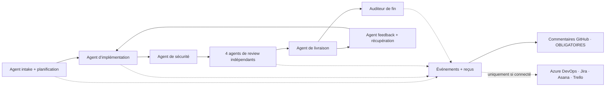
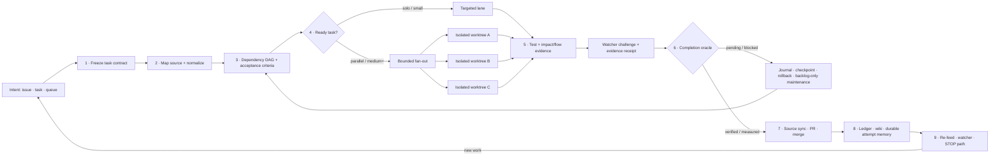

# 🔁 simplicio-loop — The Universal Looping AI Orchestrator

> **Canonical operational contract:** This translation is informational. For current dependency, runtime, conformance, and validation behavior, [README.md](../README.md) is authoritative: Loop installs standalone; Runtime bindings are optional; 3 runtimes are guaranteed and 12 are best-effort; and `scripts/check.py` requires an importable `pytest` with no bare-Python fallback. GitHub Actions is not required gate evidence.

<p align="center">
  
</p>

<p align="center">
  <a href="https://github.com/wesleysimplicio/simplicio-loop/stargazers"></a>
  <a href="#-les-7-skills--5-accélérateurs"></a>
  <a href="#-adaptateurs-de-source"></a>
  <a href="#-15-runtimes-un-protocole"></a>
  <a href="#-les-44-points-dextension"></a>
  <a href="#-économie-de-tokens"></a>
  <a href="../LICENSE"></a>
</p>

<p align="center">
  <a href="#-tldr">TL;DR</a> ·
  <a href="#-les-7-skills--5-accélérateurs">7 Skills</a> ·
  <a href="#-adaptateurs-de-source">Adaptateurs de source</a> ·
  <a href="#-15-runtimes-un-protocole">15 Runtimes</a> ·
  <a href="#-la-boucle">La boucle</a> ·
  <a href="#-économie-de-tokens">Économie de tokens</a> ·
  <a href="#-économie-de-tokens">Moteur de capture</a> ·
  <a href="#-installation--utilisation">Installation</a>
</p>

<p align="center">
  <strong>🌍 Languages:</strong><br>
  <a href="../README.md">🇬🇧 English</a> |
  <a href="README.pt-BR.md">🇧🇷 Português</a> |
  <a href="README.es-ES.md">🇪🇸 Español</a> |
  <a href="README.fr-FR.md">🇫🇷 Français</a> |
  <a href="README.de-DE.md">🇩🇪 Deutsch</a> |
  <a href="README.it-IT.md">🇮🇹 Italiano</a> |
  <a href="README.ja-JP.md">🇯🇵 日本語</a> |
  <a href="README.ko-KR.md">🇰🇷 한국어</a> |
  <a href="README.zh-CN.md">🇨🇳 简体中文</a> |
  <a href="README.ru-RU.md">🇷🇺 Русский</a> |
  <a href="README.pl-PL.md">🇵🇱 Polski</a> |
  <a href="README.tr-TR.md">🇹🇷 Türkçe</a> |
  <a href="README.nl-NL.md">🇳🇱 Nederlands</a> |
  <a href="README.hi-IN.md">🇮🇳 हिन्दी</a> |
  <a href="README.ar-SA.md">🇸🇦 العربية</a>
</p>

---

<!-- visual-story:start -->
## 🚀 La nouvelle génération — un système d’exploitation pour le travail vérifié des agents

**simplicio-loop va désormais bien au-delà d’un prompt répété jusqu’à la fin.** Il transforme l’intention en contrat de tâche figé, cartographie le dépôt, planifie selon les dépendances, distribue l’exécution dans des worktrees isolés, collecte des reçus structurés, vérifie indépendamment, revient en arrière en sécurité, mémorise chaque tentative et synchronise la source de vérité jusqu’à la livraison.

- **Le contrat d’abord** — critères d’acceptation, dépendances, risques, état de la source et oracle de fin sont explicites avant l’exécution.
- **Parallèle sans corruption** — les tâches prêtes s’exécutent dans des lanes/worktrees isolés puis convergent via un registre opérationnel.
- **La preuve avant la fin** — tests, contrôles impact/flux, défis du watcher, reçus de livraison et preuves HBP refusent les faux états terminés.
- **Une mémoire qui change le comportement** — journal, détecteur de blocage, checkpoints et wiki cross-agent évitent l’oscillation et rendent les handoffs durables.

<p align="center">
  
</p>

<p align="center"><em>Fan-out guidé par les dépendances : des workers isolés s’exécutent en parallèle, renvoient leurs preuves puis convergent vers une livraison vérifiée.</em></p>

<p align="center">
  
</p>

<p align="center"><em>Chaque étape est explicite, bornée, observable et réversible.</em></p>

<p align="center">
  
</p>

<p align="center"><em>La preuve et la mémoire font partie du chemin d’exécution, pas d’un rapport rédigé après coup.</em></p>

Cette architecture transforme un objectif en système de livraison gouverné : d’une tâche difficile à un backlog complet, entre sessions et runtimes, avec des opérateurs local-first et des reçus auditables par une personne, la CI ou un autre agent.

<p align="center">
  
</p>
<!-- visual-story:end -->

<!-- stage-agents-roadmap:start -->
## 🤖 Feuille de route — un agent concret derrière chaque étape

> **État :** architecture planifiée dans [#422](https://github.com/wesleysimplicio/simplicio-loop/issues/422)–[#436](https://github.com/wesleysimplicio/simplicio-loop/issues/436). Le commentaire lifecycle canonique de GitHub existe déjà ; le gate complet des agents par étape et du reporting obligatoire reste en cours dans [#433](https://github.com/wesleysimplicio/simplicio-loop/issues/433).

Intake/planification, implémentation, sécurité, livraison, récupération et audit final auront chacun un agent responsable. La review se divise en quatre agents indépendants — sécurité/correction, qualité, reproduction runtime/E2E et rayon d’impact — avant de converger.

<p align="center"></p>



**Politique :** GitHub est obligatoire pour les runs liés à GitHub et `COMPLETE` attend une confirmation distante. Azure DevOps, Jira, Asana et Trello ne reçoivent des commentaires qu’après preuve de connexion, authentification, autorisation et résolution de la cible ; `NOT_CONNECTED` est un skip explicite non bloquant. Contrat et tests : [#436](https://github.com/wesleysimplicio/simplicio-loop/issues/436).
<!-- stage-agents-roadmap:end -->

## 🆕 Nouveautés de la v3.38.0 — la release de coordination multi-agents

Cette release s'attaque à un problème qui n'apparaît que lorsque **plusieurs sessions d'agents
travaillent le même dépôt en même temps** : comment une session sait-elle ce qui est déjà réclamé,
ce qui est déjà fusionné-mais-incomplet, et que faire de son propre temps mort au lieu de dupliquer
le travail d'une session sœur ? Chaque point ci-dessous a été construit, testé et livré contre
l'état **réel, multi-session, de ce dépôt lui-même** — pas un scénario synthétique.

- **`scripts/coordinator.py` — le cœur de décision.** À partir de l'état GitHub du jour
  (commentaires de réclamation sur les issues ouvertes + PR fusionnées), il renvoie une action
  déterministe par issue : `OWN`, `CONTINUE_OWN`, `DEFER_ACTIVE_CLAIM` (une session sœur l'a
  réclamée récemment — ne pas dupliquer), `RECLAIM_STALE` (réclamation refroidie, reprise sûre), ou
  `VERIFY_PARTIAL` (une PR déjà fusionnée pour cette issue, mais encore ouverte — vérifier ce qui
  est vraiment fait). Il lève aussi un signal `duplicate_risk` dès que deux sessions réclament la
  même issue à quelques instants d'écart — attrapé en direct dès le premier jour : deux sessions
  construisant indépendamment un collecteur de constats pour la même issue, sous deux noms de
  fichiers différents.
- **`scripts/pr_dod_review.py` — le reviewer du temps mort.** Quand toutes les issues ouvertes sont
  déjà réclamées, la meilleure action d'une session est de vérifier les PR ouvertes contre le
  standard du dépôt : la Definition of Done à 7 dimensions (implémentation, tests unitaires/
  intégration/système/régression, benchmark de performance, ≥85 % de couverture) et la checklist de
  critères d'acceptation figée de l'issue sous-jacente. `check --post` publie un verdict mécanique,
  ligne par ligne, en commentaire de PR au lieu d'une approbation à l'instinct — prouvé contre une
  vraie PR déjà fusionnée : **17 critères d'acceptation sur 17** correctement signalés comme non
  résolus sur l'épique parent.
- **`scripts/finding_collector.py` — mémoire de défauts durable et dédupliquée** (issue #466, phase
  1). Un enregistrement `simplicio.finding/v1` par défaut distinct, empreinté de sorte que le
  *même* bug sous-jacent — vu par n'importe quel agent, n'importe quel run — s'agrège en un seul
  enregistrement avec un compteur d'occurrences au lieu de générer du bruit dupliqué.
- **Deux régressions réelles attrapées et corrigées sur `main` lui-même, en direct, ce cycle** —
  une PR a supprimé silencieusement une définition de fonction (cassant le selftest de
  `loop_progress.py`), fusionnée une fois ; une course de squash-merge a ensuite réintroduit le
  même code cassé sur `main` une deuxième fois. Les deux ont été trouvées en exécutant réellement
  le script concerné, pas en faisant confiance à une description de PR verte — c'est exactement
  pour ça que `coordinator.py` et `pr_dod_review.py` existent désormais.

**Ce que ça change concrètement :** si vous exécutez `simplicio-loop` sur plusieurs sessions ou
machines contre le même dépôt, il vous protège désormais activement des deux échecs les plus
fréquents en pratique — deux agents refaisant discrètement le même travail, et une PR « terminée »
fusionnée qui ne résout en réalité qu'une partie de l'issue. Ni l'un ni l'autre n'était visible
avant ; les deux le sont désormais, mécaniquement, à chaque passe de triage. Détails complets dans
[`CHANGELOG.md`](../CHANGELOG.md).

---

## ⚡ TL;DR

**simplicio-loop** est un **super-plugin** indépendant du runtime — un unique orchestrateur autonome
fonctionnant en boucle (invoqué via **`/simplicio-loop`**) plus **cinq skills satellites** — qui
transforme n'importe quel LLM performant (Claude, Codex, Copilot, Gemini, Cursor, modèles locaux) en un
worker autonome. Vous le pointez vers un corps de travail — *« termine toutes les issues ouvertes »*,
*« vide la file d'attente CI »*, *« épuise le tableau Jira »* — et il exécute l'ensemble du cycle de vie
tout seul :

> **découvrir → comprendre → décider → agir → vérifier → corriger → enregistrer → répéter**

Il découvre le travail à partir de n'importe quelle source (GitHub Issues, Jira, Azure DevOps, sessions
agentsview, et plus encore), déduplique, met à l'échelle automatiquement une flotte d'agents adaptée à
votre machine, implémente chaque élément via une boucle de qualité qui **exécute le code (et ne se
contente pas de le compiler)**, ouvre des PR, résout les retours CI/revue, fusionne, et reste à l'affût
**24h/24, 7j/7** de nouveau travail — le tout derrière des garde-fous de sécurité et un coupe-circuit de
coût strict.

```text
/simplicio-loop finish all open issues
→ identity + pre-flight (auth, runtime, STOP path)
→ discover 50 issues · dedup · build dependency DAG
→ autoscale fleet = 14 · pipeline implement→review→merge
→ each item: read body+ACs → orient code → plan → edit → run → verify → PR
→ merge · close with evidence · rollback if main breaks
→ keep looping every ~2 min until the queue is dry (evidence-gated, never a false "done")
```

Trois choses le rendent différent : c'est un **super-plugin de skills ciblées**, il exécute le **même
protocole sur 15 runtimes**, et il fait tout cela avec une **économie de tokens agressive et honnête**.

---

## 📘 Registre officiel des capacités

Le palmarès complet et officiel de ce que `simplicio-loop` embarque — chaque capacité ci-dessous est
**réelle, exécutable et testée** (`python3 scripts/check.py` : claims-audit 4/4 + 28 tests). Chacune
renvoie à sa section détaillée et à son worker.

| Capacité | Ce qu'elle fait | Preuve / worker | Détails |
|---|---|---|---|
| 🎬 **Preuve vidéo** (`video_evidence`) | Enregistre la **session réelle du navigateur** comme preuve animée qu'un changement d'UI fonctionne (Playwright, par défaut) ; rend un **MP4 déterministe et sous-titré** avec [hyperframes](https://github.com/heygen-com/hyperframes) pour une demande explicite de vidéo explicative (`/simplicio-loop make a video of screen X`) | `scripts/video_evidence.py` · BLOQUÉ (jamais de faux pass) sans la chaîne d'outils | [§ Preuve vidéo](#-preuve-vidéo--playwright-par-défaut-hyperframes-à-la-demande) |
| 🧠 **Mémoire des tentatives + détecteur de blocage** | Un run-journal durable (`.orchestrator/loop/journal.jsonl`) + un détecteur de blocage pour que la boucle **change de stratégie au lieu d'osciller** ; un triage incrémental (`since`) ne lit que le delta à chaque tour | `scripts/loop_journal.py` · `selftest` 9/9 | [§ Anti-oscillation](#-mémoire-des-tentatives--détecteur-de-blocage-anti-oscillation) |
| 🔒 **Gate de sécurité fail-closed** (`action_gate`) | Un hook `PreToolUse`/git-pre-push qui **bloque mécaniquement** le force-push, la réécriture d'historique, la suppression de masse, le DDL destructeur, le démantèlement d'infra et les commits/pushes chargés de secrets — l'Étape 5 rendue exécutable, pas en prose | `hooks/action_gate.py` · `selftest` 15/15 | [§ Sécurité](#-sécurité-non-négociable) |
| 🔬 **Vérification locale** | Une suite de tests (selftests des workers + un **e2e du driver de boucle** prouvant la sortie adossée à la preuve) + un **claims-audit** (les scripts référencés existent · les compteurs sont cohérents · `_bundle ≡ source`) — tout en local, **sans CI payante** | `scripts/check.py` · `scripts/claims_audit.py` · `tests/` | [§ Tests & vérifications locales](#-tests--vérifications-locales-sans-ci-payante) |
| ✅ **Économies honnêtes** | La ligne d'économies est désormais **adossée à une preuve, pas obligatoire** — un chiffre n'est affiché qu'avec un reçu mesuré (clamp/signatures/cache/`deterministic_edit`/ledger) ; jamais fabriqué | contrat d'économie de tokens | [§ Économie de tokens](#-économie-de-tokens) |

Deux **modes** de boucle rendent la terminaison explicite : **converge** (une unique tâche difficile —
se termine sur la `<promise>` adossée à une preuve ou une escalade de blocage) vs **drain** (une file —
se termine quand la re-requête de la source reste vide K tours). Les deux obéissent toujours aux sorties
Both modes are still governed by universal exits: promise+evidence, `max_iterations`, and STOP.

> Score de la boucle au fil de cette lignée de travaux : **7,5** (conception solide, non prouvée) → **9**
> (mémoire des tentatives + anti-oscillation) → **9,5** (preuve locale reproductible) → **~10** (sécurité
> imposée + sémantique de boucle complète). L'infrastructure de vérification attrape désormais les
> régressions du projet lui-même à mesure qu'il grandit.

---

## 🧠 Les 7 skills + 5 accélérateurs

Le cœur de l'orchestrateur + six satellites + cinq accélérateurs/intégrations. Chaque satellite est
**optionnel** — lorsqu'il est chargé, l'orchestrateur lui délègue (plus riche + moins coûteux) ;
lorsqu'il est absent, le protocole inline couvre 100 %. Les accélérateurs sont **auto-détectés** —
présent = utilisé, absent = repli LLM.

| # | Capacité | Absorbe | Ce qu'elle fait | Impact en tokens |
|---|---|---|---|---|
| 1 | 🔁 **simplicio-loop** | — | Point d'entrée public unifié : cœur d'orchestrateur + boucle durcie derrière une seule commande | Core + loop |
| 2 | ↩️ **simplicio-tasks** | alias legacy | Compatibilité pour les anciennes installations et prompts sauvegardés | Alias legacy |
| 3 | 🧱 **simplicio-orient** | [rtk](https://github.com/rtk-ai/rtk) + [caveman](https://github.com/JuliusBrussee/caveman) | Exécution terminal-first, catalogue de réduction de sortie, tee-cache, lectures signatures | L0 déterministe |
| 4 | 🔥 **simplicio-review** | [thermos](https://github.com/cursor/plugins/tree/main/thermos) | Revue adverse parallèle sur des grilles distinctes → verdict dédupliqué | Gate de qualité |
| 5 | 🗜️ **simplicio-compress** | [caveman](https://github.com/JuliusBrussee/caveman) | Compression de sortie + mémoire, `transform_guard` fail-closed | 40-60 % de moins |
| 6 | 🎓 **simplicio-learn** | [teaching](https://github.com/cursor/plugins/tree/main/teaching) | Rétrospective post-run → leçons durables et dédupliquées en mémoire | Plus malin à chaque run |
| 7 | 🧪 **simplicio-autoresearch** | Karpathy `autoresearch` + ECC `autoresearch-agent` | Boucle évolutive mutate/eval/keep-revert : plafonds yool, branche git isolée, éval anti-Goodhart, reçu `savings-event` | Auto-optimisation |
| 8 | 🧭 **Understand Anything** | [Egonex-AI](https://github.com/Egonex-AI/Understand-Anything) | Orientation par graphe de connaissances : recherche sémantique, visites guidées, graphe de dépendances | **L0 zéro token** |
| 9 | 📊 **agentsview** | [kenn-io](https://github.com/kenn-io/agentsview) | Analytique de session, suivi des coûts, découverte de sessions bloquées | **L1** SQL uniquement |
| 10 | ⚡ **LMCache** | [LMCache](https://github.com/LMCache/LMCache) | Cache KV entre tours de boucle — réduction de 40-70 % du TTFT sur les modèles locaux | Temps GPU ↓ |
| 11 | 🗜️ **Moteur de capture Simplicio** | `engine/simplicio_engine.py` (natif, stdlib uniquement) | Proxy de capture transparent : transmet au vrai fournisseur, mesure + compresse de façon déterministe, écrit `proxy_savings.json` | **déterministe** |
| 12 | 🎬 **video_evidence** | Playwright (par défaut) · [hyperframes](https://github.com/heygen-com/hyperframes) (à la demande) | Enregistre la **session réelle** comme preuve animée d'un changement d'UI (Playwright) ; rend une vidéo explicative **MP4 déterministe et sous-titrée** avec hyperframes quand la vidéo EST le livrable | Producteur de preuve |

Nouveaux workers de coordination multi-agents (v3.38.0), hors table skills/accélérateurs car ce
sont des capacités du cœur de boucle : `scripts/coordinator.py` (décision `OWN`/`DEFER_ACTIVE_CLAIM`/
`RECLAIM_STALE`/`VERIFY_PARTIAL`), `scripts/pr_dod_review.py` (revue DoD/AC mécanique), et
`scripts/finding_collector.py` (mémoire de défauts dédupliquée) — voir
[`references/multi-agent-coordination.md`](../.claude/skills/simplicio-loop/references/multi-agent-coordination.md).

Chaque skill vit sous [`.claude/skills/`](../.claude/skills) ; chaque accélérateur dispose d'un document
de référence sous `.claude/skills/simplicio-loop/references/` (le producteur vidéo :
[`video-evidence.md`](../.claude/skills/simplicio-loop/references/video-evidence.md), worker
[`scripts/video_evidence.py`](../scripts/video_evidence.py)).

---

## 📡 Adaptateurs de source

L'orchestrateur découvre le travail à partir de n'importe quelle source via des adaptateurs enfichables.
Chacun expose six verbes : `list_ready`, `get_details`, `claim`, `update_status`, `attach_evidence`,
`close`.

| Source | Adaptateur | Objet |
|---|---|---|
| GitHub Issues/PRs | `gh` CLI (natif) | Source primaire d'éléments de travail |
| Jira / Asana / ClickUp / Linear / Notion | connecteur de l'hôte | Gestion de tableaux/projets |
| Trello / Azure DevOps | adaptateur `az boards` | Suivi de travail Azure |
| **sessions agentsview** | `scripts/agentsview_adapter.py` | Récupération de session bloquée + observabilité des coûts |
| Fichiers locaux / file CI | système de fichiers / API CI | Suivi de travail interne |

Voir le document de référence de chaque adaptateur sous `.claude/skills/simplicio-loop/references/`.

---

## 🌐 15 runtimes, un protocole

Un unique cœur de skill universel + un unique jeu de hooks pilote chaque runtime. Un adaptateur est
mince : il indique à un runtime *où charger les skills*, *comment armer la boucle* et *comment lier la
vitesse native*. **La skill ne nomme aucun runtime ; c'est le runtime qui détecte la skill.** Les 4
nouveaux runtimes de la v3.37.0/v3.38.0 (Kimi, Qwen, DeepSeek, Orca) suivent le même contrat en
best-effort.

| Runtime | Chargement de la skill | Pilotage de la boucle | Liaison native |
|---|---|---|---|
| **Claude Code** | `.claude/skills/` + plugin | Hook `Stop` | MCP |
| **Codex** | `AGENTS.md` | self-paced | MCP / adaptateur |
| **VS Code (Copilot)** | `copilot-instructions.md` | tasks | MCP |
| **Cursor** | `.cursor-plugin/` | `stop`+`afterAgentResponse` | MCP / rules |
| **Antigravity** | rules / `AGENTS.md` | self-paced | MCP |
| **Kiro** | `.kiro/steering/` | specs | MCP |
| **OpenCode** | `AGENTS.md` | self-paced | MCP |
| **Gemini** | `GEMINI.md` | self-paced | MCP / adaptateur |
| **Aider** | `CONVENTIONS.md` | self-paced | — (repli LLM) |
| **Simplicio Agent** | recall natif | boucle native | **natif** |
| **OpenClaw** | plugin SDK | scheduler natif | **natif** |

La promesse : **même protocole, mêmes garde-fous, même sécurité sur les 15 — seule la vitesse
diffère.** `orient_clamp.py` (économie de tokens) fonctionne sur tous les runtimes sans aucun câblage.
Voir [`adapters/MATRIX.md`](../adapters/MATRIX.md).

---

## 🗺️ Le flux complet — de la demande à la livraison

Chaque couche sur laquelle agit l'orchestrateur, dans l'ordre — depuis la lecture de la demande (issues,
tâches, affectations) jusqu'à la livraison d'un travail fusionné et prouvé, puis la boucle 24h/24 pour en
chercher davantage.



---

## 🔁 La boucle

La **boucle adossée à la preuve** (Evidence-Gated Loop) est le mécanisme central. Elle réinjecte le même
objectif à chaque tour afin que l'agent voie son propre travail antérieur. La sortie se fait UNIQUEMENT
via :

1. **`<promise>` adossée à une preuve** — le tour qui émet la promesse DOIT aussi porter une preuve
   concrète (test qui passe, PR fusionnée, re-requête d'élément clôturé). Une promesse sans preuve =
   ignorée.
2. **Plafond `max_iterations`** — garde-fou de sécurité strict
3. **STOP/cancel path** — explicit STOP file or channel command stops unattended runs
4. **Signal STOP** — `.orchestrator/STOP` ou commande de canal

Entre les tours, LMCache (lorsqu'il est disponible) met en cache l'état KV afin que la réinjection coûte
un prefill quasi nul.

### 🧠 Mémoire des tentatives + détecteur de blocage (anti-oscillation)

Une boucle de réinjection qui ne se souvient de rien oscille — essayer X, échouer, ré-essayer X —
jusqu'à ce que le plafond se consume. simplicio-loop tient un **run-journal durable**
(`.orchestrator/loop/journal.jsonl`, append-only :
`iteration · action · hypothesis · gate · error-fingerprint`) et un **détecteur de blocage**
([`scripts/loop_journal.py`](../scripts/loop_journal.py), déterministe + sans modèle) :

- **Empreinte d'erreur** — la sortie du gate en échec est réduite à un hash stable, avec les numéros de
  ligne, les chemins, les hex/uuids, les horodatages et les durées normalisés, de sorte que le *même*
  bug soit reconnu d'un tour à l'autre même quand le texte accessoire diffère.
- **Blocage = K échecs d'affilée à empreinte identique** (K=3 par défaut). Une empreinte changeante
  signifie que la boucle avance (PROGRESS) ; la même K fois signifie qu'elle tourne en rond (STALLED).
- En cas de STALLED, la boucle ne réinjecte **pas** le même objectif — elle nomme les **actions sans
  issue** à éviter, puis **change de stratégie** ou **escalade vers le gate humain** avec l'empreinte.
- `loop_journal.py resume` est lu en tête de chaque tour, de sorte qu'un nouveau processus reprend sans
  re-dériver les tentatives antérieures (vrai resume) et ne réessaie jamais une impasse connue.

```bash
loop_journal.py resume                       # what was tried + dead-ends to avoid
loop_journal.py record --iteration N --action "…" --gate fail --gate-output test.log
loop_journal.py stall --k 3 --exit-code      # PROGRESS → re-feed · STALLED → switch/escalate
```

---

## 🎬 Preuve vidéo — Playwright par défaut, hyperframes à la demande

La boucle produit des **vidéos de démonstration** comme preuve qu'un changement fonctionne — **deux
moteurs**, un seul point d'extension `video_evidence` (worker
[`scripts/video_evidence.py`](../scripts/video_evidence.py), contrat
[`references/video-evidence.md`](../.claude/skills/simplicio-loop/references/video-evidence.md)) :

1. **Par défaut — le flux de preuve normal utilise Playwright.** Après un changement d'UI,
   `video_evidence` enregistre la **session réelle du navigateur** qui pilote l'écran (vidéo native
   Playwright → `.webm`, → `.mp4` avec FFmpeg) — le reçu « ça marche, pas juste ça compile » le plus
   fort (Étape 4b) et une `<promise>` valide, adossée à une preuve.

   ```bash
   python3 scripts/video_evidence.py verify --url http://localhost:3000/login \
       --name login-demo --expect "Sign in" --issue 42 [--upload --pr 42]
   ```

2. **À la demande — une vidéo explicative personnalisée utilise hyperframes.** Quand le livrable EST
   une vidéo (« make an explainer video of screen X »), l'orchestrateur rend un **diaporama
   déterministe et sous-titré** des captures d'écran de `web_verify` avec
   [**hyperframes**](https://github.com/heygen-com/hyperframes) (de HeyGen — « même entrée, mêmes
   frames, même sortie », reproductible en CI, sans clé d'API, rendu local via Chrome headless + FFmpeg).

   ```text
   /simplicio-loop make an explainer video of the system login screen
   → detect: video-creation request → web_verify captures the screens
   → video_evidence verify --engine hyperframes → deterministic MP4 → attached to the PR
   ```

Pour l'un ou l'autre moteur : une vidéo qui n'a jamais été enregistrée/rendue donne **BLOCKED**, jamais
un faux pass. La preuve est toujours un **chemin de fichier + un verdict booléen** — jamais des octets
de vidéo dans le contexte (économie de tokens).

---

## 📊 Économie de tokens

| Technique | Économie |
|---|---|
| `deterministic_edit` (L0) | 100 % des tokens d'édition (fichier écrit mécaniquement, jamais par le LLM) |
| Exécution terminal-first | Les faits viennent du shell, pas d'une hallucination du LLM |
| Catalogue de réduction de sortie | Plafonds par type de commande (`CAP_ERRORS=20`, `CAP_WARNINGS=10`, `CAP_LIST=20`) — `orient_clamp.py` |
| Cache Tee+CCR en cas d'échec | Ne jamais réexécuter une commande échouée — lire la sortie en cache |
| Lectures signatures seules | `simplicio-cli signatures <file>` — fichier de 870 lignes → 65 lignes (**93 % économisés**), corps élidés |
| `simplicio-compress` | Prose concise + compaction unique de la mémoire |
| `orient_clamp.py` | Bride + tee sur chaque commande shell, sans câblage |
| Cache natif de réponses | requête déterministe (temp=0) répétée → servie depuis le cache, saute l'appel LLM (**100 % en cas de hit**) — `simplicio-cli cache`, activé par défaut (`SIMPLICIO_CACHE=0` pour désactiver) |
| Proxy de capture Simplicio + MCP | 60-95 % de tokens en moins sur les sorties d'outils via un démon de compression transparent |

Les économies ne comptent que sur un résultat vérifié-correct. La baseline = le chemin non orchestré le
plus économique et raisonnable vers le même résultat. **Le rapport d'économies est adossé à une preuve,
pas obligatoire :** un chiffre d'économie n'est affiché que lorsqu'un tour a réellement exécuté une
commande productrice d'économie et que le nombre se rattache à un reçu mesuré (tee de clamp, lecture
signatures, hit de cache, `deterministic_edit`, `savings_ledger`). Pas d'économie mesurée → pas de ligne
d'économies ; l'orchestrateur ne fabrique jamais une baseline ni un pourcentage. Voir
`references/token-economy.md`.

### 🔎 Exécuter `simplicio-loop` : économie vs mesure (par runtime)

Deux choses différentes se produisent quand vous appelez **`simplicio-loop`**, et elles se comportent
différemment selon le runtime :

- **Économie** — compression, brides de sortie, lectures signatures seules, `deterministic_edit` —
  s'applique **chaque fois que la skill s'exécute et charge `simplicio-orient` / `simplicio-compress`,
  sur n'importe quel runtime.** C'est le comportement de la skill plus les hooks (le plus fort là où des
  hooks existent : `orient_clamp.py` bride automatiquement sur Claude et Cursor ; ailleurs, c'est piloté
  par instructions).
- **Mesure** — les chiffres en direct du Token Monitor — ne compte que le trafic qui passe **par le
  proxy de capture.**

| Runtime | Économie (skill) | Mesure (moniteur) |
|---|---|---|
| **Simplicio Agent** | ✓ | ✓ **automatique** — déjà routé via le proxy (`base_url → :8788`) |
| **Claude** | ✓ (skill + hooks) | ✗ par défaut — Claude parle directement à `api.anthropic.com` ; mesuré uniquement une fois routé (`simplicio-cli wrap claude`, ou `ANTHROPIC_BASE_URL → http://127.0.0.1:8788`) |
| **Codex** | ✓ (skill) | ✗ par défaut — `simplicio-cli init codex` ajoute les outils MCP mais ne route pas le trafic LLM ; mesuré avec `simplicio-cli wrap codex` ou une base-url OpenAI pointant vers le proxy |

Donc : les **économies se produisent sur chaque runtime** ; le **moniteur les comptabilise
automatiquement sur Simplicio Agent**, et sur Claude/Codex après une **étape de routage unique** (`simplicio-cli wrap
…` / base-url → `:8788`). Sans routage, l'économie s'applique tout de même — le moniteur ne comptera
simplement pas ces tokens. `scripts/simplicio-economy.sh wire` effectue ce routage pour les clients
compatibles OpenAI au moment de l'installation.

### 📈 Simplicio Token Monitor

Une vue en direct, toujours active, des économies :

- **Tableau de bord web** — `http://127.0.0.1:9090` — graphe de tokens en temps réel, jauge d'économies,
  les LLMs/runtimes et **141/144 fournisseurs (98 %)** que nous interceptons, et un journal de proxy en
  direct.
- **Widget barre de menus / zone de notification** — tokens économisés en direct dans la barre système
  (macOS rumps · Windows/Linux pystray).
- **Un seul module** — `scripts/simplicio-economy.sh {status|up|wire}` démarre le proxy de capture + le
  moniteur + le widget + l'opérateur déterministe `simplicio-dev-cli` et rend compte de l'ensemble de la
  stack.

L'installation enregistre les trois comme services à démarrage automatique (macOS launchd · Linux
systemd · Windows Startup) via `scripts/setup_simplicio.sh`, ou via le multiplateforme
`python3 scripts/install_services.py install`. Après l'installation, le moniteur + la capture tournent
**sans invoquer la boucle** — voir `references/token-capture.md`.

### 🛠️ Le moteur de capture — un module natif, chaque commande

[`engine/simplicio_engine.py`](../engine/simplicio_engine.py) est le moteur de capture natif Simplicio
(natif, stdlib uniquement, fail-open, sans aucune dépendance externe). Exécutez
n'importe quelle commande via le wrapper [`scripts/simplicio-engine`](../scripts/simplicio-engine) (par
ex. `simplicio-engine doctor`) :

| Commande | Ce qu'elle fait |
|---|---|
| `proxy` | le proxy de capture transparent — route chaque modèle vers son **vrai** fournisseur, compresse + mesure + met en cache (pas de substitution de modèle) |
| `doctor` | accessibilité du proxy + économies cumulées |
| `cache` | cache natif de réponses (`stats`/`clear`) — une requête déterministe répétée est servie depuis le cache, sautant l'appel LLM |
| `signatures` | vue signatures seules d'un fichier source (corps élidés, ~93 % de tokens en moins pour lire le code) |
| `semantic` | compression extractive réversible (semantic-lite) |
| `detect` | détection du type de contenu + routage intelligent par bloc |
| `rag` | récupération TF-IDF (ou embedding `--ml`) sur le store mémoire CCR |
| `memory` | store CCR compress-cache-retrieve (`remember`/`recall`/`forget`/`list`/`stats`) |
| `mcp` | serveur MCP stdio natif (outils compress / retrieve / stats) |
| `init` / `wrap` | enregistrer Simplicio dans un client (Claude / Codex / Copilot / OpenClaw) · exécuter un client avec routage de capture |
| `report` / `audit` / `capture` / `evals` | rapport d'économies · auditer un arbre pour les occasions de compression · simuler une requête (dry-run) · gate de régression de compression |

---

## 🏛️ Piliers de conception (en détail)

Quatre mécanismes portent la puissance d'orchestration :

| Pilier | Objet | Vit dans |
|---|---|---|
| **DAG + pipeline** | parallélisme par dépendance, étagé par élément | `references/orchestration.md` (Étape 3 pool + pipeline) |
| **Isolation par worktree** | éditions parallèles sans corrompre l'arbre, fusion contrôlée par gate | `references/orchestration.md` |
| **Vérification adverse** | un panel de sceptiques avant « livré » | `references/quality-safety-delivery.md` · skill `simplicio-review` |
| **Bounded loop cap** | anti-infinite-loop, evidence-gated exit | `references/standing-loop-247.md` · skill `simplicio-loop` |

---

## 🚀 Installation et utilisation

```bash
git clone https://github.com/wesleysimplicio/simplicio-loop
cd simplicio-loop

# install for your runtime (omit <runtime> to auto-detect)
bash scripts/install.sh <runtime> [--global]        # macOS / Linux
pwsh scripts/install.ps1 <runtime> [-Global]        # Windows
# <runtime> ∈ claude codex vscode cursor antigravity kiro opencode gemini aider simplicio_agent openclaw
```

Ou, sur Claude Code / Cursor, installez-le directement depuis la dernière release GitHub (sans marketplace) :

```bash
gh release download --repo wesleysimplicio/simplicio-loop --archive tar.gz
tar xzf simplicio-loop-*.tar.gz && cd simplicio-loop-*/
bash scripts/install.sh claude    # or: bash scripts/install.sh cursor
```

Puis :

```
/simplicio-loop finish all the open issues
```

La seule exigence est **python3** dans le PATH (skills, hooks et installeur sont du Python
multiplateforme). Pour les sources GitHub, `git` + un `gh` authentifié. Voir [`INSTALL.md`](../INSTALL.md)
et [`adapters/MATRIX.md`](../adapters/MATRIX.md).

**Avant un run 24h/24 sans surveillance :** fixez un plafond de coût dans
persistante, et gardez activés le gate humain pour op irréversible + le scan de secrets. Avec

---

## 🔒 Sécurité (non négociable)

- **Scan de secrets** sur chaque diff ; blocage en cas de détection.
- **Gate humain pour op irréversible** — force-push, réécriture d'historique, déploiement en prod,
  suppression de données/schéma, suppression massive de fichiers → s'arrêter et demander. Headless +
  aucun approbateur → retirer la capacité destructrice.
- **Imposé, pas seulement promis** — `hooks/action_gate.py` est un hook `PreToolUse` / git-pre-push
  **fail-closed** qui bloque mécaniquement ce qui précède (et les commits chargés de secrets) *avant*
  leur exécution. Le contrat de sécurité tient même si le modèle l'oublie. `selftest` prouve le jeu de
  règles (14/14).
- **Verdict à 4 états pré-exécution** — l'optimisation ne peut jamais élever le palier de risque d'une
  commande.
- **Trust-before-load** — la config qui façonne la perception (profils de clamp, listes de suppression)
  n'est pas de confiance tant qu'un humain ne l'a pas relue et figée par hash.
- **Durcissement contre l'injection de prompt** — le contenu d'un élément/d'une PR/d'un commentaire ne
  peut jamais supplanter le contrat.
- **Kill-switch $ strict** pour les runs sans surveillance ; complétion **adossée à une preuve** (jamais
  un faux « done ») ; hooks **fail-open** (ne jamais piéger l'agent dans une boucle).

---

## ✅ Tests & vérifications locales (sans CI payante)

Les affirmations sont vérifiées, pas seulement assénées — et le gate s'exécute **localement**, avec zéro
coût CI :

```bash
python3 scripts/check.py            # the whole gate (audit + tests)
```

- **Suite de tests** (`tests/`) — les `selftest`s déterministes des workers, plus un **e2e du driver de
  boucle** (`hooks/loop_stop.py`) : il prouve que la boucle **s'arrête sur la preuve**, **ignore une
  `<promise>` nue**, et **s'arrête sur le plafond** comme des sorties distinctes — et que les
  producteurs de preuve **BLOQUENT** (jamais de faux pass) quand leur toolchain est absente. Le gate
  exige un `pytest` importable ; il n'existe aucun fallback Python nu.
- **Claims audit** (`scripts/claims_audit.py`, fail-closed) — chaque `scripts/*.py` référencé par la doc
  existe · le compte de points d'extension concorde dans tous les fichiers · chaque commande de worker
  citée s'exécute réellement · les skills livrées dans `simplicio_loop/_bundle/` sont **identiques au
  bit près** à la source.
- **Câblez-le comme un hook git pre-push** pour garder `main` honnête gratuitement :
  ```bash
  printf '#!/bin/sh\npython3 scripts/check.py\n' > .git/hooks/pre-push && chmod +x .git/hooks/pre-push
  ```

`pip install "simplicio-loop[dev]"` installe la dépendance obligatoire `pytest` pour `scripts/check.py`.

---

## ⭐ Historique des étoiles

[](https://star-history.com/#wesleysimplicio/simplicio-loop&Date)

---

## 📄 Licence

MIT

<!-- simplicio-loop:github-comment-coordination:v1 -->
## 🌐 Coordination par commentaires GitHub entre runtimes

`simplicio-loop` peut fonctionner simultanément dans Claude Code, Codex, Cursor, Gemini et Hermes. Lorsqu’une exécution est liée à une issue GitHub, la boucle publie des mises à jour idempotentes dans le commentaire canonique : prise en charge, planification, progression, preuves, PR et clôture. Des agents sur plusieurs machines peuvent ainsi utiliser le même fil GitHub sans partager un système de fichiers local.

```powershell
pwsh scripts/install.ps1 claude -Global
pwsh scripts/install.ps1 codex -Global
pwsh scripts/install.ps1 cursor -Global
pwsh scripts/install.ps1 gemini -Global
pwsh scripts/install.ps1 hermes -Global   # alias historique de simplicio_agent
```

La file locale, les leases, worktrees, heartbeats et preuves restent actifs ; les commentaires GitHub sont la projection de coordination partagée. Ce flux est réservé à GitHub : Jira, Azure DevOps et les autres trackers ne reçoivent pas ces commentaires. Sans accès GitHub, la boucle reste locale et journalise l’échec sans inventer d’accusé distant. Utilisez le même `source_issue` et un accès GitHub pour chaque runtime.
