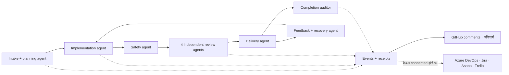
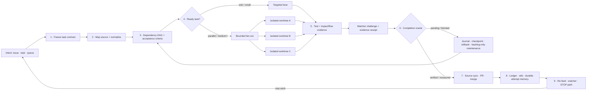

# 🔁 simplicio-loop — The Universal Looping AI Orchestrator

<p align="center">
  
</p>

<p align="center">
  <a href="https://github.com/wesleysimplicio/simplicio-loop/stargazers"></a>
  <a href="#-12-स्किल्स-और-एक्सेलेरेटर्स"></a>
  <a href="#-स्रोत-एडाप्टर्स"></a>
  <a href="#-15-रनटाइम-एक-प्रोटोकॉल"></a>
  <a href="#-पूरा-प्रवाह--माँग-से-वितरण-तक"></a>
  <a href="#-टोकन-अर्थव्यवस्था"></a>
  <a href="../LICENSE"></a>
</p>

<p align="center">
  <a href="#-tldr">TL;DR</a> ·
  <a href="#-12-स्किल्स-और-एक्सेलेरेटर्स">12 स्किल्स</a> ·
  <a href="#-स्रोत-एडाप्टर्स">स्रोत एडाप्टर्स</a> ·
  <a href="#-15-रनटाइम-एक-प्रोटोकॉल">15 रनटाइम</a> ·
  <a href="#-लूप">लूप</a> ·
  <a href="#-टोकन-अर्थव्यवस्था">टोकन अर्थव्यवस्था</a> ·
  <a href="#-टोकन-अर्थव्यवस्था">कैप्चर इंजन</a> ·
  <a href="#-इंस्टॉल-करें-और-उपयोग-करें">इंस्टॉल</a>
</p>

<p align="center">
  <strong>🌍 Languages:</strong><br>
  <a href="../README.md">🇬🇧 English</a> |
  <a href="README.pt-BR.md">🇧🇷 Português</a> |
  <a href="README.es-ES.md">🇪🇸 Español</a> |
  <a href="README.fr-FR.md">🇫🇷 Français</a> |
  <a href="README.de-DE.md">🇩🇪 Deutsch</a> |
  <a href="README.it-IT.md">🇮🇹 Italiano</a> |
  <a href="README.ja-JP.md">🇯🇵 日本語</a> |
  <a href="README.ko-KR.md">🇰🇷 한국어</a> |
  <a href="README.zh-CN.md">🇨🇳 简体中文</a> |
  <a href="README.ru-RU.md">🇷🇺 Русский</a> |
  <a href="README.pl-PL.md">🇵🇱 Polski</a> |
  <a href="README.tr-TR.md">🇹🇷 Türkçe</a> |
  <a href="README.nl-NL.md">🇳🇱 Nederlands</a> |
  <a href="README.hi-IN.md">🇮🇳 हिन्दी</a> |
  <a href="README.ar-SA.md">🇸🇦 العربية</a>
</p>

---

<!-- visual-story:start -->
## 🚀 नई पीढ़ी — सत्यापित एजेंट कार्य के लिए एक ऑपरेटिंग सिस्टम

**simplicio-loop अब केवल पूरा होने तक prompt दोहराने वाला साधन नहीं है।** यह उद्देश्य को स्थिर task contract में बदलता है, repository का मानचित्र बनाता है, dependencies के अनुसार योजना करता है, execution को अलग-अलग worktree में बाँटता है, structured receipts एकत्र करता है, स्वतंत्र verification और सुरक्षित rollback करता है, हर प्रयास याद रखता है और delivery तक source of record को synchronize रखता है।

- **पहले contract** — acceptance criteria, dependencies, risks, source state और completion oracle execution से पहले स्पष्ट होते हैं।
- **बिना corruption के parallelism** — तैयार tasks अलग lane/worktree में चलते हैं और operational ledger के माध्यम से converge करते हैं।
- **completion से पहले proof** — tests, impact/flow checks, watcher challenge, delivery receipt और HBP evidence झूठे done state को अस्वीकार करते हैं।
- **व्यवहार बदलने वाली memory** — journal, stall detector, checkpoint और cross-agent wiki दोहराव रोकते हैं और handoff को टिकाऊ बनाते हैं।

<p align="center">
  
</p>

<p align="center"><em>Dependency-aware fan-out: अलग workers parallel चलते हैं, evidence लौटाते हैं और एक verified delivery में converge करते हैं।</em></p>

<p align="center">
  
</p>

<p align="center"><em>हर चरण स्पष्ट, सीमित, observable और reversible है।</em></p>

<p align="center">
  
</p>

<p align="center"><em>Evidence और memory execution path का हिस्सा हैं, बाद में लिखी गई report नहीं।</em></p>

यह architecture एक लक्ष्य को governed delivery system में बदलता है: एक कठिन task से पूरे backlog तक, sessions और runtimes के पार, local-first operators और ऐसे receipts के साथ जिन्हें मनुष्य, CI या दूसरा agent audit कर सके।

<p align="center">
  
</p>
<!-- visual-story:end -->

<!-- stage-agents-roadmap:start -->
## 🤖 रोडमैप — हर चरण के पीछे एक ठोस agent

> **स्थिति:** [#422](https://github.com/wesleysimplicio/simplicio-loop/issues/422)–[#436](https://github.com/wesleysimplicio/simplicio-loop/issues/436) में track की गई नियोजित architecture। GitHub का canonical lifecycle comment आज मौजूद है; stage agents और mandatory reporting का पूरा gate अभी [#433](https://github.com/wesleysimplicio/simplicio-loop/issues/433) में implement हो रहा है।

Intake/planning, implementation, safety, delivery, recovery और final audit में एक-एक उत्तरदायी agent होगा। Review converge होने से पहले चार independent agents में बँटेगा — security/correctness, quality, runtime/E2E reproduction और blast radius।

<p align="center"></p>



**नीति:** GitHub से जुड़े run में GitHub comments अनिवार्य हैं और `COMPLETE` remote confirmation की प्रतीक्षा करता है। Azure DevOps, Jira, Asana और Trello को comments तभी मिलते हैं जब connection, authentication, authorization और target resolution प्रमाणित हों; `NOT_CONNECTED` एक स्पष्ट, non-blocking skip है। Contract और tests: [#436](https://github.com/wesleysimplicio/simplicio-loop/issues/436)।
<!-- stage-agents-roadmap:end -->

## 🆕 v3.38.0 में नया क्या है — मल्टी-एजेंट समन्वय रिलीज़

यह रिलीज़ उस एक कठिन समस्या को हल करती है जो तभी सामने आती है जब **कई agent सत्र एक साथ एक ही
repo पर काम करते हैं**: किसी सत्र को कैसे पता चले कि कौन-सा issue पहले से claim हो चुका है, कौन-सा
PR मर्ज होकर भी अधूरा रह गया, और खाली समय में सत्र किसी sibling का काम दोहराने के बजाय क्या करे?
नीचे हर बिंदु इसी repo की सजीव, बहु-सत्र state पर बना, परखा और भेजा गया — किसी काल्पनिक परिदृश्य
पर नहीं।

- **`scripts/coordinator.py` — निर्णय केंद्र।** GitHub की आज की स्थिति (claim टिप्पणियाँ + मर्ज-किए
  PRs) देखकर हर issue के लिए एक नियतात्मक क्रिया लौटाता है: `OWN`, `CONTINUE_OWN`,
  `DEFER_ACTIVE_CLAIM` (कोई sibling हाल ही में claim कर चुका), `RECLAIM_STALE` (वह claim ठंडा पड़
  गया), या `VERIFY_PARTIAL` (इस issue के लिए PR मर्ज हो चुका पर issue अब भी खुला है — मान लेने से
  पहले जाँचो कि वास्तव में क्या हुआ)। दो सत्र एक साथ एक ही issue claim करें तो तुरंत `duplicate_risk`
  उठाता है — पहले ही दिन सजीव पकड़ा गया: दो सत्र अलग-अलग फ़ाइलनामों में एक ही findings collector
  बना रहे थे।
- **`scripts/pr_dod_review.py` — खाली समय का समीक्षक।** जब सारे open issues पहले से claim हों, तब
  सबसे अच्छा कदम इंतज़ार करना नहीं बल्कि खुले PRs को repo के अपने मानक — 7-आयामी Definition of Done
  (implementation, unit/integration/system/regression tests, performance benchmark, ≥85% coverage)
  और मूल issue की जमी acceptance-criteria सूची — पर जाँचना है। एक असली, पहले से मर्ज हुए "MVP slice"
  PR पर इसने parent epic के **17 में से 17** acceptance criteria अभी भी अधूरे सही पकड़े।
- **`scripts/finding_collector.py` — टिकाऊ, डुप्लिकेट-मुक्त defect memory** (issue #466, चरण 1)।
  हर अलग बग के लिए एक `simplicio.finding/v1` रिकॉर्ड, fingerprinted ताकि किसी भी agent/run में वही
  underlying बग एक ही occurrence-count वाले रिकॉर्ड में समाए, अलग-अलग डुप्लिकेट शोर के रूप में नहीं।
- **दो असली regressions** इसी रिलीज़ चक्र में, `main` पर ही, सजीव पकड़े और ठीक हुए — एक PR ने चुपचाप
  एक function definition हटा दी (जिससे `loop_progress.py` का अपना selftest टूट गया), और एक
  squash-merge race ने वही टूटा कोड दोबारा `main` पर ला दिया। दोनों असल में स्क्रिप्ट चलाकर पकड़े गए,
  हरे PR description पर भरोसा करके नहीं — यही वजह है कि अब `coordinator.py` और `pr_dod_review.py`
  मौजूद हैं।

**आपके लिए इसका व्यावहारिक मतलब:** यदि आप एक ही repo पर एक से अधिक सत्र या मशीन में
`simplicio-loop` चलाते हैं, तो यह अब दो असली विफलता-पैटर्न से सक्रिय रूप से बचाता है — दो agents
चुपचाप एक ही काम दोहराना, और एक "done" PR जो मर्ज तो हुआ पर असली issue आधा-अधूरा छोड़ गया। पहले
कोई भी दिखाई नहीं देता था; अब दोनों हर triage पास पर यांत्रिक रूप से दिखते हैं। पूरी सूची
[`CHANGELOG.md`](../CHANGELOG.md) में।

---

## ⚡ TL;DR

**simplicio-loop** एक रनटाइम-निरपेक्ष **सुपर-प्लगइन** है — एक स्वायत्त लूपिंग
ऑर्केस्ट्रेटर (**`/simplicio-loop`** के रूप में आह्वानित) और साथ में **पाँच उपग्रह स्किल्स** — जो किसी भी
सशक्त LLM (Claude, Codex, Copilot, Gemini, Cursor, स्थानीय मॉडल) को एक स्व-संचालित वर्कर में बदल देता है। आप
इसे किसी कार्य-भार की ओर इशारा करते हैं — *"सभी खुले issues पूरे करो"*, *"CI कतार साफ़ करो"*, *"Jira बोर्ड खाली करो"* — और यह
पूरे जीवनचक्र को स्वयं चलाता है:

> **खोजो → समझो → निर्णय लो → कार्य करो → सत्यापित करो → सुधारो → रिकॉर्ड करो → दोहराओ**

यह किसी भी स्रोत से कार्य खोजता है (GitHub Issues, Jira, Azure DevOps, agentsview सत्र, और भी
अधिक), डुप्लिकेट हटाता है, आपकी मशीन के अनुसार एक एजेंट फ़्लीट को ऑटो-स्केल करता है, प्रत्येक आइटम को एक गुणवत्ता
लूप के माध्यम से लागू करता है जो **कोड को चलाता है (केवल कंपाइल नहीं करता)**, PRs खोलता है, CI/समीक्षा फ़ीडबैक हल करता है, मर्ज करता है,
और नए कार्य के लिए **24/7** निगरानी जारी रखता है — यह सब सुरक्षा गेट्स और एक कठोर लागत किल-स्विच के पीछे।

```text
/simplicio-loop finish all open issues
→ identity + pre-flight (auth, runtime, STOP path)
→ discover 50 issues · dedup · build dependency DAG
→ autoscale fleet = 14 · pipeline implement→review→merge
→ each item: read body+ACs → orient code → plan → edit → run → verify → PR
→ merge · close with evidence · rollback if main breaks
→ keep looping every ~2 min until the queue is dry (evidence-gated, never a false "done")
```

तीन बातें इसे अलग बनाती हैं: यह **केंद्रित स्किल्स का एक सुपर-प्लगइन** है, यह **15 रनटाइम पर
वही प्रोटोकॉल** (3 गारंटीशुदा + 12 best-effort) चलाता है, और यह सब कुछ **आक्रामक, ईमानदार टोकन
अर्थव्यवस्था** के साथ करता है।

---

## 📘 आधिकारिक क्षमता अभिलेख

`simplicio-loop` जो कुछ भेजता है उसकी संपूर्ण, आधिकारिक सूची — नीचे की हर क्षमता **वास्तविक,
चलाने-योग्य और परीक्षित** है (`python3 scripts/check.py`: claims-audit 4/4 + 28 tests)। प्रत्येक अपने
गहन खंड और अपने वर्कर से जुड़ती है।

| क्षमता | यह क्या करती है | प्रमाण / वर्कर | विवरण |
|---|---|---|---|
| 🎬 **Video evidence** (`video_evidence`) | किसी UI परिवर्तन के काम करने के चलते-फिरते प्रमाण के रूप में **असली ब्राउज़र सत्र** को रिकॉर्ड करती है (Playwright, डिफ़ॉल्ट); किसी स्पष्ट explainer अनुरोध के लिए [hyperframes](https://github.com/heygen-com/hyperframes) के साथ एक **नियतात्मक कैप्शन-युक्त MP4** रेंडर करती है (`/simplicio-loop make a video of screen X`) | `scripts/video_evidence.py` · toolchain के बिना BLOCKED (कभी fake-pass नहीं) | [§ Video evidence](#-video-evidence--playwright-by-default-hyperframes-on-request) |
| 🧠 **Attempt memory + stall detector** | एक टिकाऊ रन-जर्नल (`.orchestrator/loop/journal.jsonl`) + एक stall detector ताकि लूप **दोलन करने के बजाय रणनीति बदले**; वृद्धिशील ट्राइएज (`since`) हर बारी केवल डेल्टा पढ़ता है | `scripts/loop_journal.py` · `selftest` 9/9 | [§ Anti-oscillation](#-attempt-memory--stall-detector-दोलन-रोधी) |
| 🔒 **Fail-closed safety gate** (`action_gate`) | एक `PreToolUse`/git-pre-push हुक जो force-push, इतिहास पुनर्लेखन, मास-डिलीट, विनाशकारी DDL, इन्फ़्रा teardown, और सीक्रेट-युक्त कमिट्स/पुश को **यांत्रिक रूप से ब्लॉक** करता है — Step 5 को निष्पादन-योग्य बनाया गया, गद्य नहीं | `hooks/action_gate.py` · `selftest` 15/15 | [§ Safety](#-सुरक्षा-गैर-समझौता-योग्य) |
| 🔬 **Local verification** | एक टेस्ट सूट (वर्कर selftests + लूप ड्राइवर का एक **e2e** जो साक्ष्य-गेटेड निकास सिद्ध करता है) + एक **claims-audit** (संदर्भित स्क्रिप्ट्स मौजूद · गणनाएँ संगत · `_bundle ≡ source`) — सब स्थानीय, **कोई सशुल्क CI नहीं** | `scripts/check.py` · `scripts/claims_audit.py` · `tests/` | [§ Tests & local checks](#-परीक्षण-और-स्थानीय-जाँच-कोई-सशुल्क-ci-नहीं) |
| ✅ **Honest savings** | बचत पंक्ति अब **साक्ष्य-गेटेड है, अनिवार्य नहीं** — कोई संख्या केवल किसी मापी गई रसीद के साथ दिखाई जाती है (clamp/signatures/cache/`deterministic_edit`/ledger); कभी मनगढ़ंत नहीं | token-economy अनुबंध | [§ Token economy](#-टोकन-अर्थव्यवस्था) |

दो लूप **मोड** समापन को स्पष्ट करते हैं: **converge** (एक एकल कठिन कार्य — साक्ष्य-गेटेड
`<promise>` या stall एस्केलेशन पर समाप्त) बनाम **drain** (एक कतार — समाप्त तब जब स्रोत
पुनः-क्वेरी K राउंड खाली रहे)। दोनों फिर भी सार्वभौमिक निकासों का पालन करते हैं (promise+evidence,
Both modes are still governed by universal exits: promise+evidence, `max_iterations`, and STOP.

> इस कार्य-श्रृंखला में लूप स्कोरिंग: **7.5** (मज़बूत डिज़ाइन, असिद्ध) → **9** (attempt memory +
> दोलन-रोधी) → **9.5** (पुनरुत्पादनीय स्थानीय प्रमाण) → **~10** (प्रवर्तित सुरक्षा + संपूर्ण लूप
> सिमेंटिक्स)। सत्यापन अवसंरचना अब परियोजना के अपने रिग्रेशन्स को बढ़ने के साथ पकड़ती है।

---

## 🧠 12 स्किल्स और एक्सेलेरेटर्स

ऑर्केस्ट्रेटर केंद्र + पाँच उपग्रह + पाँच एक्सेलेरेटर्स/इंटीग्रेशन। प्रत्येक उपग्रह **वैकल्पिक** है —
लोड होने पर ऑर्केस्ट्रेटर उसे सौंप देता है (समृद्ध + सस्ता); अनुपस्थित होने पर इनलाइन प्रोटोकॉल
कार्य का 100% कवर करता है। एक्सेलेरेटर्स **स्वतः-पहचाने** जाते हैं — उपस्थित = उपयोग, अनुपस्थित = LLM फ़ॉलबैक।

| # | क्षमता | किसे आत्मसात करता है | यह क्या करता है | टोकन प्रभाव |
|---|---|---|---|---|
| 1 | 🔁 **simplicio-loop** | — | Unified public entrypoint: orchestrator core + hardened loop behind one command | Core + loop |
| 2 | ↩️ **simplicio-tasks** | legacy alias | Compatibility shim for older installs and saved prompts | Legacy alias |
| 3 | 🧱 **simplicio-orient** | [rtk](https://github.com/rtk-ai/rtk) + [caveman](https://github.com/JuliusBrussee/caveman) | टर्मिनल-फ़र्स्ट निष्पादन, आउटपुट-घटाव कैटलॉग, tee-cache, signatures-read | L0 नियतात्मक |
| 4 | 🔥 **simplicio-review** | [thermos](https://github.com/cursor/plugins/tree/main/thermos) | अलग-अलग रूब्रिक्स पर समानांतर प्रतिकूल समीक्षा → डुप्लिकेट-मुक्त निर्णय | गुणवत्ता गेट |
| 5 | 🗜️ **simplicio-compress** | [caveman](https://github.com/JuliusBrussee/caveman) | आउटपुट + स्मृति संपीड़न, fail-closed `transform_guard` | 40-60% कम |
| 6 | 🎓 **simplicio-learn** | [teaching](https://github.com/cursor/plugins/tree/main/teaching) | रन-पश्चात पूर्वावलोकन → स्मृति में टिकाऊ, डुप्लिकेट-मुक्त सबक | हर रन और बुद्धिमान |
| 7 | 🧪 **simplicio-autoresearch** | Karpathy autoresearch + ECC `autoresearch-agent` | Evolutionary mutate/eval/keep-revert लूप: yool-guardrailed caps, git-isolated branch, anti-Goodhart gate-first eval, `savings-event` रसीद | ऑटो-ऑप्टिमाइज़ |
| 8 | 🧭 **Understand Anything** | [Egonex-AI](https://github.com/Egonex-AI/Understand-Anything) | ज्ञान-ग्राफ orient: सिमेंटिक सर्च, निर्देशित भ्रमण, निर्भरता ग्राफ | **L0 शून्य टोकन** |
| 9 | 📊 **agentsview** | [kenn-io](https://github.com/kenn-io/agentsview) | सत्र विश्लेषण, लागत ट्रैकिंग, ठप-सत्र खोज | **L1** केवल SQL |
| 10 | ⚡ **LMCache** | [LMCache](https://github.com/LMCache/LMCache) | लूप बारियों के बीच KV कैश — स्थानीय मॉडल पर 40-70% TTFT कमी | GPU समय ↓ |
| 11 | 🗜️ **Simplicio कैप्चर इंजन** | `engine/simplicio_engine.py` (native, stdlib-only) | पारदर्शी कैप्चर प्रॉक्सी: असली प्रदाता को अग्रेषित करता है, मापता है + नियतात्मक रूप से संपीड़ित करता है, `proxy_savings.json` लिखता है | **नियतात्मक** |
| 12 | 🎬 **video_evidence** | Playwright (डिफ़ॉल्ट) · [hyperframes](https://github.com/heygen-com/hyperframes) (अनुरोध पर) | किसी UI परिवर्तन के चलते-फिरते प्रमाण के रूप में **असली सत्र** रिकॉर्ड करता है (Playwright); जब वीडियो ही वितरण है तब hyperframes के साथ एक **नियतात्मक कैप्शन-युक्त MP4** explainer रेंडर करता है | साक्ष्य उत्पादक |

प्रत्येक स्किल [`.claude/skills/`](../.claude/skills) के अंतर्गत रहती है; प्रत्येक एक्सेलेरेटर के लिए
`.claude/skills/simplicio-loop/references/` के अंतर्गत एक संदर्भ दस्तावेज़ है (वीडियो उत्पादक:
[`video-evidence.md`](../.claude/skills/simplicio-loop/references/video-evidence.md), वर्कर
[`scripts/video_evidence.py`](../scripts/video_evidence.py))।

---

## 📡 स्रोत एडाप्टर्स

ऑर्केस्ट्रेटर प्लग-योग्य एडाप्टर्स के माध्यम से किसी भी स्रोत से कार्य खोजता है। प्रत्येक छह क्रियाएँ उजागर करता है:
`list_ready`, `get_details`, `claim`, `update_status`, `attach_evidence`, `close`।

| स्रोत | एडाप्टर | उद्देश्य |
|---|---|---|
| GitHub Issues/PRs | `gh` CLI (native) | प्राथमिक कार्य-आइटम स्रोत |
| Jira / Asana / ClickUp / Linear / Notion | होस्ट कनेक्टर | बोर्ड/प्रोजेक्ट प्रबंधन |
| Trello / Azure DevOps | `az boards` एडाप्टर | Azure कार्य ट्रैकिंग |
| **agentsview सत्र** | `scripts/agentsview_adapter.py` | ठप-सत्र पुनर्प्राप्ति + लागत अवलोकनीयता |
| स्थानीय फ़ाइलें / CI कतार | filesystem / CI API | आंतरिक कार्य ट्रैकिंग |

प्रत्येक एडाप्टर का संदर्भ दस्तावेज़ `.claude/skills/simplicio-loop/references/` के अंतर्गत देखें।

---

## 🌐 15 रनटाइम, एक प्रोटोकॉल — 3 गारंटीशुदा + 12 best-effort

एक सार्वभौमिक स्किल कोर + हुक्स का एक सेट हर रनटाइम को चलाता है। एक एडाप्टर पतला होता है: यह किसी
रनटाइम को बताता है कि *स्किल्स कहाँ लोड करें*, *लूप को कैसे सक्रिय करें*, और *मूल गति से कैसे
बाइंड करें*। **स्किल किसी रनटाइम का नाम नहीं लेती; रनटाइम स्किल को पहचानता है।**

| रनटाइम | स्किल लोड | लूप ड्राइव | मूल बाइंड |
|---|---|---|---|
| **Claude Code** | `.claude/skills/` + plugin | `Stop` hook | MCP |
| **Codex** | `AGENTS.md` | self-paced | MCP / adapter |
| **VS Code (Copilot)** | `copilot-instructions.md` | tasks | MCP |
| **Cursor** | `.cursor-plugin/` | `stop`+`afterAgentResponse` | MCP / rules |
| **Antigravity** | rules / `AGENTS.md` | self-paced | MCP |
| **Kiro** | `.kiro/steering/` | specs | MCP |
| **OpenCode** | `AGENTS.md` | self-paced | MCP |
| **Gemini** (CLI/Code Assist) | `GEMINI.md` | self-paced | MCP / adapter |
| **Kimi** | inlined conventions | self-paced | best-effort, कोई प्रमाणित client नहीं |
| **Qwen** (Code/CLI) | `AGENTS.md`-समकक्ष | self-paced | best-effort |
| **DeepSeek** | inlined conventions | self-paced | best-effort, कोई first-party client नहीं |
| **Aider** | `CONVENTIONS.md` | self-paced | — (LLM fallback) |
| **Simplicio Agent** *(पहले Hermes)* | native recall | native loop | **native** |
| **OpenClaw** | plugin SDK | native scheduler | **native** |
| **Orca** | inner agent + skills registry के माध्यम से | inner hook / scheduled automations | registry/inner-agent config |

Tier 1 (Claude Code, Codex, Cursor) हर commit पर मशीनी रूप से सत्यापित है; बाकी 12 रनटाइम
best-effort हैं (योगदान स्वागत है, कोई गेट नहीं)। वादा: **सभी 15 पर वही प्रोटोकॉल, वही गेट्स, वही
सुरक्षा — केवल गति भिन्न होती है।**
`orient_clamp.py` (टोकन अर्थव्यवस्था) हर रनटाइम पर शून्य वायरिंग के साथ काम करता है। देखें
[`adapters/MATRIX.md`](../adapters/MATRIX.md)।

---

## 🗺️ पूरा प्रवाह — माँग से वितरण तक

ऑर्केस्ट्रेटर जिस प्रत्येक परत पर कार्य करता है, क्रम में — माँग पढ़ने (issues, tasks, assigns)
से लेकर मर्ज-किए-गए, साक्ष्य-समर्थित कार्य के वितरण तक, फिर और अधिक के लिए 24/7 लूपिंग।



---

## 🔁 लूप

**साक्ष्य-गेटेड लूप** केंद्रीय तंत्र है। यह हर बारी वही लक्ष्य फिर से प्रदान करता है ताकि
एजेंट अपना ही पूर्व कार्य देखे। निकास **केवल** इनके माध्यम से होता है:

1. **साक्ष्य-गेटेड `<promise>`** — जो बारी वादा उत्सर्जित करती है उसे ठोस प्रमाण भी
   ले जाना चाहिए (पास होता टेस्ट, मर्ज-किया-गया PR, बंद-आइटम पुनः-क्वेरी)। बिना साक्ष्य वाला वादा = अनदेखा।
2. **`max_iterations` सीमा** — कठोर सुरक्षा बैकस्टॉप
3. **STOP/cancel path** — explicit STOP file or channel command stops unattended runs
4. **STOP संकेत** — `.orchestrator/STOP` या चैनल कमांड

बारियों के बीच, LMCache (जब उपलब्ध हो) KV स्थिति को कैश करता है ताकि पुनः-फ़ीड की लागत लगभग-शून्य प्रीफ़िल हो।

### 🧠 Attempt memory + stall detector (दोलन-रोधी)

एक पुनः-फ़ीड लूप जो कुछ याद नहीं रखता वह दोलन करता है — X आज़माओ, असफल, X फिर आज़माओ — जब तक
सीमा भस्म न हो जाए। simplicio-loop एक **टिकाऊ रन-जर्नल** रखता है (`.orchestrator/loop/journal.jsonl`,
append-only: `iteration · action · hypothesis · gate · error-fingerprint`) और एक **stall detector**
([`scripts/loop_journal.py`](../scripts/loop_journal.py), नियतात्मक + मॉडल-मुक्त):

- **Error fingerprint** — विफल गेट आउटपुट को एक स्थिर hash में घटाया जाता है जिसमें पंक्ति-संख्याएँ,
  पथ, hex/uuids, टाइमस्टैम्प और अवधियाँ सामान्यीकृत होती हैं, ताकि *वही* बग बारियों में पहचाना जाए
  भले ही आनुषंगिक पाठ भिन्न हो।
- **Stall = लगातार K समान-fingerprint विफलताएँ** (डिफ़ॉल्ट K=3)। एक बदलता fingerprint मतलब
  लूप आगे बढ़ रहा है (PROGRESS); वही K बार मतलब वह घूम रहा है (STALLED)।
- STALLED पर लूप वही लक्ष्य फिर से **नहीं** फ़ीड करता — वह बचने योग्य **dead-end actions** का नाम
  देता है, फिर **रणनीति बदलता है** या fingerprint के साथ **मानव गेट तक एस्केलेट** करता है।
- `loop_journal.py resume` हर बारी के शीर्ष पर पढ़ा जाता है, ताकि एक ताज़ा प्रक्रिया पूर्व प्रयासों को
  पुनः-व्युत्पन्न किए बिना जारी रहे (असली resume) और किसी ज्ञात dead-end को कभी पुनः न आज़माए।

```bash
loop_journal.py resume                       # what was tried + dead-ends to avoid
loop_journal.py record --iteration N --action "…" --gate fail --gate-output test.log
loop_journal.py stall --k 3 --exit-code      # PROGRESS → re-feed · STALLED → switch/escalate
```

---

## 🎬 Video evidence — डिफ़ॉल्ट रूप से Playwright, अनुरोध पर hyperframes

लूप किसी परिवर्तन के काम करने के प्रमाण के रूप में **डेमो वीडियो** बनाता है — **दो इंजन**, एक ही `video_evidence`
एक्सटेंशन पॉइंट (वर्कर [`scripts/video_evidence.py`](../scripts/video_evidence.py), अनुबंध
[`references/video-evidence.md`](../.claude/skills/simplicio-loop/references/video-evidence.md)):

1. **डिफ़ॉल्ट — सामान्य साक्ष्य प्रवाह Playwright का उपयोग करता है।** किसी UI परिवर्तन के बाद, `video_evidence`
   स्क्रीन को चलाने वाले **असली ब्राउज़र सत्र** को रिकॉर्ड करता है (Playwright का native वीडियो → `.webm`, →
   FFmpeg के साथ `.mp4`) — सबसे मज़बूत "काम करता है, केवल कंपाइल नहीं" रसीद (Step 4b) और एक वैध
   साक्ष्य-गेटेड `<promise>`।

   ```bash
   python3 scripts/video_evidence.py verify --url http://localhost:3000/login \
       --name login-demo --expect "Sign in" --issue 42 [--upload --pr 42]
   ```

2. **अनुरोध पर — एक वैयक्तिकृत explainer hyperframes का उपयोग करता है।** जब वितरण ही वीडियो है
   ("make an explainer video of screen X"), तब ऑर्केस्ट्रेटर `web_verify` स्क्रीनशॉट्स का एक
   **नियतात्मक, कैप्शन-युक्त स्लाइडशो** [**hyperframes**](https://github.com/heygen-com/hyperframes)
   (HeyGen द्वारा — "वही इनपुट, वही फ़्रेम, वही आउटपुट", CI-पुनरुत्पादनीय, कोई API कुंजी नहीं, headless
   Chrome + FFmpeg के माध्यम से स्थानीय रेंडर) के साथ रेंडर करता है।

   ```text
   /simplicio-loop make an explainer video of the system login screen
   → detect: video-creation request → web_verify captures the screens
   → video_evidence verify --engine hyperframes → deterministic MP4 → attached to the PR
   ```

दोनों में से कोई भी इंजन: एक वीडियो जो कभी रिकॉर्ड/रेंडर नहीं हुआ वह **BLOCKED** देता है, कभी fake pass नहीं।
साक्ष्य हमेशा एक **फ़ाइल पथ + बूलियन निर्णय** होता है — कभी संदर्भ में वीडियो बाइट्स नहीं (टोकन अर्थव्यवस्था)।

---

## 📊 टोकन अर्थव्यवस्था

| तकनीक | बचत |
|---|---|
| `deterministic_edit` (L0) | edit टोकन का 100% (फ़ाइल यांत्रिक रूप से लिखी गई, कभी LLM द्वारा नहीं) |
| टर्मिनल-फ़र्स्ट निष्पादन | तथ्य शेल से, LLM भ्रांति से नहीं |
| आउटपुट-घटाव कैटलॉग | प्रति कमांड-प्रकार कैप्स (`CAP_ERRORS=20`, `CAP_WARNINGS=10`, `CAP_LIST=20`) — `orient_clamp.py` |
| विफलता पर Tee+CCR कैश | किसी विफल कमांड को कभी फिर से न चलाएँ — कैश किया आउटपुट पढ़ें |
| Signatures-only रीड्स | `simplicio-cli signatures <file>` — 870-पंक्ति फ़ाइल → 65 पंक्तियाँ (**93% बचाया**), बॉडीज़ हटाई गईं |
| `simplicio-compress` | संक्षिप्त गद्य + एक बार की स्मृति संघनन |
| `orient_clamp.py` | हर शेल कमांड पर क्लैम्प + tee, शून्य वायरिंग |
| मूल प्रतिक्रिया कैश | दोहराया गया नियतात्मक (temp=0) अनुरोध → कैश से परोसा गया, LLM कॉल छोड़ी गई (**हिट पर 100%**) — `simplicio-cli cache`, डिफ़ॉल्ट रूप से चालू (`SIMPLICIO_CACHE=0` से अक्षम करें) |
| Simplicio कैप्चर प्रॉक्सी + MCP | एक पारदर्शी संपीड़न डेमन के माध्यम से टूल आउटपुट पर 60-95% कम टोकन |

बचत केवल किसी सत्यापित-सही परिणाम पर गिनी जाती है। बेसलाइन = उसी परिणाम तक का सबसे सस्ता समझदार
गैर-ऑर्केस्ट्रेटेड पथ। **बचत रिपोर्टिंग साक्ष्य-गेटेड है, अनिवार्य नहीं:** एक बचत आँकड़ा
केवल तब दिखाया जाता है जब किसी बारी ने वास्तव में कोई अर्थव्यवस्था-उत्पादक कमांड चलाया हो और संख्या किसी
मापी गई रसीद तक पहुँचती हो (clamp tee, signatures-read, cache hit, `deterministic_edit`, `savings_ledger`)।
कोई मापी गई अर्थव्यवस्था नहीं → कोई बचत पंक्ति नहीं; ऑर्केस्ट्रेटर कभी कोई बेसलाइन या प्रतिशत नहीं गढ़ता।
देखें `references/token-economy.md`।

### 🔎 `simplicio-loop` चलाना: अर्थव्यवस्था बनाम मापन (प्रति रनटाइम)

जब आप **`simplicio-loop`** को कॉल करते हैं तो दो अलग बातें होती हैं, और वे प्रति रनटाइम भिन्न व्यवहार करती हैं:

- **अर्थव्यवस्था** — संपीड़न, आउटपुट क्लैम्प्स, signatures-only रीड्स, `deterministic_edit` — **हर बार
  जब स्किल चलती है और `simplicio-orient` / `simplicio-compress` लोड करती है, किसी भी रनटाइम पर** लागू होती है।
  यह स्किल का व्यवहार प्लस हुक्स है (जहाँ हुक्स मौजूद हैं वहाँ सबसे मज़बूत: `orient_clamp.py` Claude और
  Cursor पर ऑटो-क्लैम्प करता है; अन्यत्र यह निर्देश-संचालित है)।
- **मापन** — Token Monitor की सजीव संख्याएँ — केवल उस ट्रैफ़िक की गिनती करती हैं जो **कैप्चर प्रॉक्सी से होकर**
  बहता है।

| रनटाइम | अर्थव्यवस्था (स्किल) | मापन (मॉनिटर) |
|---|---|---|
| **Simplicio Agent** | ✓ | ✓ **स्वचालित** — पहले से प्रॉक्सी से राउट (`base_url → :8788`) |
| **Claude** | ✓ (स्किल + हुक्स) | ✗ डिफ़ॉल्ट रूप से — Claude सीधे `api.anthropic.com` से बात करता है; राउट होने पर ही मापा जाता है (`simplicio-cli wrap claude`, या `ANTHROPIC_BASE_URL → http://127.0.0.1:8788`) |
| **Codex** | ✓ (स्किल) | ✗ डिफ़ॉल्ट रूप से — `simplicio-cli init codex` MCP टूल्स जोड़ता है पर LLM ट्रैफ़िक राउट नहीं करता; `simplicio-cli wrap codex` या प्रॉक्सी की ओर इशारा करने वाले OpenAI base-url के साथ मापा जाता है |

तो: **बचत हर रनटाइम पर होती है**; **मॉनिटर उन्हें Simplicio Agent पर स्वचालित रूप से** गिनता है, और
Claude/Codex पर एक **एक-बार के राउटिंग चरण** के बाद (`simplicio-cli wrap …` / base-url → `:8788`)। राउटिंग के बिना,
अर्थव्यवस्था फिर भी लागू होती है — मॉनिटर बस उन टोकन्स को नहीं गिनेगा। `scripts/simplicio-economy.sh wire`
इंस्टॉल समय पर OpenAI-संगत क्लाइंट्स के लिए यह राउटिंग करता है।

### 📈 Simplicio Token Monitor

बचत का एक सजीव, हमेशा-चालू दृश्य:

- **वेब डैशबोर्ड** — `http://127.0.0.1:9090` — रीयल-टाइम टोकन चार्ट, बचत गेज, जिन LLMs/रनटाइम्स
  और **141/144 प्रदाताओं (98%)** को हम इंटरसेप्ट करते हैं, और एक सजीव प्रॉक्सी लॉग।
- **मेनू-बार / ट्रे विजेट** — सिस्टम ट्रे में सजीव बचाए गए टोकन (macOS rumps · Windows/Linux pystray)।
- **एक मॉड्यूल** — `scripts/simplicio-economy.sh {status|up|wire}` कैप्चर प्रॉक्सी + मॉनिटर +
  ट्रे + `simplicio-dev-cli` नियतात्मक ऑपरेटर को ऊपर लाता है और पूरे स्टैक की रिपोर्ट करता है।

इंस्टॉल तीनों को `scripts/setup_simplicio.sh`, या क्रॉस-प्लेटफ़ॉर्म `python3 scripts/install_services.py install`
के माध्यम से ऑटो-स्टार्ट सेवाओं (macOS launchd · Linux systemd · Windows Startup) के रूप में पंजीकृत करता है। इंस्टॉल के बाद
मॉनिटर + कैप्चर **लूप का आह्वान किए बिना** चलते हैं — देखें `references/token-capture.md`।

### 🛠️ कैप्चर इंजन — एक मूल मॉड्यूल, हर कमांड

[`engine/simplicio_engine.py`](../engine/simplicio_engine.py) मूल Simplicio कैप्चर इंजन है —
**native, stdlib-only, fail-open, किसी बाहरी निर्भरता के बिना**। किसी भी
कमांड को [`scripts/simplicio-engine`](../scripts/simplicio-engine) रैपर के माध्यम से चलाएँ (उदा. `simplicio-engine doctor`):

| कमांड | यह क्या करता है |
|---|---|
| `proxy` | पारदर्शी कैप्चर प्रॉक्सी — प्रत्येक मॉडल को उसके **असली** प्रदाता तक राउट करता है, संपीड़ित + मापता + कैश करता है (कोई मॉडल स्वैप नहीं) |
| `doctor` | प्रॉक्सी पहुँच-योग्यता + आजीवन बचत |
| `cache` | मूल प्रतिक्रिया कैश (`stats`/`clear`) — दोहराया गया नियतात्मक अनुरोध कैश से परोसा जाता है, LLM कॉल छोड़ी जाती है |
| `signatures` | किसी स्रोत फ़ाइल का signatures-only दृश्य (बॉडीज़ हटाई गईं, कोड पढ़ने में ~93% कम टोकन) |
| `semantic` | प्रतिवर्ती निष्कर्षक (semantic-lite) संपीड़न |
| `detect` | सामग्री-प्रकार पहचान + स्मार्ट प्रति-ब्लॉक राउटिंग |
| `rag` | CCR स्मृति स्टोर पर TF-IDF (या `--ml` एम्बेडिंग) पुनर्प्राप्ति |
| `memory` | CCR compress-cache-retrieve स्टोर (`remember`/`recall`/`forget`/`list`/`stats`) |
| `mcp` | मूल stdio MCP सर्वर (compress / retrieve / stats टूल्स) |
| `init` / `wrap` | Simplicio को किसी क्लाइंट में पंजीकृत करें (Claude / Codex / Copilot / OpenClaw) · किसी क्लाइंट को कैप्चर राउटिंग के साथ चलाएँ |
| `report` / `audit` / `capture` / `evals` | बचत रिपोर्ट · संपीड़न अवसर के लिए किसी ट्री का ऑडिट · किसी अनुरोध का ड्राई-रन · संपीड़न रिग्रेशन गेट |

---

## 🏛️ डिज़ाइन स्तंभ (विस्तार में)

चार तंत्र ऑर्केस्ट्रेशन की शक्ति को वहन करते हैं:

| स्तंभ | केंद्र | कहाँ रहता है |
|---|---|---|
| **DAG + पाइपलाइन** | निर्भरता द्वारा समानांतरता, प्रति-आइटम चरणबद्ध | `references/orchestration.md` (Step 3 pool + pipeline) |
| **Worktree पृथक्करण** | ट्री को बिगाड़े बिना समानांतर संपादन, मर्ज-गेटेड | `references/orchestration.md` |
| **प्रतिकूल सत्यापन** | "वितरित" से पहले संशयवादियों का एक पैनल | `references/quality-safety-delivery.md` · skill `simplicio-review` |
| **Bounded loop cap** | anti-infinite-loop, evidence-gated exit | `references/standing-loop-247.md` · skill `simplicio-loop` |

---

## 🚀 इंस्टॉल करें और उपयोग करें

```bash
git clone https://github.com/wesleysimplicio/simplicio-loop
cd simplicio-loop

# install for your runtime (omit <runtime> to auto-detect)
bash scripts/install.sh <runtime> [--global]        # macOS / Linux
pwsh scripts/install.ps1 <runtime> [-Global]        # Windows
# <runtime> ∈ claude codex vscode cursor antigravity kiro opencode gemini aider simplicio_agent openclaw
```

या, Claude Code / Cursor पर, इसे सीधे नवीनतम GitHub रिलीज़ से इंस्टॉल करें (मार्केटप्लेस नहीं):

```bash
gh release download --repo wesleysimplicio/simplicio-loop --archive tar.gz
tar xzf simplicio-loop-*.tar.gz && cd simplicio-loop-*/
bash scripts/install.sh claude    # or: bash scripts/install.sh cursor
```

फिर:

```
/simplicio-loop finish all the open issues
```

एकमात्र आवश्यकता PATH पर **python3** है (स्किल्स, हुक्स और इंस्टॉलर क्रॉस-प्लेटफ़ॉर्म Python हैं)।
GitHub स्रोतों के लिए, `git` + एक प्रमाणित `gh`। देखें [`INSTALL.md`](../INSTALL.md) और
[`adapters/MATRIX.md`](../adapters/MATRIX.md)।

**Before an unattended 24/7 run:** verify persistent source auth, keep the irreversible-operation human gate + secret-scan enabled, and ensure a reachable STOP/cancel path.

---

## 🔒 सुरक्षा (गैर-समझौता-योग्य)

- हर diff पर **सीक्रेट-स्कैन**; हिट पर रोकें।
- **अपरिवर्तनीय-संचालन मानव गेट** — force-push, इतिहास पुनर्लेखन, prod डिप्लॉय, डेटा/स्कीमा डिलीट,
  मास-फ़ाइल डिलीट → रुको और पूछो। हेडलेस + कोई अनुमोदक नहीं → विनाशकारी क्षमता हटा दें।
- **प्रवर्तित, केवल वादा नहीं** — `hooks/action_gate.py` एक **fail-closed** `PreToolUse` /
  git-pre-push हुक है जो उपरोक्त (और सीक्रेट-युक्त कमिट्स) को उनके चलने से *पहले* यांत्रिक रूप से ब्लॉक करता है।
  सुरक्षा अनुबंध तब भी कायम रहता है जब मॉडल इसे भूल जाए। `selftest` ruleset सिद्ध करता है (14/14)।
- **4-अवस्था पूर्व-निष्पादन निर्णय** — अनुकूलन किसी कमांड के जोखिम स्तर को कभी नहीं बढ़ा सकता।
- **Trust-before-load** — धारणा-आकार देने वाला कॉन्फ़िग (clamp प्रोफ़ाइल, suppression सूचियाँ)
  तब तक अविश्वसनीय रहता है जब तक कोई मानव समीक्षा करके उसे hash-pin न कर दे।
- **प्रॉम्प्ट-इंजेक्शन सुदृढ़ीकरण** — आइटम/PR/टिप्पणी सामग्री अनुबंध को कभी ओवरराइड नहीं कर सकती।
- अनिगरानी रन्स के लिए कठोर **$ किल-स्विच**; **साक्ष्य-गेटेड** समापन (कभी झूठा "done" नहीं);
  **fail-open** हुक्स (एजेंट को कभी लूप में न फँसाएँ)।

---

## ✅ परीक्षण और स्थानीय जाँच (कोई सशुल्क CI नहीं)

दावे सत्यापित होते हैं, केवल अभिकथित नहीं — और गेट **स्थानीय रूप से** चलता है, शून्य CI लागत के साथ:

```bash
python3 scripts/check.py            # the whole gate (audit + tests)
```

- **टेस्ट सूट** (`tests/`) — वर्कर्स के नियतात्मक `selftest`s, साथ ही लूप ड्राइवर का एक **e2e**
  (`hooks/loop_stop.py`): यह सिद्ध करता है कि लूप **साक्ष्य पर रुकता है**, एक बेयर
  `<promise>` को **अनदेखा करता है**, और **सीमा पर रुकता है** — अलग-अलग निकासों के रूप में — और कि साक्ष्य उत्पादक
  अपने toolchain के अनुपस्थित होने पर **BLOCK** करते हैं (कभी fake-pass नहीं)। `pytest` के अंतर्गत *या*, बिना किसी pip
  के, बेयर python3 पर स्व-चलता है (`python3 tests/test_*.py`)।
- **Claims audit** (`scripts/claims_audit.py`, fail-closed) — दस्तावेज़ संदर्भित हर `scripts/*.py`
  मौजूद है · एक्सटेंशन-पॉइंट गणना सभी फ़ाइलों में सहमत है · प्रत्येक उद्धृत वर्कर कमांड
  वास्तव में चलता है · भेजी गई `simplicio_loop/_bundle/` स्किल्स स्रोत के साथ **बाइट-समान** हैं।
- **इसे एक git pre-push हुक के रूप में वायर करें** ताकि `main` मुफ़्त में ईमानदार रहे:
  ```bash
  printf '#!/bin/sh\npython3 scripts/check.py\n' > .git/hooks/pre-push && chmod +x .git/hooks/pre-push
  ```

`pip install "simplicio-loop[dev]"` बेहतर आउटपुट के लिए pytest जोड़ता है; यह कभी आवश्यक नहीं है।

---

## ⭐ स्टार इतिहास

[](https://star-history.com/#wesleysimplicio/simplicio-loop&Date)

---

## 📄 लाइसेंस

MIT

<!-- simplicio-loop:github-comment-coordination:v1 -->
## 🌐 GitHub टिप्पणियों से runtimes के बीच समन्वय

`simplicio-loop` को Claude Code, Codex, Cursor, Gemini और Hermes में एक साथ चलाया जा सकता है। GitHub issue से जुड़ा run canonical comment में claim, plan, progress, evidence, PR और close के idempotent updates लिखता है। इससे अलग-अलग मशीनों के agents साझा local filesystem के बिना उसी GitHub thread में समन्वय कर सकते हैं।

```powershell
pwsh scripts/install.ps1 claude -Global
pwsh scripts/install.ps1 codex -Global
pwsh scripts/install.ps1 cursor -Global
pwsh scripts/install.ps1 gemini -Global
pwsh scripts/install.ps1 hermes -Global   # simplicio_agent का legacy alias
```

Local queue, leases, worktrees, heartbeats और evidence हर मशीन पर सक्रिय रहते हैं; GitHub comments साझा coordination projection हैं। यह flow केवल GitHub के लिए है; Jira, Azure DevOps और अन्य trackers को comments नहीं भेजे जाते। GitHub अनुपलब्ध हो तो loop local रूप से चलता और sync failure दर्ज करता है, remote acknowledgment नहीं गढ़ता। हर runtime को GitHub access देकर वही `source_issue` इस्तेमाल करें।
