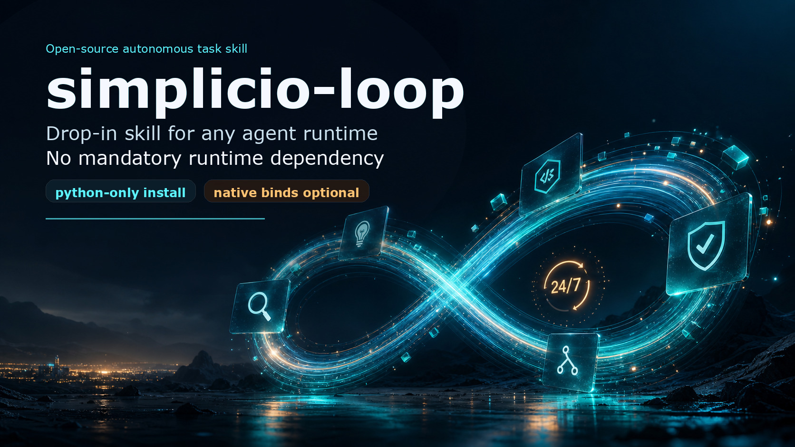

# 🔁 simplicio-tasks — The Universal Looping AI Orchestrator

<p align="center">
  
</p>

<p align="center">
  <a href="https://github.com/wesleysimplicio/simplicio-loop/stargazers"></a>
  <a href="#-le-11-skill--acceleratori"></a>
  <a href="#-source-adapter"></a>
  <a href="#-11-runtime-un-protocollo"></a>
  <a href="#-i-44-extension-point"></a>
  <a href="#-economia-dei-token"></a>
  <a href="../LICENSE"></a>
</p>

<p align="center">
  <a href="#-tldr">TL;DR</a> ·
  <a href="#-le-11-skill--acceleratori">11 Skill</a> ·
  <a href="#-source-adapter">Source Adapter</a> ·
  <a href="#-11-runtime-un-protocollo">11 Runtime</a> ·
  <a href="#-il-loop">Il loop</a> ·
  <a href="#-economia-dei-token">Economia dei token</a> ·
  <a href="#-economia-dei-token">Capture Engine</a> ·
  <a href="#-installazione--uso">Installazione</a>
</p>

<p align="center">
  <strong>🌍 Languages:</strong><br>
  <a href="../README.md">🇬🇧 English</a> |
  <a href="README.pt-BR.md">🇧🇷 Português</a> |
  <a href="README.es-ES.md">🇪🇸 Español</a> |
  <a href="README.fr-FR.md">🇫🇷 Français</a> |
  <a href="README.de-DE.md">🇩🇪 Deutsch</a> |
  <a href="README.it-IT.md">🇮🇹 Italiano</a> |
  <a href="README.ja-JP.md">🇯🇵 日本語</a> |
  <a href="README.ko-KR.md">🇰🇷 한국어</a> |
  <a href="README.zh-CN.md">🇨🇳 简体中文</a> |
  <a href="README.ru-RU.md">🇷🇺 Русский</a> |
  <a href="README.pl-PL.md">🇵🇱 Polski</a> |
  <a href="README.tr-TR.md">🇹🇷 Türkçe</a> |
  <a href="README.nl-NL.md">🇳🇱 Nederlands</a> |
  <a href="README.hi-IN.md">🇮🇳 हिन्दी</a> |
  <a href="README.ar-SA.md">🇸🇦 العربية</a>
</p>

---

## ⚡ TL;DR

**simplicio-tasks** è un **super-plugin** indipendente dal runtime — un unico orchestratore autonomo a
ciclo continuo (invocato come **`/simplicio-tasks`**) più **cinque skill satellite** — che trasforma
qualsiasi LLM potente (Claude, Codex, Copilot, Gemini, Cursor, modelli locali) in un worker che si guida
da solo. Lo punti verso un corpo di lavoro — *"completa tutte le issue aperte"*, *"svuota la coda della
CI"*, *"esaurisci la board di Jira"* — e lui esegue da solo l'intero ciclo di vita:

> **scopri → comprendi → decidi → agisci → verifica → correggi → registra → ripeti**

Scopre il lavoro da qualsiasi fonte (GitHub Issues, Jira, Azure DevOps, sessioni agentsview e altro),
deduplica, ridimensiona automaticamente una flotta di agenti in base alla tua macchina, implementa ogni
elemento attraverso un loop di qualità che **esegue il codice (non si limita a compilarlo)**, apre le PR,
risolve i feedback di CI/review, fa il merge e continua a sorvegliare **24/7** in cerca di nuovo lavoro —
il tutto dietro gate di sicurezza e un kill-switch rigido sui costi.

```text
/simplicio-tasks finish all open issues
→ identity + pre-flight (kill-switch, auth, watcher)
→ discover 50 issues · dedup · build dependency DAG
→ autoscale fleet = 14 · pipeline implement→review→merge
→ each item: read body+ACs → orient code → plan → edit → run → verify → PR
→ merge · close with evidence · rollback if main breaks
→ keep looping every ~2 min until the queue is dry (evidence-gated, never a false "done")
```

Tre cose lo rendono diverso: è un **super-plugin di skill mirate**, esegue lo **stesso protocollo su 11
runtime** e fa tutto questo con un'**economia dei token aggressiva e onesta**.

---

## 📘 Registro ufficiale delle capacità (v3.4.0)

Il roster completo e ufficiale di ciò che `simplicio-tasks` offre — ogni capacità qui sotto è **reale,
eseguibile e testata** (`python3 scripts/check.py`: claims-audit 4/4 + 27 test). Ciascuna rimanda alla
propria sezione approfondita e al proprio worker.

| Capacità | Cosa fa | Prova / worker | Dettagli |
|---|---|---|---|
| 🎬 **Video evidence** (`video_evidence`) | Renderizza un demo **MP4 deterministico** di una schermata/funzionalità con [hyperframes](https://github.com/heygen-com/hyperframes) — soddisfa `/simplicio-tasks make a demo video of screen X` e funge anche da prova CI-riproducibile che una modifica della UI funziona | `scripts/video_evidence.py` · BLOCCATO (mai un fake-pass) senza Node 22+/FFmpeg | [§ Video evidence](#-video-evidence--video-dimostrativi-via-hyperframes) |
| 🧠 **Memoria dei tentativi + rilevatore di stallo** | Un run-journal durevole (`.orchestrator/loop/journal.jsonl`) + un rilevatore di stallo così che il loop **cambi strategia invece di oscillare**; triage incrementale (`since`) che legge solo il delta a ogni turno | `scripts/loop_journal.py` · `selftest` 9/9 | [§ Anti-oscillazione](#-memoria-dei-tentativi--rilevatore-di-stallo-anti-oscillazione) |
| 🔒 **Gate di sicurezza fail-closed** (`action_gate`) | Un hook `PreToolUse`/git-pre-push che **blocca meccanicamente** force-push, riscrittura della history, eliminazione massiva, DDL distruttiva, smantellamento dell'infra e commit/push contenenti segreti — lo Step 5 reso eseguibile, non prosa | `hooks/action_gate.py` · `selftest` 15/15 | [§ Sicurezza](#-sicurezza-non-negoziabile) |
| 🔬 **Verifica locale** | Una suite di test (selftest dei worker + un **e2e del driver del loop** che dimostra l'uscita vincolata a evidenze) + un **claims-audit** (gli script referenziati esistono · i conteggi sono coerenti · `_bundle ≡ source`) — tutto locale, **senza CI a pagamento** | `scripts/check.py` · `scripts/claims_audit.py` · `tests/` | [§ Test e controlli locali](#-test-e-controlli-locali-senza-ci-a-pagamento) |
| ✅ **Risparmi onesti** | La riga dei risparmi è ora **vincolata a evidenze, non obbligatoria** — un numero viene mostrato solo con una ricevuta misurata (clamp/firme/cache/`deterministic_edit`/ledger); mai fabbricato | contratto dell'economia dei token | [§ Economia dei token](#-economia-dei-token) |
| 💳 **Billing open-core** | Un meter→invoice deterministico e rispettoso della privacy sopra la misurazione che il loop già produce (kill-switch + `savings_ledger`) — tre fasce (seat/run/metered) | `scripts/billing_aggregator.py` · `selftest` 11/11 | [PRICING.md](../PRICING.md) |

Due **modalità** del loop rendono esplicita la terminazione: **converge** (un singolo task arduo —
termina sulla `<promise>` vincolata a evidenze o su un'escalation di stallo) vs **drain** (una coda —
termina quando la ri-query della fonte resta vuota per K round). Entrambe obbediscono comunque alle uscite
universali (promise+evidenze, `max_iterations`, budget, STOP).

> Punteggio del loop lungo questa linea di lavoro: **7.5** (design forte, non provato) → **9** (memoria dei
> tentativi + anti-oscillazione) → **9.5** (prova locale riproducibile) → **~10** (sicurezza imposta +
> semantica completa del loop). L'infrastruttura di verifica ora cattura le regressioni del progetto stesso
> man mano che cresce.

---

## 🧠 Le 11 skill e acceleratori

Il nucleo dell'orchestratore + cinque satelliti + cinque acceleratori/integrazioni. Ogni satellite è
**opzionale** — quando è caricato, l'orchestratore delega a esso (più ricco + più economico); quando è
assente, il protocollo inline copre il 100%. Gli acceleratori sono **rilevati automaticamente** — presente
= usato, assente = fallback LLM.

| # | Capacità | Assorbe | Cosa fa | Impatto sui token |
|---|---|---|---|---|
| 1 | 🔁 **simplicio-tasks** | — | Il loop dell'orchestratore: 44 extension point, router a doppio percorso, convergenza con auto-audit | Core |
| 2 | ♾️ **simplicio-loop** | [ralph-loop](https://github.com/cursor/plugins/tree/main/ralph-loop) | Loop Ralph rinforzato: uscita con `<promise>` vincolata a evidenze, limite max_iterations | Drive del loop |
| 3 | 🧱 **simplicio-orient** | [rtk](https://github.com/rtk-ai/rtk) + [caveman](https://github.com/JuliusBrussee/caveman) | Esecuzione terminal-first, catalogo di riduzione dell'output, tee-cache, letture solo-firme | L0 deterministico |
| 4 | 🔥 **simplicio-review** | [thermos](https://github.com/cursor/plugins/tree/main/thermos) | Review avversariale parallela su rubriche distinte → verdetto deduplicato | Gate di qualità |
| 5 | 🗜️ **simplicio-compress** | [caveman](https://github.com/JuliusBrussee/caveman) | Compressione di output + memoria, `transform_guard` fail-closed | 40-60% in meno |
| 6 | 🎓 **simplicio-learn** | [teaching](https://github.com/cursor/plugins/tree/main/teaching) | Retrospettiva post-esecuzione → lezioni durevoli e deduplicate in memoria | Più intelligente a ogni esecuzione |
| 7 | 🧭 **Understand Anything** | [Egonex-AI](https://github.com/Egonex-AI/Understand-Anything) | Orient su knowledge graph: ricerca semantica, tour guidati, grafo delle dipendenze | **L0 zero token** |
| 8 | 📊 **agentsview** | [kenn-io](https://github.com/kenn-io/agentsview) | Analitica delle sessioni, tracciamento dei costi, scoperta delle sessioni bloccate | **L1** solo SQL |
| 9 | ⚡ **LMCache** | [LMCache](https://github.com/LMCache/LMCache) | Cache KV tra i turni del loop — riduzione del TTFT del 40-70% sui modelli locali | Tempo GPU ↓ |
| 10 | 🗜️ **Simplicio capture engine** | `engine/simplicio_engine.py` (nativo, solo-stdlib; schema dei risparmi compatibile con il progetto OSS [headroom](https://github.com/headroomlabs-ai/headroom)) | Proxy di cattura trasparente: inoltra al provider reale, misura + comprime in modo deterministico, scrive `proxy_savings.json` | **deterministico** |
| 11 | 🎬 **video_evidence (hyperframes)** | [hyperframes](https://github.com/heygen-com/hyperframes) | Renderizza un video demo **MP4 deterministico** di una schermata/funzionalità — soddisfa `/simplicio-tasks make a demo video of screen X` E funge anche da prova CI-riproducibile che una modifica della UI funziona | Produttore di evidenze |

Ogni skill vive sotto [`.claude/skills/`](../.claude/skills); ogni acceleratore ha un documento di
riferimento sotto `.claude/skills/simplicio-tasks/references/` (il produttore video:
[`video-evidence.md`](../.claude/skills/simplicio-tasks/references/video-evidence.md), worker
[`scripts/video_evidence.py`](../scripts/video_evidence.py)).

---

## 📡 Source adapter

L'orchestratore scopre il lavoro da qualsiasi fonte tramite adapter modulari. Ognuno espone sei verbi:
`list_ready`, `get_details`, `claim`, `update_status`, `attach_evidence`, `close`.

| Fonte | Adapter | Scopo |
|---|---|---|
| GitHub Issues/PRs | `gh` CLI (nativo) | Fonte primaria di work-item |
| Jira / Asana / ClickUp / Linear / Notion | connettore host | Gestione board/progetti |
| Trello / Azure DevOps | adapter `az boards` | Tracciamento del lavoro su Azure |
| **sessioni agentsview** | `scripts/agentsview_adapter.py` | Recupero delle sessioni bloccate + osservabilità dei costi |
| File locali / coda CI | filesystem / API CI | Tracciamento interno del lavoro |

Vedi il documento di riferimento di ogni adapter sotto `.claude/skills/simplicio-tasks/references/`.

---

## 🌐 11 runtime, un protocollo

Un unico nucleo di skill universale + un unico set di hook guida ogni runtime. Un adapter è sottile: dice
a un runtime *dove caricare le skill*, *come armare il loop* e *come legarsi alla velocità nativa*. **La
skill non nomina alcun runtime; è il runtime a rilevare la skill.**

| Runtime | Caricamento skill | Drive del loop | Binding nativo |
|---|---|---|---|
| **Claude Code** | `.claude/skills/` + plugin | hook `Stop` | MCP |
| **Codex** | `AGENTS.md` | auto-ritmato | MCP / adapter |
| **VS Code (Copilot)** | `copilot-instructions.md` | tasks | MCP |
| **Cursor** | `.cursor-plugin/` | `stop`+`afterAgentResponse` | MCP / rules |
| **Antigravity** | rules / `AGENTS.md` | auto-ritmato | MCP |
| **Kiro** | `.kiro/steering/` | specs | MCP |
| **OpenCode** | `AGENTS.md` | auto-ritmato | MCP |
| **Gemini** | `GEMINI.md` | auto-ritmato | MCP / adapter |
| **Aider** | `CONVENTIONS.md` | auto-ritmato | — (fallback LLM) |
| **Hermes** | native recall | loop nativo | **nativo** |
| **OpenClaw** | plugin SDK | scheduler nativo | **nativo** |

La promessa: **stesso protocollo, stessi gate, stessa sicurezza su tutti e 11 — cambia solo la
velocità.** `orient_clamp.py` (economia dei token) funziona su ogni runtime senza alcun cablaggio. Vedi
[`adapters/MATRIX.md`](../adapters/MATRIX.md).

---

## 🗺️ Il flusso completo — dalla richiesta alla consegna

Ogni livello su cui agisce l'orchestratore, in ordine — dalla lettura della richiesta (issue, task,
assegnazioni) fino alla consegna di lavoro mergeato e documentato, poi il loop 24/7 per altro lavoro.

```mermaid
flowchart TD
  subgraph SRC["1 · Demand sources (any adapter)"]
    direction LR
    S1["GitHub Issues / PRs / CI"]
    S2["Jira · Azure DevOps · Linear · ClickUp · Notion · agentsview · Understand Anything (orient)"]
    S3["Assigns · TODO/FIXME · CVE · local files · LMCache (inference accelerator)"]
  end
  SRC --> PF
  subgraph PF["2 · Pre-flight gates"]
    direction LR
    P1["cost kill-switch budget · agentsview cost check"]
    P2["source auth + scopes"]
    P3["arm 24/7 watcher"]
  end
  PF --> DISC
  subgraph DISC["3 · Discover + normalize"]
    direction LR
    D1["source_adapter: list metadata only"]
    D2["normalize to canonical schema"]
    D3["dedup id+title+fingerprint+branch/PR"]
    D4["dependency DAG"]
  end
  DISC --> INTK
  subgraph INTK["4 · Deep intake (per item)"]
    direction LR
    I1["body + ALL comments"]
    I2["extract acceptance criteria"]
    I3["orient code · signatures-only reads or Understand Anything knowledge graph"]
    I4["plan + AC checklist + complexity"]
  end
  INTK --> RT{"5 · Route"}
  RT -->|"small and every item complexity at most 3"| FAST["Fast-path: solo, one targeted test"]
  RT -->|"large queue or any medium+"| POOL
  subgraph POOL["6 · Continuous worker pool (autoscaled, conflict-aware)"]
    direction LR
    W1["claim · branch · worktree if overlap"]
    W2["deterministic_edit"]
    W3["quality loop: edit-lint-test-fix"]
  end
  FAST --> QG
  POOL --> QG
  subgraph QG["7 · Quality gates"]
    direction LR
    Q1["AC gate = real DoD"]
    Q2["WORKS not just compiles · web_verify (Playwright) · video_evidence (hyperframes MP4)"]
    Q3["adversarial review · thermos rubrics"]
  end
  QG --> SG
  subgraph SG["8 · Safety gates (non-negotiable)"]
    direction LR
    G1["secret-scan"]
    G2["irreversible-op human gate"]
    G3["4-state verdict · attestation"]
  end
  SG --> DEL
  subgraph DEL["9 · Deliver"]
    direction LR
    L1["commit · push · Draft PR"]
    L2["close in-source + evidence"]
    L3["verify reality, not self-report"]
  end
  DEL --> FB
  subgraph FB["10 · Feedback loop to merge-ready"]
    direction LR
    F1["CI fail -> fix root cause"]
    F2["review comments -> adjust"]
    F3["branch behind main -> additive rebase"]
  end
  FB -->|"merged and closed"| DONE(["done + evidence + measured savings (only if a receipt exists)"])
  WATCH["11 · 24/7 watcher · simplicio-loop evidence-gated promise · max-iterations cap · cost kill-switch · LMCache KV cache warm"]
  FB -. "poll new work / comments / checks" .-> WATCH
  DONE -. "idle until new work" .-> WATCH
  WATCH -. "re-feed the goal" .-> DISC
```



---

## 🔁 Il loop

Il **loop vincolato a evidenze** è il meccanismo centrale. Ri-inietta lo stesso obiettivo a ogni turno
così che l'agente veda il proprio lavoro precedente. L'uscita avviene SOLO tramite:

1. **`<promise>` vincolata a evidenze** — il turno che emette la promise DEVE portare anche una prova
   concreta (test superato, PR mergeata, ri-query dell'elemento chiuso). Una promise senza evidenze =
   ignorata.
2. **Limite `max_iterations`** — backstop di sicurezza rigido
3. **Kill-switch di budget** — `daily_usd_ceiling` ferma il loop quando la spesa è esaurita
4. **Segnale STOP** — `.orchestrator/STOP` o comando di canale

Tra un turno e l'altro, LMCache (quando disponibile) memorizza lo stato KV così che la ri-iniezione costi
un prefill quasi nullo.

### 🧠 Memoria dei tentativi + rilevatore di stallo (anti-oscillazione)

Un loop di ri-iniezione che non ricorda nulla oscilla — prova X, fallisci, prova di nuovo X — finché il
limite non si esaurisce. simplicio-loop tiene un **run-journal durevole**
(`.orchestrator/loop/journal.jsonl`, solo-append: `iteration · action · hypothesis · gate ·
error-fingerprint`) e un **rilevatore di stallo**
([`scripts/loop_journal.py`](../scripts/loop_journal.py), deterministico + senza modello):

- **Fingerprint dell'errore** — l'output del gate fallito viene ridotto a un hash stabile con numeri di
  riga, percorsi, hex/uuid, timestamp e durate normalizzati via, così che lo *stesso* bug venga riconosciuto
  tra i turni anche quando il testo accessorio differisce.
- **Stallo = K fallimenti consecutivi con fingerprint identico** (default K=3). Un fingerprint che cambia
  significa che il loop si muove (PROGRESS); lo stesso K volte significa che gira a vuoto (STALLED).
- In caso di STALLED il loop **non** ri-inietta lo stesso obiettivo — nomina le **azioni senza uscita** da
  evitare, poi **cambia strategia** o **fa escalation al gate umano** con il fingerprint.
- `loop_journal.py resume` viene letto all'inizio di ogni turno, così che un processo fresco continui senza
  ri-derivare i tentativi precedenti (resume reale) e non ritenti mai un vicolo cieco noto.

```bash
loop_journal.py resume                       # what was tried + dead-ends to avoid
loop_journal.py record --iteration N --action "…" --gate fail --gate-output test.log
loop_journal.py stall --k 3 --exit-code      # PROGRESS → re-feed · STALLED → switch/escalate
```

---

## 🎬 Video evidence — video dimostrativi via hyperframes

Il loop può **creare video dimostrativi** di una schermata/funzionalità su richiesta, e riutilizzare quel
video come prova che una modifica funziona. Il produttore è
[**hyperframes**](https://github.com/heygen-com/hyperframes) (di HeyGen) — renderizza composizioni
HTML/CSS/media in un **MP4 deterministico** ("stesso input, stessi frame, stesso output"), così che il demo
sia un artefatto CI-riproducibile, non una registrazione usa-e-getta. Nessuna API key; render locale via
Chrome headless + FFmpeg (Node 22+).

Si attiva in due modi — entrambi tramite l'extension point `video_evidence` (worker
[`scripts/video_evidence.py`](../scripts/video_evidence.py), contratto
[`references/video-evidence.md`](../.claude/skills/simplicio-tasks/references/video-evidence.md)):

1. **Su richiesta — il video È il deliverable.** Chiedilo direttamente e l'orchestratore instrada il
   work-item al produttore hyperframes:

   ```text
   /simplicio-tasks make a demo video of the system login screen
   → detect: video-creation request  → drive the screen with web_verify (per-step screenshots)
   → scaffold a hyperframes composition  → npx hyperframes render → deterministic MP4
   → attach the MP4 to the PR as evidence + close with the link
   ```

2. **Come prova — il video supporta una modifica del codice.** Dopo una modifica della UI, lo stesso
   walkthrough MP4 è la ricevuta "funziona, non solo compila" più forte (Step 4b) e una `<promise>` valida
   vincolata a evidenze per il loop — un video che non è mai stato renderizzato produce **BLOCKED**, mai un
   fake-pass.

I due produttori di evidenze si concatenano: `web_verify` (Playwright) cattura gli screenshot per ogni
passo, `video_evidence` (hyperframes) li assembla in un walkthrough MP4 deterministico con didascalie. Le
evidenze sono sempre un **percorso di file + verdetto booleano** — mai byte video nel contesto (economia dei
token).

```bash
# one-shot, outside the loop
python3 scripts/video_evidence.py detect  --goal "record a video of the checkout screen"
python3 scripts/video_evidence.py verify  --name checkout-demo \
    --frames .orchestrator/tee/web --title "Checkout" --issue 42 [--upload --pr 42]
```

---

## 📊 Economia dei token

| Tecnica | Risparmio |
|---|---|
| `deterministic_edit` (L0) | 100% dei token di edit (file scritto meccanicamente, mai dall'LLM) |
| Esecuzione terminal-first | Fatti dalla shell, non allucinazione dell'LLM |
| Catalogo di riduzione dell'output | Limiti per tipo di comando (`CAP_ERRORS=20`, `CAP_WARNINGS=10`, `CAP_LIST=20`) — `orient_clamp.py` |
| Cache tee+CCR in caso di fallimento | Mai rieseguire un comando fallito — leggi l'output dalla cache |
| Letture solo-firme | `simplicio-cli signatures <file>` — file di 870 righe → 65 righe (**93% risparmiato**), corpi rimossi |
| `simplicio-compress` | Prosa stringata + compattazione una-tantum della memoria |
| `orient_clamp.py` | Clamp + tee su ogni comando shell, zero cablaggio |
| Native response cache | richiesta ripetuta e deterministica (temp=0) → servita dalla cache, salta la chiamata all'LLM (**100% in caso di hit**) — `simplicio-cli cache`, attiva di default (`SIMPLICIO_CACHE=0` per disattivarla) |
| Simplicio capture proxy + MCP | 60-95% di token in meno sugli output degli strumenti tramite un daemon di compressione trasparente |

I risparmi contano solo a fronte di un esito verificato-corretto. La baseline = il percorso sensato e più
economico non orchestrato verso lo stesso risultato. **Il reporting dei risparmi è vincolato a evidenze,
non obbligatorio:** una cifra di risparmio viene mostrata solo quando un turno ha effettivamente eseguito un
comando che produce economia e il numero risale a una ricevuta misurata (clamp tee, lettura solo-firme, hit
di cache, `deterministic_edit`, `savings_ledger`). Nessuna economia misurata → nessuna riga di risparmio;
l'orchestratore non fabbrica mai una baseline o una percentuale. Vedi `references/token-economy.md`.

### 🔎 Eseguire `simplicio-tasks`: economia vs misurazione (per runtime)

Quando chiami **`simplicio-tasks`** accadono due cose diverse, e si comportano diversamente per runtime:

- **Economia** — compressione, clamp dell'output, letture solo-firme, `deterministic_edit` — si applica
  **ogni volta che la skill gira e carica `simplicio-orient` / `simplicio-compress`, su qualsiasi runtime.**
  È il comportamento della skill più gli hook (più forte dove esistono gli hook: `orient_clamp.py` fa
  auto-clamp su Claude e Cursor; altrove è guidato da istruzioni).
- **Misurazione** — i numeri live del Token Monitor — conta solo il traffico che passa **attraverso il
  capture proxy.**

| Runtime | Economia (skill) | Misurazione (monitor) |
|---|---|---|
| **Hermes** | ✓ | ✓ **automatica** — già instradato attraverso il proxy (`base_url → :8788`) |
| **Claude** | ✓ (skill + hook) | ✗ di default — Claude parla direttamente con `api.anthropic.com`; misurato solo una volta instradato (`simplicio-cli wrap claude`, o `ANTHROPIC_BASE_URL → http://127.0.0.1:8788`) |
| **Codex** | ✓ (skill) | ✗ di default — `simplicio-cli init codex` aggiunge gli strumenti MCP ma non instrada il traffico LLM; misurato con `simplicio-cli wrap codex` o un base-url OpenAI che punta al proxy |

Quindi: i **risparmi avvengono su ogni runtime**; il **monitor li conteggia automaticamente su Hermes**, e
su Claude/Codex dopo un **passo di routing una-tantum** (`simplicio-cli wrap …` / base-url → `:8788`). Senza
routing, l'economia si applica comunque — il monitor semplicemente non conterà quei token.
`scripts/simplicio-economy.sh wire` esegue questo routing per i client compatibili con OpenAI al momento
dell'installazione.

### 📈 Simplicio Token Monitor

Una vista live, sempre attiva, dei risparmi:

- **Dashboard web** — `http://127.0.0.1:9090` — grafico dei token in tempo reale, indicatore dei risparmi,
  gli LLM/runtime e i **141/144 provider (98%)** che intercettiamo, più un log live del proxy.
- **Widget nella barra dei menu / tray** — token risparmiati in tempo reale nella system tray (macOS rumps · Windows/Linux pystray).
- **Un modulo** — `scripts/simplicio-economy.sh {status|up|wire}` avvia il capture proxy + monitor +
  tray + l'operatore deterministico `simplicio-dev-cli` e riporta l'intero stack.

L'installazione registra tutti e tre come servizi ad avvio automatico (macOS launchd · Linux systemd · Windows Startup) tramite
`scripts/setup_simplicio.sh`, o il cross-platform `python3 scripts/install_services.py install`. Dopo
l'installazione il monitor + cattura girano **senza invocare il loop** — vedi `references/token-capture.md`.

### 🛠️ Il capture engine — un modulo nativo, ogni comando

[`engine/simplicio_engine.py`](../engine/simplicio_engine.py) è il capture engine nativo di Simplicio
(solo-stdlib, fail-open) — una **reimplementazione completa della superficie upstream
[headroom](https://github.com/headroomlabs-ai/headroom) senza alcuna dipendenza esterna**. Esegui qualsiasi
comando tramite il wrapper [`scripts/simplicio-engine`](../scripts/simplicio-engine) (es. `simplicio-engine doctor`):

| Comando | Cosa fa |
|---|---|
| `proxy` | il capture proxy trasparente — instrada ogni modello al suo provider **reale**, comprime + misura + memorizza in cache (nessuno scambio di modello) |
| `doctor` | raggiungibilità del proxy + risparmi a vita |
| `cache` | native response cache (`stats`/`clear`) — una richiesta deterministica ripetuta è servita dalla cache, saltando la chiamata all'LLM |
| `signatures` | vista solo-firme di un file sorgente (corpi rimossi, ~93% di token in meno per leggere il codice) |
| `semantic` | compressione estrattiva reversibile (semantic-lite) |
| `kompress` | token-pruning semantico **ONNX** tramite il vero modello `kompress-v2-base` |
| `detect` | rilevamento del tipo di contenuto + routing intelligente per blocco |
| `rag` | retrieval TF-IDF (o embedding `--ml`) sullo store di memoria CCR |
| `memory` | store CCR compress-cache-retrieve (`remember`/`recall`/`forget`/`list`/`stats`) |
| `mcp` | server MCP nativo su stdio (strumenti compress / retrieve / stats) |
| `init` / `wrap` | registra Simplicio in un client (Claude / Codex / Copilot / OpenClaw) · esegui un client con routing di cattura |
| `report` / `audit` / `capture` / `evals` | report dei risparmi · audit di un albero per opportunità di compressione · dry-run di una richiesta · gate di regressione della compressione |

### 🧠 Modelli ML reali opzionali — `pip install "simplicio-loop[onnx]"`

Quattro modelli ONNX **reali**, pubblici (Apache-2.0) girano nativamente — gli stessi modelli usati
dall'upstream. Senza l'extra, il percorso deterministico solo-stdlib copre tutto; i modelli vengono
scaricati al primo uso.

| Modello | Comando | Uso |
|---|---|---|
| `kompress-v2-base` | `simplicio-cli kompress` | token-pruning semantico |
| `technique-router-onnx` | `simplicio-cli router` | routing delle tecniche |
| `all-MiniLM-L6-v2-onnx` | `simplicio-cli embed` · `rag --ml` | embedding + RAG semantico |
| `siglip-image-encoder-onnx` | `simplicio-cli image` | verificatore di contenuto per la compressione delle immagini |

### ⚙️ Core nativo di performance in Rust (opzionale)

[`rust/`](../rust) fornisce quattro crate portate + rinominate dall'upstream (Apache-2.0; il `NOTICE` lo accredita):
`simplicio-core` (compressori + smart-crusher), `simplicio-py` (binding PyO3), `simplicio-proxy`
(reverse proxy axum), `simplicio-parity` (harness di parità Rust↔Python). Compila con `maturin` — il motore
Python funziona pienamente senza di essi; le crate aggiungono solo velocità nativa.

---

## 🏛️ Pilastri di design (in dettaglio)

Quattro meccanismi reggono la potenza di orchestrazione:

| Pilastro | Focus | Vive in |
|---|---|---|
| **DAG + pipeline** | parallelismo per dipendenza, scaglionato per elemento | `references/orchestration.md` (Step 3 pool + pipeline) |
| **Isolamento worktree** | edit paralleli senza corrompere l'albero, vincolati al merge | `references/orchestration.md` |
| **Verifica avversariale** | un collegio di scettici prima di "delivered" | `references/quality-safety-delivery.md` · skill `simplicio-review` |
| **Tetto al budget del loop** | anti-loop-infinito, doppia uscita | `references/standing-loop-247.md` · skill `simplicio-loop` |

---

## 🚀 Installazione e uso

```bash
git clone https://github.com/wesleysimplicio/simplicio-loop
cd simplicio-loop

# install for your runtime (omit <runtime> to auto-detect)
bash scripts/install.sh <runtime> [--global]        # macOS / Linux
pwsh scripts/install.ps1 <runtime> [-Global]        # Windows
# <runtime> ∈ claude codex vscode cursor antigravity kiro opencode gemini aider hermes openclaw
```

Oppure, su Claude Code / Cursor, installalo direttamente dall'ultima release di GitHub (senza marketplace):

```bash
gh release download --repo wesleysimplicio/simplicio-loop --archive tar.gz
tar xzf simplicio-loop-*.tar.gz && cd simplicio-loop-*/
bash scripts/install.sh claude    # or: bash scripts/install.sh cursor
```

Poi:

```
/simplicio-tasks finish all the open issues
```

L'unico requisito è **python3** nel PATH (skill, hook e installer sono Python cross-platform). Per le
fonti GitHub, `git` + un `gh` autenticato. Vedi [`INSTALL.md`](../INSTALL.md) e
[`adapters/MATRIX.md`](../adapters/MATRIX.md).

**Prima di un'esecuzione non presidiata 24/7:** imposta un tetto di costo in
`.orchestrator/loop-budget.json` (`daily_usd_ceiling > 0`), conferma che l'auth della fonte sia
persistente e tieni attivi il gate umano sulle operazioni irreversibili + il secret-scan. Con
`ceiling = 0` il watcher rifiuta di girare in modalità non presidiata (fail-safe).

---

## 🔒 Sicurezza (non negoziabile)

- **Secret-scan** di ogni diff; blocco al primo riscontro.
- **Gate umano sulle operazioni irreversibili** — force-push, riscrittura della history, deploy in prod,
  cancellazione di dati/schema, eliminazione massiva di file → fermati e chiedi. Headless + nessun
  approvatore → rimuovi la capacità distruttiva.
- **Imposta, non solo promessa** — `hooks/action_gate.py` è un hook `PreToolUse` / git-pre-push
  **fail-closed** che blocca meccanicamente quanto sopra (e i commit contenenti segreti) *prima* che vengano
  eseguiti. Il contratto di sicurezza regge anche se il modello lo dimentica. Il `selftest` dimostra il
  ruleset (14/14).
- **Verdetto a 4 stati pre-esecuzione** — l'ottimizzazione non può mai alzare la fascia di rischio di un
  comando.
- **Trust-before-load** — la configurazione che plasma la percezione (profili di clamp, liste di
  soppressione) non è affidabile finché un umano non la revisiona e la fissa per hash.
- **Hardening anti prompt-injection** — il contenuto di elementi/PR/commenti non può mai sovrascrivere il
  contratto.
- **Kill-switch rigido in $** per le esecuzioni non presidiate; completamento **vincolato a evidenze**
  (mai un falso "done"); hook **fail-open** (mai intrappolare l'agente in un loop).

---

## ✅ Test e controlli locali (senza CI a pagamento)

Le affermazioni sono verificate, non solo asserite — e il gate gira **localmente**, con zero costo di CI:

```bash
python3 scripts/check.py            # the whole gate (audit + tests)
```

- **Suite di test** (`tests/`) — i `selftest` deterministici dei worker, più un **e2e del driver del loop**
  (`hooks/loop_stop.py`): dimostra che il loop **si ferma sulle evidenze**, **ignora una `<promise>`
  nuda** e **si ferma sul limite** come uscite distinte — e che i produttori di evidenze **BLOCCANO** (mai
  un fake-pass) quando la loro toolchain è assente. Gira sotto `pytest` *oppure*, senza alcun pip, si
  auto-esegue su bare python3 (`python3 tests/test_*.py`).
- **Claims audit** (`scripts/claims_audit.py`, fail-closed) — ogni `scripts/*.py` referenziato dai documenti
  esiste · il conteggio degli extension point concorda tra tutti i file · ogni comando worker citato gira
  davvero · le skill spedite in `simplicio_loop/_bundle/` sono **byte-identiche** alla sorgente.
- **Cablalo come hook git pre-push** per mantenere `main` onesto gratis:
  ```bash
  printf '#!/bin/sh\npython3 scripts/check.py\n' > .git/hooks/pre-push && chmod +x .git/hooks/pre-push
  ```

`pip install "simplicio-loop[dev]"` aggiunge pytest per un output più gradevole; non è mai richiesto.

---

## 📄 Licenza

MIT
