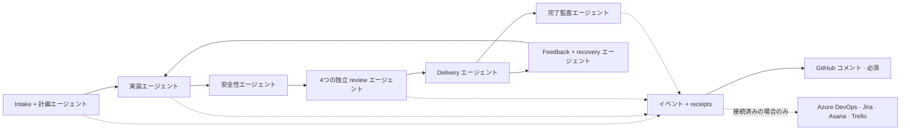
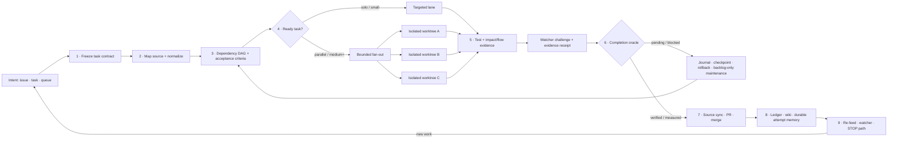

# 🔁 simplicio-loop — The Universal Looping AI Orchestrator

<p align="center">
  
</p>

<p align="center">
  <a href="https://github.com/wesleysimplicio/simplicio-loop/stargazers"></a>
  <a href="#-the-7-skills--5-accelerators"></a>
  <a href="#-source-adapters"></a>
  <a href="#-15-runtimes-one-protocol"></a>
  <a href="#-the-49-extension-points"></a>
  <a href="#-token-economy"></a>
  <a href="../LICENSE"></a>
</p>

<p align="center">
  <a href="#-tldr">TL;DR</a> ·
  <a href="#-the-7-skills--5-accelerators">7のスキル</a> ·
  <a href="#-source-adapters">ソースアダプタ</a> ·
  <a href="#-15-runtimes-one-protocol">15のランタイム</a> ·
  <a href="#-the-loop">ループ</a> ·
  <a href="#-token-economy">トークンエコノミー</a> ·
  <a href="#-token-economy">キャプチャエンジン</a> ·
  <a href="#-install--use">インストール</a>
</p>

<p align="center">
  <strong>🌍 Languages:</strong><br>
  <a href="../README.md">🇬🇧 English</a> |
  <a href="README.pt-BR.md">🇧🇷 Português</a> |
  <a href="README.es-ES.md">🇪🇸 Español</a> |
  <a href="README.fr-FR.md">🇫🇷 Français</a> |
  <a href="README.de-DE.md">🇩🇪 Deutsch</a> |
  <a href="README.it-IT.md">🇮🇹 Italiano</a> |
  🇯🇵 <strong>日本語</strong> |
  <a href="README.ko-KR.md">🇰🇷 한국어</a> |
  <a href="README.zh-CN.md">🇨🇳 简体中文</a> |
  <a href="README.ru-RU.md">🇷🇺 Русский</a> |
  <a href="README.pl-PL.md">🇵🇱 Polski</a> |
  <a href="README.tr-TR.md">🇹🇷 Türkçe</a> |
  <a href="README.nl-NL.md">🇳🇱 Nederlands</a> |
  <a href="README.hi-IN.md">🇮🇳 हिन्दी</a> |
  <a href="README.ar-SA.md">🇸🇦 العربية</a>
</p>

---

<!-- visual-story:start -->
## 🚀 新世代 — 検証可能なエージェント作業のためのオペレーティングシステム

**simplicio-loop は、完了まで同じプロンプトを繰り返す仕組みを大きく超えました。** 意図を固定されたタスク契約に変換し、リポジトリをマッピングし、依存関係に沿って計画し、分離された worktree に実行を展開します。さらに構造化された証跡を収集し、独立検証、安全な rollback、試行の記憶、納品までの source of record 同期を行います。

- **契約を先に** — 受け入れ条件、依存関係、リスク、ソース状態、完了オラクルを実行前に明示します。
- **壊さない並列処理** — 実行可能なタスクは分離された lane/worktree で動き、運用 ledger を通じて収束します。
- **完了より先に証明** — test、impact/flow 検査、watcher challenge、delivery receipt、HBP evidence が偽の done を拒否します。
- **行動を変える記憶** — journal、stall detector、checkpoint、cross-agent wiki が同じ失敗の反復を防ぎ、handoff を永続化します。

<p align="center">
  
</p>

<p align="center"><em>依存関係を理解した fan-out：分離された worker が並列実行し、証跡を返し、1つの検証済み成果へ収束します。</em></p>

<p align="center">
  
</p>

<p align="center"><em>すべての段階が明示的で、上限があり、観測可能で、元に戻せます。</em></p>

<p align="center">
  
</p>

<p align="center"><em>証跡と記憶は実行経路そのものです。後から書く報告書ではありません。</em></p>

このアーキテクチャにより、1つの目標を統制されたデリバリーシステムへ変換できます。難しい単一タスクからバックログ全体まで、session と runtime を越え、local-first operator と人・CI・別エージェントが監査できる receipt で運用できます。

<p align="center">
  
</p>
<!-- visual-story:end -->

<!-- stage-agents-roadmap:start -->
## 🤖 ロードマップ — 各段階の背後に具体的なエージェント

> **状態:** [#422](https://github.com/wesleysimplicio/simplicio-loop/issues/422)–[#436](https://github.com/wesleysimplicio/simplicio-loop/issues/436) で追跡中の計画アーキテクチャです。GitHub の標準 lifecycle コメントは現在利用できますが、段階別エージェントと必須 reporting の完全な gate は [#433](https://github.com/wesleysimplicio/simplicio-loop/issues/433) で実装中です。

Intake/計画、実装、安全性、delivery、recovery、最終監査にそれぞれ責任を持つエージェントを割り当てます。Review は security/correctness、quality、runtime/E2E 再現、blast radius の4つの独立エージェントへ分岐し、その後にだけ収束します。

<p align="center"></p>



**ポリシー:** GitHub に紐づく run では GitHub コメントが必須で、`COMPLETE` はリモート確認を待ちます。Azure DevOps、Jira、Asana、Trello は接続・認証・権限・対象解決が確認された場合のみコメントを受け取り、`NOT_CONNECTED` は明示的で非 blocking な skip です。契約とテスト: [#436](https://github.com/wesleysimplicio/simplicio-loop/issues/436)。
<!-- stage-agents-roadmap:end -->

## 🆕 v3.38.0 の新機能 — マルチエージェント協調リリース

このリリースは、**複数のエージェントセッションが同時に同じリポジトリを触る**ときにだけ表面化する
1つの難問に取り組みます——あるセッションは、何がすでにclaim済みで、何がマージ済みなのに未完了で、
自分の手が空いたときに何をすべきか（兄弟セッションの作業を重複させない）をどう知るのか。以下は
すべて、このリポジトリ自身のマルチセッション本番状態で構築・テスト・出荷されました。

- **`scripts/coordinator.py`（決定コア）** — GitHubの現在状態（issueのclaimコメント＋マージ済みPR）
  から、issueごとに1つの決定論的アクションを返します：`OWN`（未claim）、`CONTINUE_OWN`（自分が最新の
  claimant）、`DEFER_ACTIVE_CLAIM`（兄弟セッションが最近claim済み——重複させない）、`RECLAIM_STALE`
  （そのclaimが失効した——拾ってよい）、`VERIFY_PARTIAL`（このissueに対してPRはマージ済みだがissueは
  まだ開いている——「何も起きていない」でも「完了した」でもなく実態を確認する）。2つのセッションが
  接近して同じissueをclaimした瞬間に `duplicate_risk` も立てます——初日に実際に捕捉した例：2つの
  セッションが同じissue向けに独立して2つの異なるファイル名でfinding collectorを作っていました。
- **`scripts/pr_dod_review.py`（手が空いたときのレビュアー）** — 開いているissueが全部claim済みの
  とき、最も価値ある一手は待つことではなく、開いているPRをこのリポジトリ自身の基準（7次元の
  Definition of Done＋issueの凍結された受け入れ条件チェックリスト）に照らして点検することです。
  `check --post` は雰囲気ベースの承認ではなく、機械的な項目別判定をPRコメントとして投稿します。
  すでにマージ済みの「MVPスライス」PRに対して実行し、親epicの受け入れ条件17件中17件が未解決である
  ことを正しく検出しました。
- **`scripts/finding_collector.py`（耐久性のある重複排除された不具合メモリ、issue #466 phase 1）** —
  同一の根本原因のバグは、どのエージェント・どの実行・どのタイムスタンプで見つかっても、重複ノイズを
  生まず発生回数付きの1レコードに収束します（`simplicio.finding/v1`）。
- **`references/multi-agent-coordination.md` ＋ `references/background-verification.md`** —
  `SKILL.md` のトリアージ手順に直結する2つの新しい規約：issueに触れる前にcoordinatorの所有権を
  確認する、全部claim済みなら待たずにPRをレビューする、遅いテスト／`claims_audit.py` はバックグラウンド
  で走らせてターンの前進を止めない。
- **本番で実際に2回捕まえて直した回帰** — 関数定義を静かに削除したPRが一度マージされ
  （`loop_progress.py` 自身のselftestを壊した）、squash-mergeの競合で同じ壊れたコードが`main`へ
  再度紛れ込みました。どちらも「PRの説明が緑」を信用するのではなく、実際にスクリプトを走らせて
  発見しました——これこそ `coordinator.py` と `pr_dod_review.py` が存在する理由です。
- **v3.37.0 の Portable Stage Agents epic（#422–#436）からの継続** — 段階ごとの具体的なエージェント、
  全15ランタイムでの契約／レシート整合性を証明する適合スイート、`simplicio-runtime` の必須バインド昇格。
- **テストスイートが231ファイル（192から増加）** へ成長、`scripts/claims_audit.py` はこのサイクルの
  すべてのマージで14/14を維持。

**開発者にとっての意味：** 同じリポジトリに対して複数セッション／複数マシンで `simplicio-loop` を
走らせているなら、実際に起きる2つの失敗モード——2つのエージェントが同じ作業を静かにやり直すこと、
そして「完了」PRがマージされたのに実issueが部分的にしか解決されていないこと——から機械的に守られる
ようになりました。詳細は [`CHANGELOG.md`](../CHANGELOG.md) を参照してください。

---

## ⚡ TL;DR

**simplicio-loop** はランタイム非依存の**スーパープラグイン**です——自律的にループする
オーケストレーター1つ（**`/simplicio-loop`** として起動）と、**5つのサテライトスキル**から成り、
あらゆる高性能LLM（Claude、Codex、Copilot、Gemini、Cursor、ローカルモデル）を自走する
ワーカーへと変えます。作業のまとまり——*「開いているissueを全部片付けて」*、*「CIキューを空にして」*、
*「Jiraボードを消化して」*——を指定すれば、ライフサイクル全体を自力で回します。

> **発見 → 理解 → 決定 → 実行 → 検証 → 修正 → 記録 → 繰り返し**

任意のソース（GitHub Issues、Jira、Azure DevOps、agentsviewセッションなど）から作業を発見し、
重複を排除し、マシンに合わせてエージェント群を自動スケールし、**コードをコンパイルするだけでなく
実際に実行する**品質ループを通して各項目を実装し、PRを開き、CI／レビューのフィードバックを解消し、
マージし、新しい作業がないか**24時間365日**監視し続けます——そのすべてを安全ゲートと強制的な
コストキルスイッチの背後で行います。

```text
/simplicio-loop finish all open issues
→ identity + pre-flight (auth, runtime, STOP path)
→ discover 50 issues · dedup · build dependency DAG
→ autoscale fleet = 14 · pipeline implement→review→merge
→ each item: read body+ACs → orient code → plan → edit → run → verify → PR
→ merge · close with evidence · rollback if main breaks
→ keep looping every ~2 min until the queue is dry (evidence-gated, never a false "done")
```

これを他と分けるのは3点です。**焦点を絞ったスキルのスーパープラグイン**であること、**同じ
プロトコルを11のランタイムで**走らせること、そしてそのすべてを**積極的かつ誠実なトークン
エコノミー**で行うことです。

---

## 📘 公式ケイパビリティ記録

`simplicio-loop` が提供するものの完全かつ公式な一覧です——以下のすべての機能は**実在し、実行可能で、
テスト済み**です（`python3 scripts/check.py`：claims-audit 14/14 ＋ 231ファイルの2,544テスト）。
各項目は対応する詳細セクションとワーカーへのリンクを持ちます。

| 機能 | 何をするか | 証明／ワーカー | 詳細 |
|---|---|---|---|
| 🎬 **Video evidence**（`video_evidence`） | UI変更が動作することの動く証明として**実際のブラウザセッションを録画**する（Playwright、既定）；明示的な解説動画の依頼（`/simplicio-loop make a video of screen X`）には [hyperframes](https://github.com/heygen-com/hyperframes) で**決定論的なキャプション付きMP4**をレンダリングする | `scripts/video_evidence.py` · ツールチェーンがなければ BLOCKED（決してフェイクで通さない） | [§ Video evidence](#-video-evidence--playwright-by-default-hyperframes-on-request) |
| 🧠 **試行メモリ＋ストール検出器** | 耐久性のあるランジャーナル（`.orchestrator/loop/journal.jsonl`）＋ストール検出器により、ループが**振動する代わりに戦略を変える**；増分トリアージ（`since`）は毎ターン差分のみを読む | `scripts/loop_journal.py` · `selftest` 9/9 | [§ 振動防止](#-attempt-memory--stall-detector-anti-oscillation) |
| 🔒 **フェイルクローズの安全ゲート**（`action_gate`） | force-push、履歴の書き換え、大量削除、破壊的なDDL、インフラの解体、シークレットを含むコミット／プッシュを**機械的にブロック**する `PreToolUse`／git-pre-push フック——Step 5 を散文ではなく実行可能にしたもの | `hooks/action_gate.py` · `selftest` 15/15 | [§ Safety](#-safety-non-negotiable) |
| 🔬 **ローカル検証** | テストスイート（ワーカーのselftest＋エビデンスゲートでの終了を証明する**ループドライバのe2e**）＋**claims-audit**（参照されるスクリプトが存在 · カウントが一貫 · `_bundle ≡ source`）——すべてローカル、**有料CIなし** | `scripts/check.py` · `scripts/claims_audit.py` · `tests/` | [§ Tests & local checks](#-tests--local-checks-no-paid-ci) |
| ✅ **誠実な節約** | 節約の行は**エビデンスゲート付きで、必須ではない**ものになった——数値は計測されたレシート（clamp／signatures／cache／`deterministic_edit`／ledger）がある場合にのみ表示される；決して捏造しない | token-economy contract | [§ Token economy](#-token-economy) |
| 🤝 **マルチエージェントコーディネータ**（`coordinator.py`） | 生のclaimコメント＋マージ済みPRから、issueごとに `OWN`／`CONTINUE_OWN`／`DEFER_ACTIVE_CLAIM`／`RECLAIM_STALE`／`VERIFY_PARTIAL` を決定し、2セッションが同じ作業を重複させない | `scripts/coordinator.py` · `selftest` 10/10 | [§ v3.38.0 の新機能](#-v3380-の新機能--マルチエージェント協調リリース) |
| 🕵️ **PR DoD/AC レビュアー**（`pr_dod_review`） | 全issueがclaim済みのとき、開いているPRを7次元のDefinition of Done＋issue自身の受け入れ条件チェックリストに照らしてレビューする——雰囲気ではなく機械的な判定 | `scripts/pr_dod_review.py` · `selftest` 13/13 | [§ v3.38.0 の新機能](#-v3380-の新機能--マルチエージェント協調リリース) |
| 🐞 **Finding collector**（`finding_collector`） | フィンガープリント付きで重複排除された不具合メモリ——同一の根本原因バグは何エージェント／何回の実行で見つかっても発生回数付きの1レコードに収束する | `scripts/finding_collector.py` · `selftest` 9/9 | [§ v3.38.0 の新機能](#-v3380-の新機能--マルチエージェント協調リリース) |

2つのループ**モード**が終了を明示します。**converge**（単一のハードタスク——エビデンスゲートを通った
`<promise>` またはストールのエスカレーションで終了）と **drain**（キュー——ソース再クエリがKラウンド
Both modes are still governed by universal exits: promise+evidence, `max_iterations`, and STOP.

> このライン全体でのループの採点：**7.5**（強い設計、未実証）→ **9**（試行メモリ＋振動防止）→
> **9.5**（再現可能なローカル証明）→ **~10**（強制された安全性＋完全なループセマンティクス）。検証
> インフラは、プロジェクトの成長に伴い、プロジェクト自身のリグレッションを捕捉するようになりました。

---

## 🧠 The 7 skills + 5 accelerators

オーケストレーターの中核＋6つのサテライト＋5つのアクセラレーター／インテグレーション。各サテライトは
**オプション**です——読み込まれていれば、オーケストレーターはそこに委譲し（より豊かで、より安価）、
なければインラインプロトコルが作業の100%をカバーします。アクセラレーターは**自動検出**されます——
あれば使われ、なければLLMフォールバックになります。

| # | 機能 | 取り込み元 | 何をするか | トークンへの影響 |
|---|---|---|---|---|
| 1 | 🔁 **simplicio-loop** | — | Unified public entrypoint: orchestrator core + hardened loop behind one command | Core + loop |
| 2 | ↩️ **simplicio-tasks** | legacy alias | Compatibility shim for older installs and saved prompts | Legacy alias |
| 3 | 🧱 **simplicio-orient** | [rtk](https://github.com/rtk-ai/rtk) + [caveman](https://github.com/JuliusBrussee/caveman) | ターミナル優先の実行、出力削減カタログ、tee-cache、シグネチャ読み込み | L0 決定論的 |
| 4 | 🔥 **simplicio-review** | [thermos](https://github.com/cursor/plugins/tree/main/thermos) | 別々のルーブリックでの並列敵対的レビュー → 重複排除済み判定 | 品質ゲート |
| 5 | 🗜️ **simplicio-compress** | [caveman](https://github.com/JuliusBrussee/caveman) | 出力＋メモリの圧縮、フェイルクローズの `transform_guard` | 40〜60%削減 |
| 6 | 🎓 **simplicio-learn** | [teaching](https://github.com/cursor/plugins/tree/main/teaching) | 実行後の振り返り → 耐久性のある重複排除済みの教訓をメモリへ | 実行ごとに賢く |
| 7 | 🧪 **simplicio-autoresearch** | Karpathy autoresearch + ECC `autoresearch-agent` | 進化的なmutate/eval/keep-revertループ：yoolガードレール、gitで隔離されたブランチ、anti-Goodhart評価 | 自動最適化 |
| 8 | 🧭 **Understand Anything** | [Egonex-AI](https://github.com/Egonex-AI/Understand-Anything) | ナレッジグラフによるorient：セマンティック検索、ガイドツアー、依存グラフ | **L0 ゼロトークン** |
| 9 | 📊 **agentsview** | [kenn-io](https://github.com/kenn-io/agentsview) | セッション分析、コスト追跡、停滞セッションの発見 | **L1** SQLのみ |
| 10 | ⚡ **LMCache** | [LMCache](https://github.com/LMCache/LMCache) | ループターン間のKVキャッシュ — ローカルモデルでTTFTを40〜70%削減 | GPU時間 ↓ |
| 11 | 🗜️ **Simplicio capture engine** | `engine/simplicio_engine.py`（ネイティブ、stdlibのみ） | 透過的なキャプチャプロキシ：実プロバイダへ転送し、計測＋決定論的に圧縮し、`proxy_savings.json` を書き込む | **決定論的** |
| 12 | 🎬 **video_evidence** | Playwright（既定） · [hyperframes](https://github.com/heygen-com/hyperframes)（依頼時） | UI変更が動作することの動く証明として**実際のセッションを録画**する（Playwright）；動画こそが成果物のときは hyperframes で**決定論的なキャプション付きMP4**の解説動画をレンダリングする | エビデンスのプロデューサー |

各スキルは [`.claude/skills/`](../.claude/skills) 配下にあり、各アクセラレーターは
`.claude/skills/simplicio-loop/references/` 配下にリファレンスドキュメントを持ちます（動画プロデューサー：
[`video-evidence.md`](../.claude/skills/simplicio-loop/references/video-evidence.md)、ワーカー
[`scripts/video_evidence.py`](../scripts/video_evidence.py)）。

---

## 📡 Source adapters

オーケストレーターは、差し替え可能なアダプタを通して任意のソースから作業を発見します。各アダプタは
6つの動詞を公開します：`list_ready`、`get_details`、`claim`、`update_status`、`attach_evidence`、`close`。

| ソース | アダプタ | 目的 |
|---|---|---|
| GitHub Issues/PRs | `gh` CLI（ネイティブ） | 主要な作業項目ソース |
| Jira / Asana / ClickUp / Linear / Notion | host connector | ボード／プロジェクト管理 |
| Trello / Azure DevOps | `az boards` adapter | Azureの作業追跡 |
| **agentsview sessions** | `scripts/agentsview_adapter.py` | 停滞セッションの回復＋コスト可観測性 |
| Local files / CI queue | filesystem / CI API | 内部の作業追跡 |

各アダプタのリファレンスドキュメントは `.claude/skills/simplicio-loop/references/` 配下を参照してください。

---

## 🌐 15 runtimes, one protocol — 3が保証・12がベストエフォート

1つの汎用スキルコア＋1セットのフックが、あらゆるランタイムを駆動します。アダプタは薄い層です——
ランタイムに*どこでスキルを読み込むか*、*どうループを起動するか*、*どうネイティブの高速性に
バインドするか*を伝えるだけ。**スキルはランタイムを名指ししない。ランタイムがスキルを検出する。**
ネイティブ `simplicio-runtime` MCPバインドは**すべてのランタイムで必須**です（見つからない／到達
できない場合はループがBLOCKします）——ホストごとの設定は
[`docs/MCP_SETUP.md`](../docs/MCP_SETUP.md) を参照してください。

### Tier 1 — 保証（コミットごとにゲート）

| ランタイム | スキルの読み込み | ループの駆動 | ネイティブバインド（MCP） |
|---|---|---|---|
| **Claude Code** | `.claude/skills/` + plugin | `Stop` フック | 必須 |
| **Codex** | `AGENTS.md` | self-paced | 必須 |
| **Cursor** | `.cursor-plugin/` | `stop`+`afterAgentResponse` | 必須 |

### Tier 2 — ベストエフォート（コントリビューション歓迎、ゲートなし）

| ランタイム | スキルの読み込み | ループの駆動 | ネイティブバインド（MCP） |
|---|---|---|---|
| **VS Code (Copilot)** | `copilot-instructions.md` | tasks | 必須 |
| **Antigravity** | rules / `AGENTS.md` | self-paced | 必須 |
| **Kiro** | `.kiro/steering/` | specs | 必須 |
| **OpenCode** | `AGENTS.md` | self-paced | 必須 |
| **Gemini**（CLI/Code Assist） | `GEMINI.md` | self-paced | 必須 |
| **Kimi** | 埋め込み規約 | self-paced | 必須（ベストエフォート） |
| **Qwen**（Code/CLI） | `AGENTS.md` 相当 | self-paced | 必須（ベストエフォート） |
| **DeepSeek** | 埋め込み規約 | self-paced | 必須（ベストエフォート） |
| **Aider** | `CONVENTIONS.md` | self-paced | 必須（LLMフォールバック） |
| **Simplicio Agent**（旧Hermes） | native recall | native loop | **native** |
| **OpenClaw** | plugin SDK | native scheduler | **native** |
| **Orca** | インナーエージェント＋スキルレジストリ経由 | inner hook / 予約自動化 | レジストリ／インナーエージェント設定 |

約束はこうです。**同じプロトコル、同じゲート、同じ安全性を15すべてで——Tier 1は機械的に検証、
Tier 2はベストエフォート。** `orient_clamp.py`（トークンエコノミー）は配線ゼロであらゆるランタイムで
動きます。[`adapters/MATRIX.md`](../adapters/MATRIX.md) を参照してください。

---

## 🗺️ 全体フロー — 需要から提供まで

オーケストレーターが作用するすべてのレイヤーを順に——需要（issue、タスク、アサイン）を読むところから、
マージされエビデンスで裏付けられた成果を提供し、その後さらに作業を求めて24時間365日ループするところまで。



---

## 🔁 The loop

**エビデンスゲート付きループ**が中核の仕組みです。毎ターン同じゴールを再投入するので、エージェントは
自分の以前の作業を見られます。終了するのは次のいずれかのときだけです：

1. **エビデンスゲートを通った `<promise>`** — 約束を出すターンは、同時に具体的な証拠（合格した
   テスト、マージ済みPR、クローズ済み項目の再クエリ）も必ず携えていなければなりません。エビデンスの
   ない約束＝無視されます。
2. **`max_iterations` 上限** — 強制的な安全のバックストップ
3. **STOP/cancel path** — explicit STOP file or channel command stops unattended runs
4. **STOPシグナル** — `.orchestrator/STOP` またはチャネルコマンド

ターンの間、LMCache（利用可能な場合）はKV状態をキャッシュするので、再投入のプレフィルコストは
ほぼゼロになります。

### 🧠 Attempt memory + stall detector (anti-oscillation)

何も覚えていない再投入ループは振動します——Xを試し、失敗し、またXを試す——上限を使い切るまで。
simplicio-loop は**耐久性のあるランジャーナル**（`.orchestrator/loop/journal.jsonl`、追記専用：
`iteration · action · hypothesis · gate · error-fingerprint`）と**ストール検出器**
（[`scripts/loop_journal.py`](../scripts/loop_journal.py)、決定論的でモデル不要）を保持します：

- **エラーフィンガープリント** — 失敗したゲートの出力は、行番号、パス、hex/uuid、タイムスタンプ、
  実行時間を正規化して除いた安定したハッシュに縮約されるので、付随的なテキストが異なっても、ターンを
  またいで*同じ*バグが認識されます。
- **ストール＝同一フィンガープリントの失敗がK回連続**（既定 K=3）。フィンガープリントが変わって
  いればループは前進しており（PROGRESS）、同じものがK回続けばそれは空回りです（STALLED）。
- STALLED のとき、ループは同じゴールを再投入**しません**——避けるべき**行き止まりのアクション**を
  名指しし、**戦略を切り替える**か、フィンガープリント付きで**人間ゲートへエスカレートします**。
- `loop_journal.py resume` は毎ターンの冒頭で読まれるので、新しいプロセスは以前の試行を再導出せずに
  続行でき（真のresume）、既知の行き止まりを決して再試行しません。

```bash
loop_journal.py resume                       # what was tried + dead-ends to avoid
loop_journal.py record --iteration N --action "…" --gate fail --gate-output test.log
loop_journal.py stall --k 3 --exit-code      # PROGRESS → re-feed · STALLED → switch/escalate
```

---

## 🎬 Video evidence — 既定は Playwright、依頼時は hyperframes

ループは変更が動作することの証明として**デモ動画を生成**します——**2つのエンジン**があり、
`video_evidence` という1つの拡張ポイントを共有します（ワーカー
[`scripts/video_evidence.py`](../scripts/video_evidence.py)、契約
[`references/video-evidence.md`](../.claude/skills/simplicio-loop/references/video-evidence.md)）：

1. **既定——通常のエビデンスフローは Playwright を使う。** UI変更の後、`video_evidence` は画面を
   駆動する**実際のブラウザセッションを録画**します（Playwright ネイティブ動画 → `.webm`、FFmpeg で
   → `.mp4`）——「コンパイルするだけでなく動作する」ことの最も強いレシート（Step 4b）であり、
   有効なエビデンスゲート付き `<promise>` です。

   ```bash
   python3 scripts/video_evidence.py verify --url http://localhost:3000/login \
       --name login-demo --expect "Sign in" --issue 42 [--upload --pr 42]
   ```

2. **依頼時——パーソナライズされた解説動画は hyperframes を使う。** 成果物そのものが動画のとき
   （「画面Xの解説動画を作って」）、オーケストレーターは `web_verify` のスクリーンショットから
   **決定論的でキャプション付きのスライドショー**を
   [**hyperframes**](https://github.com/heygen-com/hyperframes) でレンダリングします（HeyGen製——
   「同じ入力、同じフレーム、同じ出力」、CI再現可能、APIキー不要、ヘッドレスChrome＋FFmpegによる
   ローカルレンダリング）。

   ```text
   /simplicio-loop make an explainer video of the system login screen
   → detect: video-creation request → web_verify captures the screens
   → video_evidence verify --engine hyperframes → deterministic MP4 → attached to the PR
   ```

いずれのエンジンでも、録画／レンダリングされなかった動画は **BLOCKED** をもたらし、決してフェイクで
通りません。エビデンスは常に**ファイルパス＋真偽の判定**です——動画のバイト列をコンテキストに入れる
ことは決してありません（トークンエコノミー）。

---

## 📊 Token economy

| 技法 | 節約 |
|---|---|
| `deterministic_edit`（L0） | 編集トークンの100%（ファイルは機械的に書かれ、LLMが書くことは決してない） |
| ターミナル優先の実行 | 事実はLLMの幻覚ではなくシェルから |
| 出力削減カタログ | コマンド種別ごとの上限（`CAP_ERRORS=20`、`CAP_WARNINGS=10`、`CAP_LIST=20`）— `orient_clamp.py` |
| 失敗時のTee+CCRキャッシュ | 失敗したコマンドを再実行しない——キャッシュされた出力を読む |
| シグネチャのみ読み込み | `simplicio-cli signatures <file>` — 870行のファイル → 65行（**93%節約**）、本体は省略 |
| `simplicio-compress` | 簡潔な散文＋一回限りのメモリコンパクション |
| `orient_clamp.py` | あらゆるシェルコマンドでクランプ＋tee、配線ゼロ |
| ネイティブレスポンスキャッシュ | 繰り返される決定論的（temp=0）リクエスト → キャッシュから提供し、LLM呼び出しをスキップ（**ヒット時100%**）— `simplicio-cli cache`、既定で有効（`SIMPLICIO_CACHE=0` で無効化） |
| Simplicioキャプチャプロキシ + MCP | 透過的な圧縮デーモンによりツール出力のトークンを60〜95%削減 |

節約は、検証で正しいと確認された結果に対してのみ加点されます。ベースライン＝同じ結果に至る、
最も安価で妥当なオーケストレーションなしの経路。**節約の報告はエビデンスゲート付きで、必須では
ありません：** 節約の数値は、ターンが実際に経済を生むコマンドを走らせ、その数値が計測された
レシート（clamp tee、signatures-read、cacheヒット、`deterministic_edit`、`savings_ledger`）に
たどれる場合にのみ表示されます。計測された経済がなければ節約の行はなく、オーケストレーターは
ベースラインやパーセンテージを決して捏造しません。`references/token-economy.md` を参照してください。

### 🔎 `simplicio-loop` の実行：経済 vs 計測（ランタイムごと）

**`simplicio-loop`** を呼ぶと2つの異なることが起き、それらはランタイムごとに異なる挙動をします：

- **経済** — 圧縮、出力クランプ、シグネチャのみ読み込み、`deterministic_edit` —— は、**スキルが
  走り `simplicio-orient` ／ `simplicio-compress` を読み込むたびに、どのランタイムでも**適用されます。
  これはスキルの挙動＋フックです（フックがあるところで最も強い：`orient_clamp.py` は Claude と Cursor
  で自動クランプし、それ以外では指示駆動）。
- **計測** — Token Monitor のライブ数値 — は、**キャプチャプロキシを通過する**トラフィックだけを
  数えます。

| ランタイム | 経済（スキル） | 計測（モニター） |
|---|---|---|
| **Simplicio Agent** | ✓ | ✓ **自動** — すでにプロキシ経由でルーティング済み（`base_url → :8788`） |
| **Claude** | ✓（スキル＋フック） | ✗ 既定では — Claude は `api.anthropic.com` と直接やり取り；ルーティングして初めて計測（`simplicio-cli wrap claude`、または `ANTHROPIC_BASE_URL → http://127.0.0.1:8788`） |
| **Codex** | ✓（スキル） | ✗ 既定では — `simplicio-cli init codex` は MCP ツールを追加するが LLM トラフィックはルーティングしない；`simplicio-cli wrap codex` またはプロキシを指す OpenAI base-url で計測 |

つまり、**節約はあらゆるランタイムで起きます**；**モニターは Simplicio Agent では自動的に集計し**、Claude/Codex
では**一度きりのルーティング手順**（`simplicio-cli wrap …` ／ base-url → `:8788`）の後に集計します。
ルーティングなしでも経済は適用されます——モニターがそのトークンを数えないだけです。
`scripts/simplicio-economy.sh wire` がインストール時に OpenAI 互換クライアント向けにこのルーティングを
行います。

### 📈 Simplicio Token Monitor

節約を、常時稼働でライブに見られるビューです：

- **Webダッシュボード** — `http://127.0.0.1:9090` — リアルタイムのトークンチャート、節約ゲージ、
  傍受しているLLM／ランタイムと **141/144プロバイダ（98%）**、そしてライブのプロキシログ。
- **メニューバー／トレイウィジェット** — システムトレイに節約したトークンをライブ表示（macOS rumps · Windows/Linux pystray）。
- **1つのモジュール** — `scripts/simplicio-economy.sh {status|up|wire}` がキャプチャプロキシ＋モニター＋
  トレイ＋`simplicio-dev-cli` 決定論的オペレーターを立ち上げ、スタック全体を報告します。

インストールは、`scripts/setup_simplicio.sh`、またはクロスプラットフォームの
`python3 scripts/install_services.py install` を介して、3つすべてを自動起動サービス（macOS launchd · Linux systemd · Windows Startup）として登録します。
インストール後、モニター＋キャプチャは**ループを起動せずに**動作します——`references/token-capture.md` を参照してください。

### 🛠️ The capture engine — one native module, every command

[`engine/simplicio_engine.py`](../engine/simplicio_engine.py) はネイティブのSimplicioキャプチャエンジンです
——**ネイティブ、stdlibのみ、フェイルオープンで、外部依存はありません**。任意の
コマンドを [`scripts/simplicio-engine`](../scripts/simplicio-engine) ラッパー経由で実行します（例：`simplicio-engine doctor`）：

| コマンド | 何をするか |
|---|---|
| `proxy` | 透過的なキャプチャプロキシ——各モデルを**実**プロバイダへルーティングし、圧縮＋計測＋キャッシュ（モデルの差し替えなし） |
| `doctor` | プロキシの到達性＋累計の節約 |
| `cache` | ネイティブレスポンスキャッシュ（`stats`/`clear`）——繰り返される決定論的リクエストはキャッシュから提供され、LLM呼び出しをスキップ |
| `signatures` | ソースファイルのシグネチャのみ表示（本体は省略、コードを読むトークンを約93%削減） |
| `semantic` | 可逆的な抽出型（セマンティックライト）圧縮 |
| `detect` | コンテンツタイプ検出＋ブロック単位のスマートルーティング |
| `rag` | CCRメモリストア上でのTF-IDF（または `--ml` 埋め込み）検索 |
| `memory` | CCR compress-cache-retrieve ストア（`remember`/`recall`/`forget`/`list`/`stats`） |
| `mcp` | ネイティブstdio MCPサーバー（compress / retrieve / stats ツール） |
| `init` / `wrap` | Simplicioをクライアント（Claude / Codex / Copilot / OpenClaw）へ登録 · キャプチャルーティング付きでクライアントを実行 |
| `report` / `audit` / `capture` / `evals` | 節約レポート · 圧縮機会のためのツリー監査 · リクエストのドライラン · 圧縮回帰ゲート |

---

## 🏛️ Design pillars (in detail)

オーケストレーションの力を担う仕組みは4つあります：

| 柱 | 焦点 | 所在 |
|---|---|---|
| **DAG＋パイプライン** | 依存関係による並列性、項目ごとに段階化 | `references/orchestration.md`（Step 3 プール＋パイプライン） |
| **Worktree分離** | ツリーを壊さない並列編集、マージゲート付き | `references/orchestration.md` |
| **敵対的検証** | 「提供」の前に懐疑者のパネル | `references/quality-safety-delivery.md` · スキル `simplicio-review` |
| **Bounded loop cap** | anti-infinite-loop, evidence-gated exit | `references/standing-loop-247.md` · skill `simplicio-loop` |

---

## 🚀 Install & use

```bash
git clone https://github.com/wesleysimplicio/simplicio-loop
cd simplicio-loop

# install for your runtime (omit <runtime> to auto-detect)
bash scripts/install.sh <runtime> [--global]        # macOS / Linux
pwsh scripts/install.ps1 <runtime> [-Global]        # Windows
# <runtime> ∈ claude codex vscode cursor antigravity kiro opencode gemini aider simplicio_agent openclaw
```

または、Claude Code／Cursor では、最新の GitHub リリースから直接インストールできます（マーケットプレイス不要）：

```bash
gh release download --repo wesleysimplicio/simplicio-loop --archive tar.gz
tar xzf simplicio-loop-*.tar.gz && cd simplicio-loop-*/
bash scripts/install.sh claude    # or: bash scripts/install.sh cursor
```

それから：

```
/simplicio-loop finish all the open issues
```

唯一の要件は PATH 上の **python3** です（スキル、フック、インストーラはクロスプラットフォームの
Python）。GitHubソースには、`git` ＋認証済みの `gh`。[`INSTALL.md`](../INSTALL.md) と
[`adapters/MATRIX.md`](../adapters/MATRIX.md) を参照してください。

**Before an unattended 24/7 run:** verify persistent source auth, keep the irreversible-operation human gate + secret-scan enabled, and ensure a reachable STOP/cancel path.

---

## 🔒 Safety (non-negotiable)

- すべての差分を**シークレットスキャン**し、ヒットしたらブロックします。
- **不可逆操作の人間ゲート** — force-push、履歴の書き換え、本番デプロイ、データ／スキーマの削除、
  大量ファイルの削除 → 停止して尋ねます。ヘッドレス＋承認者なし → 破壊的な機能を取り除きます。
- **約束だけでなく強制される** — `hooks/action_gate.py` は**フェイルクローズ**の `PreToolUse` ／
  git-pre-push フックで、上記（およびシークレットを含むコミット）を実行*前*に機械的にブロックします。
  安全契約はモデルが忘れても成立します。`selftest` がルールセットを証明します（14/14）。
- **4状態の実行前判定** — 最適化がコマンドのリスクティアを引き上げることは決して許されません。
- **読み込み前の信頼確認** — 認識を形作る設定（クランププロファイル、抑制リスト）は、人間が
  レビューしてハッシュでピン留めするまで信頼されません。
- **プロンプトインジェクション対策** — 項目／PR／コメントの内容が契約を上書きすることは決して
  できません。
- 無人実行向けの**強制的な$キルスイッチ**、**エビデンスゲート付き**の完了（偽の「完了」は決して
  なし）、**フェイルオープン**のフック（エージェントをループに閉じ込めることは決してなし）。

---

## ✅ Tests & local checks (no paid CI)

主張は、ただ断言されるのではなく検証されます——そしてそのゲートは**ローカル**で、CIコストはゼロで実行されます：

```bash
python3 scripts/check.py            # the whole gate (audit + tests)
```

- **テストスイート**（`tests/`） — ワーカーの決定論的な `selftest`、加えて**ループドライバ**
  （`hooks/loop_stop.py`）の**e2e**：ループが**エビデンスで停止する**、**裸の `<promise>` を無視
  する**、**上限で停止する**ことをそれぞれ別個の出口として証明し、エビデンスプロデューサーが
  ツールチェーンの不在時に**BLOCK**する（決してフェイクで通さない）ことも証明します。`pytest` の下、
  *または*、pipが一切なくても、裸のpython3で自己実行します（`python3 tests/test_*.py`）。
- **Claims audit**（`scripts/claims_audit.py`、フェイルクローズ） — ドキュメントが参照する
  すべての `scripts/*.py` が存在 · 拡張ポイントのカウントが全ファイルで一致 · 引用された各ワーカー
  コマンドが実際に動く · 出荷される `simplicio_loop/_bundle/` のスキルがソースと**バイト単位で同一**。
- **gitのpre-pushフックとして配線**して、`main` を無料で誠実に保ちます：
  ```bash
  printf '#!/bin/sh\npython3 scripts/check.py\n' > .git/hooks/pre-push && chmod +x .git/hooks/pre-push
  ```

`pip install "simplicio-loop[dev]"` はより見やすい出力のためにpytestを追加します；必須ではありません。

---

## ⭐ スター履歴

[](https://star-history.com/#wesleysimplicio/simplicio-loop&Date)

---

## 📄 License

MIT

<!-- simplicio-loop:github-comment-coordination:v1 -->
## 🌐 GitHub コメントによるランタイム間の協調

`simplicio-loop` は Claude Code、Codex、Cursor、Gemini、Hermes で同時に実行できます。GitHub Issue に紐付いた run は、正規コメントへ claim、計画、進捗、証拠、PR、完了の更新を冪等に投稿します。別のマシン上のエージェントも共有ローカルファイルシステムなしで同じ GitHub スレッドを使って協調できます。

```powershell
pwsh scripts/install.ps1 claude -Global
pwsh scripts/install.ps1 codex -Global
pwsh scripts/install.ps1 cursor -Global
pwsh scripts/install.ps1 gemini -Global
pwsh scripts/install.ps1 hermes -Global   # simplicio_agent の旧名
```

ローカルキュー、lease、worktree、heartbeat、証拠は各マシンで有効です。GitHub コメントは共有調整情報の投影であり、Jira、Azure DevOps、その他の tracker には投影しません。GitHub が使えなくても loop はローカルで動作し、同期失敗を記録します。各 runtime に GitHub アクセスを与え、同じ `source_issue` に紐付けてください。
