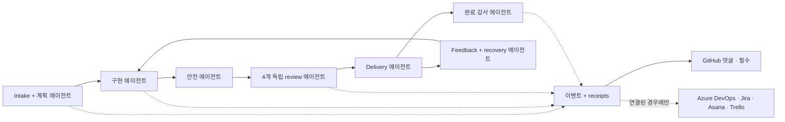
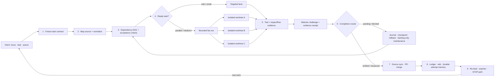

# 🔁 simplicio-loop — The Universal Looping AI Orchestrator

<p align="center">
  
</p>

<p align="center">
  <a href="https://github.com/wesleysimplicio/simplicio-loop/stargazers"></a>
  <a href="#-7개의-스킬--5개의-가속기"></a>
  <a href="#-소스-어댑터"></a>
  <a href="#-15개의-런타임-하나의-프로토콜"></a>
  <a href="#-전체-흐름--수요에서-제공까지"></a>
  <a href="#-토큰-경제"></a>
  <a href="../LICENSE"></a>
</p>

<p align="center">
  <a href="#-요약">요약</a> ·
  <a href="#-7개의-스킬--5개의-가속기">7개의 스킬</a> ·
  <a href="#-소스-어댑터">소스 어댑터</a> ·
  <a href="#-15개의-런타임-하나의-프로토콜">15개의 런타임</a> ·
  <a href="#-루프">루프</a> ·
  <a href="#-토큰-경제">토큰 경제</a> ·
  <a href="#-토큰-경제">캡처 엔진</a> ·
  <a href="#-설치--사용">설치</a>
</p>

<p align="center">
  <strong>🌍 Languages:</strong><br>
  <a href="../README.md">🇬🇧 English</a> |
  <a href="README.pt-BR.md">🇧🇷 Português</a> |
  <a href="README.es-ES.md">🇪🇸 Español</a> |
  <a href="README.fr-FR.md">🇫🇷 Français</a> |
  <a href="README.de-DE.md">🇩🇪 Deutsch</a> |
  <a href="README.it-IT.md">🇮🇹 Italiano</a> |
  <a href="README.ja-JP.md">🇯🇵 日本語</a> |
  <strong>🇰🇷 한국어</strong> |
  <a href="README.zh-CN.md">🇨🇳 简体中文</a> |
  <a href="README.ru-RU.md">🇷🇺 Русский</a> |
  <a href="README.pl-PL.md">🇵🇱 Polski</a> |
  <a href="README.tr-TR.md">🇹🇷 Türkçe</a> |
  <a href="README.nl-NL.md">🇳🇱 Nederlands</a> |
  <a href="README.hi-IN.md">🇮🇳 हिन्दी</a> |
  <a href="README.ar-SA.md">🇸🇦 العربية</a>
</p>

---

<!-- visual-story:start -->
## 🚀 새로운 세대 — 검증 가능한 에이전트 작업을 위한 운영체제

**simplicio-loop는 완료될 때까지 프롬프트를 반복하는 도구를 훨씬 넘어섰습니다.** 의도를 고정된 작업 계약으로 변환하고, 저장소를 매핑하며, 의존성에 따라 계획하고, 격리된 worktree로 실행을 분산합니다. 구조화된 증거를 수집하고 독립 검증, 안전한 rollback, 모든 시도의 기억, 전달까지 source of record 동기화도 수행합니다.

- **계약 우선** — 승인 기준, 의존성, 위험, 소스 상태, 완료 오라클을 실행 전에 명시합니다.
- **손상 없는 병렬 실행** — 준비된 작업은 격리된 lane/worktree에서 실행되고 운영 ledger를 통해 수렴합니다.
- **완료보다 증명이 먼저** — test, impact/flow 검사, watcher challenge, delivery receipt, HBP evidence가 거짓 done 상태를 거부합니다.
- **행동을 바꾸는 기억** — journal, stall detector, checkpoint, cross-agent wiki가 반복 실패를 막고 handoff를 지속시킵니다.

<p align="center">
  
</p>

<p align="center"><em>의존성을 인식한 fan-out: 격리된 worker가 병렬로 실행되고 증거를 반환해 하나의 검증된 전달물로 수렴합니다.</em></p>

<p align="center">
  
</p>

<p align="center"><em>모든 단계는 명시적이고, 제한되며, 관찰 가능하고, 되돌릴 수 있습니다.</em></p>

<p align="center">
  
</p>

<p align="center"><em>증거와 기억은 실행 경로의 일부이며, 나중에 작성하는 보고서가 아닙니다.</em></p>

이 아키텍처는 하나의 목표를 통제된 전달 시스템으로 바꿉니다. 어려운 단일 작업부터 전체 backlog까지 session과 runtime을 넘어 실행하며, local-first operator와 사람·CI·다른 에이전트가 감사할 수 있는 receipt를 남깁니다.

<p align="center">
  
</p>
<!-- visual-story:end -->

<!-- stage-agents-roadmap:start -->
## 🤖 로드맵 — 모든 단계 뒤에 구체적인 에이전트

> **상태:** [#422](https://github.com/wesleysimplicio/simplicio-loop/issues/422)–[#436](https://github.com/wesleysimplicio/simplicio-loop/issues/436)에서 추적하는 계획 아키텍처입니다. 표준 GitHub lifecycle 댓글은 현재 존재하지만, 단계별 에이전트와 필수 reporting의 전체 gate는 [#433](https://github.com/wesleysimplicio/simplicio-loop/issues/433)에서 구현 중입니다.

Intake/계획, 구현, 안전, delivery, recovery, 최종 감사마다 책임 에이전트 한 명을 둡니다. Review는 security/correctness, quality, runtime/E2E 재현, blast radius의 네 독립 에이전트로 분기한 뒤에만 다시 합쳐집니다.

<p align="center"></p>



**정책:** GitHub에 연결된 run에서는 GitHub 댓글이 필수이며 `COMPLETE`는 원격 확인을 기다립니다. Azure DevOps, Jira, Asana, Trello는 연결·인증·권한·대상 확인이 증명된 경우에만 댓글을 받으며, `NOT_CONNECTED`는 명시적이고 비차단적인 skip입니다. 계약 및 테스트: [#436](https://github.com/wesleysimplicio/simplicio-loop/issues/436).
<!-- stage-agents-roadmap:end -->

## 🆕 v3.38.0의 새로운 기능 — 멀티 에이전트 조정 릴리스

이번 릴리스는 **여러 에이전트 세션이 동시에 같은 저장소에서 작업할 때만** 드러나는 문제 하나에
집중합니다: 세션이 이미 무엇이 claim되었는지, 무엇이 merge는 됐지만 아직 미완성인지, 그리고
자신의 유휴 시간에 형제 세션의 작업을 중복하지 않고 무엇을 해야 하는지 어떻게 아는가입니다.
아래 항목은 전부 이 저장소 자체의 **실제 멀티 세션 상태**를 대상으로 만들고 테스트하고
배포했습니다 — 가상 시나리오가 아닙니다.

- **`scripts/coordinator.py` — 결정 코어.** 오늘의 GitHub 상태(열린 이슈의 claim 댓글 + merge된
  PR)를 보고 이슈마다 결정론적 행동 하나를 반환합니다: `OWN`(아직 아무도 claim 안 함),
  `CONTINUE_OWN`(내가 이미 최신 claimant), `DEFER_ACTIVE_CLAIM`(형제 세션이 최근에 claim함 —
  중복하지 말 것), `RECLAIM_STALE`(그 claim이 식어서 다시 가져가도 안전), `VERIFY_PARTIAL`(이
  이슈용 PR이 이미 merge됐지만 이슈는 여전히 열려 있음 — "아무 일도 없었다"거나 "끝났다"고
  단정하기 전에 실제로 뭐가 됐는지 확인). 두 세션이 짧은 간격으로 같은 이슈를 claim하면
  `duplicate_risk` 플래그도 즉시 세웁니다. 출시 첫날 실제로 잡아낸 사례: 두 세션이 같은 이슈용
  finding collector를 서로 다른 파일명으로 각자 독립적으로 만들고 있었습니다.
- **`scripts/pr_dod_review.py` — 유휴 시간을 위한 리뷰어.** 열린 이슈가 모두 claim됐을 때 세션의
  가장 레버리지 있는 행동은 기다리는 게 아니라 열린 PR을 이 저장소 자체 기준으로 점검하는
  것입니다: 7차원 Definition of Done(구현, 단위/통합/시스템/회귀 테스트, 성능 벤치마크, 커버리지
  85% 이상)과 해당 이슈의 고정된 acceptance-criteria 체크리스트. `check --post`는 감으로 하는
  승인 대신 기계적이고 항목별인 판정을 PR 댓글로 남깁니다. 이미 merge된 실제 "MVP 슬라이스" PR에
  대해 검증한 결과, 상위 epic의 acceptance criteria **17개 중 17개**가 여전히 미해결임을 정확히
  짚어냈습니다.
- **`scripts/finding_collector.py` — 내구성 있는 중복 제거 결함 메모리(이슈 #466, 1단계).**
  구별되는 결함마다 `simplicio.finding/v1` 레코드 하나를 만들고 지문을 남겨서, 어떤 에이전트가
  언제 발견하든 *같은* 근본 버그는 중복 노이즈를 만드는 대신 발생 횟수가 붙은 레코드 하나로
  합쳐집니다. 아직 GitHub 호출은 없습니다 — 그건 다음 단계입니다.
- **`references/multi-agent-coordination.md` + `references/background-verification.md`** — `SKILL.md`의
  분류(triage) 단계에 바로 연결된 두 가지 새 관례: 이슈를 건드리기 전에 coordinator의 소유권을
  확인하고, 모든 게 claim된 상태면 유휴 대신 PR을 리뷰하며, 느린 검증 명령(테스트,
  `claims_audit.py`)은 백그라운드로 실행해 진행 막대를 지켜보지 않고 한 턴이 계속 진전하게
  합니다.
- **merge 후 자동 정리(`scripts/worktree_cleanup.py`, #484)** — merge된 브랜치의 로컬 worktree와
  브랜치 참조가 세션마다 쌓이지 않고 자동으로 제거됩니다.
- **CLI 계약 추가(WI-471)** — 외부 감독자가 run을 무장하기 전에 준비 상태를 기계적으로 확인할 수
  있도록 `preflight` 서브커맨드와 `status`의 `--json` 플래그가 추가됐습니다.
- **v3.37.0의 Portable Stage Agents epic(#422–#436)에서 이어짐** — 모든 단계 뒤에 독립적으로
  검증 가능한 구체적 에이전트(intake/planner, 구현, 4방향 review 패널, safety gate, delivery,
  feedback/recovery, 완료 감사관), 15개 런타임 전체에서 계약/receipt 동등성을 증명하는 정합성
  스위트, `simplicio-runtime`이 `simplicio-mapper`/`simplicio-dev-cli`와 동일하게 필수 바인딩
  오퍼레이터로 승격.
- **테스트 스위트가 231개 파일로 증가**(192개에서), `scripts/claims_audit.py`는 이번 사이클 내내
  14/14를 유지했습니다.

**당신에게 실질적으로 의미하는 것:** 같은 저장소를 대상으로 `simplicio-loop`를 두 개 이상의
세션·머신에서 동시에 돌린다면, 실제로 벌어지는 두 가지 실패 모드 — 두 에이전트가 조용히 같은
작업을 반복하는 것, 그리고 merge는 됐지만 실제 이슈는 절반만 해결된 "완료" PR — 로부터 이제
능동적으로 보호받습니다. 예전에는 둘 다 보이지 않았지만, 이제는 매 triage마다 기계적으로
드러납니다.

전체 목록은 [`CHANGELOG.md`](../CHANGELOG.md)를, 서명된 산출물(wheel, sdist, SBOM, provenance)은
[v3.38.0 릴리스](https://github.com/wesleysimplicio/simplicio-loop/releases/tag/v3.38.0)를
참고하세요.

## ⚡ 요약

**simplicio-loop**는 런타임에 종속되지 않는 **슈퍼 플러그인**입니다 — 자율 반복 루프
오케스트레이터 하나(**`/simplicio-loop`**로 호출)에 **다섯 개의 위성 스킬**이 더해져, 강력한
LLM(Claude, Codex, Copilot, Gemini, Cursor, 로컬 모델)을 스스로 굴러가는 워커로 바꿔 줍니다.
처리할 작업 더미 — *"열린 이슈를 전부 끝내라"*, *"CI 큐를 비워라"*, *"Jira 보드를 비워라"* — 를
가리키기만 하면, 전체 생애주기를 스스로 실행합니다.

> **발견 → 이해 → 결정 → 실행 → 검증 → 수정 → 기록 → 반복**

어떤 소스(GitHub Issues, Jira, Azure DevOps, agentsview 세션 등)에서든 작업을 발견하고, 중복을
제거하며, 머신에 맞춰 에이전트 함대를 자동으로 확장하고, **코드를 단지 컴파일하는 게 아니라 실제로
실행하는** 품질 루프를 통해 각 항목을 구현하며, PR을 열고, CI/리뷰 피드백을 해결하고, 병합한 뒤,
새 작업을 찾아 **24시간 연중무휴**로 계속 감시합니다 — 이 모든 것이 안전 게이트와 강력한 비용 킬
스위치의 통제 아래에서 이뤄집니다.

```text
/simplicio-loop finish all open issues
→ identity + pre-flight (auth, runtime, STOP path)
→ discover 50 issues · dedup · build dependency DAG
→ autoscale fleet = 14 · pipeline implement→review→merge
→ each item: read body+ACs → orient code → plan → edit → run → verify → PR
→ merge · close with evidence · rollback if main breaks
→ keep looping every ~2 min until the queue is dry (evidence-gated, never a false "done")
```

이것을 남다르게 만드는 것은 세 가지입니다. **초점이 분명한 스킬들의 슈퍼 플러그인**이라는 점,
**같은 프로토콜을 15개의 런타임에서** 돌린다는 점, 그리고 이 모든 것을 **공격적이면서도 정직한
토큰 경제**로 해낸다는 점입니다.

이 스킬은 **단독으로도** 설치됩니다 — `simplicio-loop`를 쓰기 위해 `simplicio-runtime`이나 다른
필수 네이티브 컴포넌트가 필요하지 않습니다. 네이티브 바인딩, 오퍼레이터, 캡처 서비스, 그리고
더 넓은 Simplicio 런타임 스택은 코어 스킬 번들 위에 얹는 선택적 가속기입니다.

---

## 📘 공식 역량 기록

`simplicio-loop`가 제공하는 것의 완전한 공식 명단입니다 — 아래의 모든 역량은 **실재하고,
실행 가능하며, 테스트되었습니다**(`python3 scripts/check.py`: claims-audit 14/14 + 231개 파일에
걸쳐 2,544개 테스트 수집). 각 항목은 해당 심층 섹션과 워커로 링크됩니다.

| 역량 | 하는 일 | 증명 / 워커 | 상세 |
|---|---|---|---|
| 🎬 **비디오 증거** (`video_evidence`) | UI 변경이 동작한다는 움직이는 증거로 **실제 브라우저 세션을 녹화**합니다(기본값 Playwright, `.webm` → FFmpeg로 `.mp4`); 명시적인 설명용 비디오 요청(`/simplicio-loop make a video of screen X`) 시에는 [hyperframes](https://github.com/heygen-com/hyperframes)로 **캡션이 달린 결정론적 MP4**를 렌더링 | `scripts/video_evidence.py` · 툴체인 없으면 BLOCKED(절대 가짜 통과 없음) | [§ 비디오 증거](#-비디오-증거--playwright-by-default-hyperframes-on-request) |
| 🧠 **시도 메모리 + 정체 감지기** | 내구성 있는 실행 저널(`.orchestrator/loop/journal.jsonl`) + 정체 감지기로 루프가 **진동하는 대신 전략을 바꾸게** 함; 증분 분류(`since`)로 매 턴 델타만 읽음 | `scripts/loop_journal.py` · `selftest` 13/13 | [§ 진동 방지](#-시도-메모리--정체-감지기진동-방지) |
| 🔒 **페일 클로즈 안전 게이트** (`action_gate`) | force-push, 히스토리 재작성, 대량 삭제, 파괴적 DDL, 인프라 철거, 시크릿이 든 커밋/푸시를 **기계적으로 차단**하는 `PreToolUse`/git-pre-push 훅 — 산문이 아니라 실행 가능한 5단계 | `hooks/action_gate.py` · `selftest` 15/15 | [§ 안전성](#-안전성타협-불가) |
| 🔬 **로컬 검증** | 테스트 스위트(워커 selftest + 증거 게이트 종료를 증명하는 **루프 드라이버 e2e**) + **claims-audit**(참조된 스크립트 존재 · 카운트 일관성 · `_bundle ≡ source`) — 모두 로컬, **유료 CI 없음** | `scripts/check.py` · `scripts/claims_audit.py` · `tests/` | [§ 테스트 & 로컬 점검](#-테스트--로컬-점검유료-ci-없음) |
| ✅ **정직한 절감** | 절감 표시는 이제 **증거 게이트 방식이며 필수가 아님** — 측정된 영수증(clamp/signatures/cache/`deterministic_edit`/ledger)이 있을 때만 수치를 보여 줌; 절대 날조하지 않음 | 토큰 경제 계약 | [§ 토큰 경제](#-토큰-경제) |
| 🤝 **멀티 에이전트 coordinator** (`coordinator.py`) | 살아있는 claim 댓글 + merge된 PR을 보고 이슈마다 `OWN` / `CONTINUE_OWN` / `DEFER_ACTIVE_CLAIM` / `RECLAIM_STALE` / `VERIFY_PARTIAL`을 결정해, 두 세션이 같은 작업을 중복하지 않게 함 | `scripts/coordinator.py` · `selftest` 10/10 | [§ 전체 흐름](#-전체-흐름--수요에서-제공까지) |
| 🕵️ **PR DoD/AC 리뷰어** (`pr_dod_review`) | 모든 이슈가 claim된 상태일 때 열린 PR을 7차원 Definition of Done + 이슈 자체의 acceptance-criteria 체크리스트로 리뷰함 — 감으로 하는 승인이 아니라 기계적 판정 | `scripts/pr_dod_review.py` · `selftest` 13/13 | [§ 전체 흐름](#-전체-흐름--수요에서-제공까지) |
| 🐞 **Finding collector** (`finding_collector`) | 지문이 남은 중복 제거 결함 메모리 — 몇 개의 에이전트/실행이 관찰하든 같은 근본 버그는 발생 횟수가 붙은 레코드 하나로 합쳐짐 | `scripts/finding_collector.py` · `selftest` 9/9 | [§ 공식 역량 기록](#-공식-역량-기록) |

두 가지 루프 **모드**가 종료를 명시적으로 만듭니다. **converge**(단일 강한 태스크 — 증거 게이트를
통과한 `<promise>` 또는 정체 에스컬레이션으로 종료) 대 **drain**(큐 — 소스 재조회가 K 라운드 동안
Both modes are still governed by universal exits: promise+evidence, `max_iterations`, and STOP.
따릅니다.

> 이 일련의 작업에 대한 루프 점수: **7.5**(강한 설계, 미증명) → **9**(시도 메모리 +
> 진동 방지) → **9.5**(재현 가능한 로컬 증명) → **~10**(강제된 안전 + 완전한 루프
> 의미론). 검증 인프라는 이제 프로젝트가 성장하면서 자기 자신의 회귀를 잡아냅니다.

---

## 🧠 7개의 스킬 & 5개의 가속기

오케스트레이터 코어 + 여섯 개의 위성 + 다섯 개의 가속기/통합. 각 위성은 **선택 사항**입니다 —
로드되면 오케스트레이터가 거기에 위임하고(더 풍부하고 더 저렴), 없으면 인라인 프로토콜이 100%를
커버합니다. 가속기는 **자동 감지**됩니다 — 있으면 사용하고, 없으면 LLM 폴백.

| # | 기능 | 흡수한 것 | 하는 일 | 토큰 영향 |
|---|---|---|---|---|
| 1 | 🔁 **simplicio-loop** | — | 통합 공개 진입점: 오케스트레이터 코어 + 강화된 루프를 명령 하나 뒤로 | Core + loop |
| 2 | ↩️ **simplicio-tasks** | legacy alias | 예전 설치본과 저장된 프롬프트를 위한 호환성 shim | Legacy alias |
| 3 | 🧱 **simplicio-orient** | [rtk](https://github.com/rtk-ai/rtk) + [caveman](https://github.com/JuliusBrussee/caveman) | 터미널 우선 실행, 출력 축소 카탈로그, tee-cache, 시그니처 읽기 | L0 결정론적 |
| 4 | 🔥 **simplicio-review** | [thermos](https://github.com/cursor/plugins/tree/main/thermos) | 서로 다른 평가 기준의 병렬 적대적 리뷰 → 중복 제거된 판정 | 품질 게이트 |
| 5 | 🗜️ **simplicio-compress** | [caveman](https://github.com/JuliusBrussee/caveman) | 출력 + 메모리 압축, 페일 클로즈 `transform_guard` | 40-60% 감소 |
| 6 | 🎓 **simplicio-learn** | [teaching](https://github.com/cursor/plugins/tree/main/teaching) | 실행 후 회고 → 내구성 있고 중복 제거된 교훈을 메모리에 기록 | 실행마다 더 똑똑해짐 |
| 7 | 🧪 **simplicio-autoresearch** | Karpathy [autoresearch](https://github.com/balukosuri/Andrej-Karpathy-s-Autoresearch-As-a-Universal-Skill) + ECC `autoresearch-agent` | 진화적 mutate/eval/keep-revert 루프: yool 가드레일 상한, git 격리 브랜치, anti-Goodhart 게이트 우선 평가, `savings-event` receipt | 자동 최적화 |
| 8 | 🧭 **Understand Anything** | [Egonex-AI](https://github.com/Egonex-AI/Understand-Anything) | 지식 그래프 orient: 시맨틱 검색, 가이드 투어, 의존성 그래프 | **L0 제로 토큰** |
| 9 | 📊 **agentsview** | [kenn-io](https://github.com/kenn-io/agentsview) | 세션 분석, 비용 추적, 멈춘 세션 발견 | **L1** SQL만 |
| 10 | ⚡ **LMCache** | [LMCache](https://github.com/LMCache/LMCache) | 루프 턴 사이의 KV 캐시 — 로컬 모델에서 TTFT 40-70% 감소 | GPU 시간 ↓ |
| 11 | 🗜️ **Simplicio capture engine** | `engine/simplicio_engine.py` (네이티브, stdlib 전용) | 투명 캡처 프록시: 실제 프로바이더로 전달하고, 측정 + 결정론적으로 압축하며, `proxy_savings.json`을 기록 | **결정론적** |
| 12 | 🎬 **video_evidence** | Playwright(기본값) · [hyperframes](https://github.com/heygen-com/hyperframes)(요청 시) | UI 변경의 움직이는 증거로 **실제 세션을 녹화**(Playwright); 비디오 자체가 결과물일 때는 hyperframes로 **캡션이 달린 결정론적 MP4** 설명 영상을 렌더링 | 증거 생산자 |

각 스킬은 [`.claude/skills/`](../.claude/skills) 아래에 있고, 각 가속기는
`.claude/skills/simplicio-loop/references/` 아래에 참조 문서가 있습니다(비디오 생산자:
[`video-evidence.md`](../.claude/skills/simplicio-loop/references/video-evidence.md), 워커
[`scripts/video_evidence.py`](../scripts/video_evidence.py)).

---

## 📡 소스 어댑터

오케스트레이터는 플러그형 어댑터를 통해 어떤 소스에서든 작업을 발견합니다. 각 어댑터는 여섯 개의
동사를 노출합니다: `list_ready`, `get_details`, `claim`, `update_status`, `attach_evidence`,
`close`.

| 소스 | 어댑터 | 목적 |
|---|---|---|
| GitHub Issues/PRs | `gh` CLI (네이티브) | 주요 작업 항목 소스; 표준 lifecycle 댓글은 오늘부터 제공 |
| Azure DevOps | `az boards` / host connector | Azure Boards 발견; 실제 연결 능력이 증명된 뒤에만 단계 댓글 |
| Jira | host connector | Jira 발견; 연결된 경우에만 단계 댓글 |
| Asana | host connector | Asana 발견; 연결된 경우에만 단계 댓글 |
| Trello | host connector | Trello 발견; 연결된 경우에만 단계 댓글 |
| ClickUp / Linear / Notion | host connector | 보드/프로젝트 발견; 인증된 어댑터 없이는 단계 댓글 claim 없음 |
| **agentsview sessions** | `scripts/agentsview_adapter.py` | 멈춘 세션 복구 + 비용 관측 |
| Local files / CI queue | filesystem / CI API | 내부 작업 추적 |

각 어댑터의 참조 문서는 `.claude/skills/simplicio-loop/references/` 아래에 있습니다.

---

## 🌐 15개의 런타임, 하나의 프로토콜 — 3개 보장 + 12개 최선 노력

하나의 범용 스킬 코어 + 하나의 훅 세트가 모든 런타임을 구동합니다. 어댑터는 얇은 층입니다 —
런타임에게 *스킬을 어디서 로드할지*, *루프를 어떻게 무장할지*, *네이티브 속도에 어떻게
바인딩할지*를 알려 줄 뿐입니다. **스킬은 어떤 런타임도 명시하지 않으며, 런타임이 스킬을
감지합니다.** 네이티브 `simplicio-runtime` MCP 바인딩은 모든 런타임에서 **필수**입니다(없거나
연결 불가면 루프가 BLOCK) — 호스트별 설정은 [`docs/MCP_SETUP.md`](../docs/MCP_SETUP.md)를
참고하세요.

### Tier 1 — 보장(모든 커밋에서 게이트)

| 런타임 | 스킬 로드 | 루프 구동 | 네이티브 바인딩(MCP) |
|---|---|---|---|
| **Claude Code** | `.claude/skills/` + plugin | `Stop` 훅 | 필수 — `~/.claude.json` |
| **Codex** | `AGENTS.md` | 자기 페이스 | 필수 — `~/.codex/config.toml` |
| **Cursor** | `.cursor-plugin/` | `stop`+`afterAgentResponse` | 필수 — `.cursor/mcp.json` |

### Tier 2 — 최선 노력(기여 환영, 게이트 없음)

| 런타임 | 스킬 로드 | 루프 구동 | 네이티브 바인딩(MCP) |
|---|---|---|---|
| **VS Code (Copilot)** | `copilot-instructions.md` | tasks | 필수 — `.vscode/mcp.json` |
| **Antigravity** | rules / `AGENTS.md` | 자기 페이스 | 필수 — 최선 노력 경로 |
| **Kiro** | `.kiro/steering/` | specs | 필수 — `.kiro/settings/mcp.json` |
| **OpenCode** | `AGENTS.md` | 자기 페이스 | 필수 — `opencode.json` |
| **Gemini**(CLI/Code Assist) | `GEMINI.md` | 자기 페이스 | 필수 — `.gemini/settings.json`(CLI) |
| **Kimi** | 관례 인라인 | 자기 페이스 | 필수 — 최선 노력, 검증된 클라이언트 없음 |
| **Qwen**(Code/CLI) | `AGENTS.md` 상당 | 자기 페이스 | 필수 — `.qwen/settings.json`(최선 노력) |
| **DeepSeek** | 관례 인라인 | 자기 페이스 | 필수 — 퍼스트파티 클라이언트 없음, 최선 노력 |
| **Aider** | `CONVENTIONS.md` | 자기 페이스 | 필수 — MCP 클라이언트 없음(실행은 LLM 폴백) |
| **Simplicio Agent**(구 Hermes) | native recall | native loop | 필수 — **네이티브** |
| **OpenClaw** | plugin SDK | native scheduler | 필수 — **네이티브** |
| **Orca** | 내부 에이전트 + 스킬 레지스트리 경유 | 내부 훅 / 예약된 자동화 | 필수 — 레지스트리/내부 에이전트 설정 |

약속은 이렇습니다. **같은 프로토콜, 같은 게이트, 같은 안전성을 12개 모두에서 — Tier 1은 기계적으로
검증되고, Tier 2는 최선 노력입니다.** `orient_clamp.py`(토큰 경제)는 배선 없이 모든 런타임에서
동작합니다. [`adapters/MATRIX.md`](../adapters/MATRIX.md)를 참고하세요.

---

## 🗺️ 전체 흐름 — 수요에서 제공까지

오케스트레이터가 작용하는 모든 계층을 순서대로 — 수요(이슈, 태스크, 할당)를 읽는 데서 시작해,
병합되고 증거로 뒷받침된 결과물을 제공하기까지, 그런 다음 더 많은 작업을 찾아 24/7로 루프합니다.



**멀티 에이전트 조정(v3.38.0 신규).** "형제 세션이 이미 이걸 하고 있는가?"에 대한 기계적 답이
바로 위 흐름의 3단계입니다 — `scripts/coordinator.py`가 실시간 GitHub 상태로부터 결정하며,
결코 추측하지 않습니다. 후보 이슈가 전부 deferred로 돌아오면 루프는 유휴 상태로 있지 않고 대신
DoD + acceptance criteria를 기준으로 열린 PR을 리뷰합니다(`scripts/pr_dod_review.py`). 상세는
[`references/multi-agent-coordination.md`](../.claude/skills/simplicio-loop/references/multi-agent-coordination.md)를
참고하세요.

---

## 🔁 루프

**증거 게이트 루프(Evidence-Gated Loop)**가 핵심 메커니즘입니다. 매 턴 같은 목표를 다시 투입해
에이전트가 자신의 이전 작업을 보게 합니다. 종료는 오직 다음을 통해서만 일어납니다.

1. **증거 게이트를 통과한 `<promise>`** — 약속을 내는 턴은 반드시 구체적 증거(통과한 테스트,
   병합된 PR, 종료된 항목 재조회)를 함께 실어야 합니다. 증거 없는 약속 = 무시됩니다.
2. **`max_iterations` 상한** — 강력한 안전 백스톱
3. **STOP/cancel path** — explicit STOP file or channel command stops unattended runs
4. **STOP 신호** — `.orchestrator/STOP` 또는 채널 명령

턴 사이에서, LMCache(사용 가능할 때)는 KV 상태를 캐시해 재투입의 프리필 비용을 거의 0으로
만듭니다.

### 🧠 시도 메모리 + 정체 감지기(진동 방지)

아무것도 기억하지 못하는 재투입 루프는 진동합니다 — X를 시도하고, 실패하고, 다시 X를 시도하고 —
상한이 소진될 때까지. simplicio-loop는 **내구성 있는 실행 저널**(`.orchestrator/loop/journal.jsonl`,
추가 전용: `iteration · action · hypothesis · gate · error-fingerprint`)과 **정체 감지기**
([`scripts/loop_journal.py`](../scripts/loop_journal.py), 결정론적 + 모델 없음)를 유지합니다.

- **에러 지문** — 실패한 게이트 출력은 줄 번호, 경로, hex/uuid, 타임스탬프, 소요 시간을
  정규화로 제거한 안정적 해시로 축소되어, 부수적 텍스트가 다르더라도 *같은* 버그가 여러 턴에
  걸쳐 인식됩니다.
- **정체 = 동일 지문 실패가 연속 K회**(기본 K=3). 지문이 바뀌면 루프가 움직이고 있는
  것(PROGRESS)이고, 같은 지문이 K번이면 헛돌고 있는 것(STALLED)입니다.
- STALLED일 때 루프는 같은 목표를 다시 투입하지 **않습니다** — 피해야 할 **막다른 행동들**을
  명명한 뒤, **전략을 바꾸거나** 지문과 함께 **사람 게이트로 에스컬레이션**합니다.
- `loop_journal.py resume`는 매 턴 맨 위에서 읽히므로, 새 프로세스가 이전 시도를 다시 도출하지
  않고 이어 가며(진짜 재개) 알려진 막다른 길을 결코 다시 시도하지 않습니다.

```bash
loop_journal.py resume                       # what was tried + dead-ends to avoid
loop_journal.py record --iteration N --action "…" --gate fail --gate-output test.log
loop_journal.py stall --k 3 --exit-code      # PROGRESS → re-feed · STALLED → switch/escalate
```

---

## 🎬 비디오 증거 — 기본값은 Playwright, 요청 시 hyperframes

루프는 변경이 동작한다는 증거로 **데모 비디오를 만듭니다** — **두 가지 엔진**, 하나의
`video_evidence` 확장 지점(워커 [`scripts/video_evidence.py`](../scripts/video_evidence.py), 계약
[`references/video-evidence.md`](../.claude/skills/simplicio-loop/references/video-evidence.md)):

1. **기본값 — 일반적인 증거 흐름은 Playwright를 사용합니다.** UI 변경 후 `video_evidence`는
   화면을 구동하는 **실제 브라우저 세션을 녹화**합니다(Playwright 네이티브 비디오 → `.webm`,
   FFmpeg로 → `.mp4`) — "단지 컴파일되는 게 아니라 동작한다"는 가장 강력한 영수증(4b단계)이자
   유효한 증거 게이트 `<promise>`입니다.

   ```bash
   python3 scripts/video_evidence.py verify --url http://localhost:3000/login \
       --name login-demo --expect "Sign in" --issue 42 [--upload --pr 42]
   ```

2. **요청 시 — 맞춤형 설명 영상은 hyperframes를 사용합니다.** 결과물 자체가 비디오일 때
   ("make an explainer video of screen X"), 오케스트레이터는 `web_verify` 스크린샷으로
   **캡션이 달린 결정론적 슬라이드쇼**를 [**hyperframes**](https://github.com/heygen-com/hyperframes)
   (HeyGen 제작 — "같은 입력, 같은 프레임, 같은 출력", CI 재현 가능, API 키 없음, 헤드리스
   Chrome + FFmpeg 로컬 렌더)로 렌더링합니다.

   ```text
   /simplicio-loop make an explainer video of the system login screen
   → detect: video-creation request → web_verify captures the screens
   → video_evidence verify --engine hyperframes → deterministic MP4 → attached to the PR
   ```

어느 엔진이든: 녹화/렌더링되지 않은 비디오는 가짜 통과가 아니라 **BLOCKED**를 냅니다. 증거는
항상 **파일 경로 + 불리언 판정**이며, 컨텍스트에 비디오 바이트를 넣지 않습니다(토큰 경제).

---

## 📊 토큰 경제

| 기법 | 절감 |
|---|---|
| `deterministic_edit` (L0) | 편집 토큰 100%(파일은 LLM이 아니라 기계적으로 작성됨) |
| 터미널 우선 실행 | 사실은 LLM 환각이 아니라 셸에서 |
| 출력 축소 카탈로그 | 명령 유형별 상한(`CAP_ERRORS=20`, `CAP_WARNINGS=10`, `CAP_LIST=20`) — `orient_clamp.py` |
| 실패 시 Tee+CCR 캐시 | 실패한 명령을 다시 실행하지 않고 — 캐시된 출력을 읽음 |
| 시그니처 전용 읽기 | `simplicio-cli signatures <file>` — 870줄 파일 → 65줄(**93% 절감**), 본문 제거 |
| `simplicio-compress` | 간결한 산문 + 일회성 메모리 컴팩션 |
| `orient_clamp.py` | 모든 셸 명령에 클램프 + tee, 배선 불필요 |
| 네이티브 응답 캐시 | 반복되는 결정론적(temp=0) 요청 → 캐시에서 제공, LLM 호출 생략(**적중 시 100%**) — `simplicio-cli cache`, 기본 켜짐(`SIMPLICIO_CACHE=0`으로 비활성화) |
| Simplicio 캡처 프록시 + MCP | 투명 압축 데몬을 통해 도구 출력의 토큰을 60-95% 절감 |

절감은 검증으로 올바름이 확인된 결과에 대해서만 인정됩니다. 기준선 = 같은 결과에 이르는, 가장
저렴하고 합리적인 비-오케스트레이션 경로. **절감 보고는 증거 게이트 방식이며 필수가 아닙니다.**
절감 수치는 어떤 턴이 실제로 경제 생성 명령을 실행했고 그 수치가 측정된 영수증(clamp tee,
시그니처 읽기, 캐시 적중, `deterministic_edit`, `savings_ledger`)으로 추적될 때만 표시됩니다.
측정된 경제 없음 → 절감 표시 없음; 오케스트레이터는 기준선이나 백분율을 결코 날조하지 않습니다.
`references/token-economy.md`를 참고하세요.

### 🔎 `simplicio-loop` 실행: 경제 vs 측정(런타임별)

**`simplicio-loop`**를 호출할 때 두 가지 서로 다른 일이 일어나며, 런타임별로 다르게 작동합니다.

- **경제** — 압축, 출력 클램프, 시그니처 전용 읽기, `deterministic_edit` — 은 **스킬이 실행되어
  `simplicio-orient` / `simplicio-compress`를 로드할 때마다, 어떤 런타임에서든** 적용됩니다. 이는
  스킬의 동작 + 훅입니다(훅이 있는 곳에서 가장 강력: `orient_clamp.py`는 Claude와 Cursor에서 자동
  클램프; 그 외에서는 지시 기반).
- **측정** — Token Monitor의 실시간 수치 — 는 **캡처 프록시를 통과하는** 트래픽만 집계합니다.

| 런타임 | 경제(스킬) | 측정(모니터) |
|---|---|---|
| **Simplicio Agent** | ✓ | ✓ **자동** — 이미 프록시를 통해 라우팅됨(`base_url → :8788`) |
| **Claude** | ✓ (스킬 + 훅) | ✗ 기본 — Claude는 `api.anthropic.com`과 직접 통신; 라우팅된 후에만 측정됨(`simplicio-cli wrap claude`, 또는 `ANTHROPIC_BASE_URL → http://127.0.0.1:8788`) |
| **Codex** | ✓ (스킬) | ✗ 기본 — `simplicio-cli init codex`는 MCP 도구를 추가하지만 LLM 트래픽을 라우팅하지 않음; `simplicio-cli wrap codex` 또는 프록시를 가리키는 OpenAI base-url로 측정됨 |

따라서: **절감은 모든 런타임에서 일어나며**; **모니터는 Simplicio Agent에서 자동으로 집계**하고,
Claude/Codex에서는 **일회성 라우팅 단계**(`simplicio-cli wrap …` / base-url → `:8788`) 후에 집계합니다.
라우팅 없이도 경제는 여전히 적용됩니다 — 모니터가 그 토큰을 집계하지 않을 뿐.
`scripts/simplicio-economy.sh wire`가 설치 시 OpenAI 호환 클라이언트에 이 라우팅을 수행합니다.

### 📈 Simplicio Token Monitor

절감을 실시간으로, 언제나 켜진 채 보여 줍니다.

- **웹 대시보드** — `http://127.0.0.1:9090` — 실시간 토큰 차트, 절감 게이지, 우리가 가로채는
  LLM/런타임과 **141/144 프로바이더(98%)**, 그리고 실시간 프록시 로그.
- **메뉴 바 / 트레이 위젯** — 시스템 트레이에 절감된 토큰을 실시간 표시(macOS rumps · Windows/Linux pystray).
- **하나의 모듈** — `scripts/simplicio-economy.sh {status|up|wire}`가 캡처 프록시 + 모니터 +
  트레이 + `simplicio-dev-cli` 결정론적 오퍼레이터를 띄우고 전체 스택을 보고합니다.

설치 시 `scripts/setup_simplicio.sh`(또는 크로스 플랫폼 `python3 scripts/install_services.py install`)를
통해 세 가지 모두를 자동 시작 서비스로 등록합니다(macOS launchd · Linux systemd · Windows Startup).
설치 후에는 모니터 + 캡처가 **루프를 호출하지 않고도** 동작합니다 — `references/token-capture.md`를 참고하세요.

### 🛠️ 캡처 엔진 — 하나의 네이티브 모듈, 모든 명령

[`engine/simplicio_engine.py`](../engine/simplicio_engine.py)는 네이티브 Simplicio 캡처
엔진입니다 — **네이티브, stdlib 전용, 페일 오픈이며, 외부 의존성이 없습니다**.
어떤 명령이든 [`scripts/simplicio-engine`](../scripts/simplicio-engine) 래퍼를 통해 실행하세요
(예: `simplicio-engine doctor`).

| 명령 | 하는 일 |
|---|---|
| `proxy` | 투명 캡처 프록시 — 각 모델을 그 **실제** 프로바이더로 라우팅하고, 압축 + 측정 + 캐시(모델 교체 없음) |
| `doctor` | 프록시 도달 가능성 + 누적 절감 |
| `cache` | 네이티브 응답 캐시(`stats`/`clear`) — 반복되는 결정론적 요청은 캐시에서 제공되어 LLM 호출을 생략 |
| `signatures` | 소스 파일의 시그니처 전용 보기(본문 제거, 코드를 읽는 데 토큰 약 93% 감소) |
| `semantic` | 되돌릴 수 있는 추출적(semantic-lite) 압축 |
| `detect` | 콘텐츠 타입 감지 + 블록별 스마트 라우팅 |
| `rag` | CCR 메모리 저장소에 대한 TF-IDF(또는 `--ml` 임베딩) 검색 |
| `memory` | CCR compress-cache-retrieve 저장소(`remember`/`recall`/`forget`/`list`/`stats`) |
| `mcp` | 네이티브 stdio MCP 서버(compress / retrieve / stats 도구) |
| `init` / `wrap` | Simplicio를 클라이언트(Claude / Codex / Copilot / OpenClaw)에 등록 · 캡처 라우팅으로 클라이언트 실행 |
| `report` / `audit` / `capture` / `evals` | 절감 리포트 · 트리의 압축 기회 감사 · 요청 드라이런 · 압축 회귀 게이트 |

---

## 🏛️ 설계 기둥(상세)

오케스트레이션의 힘을 떠받치는 메커니즘은 네 가지입니다.

| 기둥 | 초점 | 위치 |
|---|---|---|
| **DAG + 파이프라인** | 의존성에 따른 병렬성, 항목별 단계화 | `references/orchestration.md`(Step 3 풀 + 파이프라인) |
| **Worktree 격리** | 트리를 망가뜨리지 않는 병렬 편집, 병합 게이트 적용 | `references/orchestration.md` |
| **적대적 검증** | "제공" 전에 회의론자 패널 | `references/quality-safety-delivery.md` · 스킬 `simplicio-review` |
| **Bounded loop cap** | anti-infinite-loop, evidence-gated exit | `references/standing-loop-247.md` · skill `simplicio-loop` |

---

## 🚀 설치 & 사용

```bash
git clone https://github.com/wesleysimplicio/simplicio-loop
cd simplicio-loop

# install for your runtime (omit <runtime> to auto-detect)
bash scripts/install.sh <runtime> [--global]        # macOS / Linux
pwsh scripts/install.ps1 <runtime> [-Global]        # Windows
# <runtime> ∈ claude codex vscode cursor antigravity kiro opencode gemini aider simplicio_agent openclaw
```

또는, Claude Code / Cursor에서는 최신 GitHub 릴리스에서 직접 설치할 수 있습니다(마켓플레이스 불필요):

```bash
gh release download --repo wesleysimplicio/simplicio-loop --archive tar.gz
tar xzf simplicio-loop-*.tar.gz && cd simplicio-loop-*/
bash scripts/install.sh claude    # or: bash scripts/install.sh cursor
```

그런 다음:

```
/simplicio-loop finish all the open issues
```

유일한 요구 사항은 PATH 상의 **python3**입니다(스킬, 훅, 설치 프로그램은 크로스 플랫폼
Python). GitHub 소스의 경우 `git` + 인증된 `gh`. [`INSTALL.md`](../INSTALL.md)와
[`adapters/MATRIX.md`](../adapters/MATRIX.md)를 참고하세요.

**Before an unattended 24/7 run:** verify persistent source auth, keep the irreversible-operation human gate + secret-scan enabled, and ensure a reachable STOP/cancel path.

---

## 🔒 안전성(타협 불가)

- 모든 차분을 **시크릿 스캔**하고, 적중하면 차단합니다.
- **되돌릴 수 없는 작업의 사람 게이트** — force-push, 히스토리 재작성, 프로덕션 배포, 데이터/스키마
  삭제, 대량 파일 삭제 → 멈추고 묻습니다. 헤드리스 + 승인자 없음 → 파괴적 기능을 제거합니다.
- **약속이 아니라 강제됨** — `hooks/action_gate.py`는 위 항목(및 시크릿이 든 커밋)을 실행 *전에*
  기계적으로 차단하는 **페일 클로즈** `PreToolUse` / git-pre-push 훅입니다. 모델이 잊더라도 안전
  계약은 유지됩니다. `selftest`가 규칙셋을 증명합니다(15/15).
- **4상태 실행 전 판정** — 최적화가 명령의 위험 등급을 결코 끌어올릴 수 없습니다.
- **로드 전 신뢰** — 인식을 빚어내는 설정(클램프 프로파일, 억제 목록)은 사람이 검토하고 해시로
  고정하기 전까지 신뢰되지 않습니다.
- **프롬프트 인젝션 강화** — 항목/PR/댓글 내용이 계약을 덮어쓸 수는 결코 없습니다.
- 무인 실행을 위한 **강력한 $ 킬 스위치**, **증거 게이트 방식**의 완료(거짓 "완료"는 결코 없음),
  **페일 오픈** 훅(에이전트를 루프에 가두는 일은 결코 없음).

---

## ✅ 테스트 & 로컬 점검(유료 CI 없음)

주장은 단지 단언되는 게 아니라 검증됩니다 — 그리고 게이트는 **로컬에서**, CI 비용 0으로 실행됩니다.

```bash
python3 scripts/check.py            # the whole gate (audit + tests)
```

- **테스트 스위트**(`tests/`) — 워커의 결정론적 `selftest`, 그리고 **루프 드라이버 e2e**
  (`hooks/loop_stop.py`): 루프가 **증거에서 멈추고**, **맨몸의 `<promise>`를 무시하며**, **상한에서
  멈추는 것**을 서로 다른 출구로 증명하고 — 증거 생산자가 자신의 툴체인이 없을 때 (가짜 통과 없이)
  **BLOCK**한다는 것도 증명합니다. `pytest` 아래에서 실행되거나, pip이 전혀 없을 때 맨 python3에서
  자체 실행됩니다(`python3 tests/test_*.py`).
- **Claims audit**(`scripts/claims_audit.py`, 페일 클로즈) — 문서가 참조하는 모든 `scripts/*.py`가
  존재 · 확장 지점 카운트가 모든 파일에서 일치 · 인용된 각 워커 명령이 실제로 실행 · 제공된
  `simplicio_loop/_bundle/` 스킬이 소스와 **바이트 단위로 동일**.
- **git pre-push 훅으로 배선**해 `main`을 공짜로 정직하게 유지하세요:
  ```bash
  printf '#!/bin/sh\npython3 scripts/check.py\n' > .git/hooks/pre-push && chmod +x .git/hooks/pre-push
  ```

`pip install "simplicio-loop[dev]"`는 더 보기 좋은 출력을 위해 pytest를 추가합니다; 결코 필수는 아닙니다.

---

## ⭐ 스타 히스토리

[](https://star-history.com/#wesleysimplicio/simplicio-loop&Date)

---

## 📄 라이선스

MIT

<!-- simplicio-loop:github-comment-coordination:v1 -->
## 🌐 GitHub 댓글을 통한 런타임 간 조정

`simplicio-loop`는 Claude Code, Codex, Cursor, Gemini, Hermes에서 동시에 실행할 수 있습니다. GitHub 이슈에 연결된 run은 표준 댓글 하나에 claim, 계획, 진행 상황, 증거, PR, 종료를 멱등적으로 기록합니다. 여러 컴퓨터의 agent가 공유 로컬 파일 시스템 없이 같은 GitHub 스레드에서 조정할 수 있습니다.

```powershell
pwsh scripts/install.ps1 claude -Global
pwsh scripts/install.ps1 codex -Global
pwsh scripts/install.ps1 cursor -Global
pwsh scripts/install.ps1 gemini -Global
pwsh scripts/install.ps1 hermes -Global   # simplicio_agent의 레거시 별칭
```

로컬 큐, lease, worktree, heartbeat, 증거는 계속 활성화되고 GitHub 댓글은 공유 조정 정보를 투영합니다. 이 흐름은 GitHub 전용이며 Jira, Azure DevOps 및 다른 tracker에는 댓글을 보내지 않습니다. GitHub에 연결할 수 없어도 loop는 로컬에서 계속 실행되고 실패를 기록하며 원격 확인을 만들지 않습니다. 모든 runtime에 GitHub 권한을 주고 같은 `source_issue`를 사용하세요.
