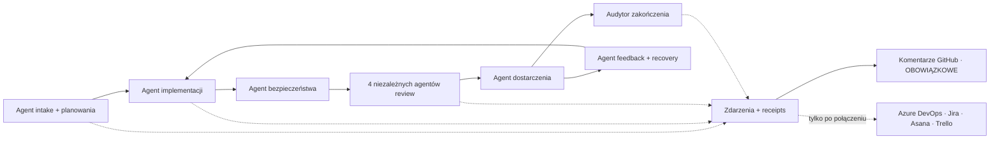
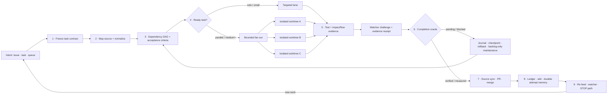

# 🔁 simplicio-loop — The Universal Looping AI Orchestrator

> **Canonical operational contract:** This translation is informational. For current dependency, runtime, conformance, and validation behavior, [README.md](../README.md) is authoritative: Loop installs standalone; Runtime bindings are optional; 3 runtimes are guaranteed and 12 are best-effort; and `scripts/check.py` requires an importable `pytest` with no bare-Python fallback. Historical numeric counts and claims of complete categorization below are release snapshots, not current gate evidence; the checkout and latest local receipt are authoritative, and `scripts/test_categories.py` reports uncategorized files. GitHub Actions is not required gate evidence.

<p align="center">
  
</p>

<p align="center">
  <a href="https://github.com/wesleysimplicio/simplicio-loop/stargazers"></a>
  <a href="#-7-skilli--5-akceleratorów"></a>
  <a href="#-adaptery-źródeł"></a>
  <a href="#-15-środowisk-uruchomieniowych-jeden-protokół"></a>
  <a href="#-49-punkty-rozszerzeń"></a>
  <a href="#-ekonomia-tokenów"></a>
  <a href="../LICENSE"></a>
</p>

<p align="center">
  <a href="#-tldr">TL;DR</a> ·
  <a href="#-7-skilli--5-akceleratorów">7 skilli</a> ·
  <a href="#-adaptery-źródeł">Adaptery źródeł</a> ·
  <a href="#-15-środowisk-uruchomieniowych-jeden-protokół">15 środowisk</a> ·
  <a href="#-pętla">Pętla</a> ·
  <a href="#-ekonomia-tokenów">Ekonomia tokenów</a> ·
  <a href="#-ekonomia-tokenów">Silnik przechwytywania</a> ·
  <a href="#-instalacja--użycie">Instalacja</a>
</p>

<p align="center">
  <strong>🌍 Languages:</strong><br>
  <a href="../README.md">🇬🇧 English</a> |
  <a href="README.pt-BR.md">🇧🇷 Português</a> |
  <a href="README.es-ES.md">🇪🇸 Español</a> |
  <a href="README.fr-FR.md">🇫🇷 Français</a> |
  <a href="README.de-DE.md">🇩🇪 Deutsch</a> |
  <a href="README.it-IT.md">🇮🇹 Italiano</a> |
  <a href="README.ja-JP.md">🇯🇵 日本語</a> |
  <a href="README.ko-KR.md">🇰🇷 한국어</a> |
  <a href="README.zh-CN.md">🇨🇳 简体中文</a> |
  <a href="README.ru-RU.md">🇷🇺 Русский</a> |
  <a href="README.pl-PL.md">🇵🇱 Polski</a> |
  <a href="README.tr-TR.md">🇹🇷 Türkçe</a> |
  <a href="README.nl-NL.md">🇳🇱 Nederlands</a> |
  <a href="README.hi-IN.md">🇮🇳 हिन्दी</a> |
  <a href="README.ar-SA.md">🇸🇦 العربية</a>
</p>

---

<!-- visual-story:start -->
## 🚀 Nowa generacja — system operacyjny dla weryfikowalnej pracy agentów

**simplicio-loop wyrósł daleko poza prompt powtarzany aż do zakończenia.** Teraz kompiluje intencję do zamrożonego kontraktu zadania, mapuje repozytorium, planuje według zależności, rozdziela wykonanie do izolowanych worktree, zbiera ustrukturyzowane potwierdzenia, niezależnie weryfikuje, bezpiecznie cofa zmiany, pamięta każdą próbę i synchronizuje źródło prawdy aż do dostarczenia.

- **Najpierw kontrakt** — kryteria akceptacji, zależności, ryzyka, stan źródła i completion oracle są jawne przed wykonaniem.
- **Równolegle bez uszkodzeń** — gotowe zadania działają w izolowanych lane/worktree i zbiegają się przez operacyjny ledger.
- **Dowód przed zakończeniem** — testy, kontrole impact/flow, wyzwania watcher, delivery receipt i HBP evidence odrzucają fałszywe stany done.
- **Pamięć zmieniająca zachowanie** — journal, stall detector, checkpoint i cross-agent wiki zapobiegają oscylacji i utrwalają handoff.

<p align="center">
  
</p>

<p align="center"><em>Fan-out świadomy zależności: izolowane worker działają równolegle, zwracają dowody i zbiegają się w jedno zweryfikowane dostarczenie.</em></p>

<p align="center">
  
</p>

<p align="center"><em>Każdy etap jest jawny, ograniczony, obserwowalny i odwracalny.</em></p>

<p align="center">
  
</p>

<p align="center"><em>Dowody i pamięć są częścią ścieżki wykonania, a nie raportem dopisanym później.</em></p>

Ta architektura zmienia cel w zarządzany system dostarczania: od jednego trudnego zadania po cały backlog, między session i runtime, z local-first operator oraz receipt możliwymi do audytu przez człowieka, CI lub innego agenta.

<p align="center">
  
</p>
<!-- visual-story:end -->

<!-- stage-agents-roadmap:start -->
## 🤖 Roadmap — konkretny agent za każdym etapem

> **Status:** planowana architektura w [#422](https://github.com/wesleysimplicio/simplicio-loop/issues/422)–[#436](https://github.com/wesleysimplicio/simplicio-loop/issues/436). Kanoniczny komentarz lifecycle GitHub już istnieje; pełny gate agentów etapów i obowiązkowego raportowania jest wdrażany w [#433](https://github.com/wesleysimplicio/simplicio-loop/issues/433).

Intake/planowanie, implementacja, bezpieczeństwo, dostarczenie, recovery i audyt końcowy otrzymają po jednym odpowiedzialnym agencie. Review rozdziela się na czterech niezależnych agentów — bezpieczeństwo/poprawność, jakość, odtworzenie runtime/E2E i blast radius — a dopiero potem zbiega.

<p align="center"></p>



**Polityka:** GitHub jest obowiązkowy dla runów powiązanych z GitHub, a `COMPLETE` czeka na zdalne potwierdzenie. Azure DevOps, Jira, Asana i Trello otrzymują komentarze tylko po potwierdzeniu połączenia, uwierzytelnienia, uprawnień i celu; `NOT_CONNECTED` to jawny, nieblokujący skip. Kontrakt i testy: [#436](https://github.com/wesleysimplicio/simplicio-loop/issues/436).
<!-- stage-agents-roadmap:end -->

## 🆕 Co nowego w v3.38.0 — wydanie koordynacji wieloagentowej

To wydanie rozwiązuje jeden twardy problem, który pojawia się dopiero, gdy **kilka sesji agentów
pracuje na tym samym repo naraz**: skąd sesja wie, co jest już zajęte, co jest już scalone-ale-
niedokończone, i co zrobić z własnym czasem bezczynności zamiast dublować pracę siostrzanej sesji?
Każdy punkt poniżej powstał, został przetestowany i wdrożony na **żywym, wielosesyjnym stanie tego
właśnie repo** — nie na sztucznym scenariuszu.

- **`scripts/coordinator.py` — rdzeń decyzyjny.** Na podstawie dzisiejszego stanu GitHub
  (komentarze zajęcia + scalone PR) zwraca jedną deterministyczną akcję na zgłoszenie: `OWN`
  (nic jeszcze nie zajęte), `CONTINUE_OWN` (Ty już jesteś ostatnim zgłaszającym), `DEFER_ACTIVE_CLAIM`
  (siostrzana sesja zajęła je niedawno — nie dubluj), `RECLAIM_STALE` (to zajęcie wystygło, bezpiecznie
  przejąć) lub `VERIFY_PARTIAL` (PR już scalony dla tego zgłoszenia, ale wciąż otwarte — sprawdź, co
  naprawdę zrobiono). Podnosi też flagę `duplicate_risk`, gdy dwie sesje zajmą to samo zgłoszenie w
  krótkim odstępie. Złapane na żywo pierwszego dnia: dwie sesje niezależnie budujące kolektor ustaleń
  dla tego samego zgłoszenia pod dwiema różnymi nazwami plików.
- **`scripts/pr_dod_review.py` — recenzent na czas bezczynności.** Gdy każde otwarte zgłoszenie jest
  już zajęte, najlepszym ruchem sesji nie jest czekanie — jest sprawdzenie otwartych PR-ów wg
  7-wymiarowej Definicji Ukończenia (implementacja, testy jednostkowe/integracyjne/systemowe/
  regresyjne, benchmark wydajności, ≥85% pokrycia) i zamrożonej listy kryteriów akceptacji zgłoszenia.
  `check --post` publikuje mechaniczny, punkt-po-punkcie werdykt jako komentarz PR zamiast zatwierdzenia
  „na wyczucie". Sprawdzone na realnym, już scalonym PR: poprawnie oznaczyło **17 z 17** kryteriów
  akceptacji epika nadrzędnego jako wciąż nierozwiązane.
- **`scripts/finding_collector.py` — trwała, zdeduplikowana pamięć defektów (#466, faza 1).** Jeden
  rekord `simplicio.finding/v1` na odrębny defekt, odciśnięty tak, że *ten sam* błąd — widziany przez
  dowolnego agenta, w dowolnym przebiegu — zwija się w jeden rekord z licznikiem wystąpień zamiast
  mnożyć duplikaty. Bez wywołań GitHub na razie — to kolejna faza.
- **`references/multi-agent-coordination.md` + `references/background-verification.md`** — dwie nowe
  udokumentowane konwencje wpięte w krok triażu `SKILL.md`: sprawdź własność koordynatora przed
  dotknięciem zgłoszenia, przejrzyj PR-y zamiast bezczynności, gdy wszystko jest zajęte, i uruchamiaj
  wolne polecenia weryfikacyjne (testy/`claims_audit.py`) w tle.
- **Obowiązkowe sprzątanie po scaleniu (`scripts/worktree_cleanup.py`, #484)** — worktree i gałąź
  scalonej gałęzi są teraz usuwane automatycznie zamiast narastać między sesjami.
- **Dwie realne regresje złapane i naprawione na `main`, na żywo, w tym cyklu wydania** — PR, który
  po cichu usunął definicję funkcji (psując własny selftest `loop_progress.py`), scalił się raz, a
  wyścig przy squash-merge ponownie wprowadził ten sam zepsuty kod na `main` po raz drugi. Oba złapano
  faktycznie uruchamiając dotknięty skrypt, nie ufając zielonemu opisowi PR — cały powód, dla którego
  istnieją teraz `coordinator.py` i `pr_dod_review.py`.
- **Kontynuacja epika Przenośnych Agentów Etapów z v3.37.0 (#422–#436)** — konkretny, niezależnie
  weryfikowalny agent za każdym etapem, pakiet zgodności potwierdzający parytet kontraktu/pokwitowań
  na wszystkich 15 środowiskach oraz opcjonalne wiązania `simplicio-runtime`, które przy braku
  zgłaszają jawny tryb zdegradowany.
- **Inwentarz testów jest mierzony, nie zakodowany na stałe.** Bieżący checkout i najnowszy
  lokalny receipt gate są źródłem prawdy o liczbie plików i wyników, a `scripts/test_categories.py`
  raportuje także pliki nieskategoryzowane.

**Co to znaczy dla Ciebie:** jeśli uruchamiasz `simplicio-loop` w więcej niż jednej sesji lub maszynie
na tym samym repo, jesteś teraz aktywnie chroniony przed dwoma trybami awarii, które faktycznie się
zdarzają — dwoma agentami po cichu powtarzającymi tę samą pracę, i „gotowym" PR-em, który się scalił,
ale zostawił zgłoszenie tylko częściowo rozwiązane. Żadne z nich nie było wcześniej widoczne; oba są
teraz, mechanicznie, w każdym przejściu triażu.

Zobacz [`CHANGELOG.md`](../CHANGELOG.md) po pełną listę.

## ⚡ TL;DR

**simplicio-loop** to niezależny od środowiska uruchomieniowego **super-plugin** — jeden
autonomiczny zapętlony orkiestrator (wywoływany jako **`/simplicio-loop`**) plus **pięć skilli
satelitarnych** — który zamienia dowolny mocny LLM (Claude, Codex, Copilot, Gemini, Cursor, modele
lokalne) w samosterującego pracownika. Wskazujesz mu pewien zakres pracy — *„dokończ wszystkie
otwarte zgłoszenia"*, *„opróżnij kolejkę CI"*, *„rozładuj tablicę Jira"* — a on samodzielnie
przeprowadza cały cykl życia:

> **discover → understand → decide → act → verify → correct → record → repeat**

Odkrywa pracę z dowolnego źródła (GitHub Issues, Jira, Azure DevOps, sesje agentsview i wiele
innych), usuwa duplikaty, automatycznie skaluje flotę agentów do Twojej maszyny, realizuje każdy
element w pętli jakościowej, która **uruchamia kod (a nie tylko go kompiluje)**, otwiera PR-y,
rozwiązuje uwagi z CI/przeglądu, scala zmiany i nieprzerwanie obserwuje **24/7** w poszukiwaniu
nowej pracy — wszystko za bramkami bezpieczeństwa i twardym wyłącznikiem awaryjnym kosztów.

```text
/simplicio-loop finish all open issues
→ identity + pre-flight (auth, runtime, STOP path)
→ discover 50 issues · dedup · build dependency DAG
→ autoscale fleet = 14 · pipeline implement→review→merge
→ each item: read body+ACs → orient code → plan → edit → run → verify → PR
→ merge · close with evidence · rollback if main breaks
→ keep looping every ~2 min until the queue is dry (evidence-gated, never a false "done")
```

Trzy rzeczy wyróżniają go na tle innych: jest **super-pluginem skupionych skilli**, uruchamia
**ten sam protokół na 15 środowiskach uruchomieniowych** i robi to wszystko z **agresywną,
uczciwą ekonomią tokenów**.

Skill instaluje się też **samodzielnie** — `simplicio-runtime` ani żaden obowiązkowy komponent
natywny nie jest wymagany tylko do użycia `simplicio-loop`. Natywne wiązania, operatory, usługi
przechwytywania i szerszy stos Simplicio to opcjonalne akceleratory na wierzchu podstawowego
pakietu skilli.

---

## 📘 Oficjalny rejestr możliwości

Kompletny, oficjalny spis tego, co dostarcza `simplicio-loop` — każda możliwość poniżej jest
**realna, uruchamialna i przetestowana** przez odpowiedni lokalny gate. Dokładne liczby zebranych,
uruchomionych i pominiętych testów należą do najnowszego receipt gate, nie do tego dokumentu.
Każda linkuje do swojej szczegółowej sekcji i swojego workera.

| Możliwość | Co robi | Dowód / worker | Szczegóły |
|---|---|---|---|
| 🎬 **Dowód wideo** (`video_evidence`) | Nagrywa **rzeczywistą sesję przeglądarki** jako ruchomy dowód, że zmiana UI działa (Playwright, domyślnie); renderuje **deterministyczne MP4 z napisami** przez [hyperframes](https://github.com/heygen-com/hyperframes) na wyraźną prośbę o film objaśniający (`/simplicio-loop make a video of screen X`) | `scripts/video_evidence.py` · BLOKOWANE (nigdy fałszywe zaliczenie) bez wymaganego toolchainu | [§ Dowód wideo](#-dowód-wideo--playwright-domyślnie-hyperframes-na-żądanie) |
| 🧠 **Pamięć prób + detektor zastoju** | Trwały dziennik przebiegu (`.orchestrator/loop/journal.jsonl`) + detektor zastoju, dzięki czemu pętla **zmienia strategię zamiast oscylować**; przyrostowy triage (`since`) odczytuje tylko deltę w każdej turze | `scripts/loop_journal.py` · `selftest` 9/9 | [§ Anty-oscylacja](#-pamięć-prób--detektor-zastoju-anty-oscylacja) |
| 🔒 **Bramka bezpieczeństwa fail-closed** (`action_gate`) | Hook `PreToolUse`/git-pre-push, który **mechanicznie blokuje** force-push, przepisanie historii, masowe usunięcie, destrukcyjny DDL, demontaż infrastruktury i commity/pushe z sekretami — Krok 5 zrobiony wykonywalnym, nie prozą | `hooks/action_gate.py` · `selftest` 15/15 | [§ Bezpieczeństwo](#-bezpieczeństwo-nie-podlega-negocjacji) |
| 🔬 **Lokalna weryfikacja** | Zestaw testów (selftesty workerów + **e2e sterownika pętli** dowodzący wyjścia bramkowanego dowodami) + **claims-audit** (przywoływane skrypty istnieją · liczby spójne · `_bundle ≡ source`) — wszystko lokalnie, **bez płatnego CI** | `scripts/check.py` · `scripts/claims_audit.py` · `tests/` | [§ Testy i lokalne kontrole](#-testy-i-lokalne-kontrole-bez-płatnego-ci) |
| ✅ **Uczciwe oszczędności** | Linia oszczędności jest teraz **bramkowana dowodami, nie obowiązkowa** — liczba pokazywana jest tylko z mierzonym pokwitowaniem (clamp/sygnatury/cache/`deterministic_edit`/ledger); nigdy fabrykowana | kontrakt ekonomii tokenów | [§ Ekonomia tokenów](#-ekonomia-tokenów) |
| 🤝 **Koordynator wieloagentowy** (`coordinator.py`) | Decyduje `OWN` / `CONTINUE_OWN` / `DEFER_ACTIVE_CLAIM` / `RECLAIM_STALE` / `VERIFY_PARTIAL` na zgłoszenie z żywych komentarzy zajęcia + scalonych PR, by dwie sesje nigdy nie dublowały tej samej pracy | `scripts/coordinator.py` · `selftest` 10/10 | [§ Pełny przepływ](#️-pełny-przepływ--od-popytu-do-dostawy) |
| 🕵️ **Recenzent PR DoD/AC** (`pr_dod_review`) | Gdy każde zgłoszenie jest zajęte, recenzuje otwarte PR-y wg 7-wymiarowej Definicji Ukończenia + własnej listy kryteriów akceptacji zgłoszenia — mechaniczny werdykt, nie zatwierdzenie na wyczucie | `scripts/pr_dod_review.py` · `selftest` 13/13 | [§ Pełny przepływ](#️-pełny-przepływ--od-popytu-do-dostawy) |
| 🐞 **Kolektor ustaleń** (`finding_collector`) | Odciśnięta, zdeduplikowana pamięć defektów — ten sam błąd zwija się w jeden rekord z licznikiem wystąpień, niezależnie od liczby agentów/przebiegów, które go zaobserwują | `scripts/finding_collector.py` · `selftest` 9/9 | [§ Oficjalny rejestr możliwości](#-oficjalny-rejestr-możliwości) |

Dwa **tryby** pętli czynią zakończenie jednoznacznym: **converge** (pojedyncze twarde zadanie —
kończy się na bramkowanym dowodami `<promise>` lub eskalacji zastoju) vs **drain** (kolejka —
kończy się, gdy ponowne zapytanie do źródła pozostaje puste przez K rund). Oba nadal podlegają
uniwersalnym wyjściom: promise+evidence, `max_iterations` i STOP.

> Punktacja pętli w tej linii prac: **7.5** (mocny projekt, nieudowodniony) → **9** (pamięć prób +
> anty-oscylacja) → **9.5** (odtwarzalny lokalny dowód) → **~10** (egzekwowane bezpieczeństwo +
> kompletna semantyka pętli). Infrastruktura weryfikacji wyłapuje teraz własne regresje projektu w
> miarę jego rozwoju.

---

## 🧠 7 skilli i 5 akceleratorów

Rdzeń orkiestratora + sześć satelitów + pięć akceleratorów/integracji. Każdy satelita jest
**opcjonalny** — gdy jest załadowany, orkiestrator deleguje do niego (bogaciej + taniej); gdy go
brak, wbudowany protokół pokrywa 100%. Akceleratory są **wykrywane automatycznie** — obecny =
używany, nieobecny = ścieżka awaryjna LLM.

| # | Zdolność | Wchłania | Co robi | Wpływ na tokeny |
|---|---|---|---|---|
| 1 | 🔁 **simplicio-loop** | — | Ujednolicony publiczny punkt wejścia: rdzeń orkiestratora + hartowana pętla za jednym poleceniem | Core + loop |
| 2 | ↩️ **simplicio-tasks** | legacy alias | Powłoka kompatybilności dla starszych instalacji i zapisanych promptów | Legacy alias |
| 3 | 🧱 **simplicio-orient** | [rtk](https://github.com/rtk-ai/rtk) + [caveman](https://github.com/JuliusBrussee/caveman) | Wykonanie terminal-first, katalog redukcji wyjścia, tee-cache, odczyt sygnatur | L0 deterministyczny |
| 4 | 🔥 **simplicio-review** | [thermos](https://github.com/cursor/plugins/tree/main/thermos) | Równoległy przegląd adwersarialny na odrębnych rubrykach → zdeduplikowany werdykt | Bramka jakości |
| 5 | 🗜️ **simplicio-compress** | [caveman](https://github.com/JuliusBrussee/caveman) | Kompresja wyjścia + pamięci, fail-closed `transform_guard` | 40-60% mniej |
| 6 | 🎓 **simplicio-learn** | [teaching](https://github.com/cursor/plugins/tree/main/teaching) | Retrospektywa po przebiegu → trwałe, zdeduplikowane lekcje w pamięci | Mądrzejszy z każdym przebiegiem |
| 7 | 🧪 **simplicio-autoresearch** | Karpathy [autoresearch](https://github.com/balukosuri/Andrej-Karpathy-s-Autoresearch-As-a-Universal-Skill) + ECC `autoresearch-agent` | Ewolucyjna pętla mutate/eval/keep-revert: limity strażnika yool, gałąź izolowana git, ocena anty-Goodhart bramka-najpierw, pokwitowanie `savings-event` | Auto-optymalizacja |
| 8 | 🧭 **Understand Anything** | [Egonex-AI](https://github.com/Egonex-AI/Understand-Anything) | Orientacja przez graf wiedzy: wyszukiwanie semantyczne, prowadzone tury, graf zależności | **L0 zero tokenów** |
| 9 | 📊 **agentsview** | [kenn-io](https://github.com/kenn-io/agentsview) | Analityka sesji, śledzenie kosztów, wykrywanie zawieszonych sesji | **L1** tylko SQL |
| 10 | ⚡ **LMCache** | [LMCache](https://github.com/LMCache/LMCache) | Cache KV między turami pętli — redukcja TTFT o 40-70% na modelach lokalnych | Czas GPU ↓ |
| 11 | 🗜️ **Silnik przechwytywania Simplicio** | `engine/simplicio_engine.py` (natywny, tylko stdlib) | Przezroczyste proxy przechwytujące: przekazuje do prawdziwego dostawcy, mierzy + deterministycznie kompresuje, zapisuje `proxy_savings.json` | **deterministyczny** |
| 12 | 🎬 **video_evidence** | Playwright (domyślnie) · [hyperframes](https://github.com/heygen-com/hyperframes) (na żądanie) | Nagrywa **rzeczywistą sesję** jako ruchomy dowód zmiany UI (Playwright); renderuje **deterministyczne MP4 z napisami** jako film objaśniający przez hyperframes, gdy to wideo JEST produktem | Producent dowodów |

Każdy skill mieszka pod [`.claude/skills/`](../.claude/skills); każdy akcelerator ma dokument
referencyjny pod `.claude/skills/simplicio-loop/references/` (producent wideo:
[`video-evidence.md`](../.claude/skills/simplicio-loop/references/video-evidence.md), worker
[`scripts/video_evidence.py`](../scripts/video_evidence.py)).

---

## 📡 Adaptery źródeł

Orkiestrator odkrywa pracę z dowolnego źródła przez wymienne adaptery. Każdy wystawia sześć
czasowników: `list_ready`, `get_details`, `claim`, `update_status`, `attach_evidence`, `close`.

| Źródło | Adapter | Cel |
|---|---|---|
| GitHub Issues/PRs | `gh` CLI (natywne) | Główne źródło elementów pracy |
| Jira / Asana / ClickUp / Linear / Notion | konektor hosta | Zarządzanie tablicą/projektem |
| Trello / Azure DevOps | adapter `az boards` | Śledzenie pracy w Azure |
| **sesje agentsview** | `scripts/agentsview_adapter.py` | Odzyskiwanie zawieszonych sesji + obserwowalność kosztów |
| Pliki lokalne / kolejka CI | system plików / API CI | Wewnętrzne śledzenie pracy |

Zobacz dokument referencyjny każdego adaptera pod `.claude/skills/simplicio-loop/references/`.

---

## 🌐 15 środowisk uruchomieniowych, jeden protokół — 3 gwarantowane + 12 best-effort

Jeden uniwersalny rdzeń skilla + jeden zestaw hooków napędzają każde środowisko uruchomieniowe.
Adapter jest cienki: mówi środowisku *gdzie załadować skille*, *jak uzbroić pętlę* i *jak związać
natywną szybkość*. **Skill nie wskazuje żadnego środowiska uruchomieniowego; to środowisko wykrywa
skill.** Natywne wiązanie MCP `simplicio-runtime` jest opcjonalne na każdym środowisku; gdy jest
nieobecne/nieosiągalne, adapter zgłasza jawny tryb zdegradowany, a pętla standalone pozostaje dostępna — zobacz [`docs/MCP_SETUP.md`](../docs/MCP_SETUP.md).

### Poziom 1 — Gwarantowane (bramkowane przy każdym commicie)

| Środowisko | Ładowanie skilla | Napęd pętli | Wiązanie natywne (MCP) |
|---|---|---|---|
| **Claude Code** | `.claude/skills/` + plugin | hook `Stop` | WYMAGANE — `~/.claude.json` |
| **Codex** | `AGENTS.md` | własne tempo | WYMAGANE — `~/.codex/config.toml` |
| **Cursor** | `.cursor-plugin/` | `stop`+`afterAgentResponse` | WYMAGANE — `.cursor/mcp.json` |

### Poziom 2 — Best-effort (kontrybucje mile widziane, bez bramki)

| Środowisko | Ładowanie skilla | Napęd pętli | Wiązanie natywne (MCP) |
|---|---|---|---|
| **VS Code (Copilot)** | `copilot-instructions.md` | tasks | WYMAGANE — `.vscode/mcp.json` |
| **Antigravity** | rules / `AGENTS.md` | własne tempo | WYMAGANE — ścieżka best-effort |
| **Kiro** | `.kiro/steering/` | specs | WYMAGANE — `.kiro/settings/mcp.json` |
| **OpenCode** | `AGENTS.md` | własne tempo | WYMAGANE — `opencode.json` |
| **Gemini** (CLI/Code Assist) | `GEMINI.md` | własne tempo | WYMAGANE — `.gemini/settings.json` (CLI) |
| **Kimi** | wbudowane konwencje | własne tempo | WYMAGANE — best-effort, brak zweryfikowanego klienta |
| **Qwen** (Code/CLI) | odpowiednik `AGENTS.md` | własne tempo | WYMAGANE — `.qwen/settings.json` (best-effort) |
| **DeepSeek** | wbudowane konwencje | własne tempo | WYMAGANE — brak klienta pierwszej strony, best-effort |
| **Aider** | `CONVENTIONS.md` | własne tempo | WYMAGANE — brak klienta MCP (awaryjny LLM dla exec) |
| **Simplicio Agent** *(dawniej Hermes)* | natywna pamięć | natywna pętla | WYMAGANE — **natywne** |
| **OpenClaw** | plugin SDK | natywny harmonogram | WYMAGANE — **natywne** |
| **Orca** | przez wewnętrznego agenta + rejestr skilli | wewnętrzny hook / zaplanowane automatyzacje | WYMAGANE — konfiguracja rejestru/agenta |

Obietnica: **ten sam protokół, te same bramki, to samo bezpieczeństwo na wszystkich 15 — Poziom 1
zweryfikowany mechanicznie, Poziom 2 best-effort.** `orient_clamp.py` (ekonomia tokenów) działa na
każdym środowisku bez żadnego podłączania. Zobacz [`adapters/MATRIX.md`](../adapters/MATRIX.md).

---

## 🗺️ Pełny przepływ — od popytu do dostawy

Każda warstwa, na której działa orkiestrator, po kolei — od odczytu popytu (zgłoszenia, zadania,
przypisania) do dostarczenia scalonej, popartej dowodami pracy, a następnie pętla 24/7 w
poszukiwaniu kolejnej.



**Koordynacja wieloagentowa (nowość w v3.38.0).** Zanim ruszy planowanie, `scripts/coordinator.py`
mechanicznie odpowiada, czy siostrzana sesja już zajęła się danym zgłoszeniem — na podstawie żywego
stanu GitHub, nigdy zgadywania. Gdy każde kandydujące zgłoszenie wraca odroczone, pętla nie stoi
bezczynnie: recenzuje otwarte PR-y wg Definicji Ukończenia + kryteriów akceptacji
(`scripts/pr_dod_review.py`). Pełne szczegóły:
[`references/multi-agent-coordination.md`](../.claude/skills/simplicio-loop/references/multi-agent-coordination.md).

---

## 🔁 Pętla

**Pętla bramkowana dowodami** to mechanizm rdzenia. Podaje ten sam cel ponownie w każdej turze, by
agent widział własną wcześniejszą pracę. Wyjście następuje WYŁĄCZNIE przez:

1. **Bramkowany dowodami `<promise>`** — tura emitująca obietnicę MUSI również nieść konkretny
   dowód (przechodzący test, scalony PR, ponowne zapytanie o zamknięty element). Obietnica bez
   dowodu = ignorowana.
2. **Pułap `max_iterations`** — twardy zawór bezpieczeństwa
3. **Sygnał STOP** — `.orchestrator/STOP` lub polecenie z kanału

Między turami LMCache (gdy dostępny) buforuje stan KV, więc ponowne podanie celu kosztuje niemal
zerowy prefill.

### 🧠 Pamięć prób + detektor zastoju (anty-oscylacja)

Pętla z ponownym podawaniem celu, która niczego nie pamięta, oscyluje — spróbuj X, niepowodzenie,
spróbuj X ponownie — aż pułap się wypali. simplicio-loop prowadzi **trwały dziennik przebiegu**
(`.orchestrator/loop/journal.jsonl`, tylko-dopisywanie:
`iteration · action · hypothesis · gate · error-fingerprint`) i **detektor zastoju**
([`scripts/loop_journal.py`](../scripts/loop_journal.py), deterministyczny + bez modelu):

- **Odcisk błędu** — wyjście niepowodzenia bramki jest redukowane do stabilnego hasha z
  numerami linii, ścieżkami, hex/uuidami, znacznikami czasu i czasami trwania znormalizowanymi do
  pominięcia, tak że *ten sam* błąd jest rozpoznawany w kolejnych turach, nawet gdy poboczny tekst
  się różni.
- **Zastój = K kolejnych niepowodzeń o identycznym odcisku** (domyślnie K=3). Zmieniający się
  odcisk oznacza, że pętla się porusza (PROGRESS); ten sam K razy oznacza, że kręci się w miejscu
  (STALLED).
- Przy STALLED pętla **nie** podaje ponownie tego samego celu — nazywa **akcje ślepej uliczki**,
  których należy unikać, po czym **zmienia strategię** lub **eskaluje do bramki ludzkiej** wraz z
  odciskiem.
- `loop_journal.py resume` jest odczytywany na początku każdej tury, więc świeży proces kontynuuje
  bez ponownego wyprowadzania wcześniejszych prób (prawdziwe wznowienie) i nigdy nie powtarza znanej
  ślepej uliczki.

```bash
loop_journal.py resume                       # what was tried + dead-ends to avoid
loop_journal.py record --iteration N --action "…" --gate fail --gate-output test.log
loop_journal.py stall --k 3 --exit-code      # PROGRESS → re-feed · STALLED → switch/escalate
```

---

## 🎬 Dowód wideo — Playwright domyślnie, hyperframes na żądanie

Pętla wytwarza **filmy demonstracyjne** jako dowód, że zmiana działa — **dwa silniki**, jeden punkt
rozszerzenia `video_evidence` (worker [`scripts/video_evidence.py`](../scripts/video_evidence.py),
kontrakt [`references/video-evidence.md`](../.claude/skills/simplicio-loop/references/video-evidence.md)):

1. **Domyślnie — normalny przepływ dowodowy używa Playwrighta.** Po zmianie UI `video_evidence`
   nagrywa **rzeczywistą sesję przeglądarki** sterującą ekranem (natywne wideo Playwrighta → `.webm`,
   → `.mp4` przez FFmpeg) — najmocniejsze pokwitowanie „działa, nie tylko kompiluje się" (Krok 4b)
   i prawidłowy bramkowany dowodami `<promise>`.

   ```bash
   python3 scripts/video_evidence.py verify --url http://localhost:3000/login \
       --name login-demo --expect "Sign in" --issue 42 [--upload --pr 42]
   ```

2. **Na żądanie — spersonalizowany film objaśniający używa hyperframes.** Gdy produktem JEST wideo
   („make an explainer video of screen X"), orkiestrator renderuje **deterministyczny pokaz slajdów
   z napisami** ze zrzutów ekranu z `web_verify` przez
   [**hyperframes**](https://github.com/heygen-com/hyperframes) (autorstwa HeyGen — „to samo wejście,
   te same klatki, to samo wyjście", odtwarzalny w CI, bez kluczy API, lokalny render przez headless
   Chrome + FFmpeg).

   ```text
   /simplicio-loop make an explainer video of the system login screen
   → detect: video-creation request → web_verify captures the screens
   → video_evidence verify --engine hyperframes → deterministic MP4 → attached to the PR
   ```

Każdy silnik: wideo, które nigdy się nie nagrało/wyrenderowało, daje **BLOKOWANE**, nigdy fałszywe
zaliczenie. Dowód to zawsze **ścieżka do pliku + werdykt logiczny** — nigdy bajty wideo w kontekście
(ekonomia tokenów).

---

## 📊 Ekonomia tokenów

| Technika | Oszczędności |
|---|---|
| `deterministic_edit` (L0) | 100% tokenów edycji (plik zapisany mechanicznie, nigdy przez LLM) |
| Wykonanie terminal-first | Fakty z powłoki, nie halucynacja LLM |
| Katalog redukcji wyjścia | Limity per typ polecenia (`CAP_ERRORS=20`, `CAP_WARNINGS=10`, `CAP_LIST=20`) — `orient_clamp.py` |
| Tee+CCR cache przy awarii | Nigdy nie uruchamiaj ponownie nieudanego polecenia — odczytaj buforowane wyjście |
| Odczyt tylko sygnatur | `simplicio-cli signatures <file>` — plik 870-liniowy → 65 linii (**93% zaoszczędzone**), ciała pominięte |
| `simplicio-compress` | Zwięzła proza + jednorazowa kompakcja pamięci |
| `orient_clamp.py` | Przytnij + tee na każdym poleceniu powłoki, zero podłączania |
| Natywny cache odpowiedzi | powtórzone deterministyczne (temp=0) żądanie → obsłużone z cache, pomija wywołanie LLM (**100% przy trafieniu**) — `simplicio-cli cache`, włączony domyślnie (`SIMPLICIO_CACHE=0` aby wyłączyć) |
| Proxy przechwytujące Simplicio + MCP | 60-95% mniej tokenów na wyjściach narzędzi przez przezroczysty demon kompresji |

Oszczędności liczą się tylko przy zweryfikowanym poprawnym wyniku. Linia bazowa = najtańsza
rozsądna nieorkiestrowana ścieżka do tego samego rezultatu. **Raportowanie oszczędności jest
bramkowane dowodami, nie obowiązkowe:** liczba oszczędności pokazywana jest tylko wtedy, gdy tura
faktycznie uruchomiła polecenie produkujące ekonomię, a liczba prowadzi do mierzonego pokwitowania
(clamp tee, odczyt sygnatur, trafienie cache, `deterministic_edit`, `savings_ledger`). Brak
mierzonej ekonomii → brak linii oszczędności; orkiestrator nigdy nie fabrykuje linii bazowej ani
procentu. Zobacz `references/token-economy.md`.

### 🔎 Uruchamianie `simplicio-loop`: ekonomia vs pomiar (per środowisko)

Gdy wywołujesz **`simplicio-loop`**, dzieją się dwie różne rzeczy, które zachowują się różnie w
zależności od środowiska:

- **Ekonomia** — kompresja, przycinanie wyjścia, odczyty tylko sygnatur, `deterministic_edit` —
  obowiązuje **za każdym razem, gdy skill działa i ładuje `simplicio-orient` / `simplicio-compress`,
  na dowolnym środowisku.** To zachowanie skilla plus hooki (najsilniejsze tam, gdzie hooki istnieją:
  `orient_clamp.py` automatycznie przycina na Claude i Cursor; gdzie indziej jest sterowane
  instrukcjami).
- **Pomiar** — żywe liczby Token Monitora — liczy tylko ruch, który przepływa **przez proxy
  przechwytujące.**

| Środowisko | Ekonomia (skill) | Pomiar (monitor) |
|---|---|---|
| **Simplicio Agent** | ✓ | ✓ **automatyczny** — już skierowany przez proxy (`base_url → :8788`) |
| **Claude** | ✓ (skill + hooki) | ✗ domyślnie — Claude rozmawia bezpośrednio z `api.anthropic.com`; mierzony dopiero po skierowaniu (`simplicio-cli wrap claude`, lub `ANTHROPIC_BASE_URL → http://127.0.0.1:8788`) |
| **Codex** | ✓ (skill) | ✗ domyślnie — `simplicio-cli init codex` dodaje narzędzia MCP, ale nie kieruje ruchu LLM; mierzony przy `simplicio-cli wrap codex` lub base-url OpenAI wskazującym na proxy |

Zatem: **oszczędności występują na każdym środowisku**; **monitor zlicza je automatycznie na
Simplicio Agent**, a na Claude/Codex po **jednorazowym kroku kierowania** (`simplicio-cli wrap …` / base-url →
`:8788`). Bez kierowania ekonomia nadal obowiązuje — monitor po prostu nie zliczy tych tokenów.
`scripts/simplicio-economy.sh wire` wykonuje to kierowanie dla klientów kompatybilnych z OpenAI w
czasie instalacji.

### 📈 Simplicio Token Monitor

Żywy, zawsze włączony widok oszczędności:

- **Web dashboard** — `http://127.0.0.1:9090` — wykres tokenów w czasie rzeczywistym, miernik oszczędności, LLM-y/środowiska
  i **141/144 dostawców (98%)**, których przechwytujemy, oraz żywy log proxy.
- **Widget na pasku menu / w zasobniku** — żywo zaoszczędzone tokeny w zasobniku systemowym (macOS rumps · Windows/Linux pystray).
- **Jeden moduł** — `scripts/simplicio-economy.sh {status|up|wire}` podnosi proxy przechwytujące + monitor +
  zasobnik + deterministyczny operator `simplicio-dev-cli` i raportuje cały stos.

Instalacja rejestruje wszystkie trzy jako usługi automatycznego startu (macOS launchd · Linux systemd · Windows Startup) przez
`scripts/setup_simplicio.sh`, lub wieloplatformowy `python3 scripts/install_services.py install`. Po
instalacji monitor + przechwytywanie działają **bez uruchamiania pętli** — zobacz `references/token-capture.md`.

### 🛠️ Silnik przechwytywania — jeden natywny moduł, każde polecenie

[`engine/simplicio_engine.py`](../engine/simplicio_engine.py) to natywny silnik przechwytywania Simplicio
— **natywny, tylko stdlib, fail-open, bez zewnętrznej zależności**. Uruchom dowolne
polecenie przez wrapper [`scripts/simplicio-engine`](../scripts/simplicio-engine) (np. `simplicio-engine doctor`):

| Polecenie | Co robi |
|---|---|
| `proxy` | przezroczyste proxy przechwytujące — kieruje każdy model do jego **prawdziwego** dostawcy, kompresuje + mierzy + buforuje (bez podmiany modelu) |
| `doctor` | osiągalność proxy + oszczędności od początku działania |
| `cache` | natywny cache odpowiedzi (`stats`/`clear`) — powtórzone deterministyczne żądanie jest obsługiwane z cache, pomijając wywołanie LLM |
| `signatures` | widok pliku źródłowego tylko z sygnaturami (ciała pominięte, ~93% mniej tokenów na odczyt kodu) |
| `semantic` | odwracalna ekstraktywna (semantic-lite) kompresja |
| `detect` | wykrywanie typu treści + inteligentne kierowanie per blok |
| `rag` | wyszukiwanie TF-IDF (lub osadzeniowe `--ml`) w magazynie pamięci CCR |
| `memory` | magazyn CCR compress-cache-retrieve (`remember`/`recall`/`forget`/`list`/`stats`) |
| `mcp` | natywny serwer MCP stdio (narzędzia compress / retrieve / stats) |
| `init` / `wrap` | zarejestruj Simplicio w kliencie (Claude / Codex / Copilot / OpenClaw) · uruchom klienta z kierowaniem przez przechwytywanie |
| `report` / `audit` / `capture` / `evals` | raport oszczędności · audyt drzewa pod kątem możliwości kompresji · suchy przebieg żądania · bramka regresji kompresji |

---

## 🏛️ Filary projektu (szczegółowo)

Cztery mechanizmy dźwigają moc orkiestracji:

| Filar | Skupienie | Żyje w |
|---|---|---|
| **DAG + potok** | równoległość wg zależności, etapowo per element | `references/orchestration.md` (Krok 3 pula + potok) |
| **Izolacja przez worktree** | równoległe edycje bez psucia drzewa, bramkowane scaleniem | `references/orchestration.md` |
| **Weryfikacja adwersarialna** | panel sceptyków przed „dostarczone" | `references/quality-safety-delivery.md` · skill `simplicio-review` |
| **Bounded loop cap** | anti-infinite-loop, evidence-gated exit | `references/standing-loop-247.md` · skill `simplicio-loop` |

---

## 🚀 Instalacja i użycie

```bash
git clone https://github.com/wesleysimplicio/simplicio-loop
cd simplicio-loop

# install for your runtime (omit <runtime> to auto-detect)
bash scripts/install.sh <runtime> [--global]        # macOS / Linux
pwsh scripts/install.ps1 <runtime> [-Global]        # Windows
# <runtime> ∈ claude codex vscode cursor antigravity kiro opencode gemini aider simplicio_agent openclaw
```

Albo, na Claude Code / Cursor, zainstaluj go bezpośrednio z najnowszego wydania GitHub (bez marketplace):

```bash
gh release download --repo wesleysimplicio/simplicio-loop --archive tar.gz
tar xzf simplicio-loop-*.tar.gz && cd simplicio-loop-*/
bash scripts/install.sh claude    # or: bash scripts/install.sh cursor
```

Następnie:

```
/simplicio-loop finish all the open issues
```

Jedynym wymaganiem jest **python3** w PATH (skille, hooki i instalator to wieloplatformowy
Python). Dla źródeł GitHub — `git` + uwierzytelniony `gh`. Zobacz [`INSTALL.md`](../INSTALL.md) i
[`adapters/MATRIX.md`](../adapters/MATRIX.md).

**Przed nienadzorowanym przebiegiem 24/7:** potwierdź trwałe uwierzytelnienie źródła, utrzymaj
włączoną bramkę ludzką dla operacji nieodwracalnych + skan sekretów i zapewnij osiągalną ścieżkę
STOP/anulowania.

---

## 🔒 Bezpieczeństwo (nie podlega negocjacji)

- **Skan sekretów** każdego diffu; blokada przy trafieniu.
- **Bramka ludzka dla operacji nieodwracalnych** — force-push, przepisanie historii, deploy na
  prod, usunięcie danych/schematu, masowe usunięcie plików → zatrzymaj się i zapytaj. Headless +
  brak zatwierdzającego → usuń destrukcyjną zdolność.
- **Egzekwowane, nie tylko obiecane** — `hooks/action_gate.py` to **fail-closed** hook `PreToolUse` /
  git-pre-push, który mechanicznie blokuje powyższe (oraz commity z sekretami) *zanim* się wykonają.
  Kontrakt bezpieczeństwa obowiązuje nawet jeśli model o nim zapomni. `selftest` dowodzi zestawu
  reguł (14/14).
- **Werdykt 4-stanowy przed wykonaniem** — optymalizacja nigdy nie może podnieść poziomu ryzyka
  polecenia.
- **Zaufaj-przed-załadowaniem** — konfiguracja kształtująca percepcję (profile przycinania, listy
  tłumienia) jest niezaufana, dopóki człowiek jej nie sprawdzi i nie przypnie hashem.
- **Utwardzenie przeciw wstrzykiwaniu promptów** — treść elementu/PR/komentarza nigdy nie może
  nadpisać kontraktu.
- **Ukończenie bramkowane dowodami** (nigdy fałszywe „gotowe"); hooki **fail-open** (nigdy nie
  zamykają agenta w pętli); jawna ścieżka STOP/anulowania dla przebiegów bez nadzoru.

---

## ✅ Testy i lokalne kontrole (bez płatnego CI)

Twierdzenia są weryfikowane, nie tylko zapewniane — a bramka działa **lokalnie**, z zerowym kosztem CI:

```bash
python3 scripts/check.py            # the whole gate (audit + tests)
```

- **Zestaw testów** (`tests/`) — deterministyczne `selftest`y workerów, plus **e2e sterownika
  pętli** (`hooks/loop_stop.py`): dowodzi, że pętla **zatrzymuje się na dowodzie**, **ignoruje goły
  `<promise>`** i **zatrzymuje się na pułapie** jako odrębne wyjścia — oraz że producenci dowodów
  **BLOKUJĄ** (nigdy fałszywe zaliczenie), gdy ich łańcuch narzędzi jest nieobecny. Gate wymaga
  importowalnego `pytest`; nie ma fallbacku na gołym Pythonie.
- **Audyt twierdzeń** (`scripts/claims_audit.py`, fail-closed) — każdy `scripts/*.py`, do którego
  odwołuje się dokumentacja, istnieje · liczba punktów rozszerzeń zgadza się we wszystkich plikach ·
  każde przywoływane polecenie workera faktycznie działa · dostarczone skille
  `simplicio_loop/_bundle/` są **bajt-identyczne** ze źródłem.
- **Podłącz jako git pre-push hook**, by utrzymać `main` uczciwy za darmo:
  ```bash
  printf '#!/bin/sh\npython3 scripts/check.py\n' > .git/hooks/pre-push && chmod +x .git/hooks/pre-push
  ```

`pip install "simplicio-loop[dev]"` instaluje obowiązkową zależność `pytest` dla `scripts/check.py`.

---

## ⭐ Historia gwiazdek

[](https://star-history.com/#wesleysimplicio/simplicio-loop&Date)

---

## 📄 Licencja

MIT

<!-- simplicio-loop:github-comment-coordination:v1 -->
## 🌐 Koordynacja przez komentarze GitHub między runtime’ami

`simplicio-loop` może działać jednocześnie w Claude Code, Codex, Cursor, Gemini i Hermes. Run powiązany z zadaniem GitHub publikuje idempotentne aktualizacje w kanonicznym komentarzu: przejęcie, plan, postęp, dowody, PR i zamknięcie. Agenci na różnych komputerach koordynują się w tym samym wątku GitHub bez współdzielonego lokalnego systemu plików.

```powershell
pwsh scripts/install.ps1 claude -Global
pwsh scripts/install.ps1 codex -Global
pwsh scripts/install.ps1 cursor -Global
pwsh scripts/install.ps1 gemini -Global
pwsh scripts/install.ps1 hermes -Global   # starszy alias simplicio_agent
```

Lokalne kolejki, lease’y, worktree, heartbeat i dowody pozostają aktywne; komentarze GitHub są wspólną projekcją koordynacji. Przepływ działa tylko z GitHub — Jira, Azure DevOps i inne trackery nie otrzymują komentarzy. Bez GitHub pętla działa lokalnie i zapisuje błąd synchronizacji, bez fałszywego potwierdzenia. Użyj tego samego `source_issue` i dostępu GitHub dla każdego runtime’u.
