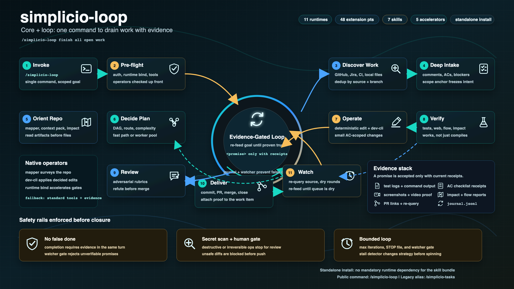
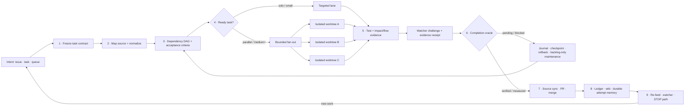

# 🔁 simplicio-loop — O Orquestrador de IA Universal em Loop

<p align="center">
  
</p>

<p align="center">
  <a href="https://github.com/wesleysimplicio/simplicio-loop/stargazers"></a>
  <a href="#-as-11-skills--aceleradores"></a>
  <a href="#-adaptadores-de-fonte"></a>
  <a href="#-11-runtimes-um-protocolo"></a>
  <a href="#-os-44-pontos-de-extensão"></a>
  <a href="#-economia-de-tokens"></a>
  <a href="../LICENSE"></a>
</p>

<p align="center">
  <a href="#-tldr">TL;DR</a> ·
  <a href="#-as-11-skills--aceleradores">11 Skills</a> ·
  <a href="#-adaptadores-de-fonte">Adaptadores de fonte</a> ·
  <a href="#-11-runtimes-um-protocolo">11 Runtimes</a> ·
  <a href="#-o-loop">O Loop</a> ·
  <a href="#-economia-de-tokens">Economia de Tokens</a> ·
  <a href="#-economia-de-tokens">Engine de Captura</a> ·
  <a href="#-instalação--uso">Instalação</a>
</p>

<p align="center">
  <strong>🌍 Languages:</strong><br>
  <a href="../README.md">🇬🇧 English</a> |
  <a href="README.pt-BR.md">🇧🇷 Português</a> |
  <a href="README.es-ES.md">🇪🇸 Español</a> |
  <a href="README.fr-FR.md">🇫🇷 Français</a> |
  <a href="README.de-DE.md">🇩🇪 Deutsch</a> |
  <a href="README.it-IT.md">🇮🇹 Italiano</a> |
  <a href="README.ja-JP.md">🇯🇵 日本語</a> |
  <a href="README.ko-KR.md">🇰🇷 한국어</a> |
  <a href="README.zh-CN.md">🇨🇳 简体中文</a> |
  <a href="README.ru-RU.md">🇷🇺 Русский</a> |
  <a href="README.pl-PL.md">🇵🇱 Polski</a> |
  <a href="README.tr-TR.md">🇹🇷 Türkçe</a> |
  <a href="README.nl-NL.md">🇳🇱 Nederlands</a> |
  <a href="README.hi-IN.md">🇮🇳 हिन्दी</a> |
  <a href="README.ar-SA.md">🇸🇦 العربية</a>
</p>

---

<!-- visual-story:start -->
## 🚀 A nova geração — um sistema operacional para trabalho verificado de agentes

**O simplicio-loop evoluiu muito além de um prompt que repete até terminar.** Agora ele compila a intenção em um contrato de tarefa congelado, mapeia o repositório, agenda trabalho conforme dependências, distribui a execução em worktrees isoladas, coleta recibos estruturados, verifica de forma independente, faz rollback com segurança, lembra cada tentativa e mantém a fonte oficial sincronizada até a entrega.

- **Contrato primeiro** — critérios de aceite, dependências, riscos, estado da fonte e oráculo de conclusão ficam explícitos antes da execução.
- **Paralelo sem corrupção** — tarefas prontas rodam em lanes/worktrees isoladas e convergem por um ledger operacional.
- **Prova antes da conclusão** — testes, impacto/fluxo, desafios do watcher, recibos de entrega e evidência HBP rejeitam falsos estados de concluído.
- **Memória que muda o comportamento** — journal, detector de estagnação, checkpoints e wiki cross-agent evitam oscilação e tornam handoffs duráveis.

<p align="center">
  
</p>

<p align="center"><em>Fan-out orientado por dependências: workers isolados executam em paralelo, devolvem evidências e convergem em uma entrega verificada.</em></p>

<p align="center">
  
</p>

<p align="center"><em>Cada etapa é explícita, limitada, observável e reversível.</em></p>

<p align="center">
  
</p>

<p align="center"><em>Evidência e memória fazem parte do caminho de execução — não são um relatório escrito depois.</em></p>

Essa arquitetura transforma um único objetivo em um sistema governado de entrega: de uma tarefa difícil a um backlog inteiro, entre sessões e runtimes, com operadores local-first e recibos auditáveis por pessoas, CI ou outro agente.

<p align="center">
  
</p>
<!-- visual-story:end -->

## ⚡ TL;DR

O **simplicio-loop** é um **super-plugin** agnóstico de runtime — um orquestrador autônomo em loop
(invocado como **`/simplicio-loop`**) mais **cinco skills satélites** — que transforma qualquer
LLM forte (Claude, Codex, Copilot, Gemini, Cursor, modelos locais) em um worker autônomo. Você
aponta para um corpo de trabalho — *"finalize todas as issues abertas"*, *"limpe a fila de CI"*, *"esvazie o board do Jira"* — e ele
executa todo o ciclo de vida sozinho:

> **descobrir → entender → decidir → agir → verificar → corrigir → registrar → repetir**

Ele descobre trabalho de qualquer fonte (GitHub Issues, Jira, Azure DevOps, sessões agentsview e
mais), deduplica, autoescala uma frota de agentes para a sua máquina, implementa cada item por um loop
de qualidade que **roda o código (não só compila)**, abre PRs, resolve feedback de CI/review, mergeia
e segue vigiando **24/7** por novo trabalho — tudo por trás de gates de segurança e um STOP/cancel path
de custo rígido.

```text
/simplicio-loop finish all open issues
→ identity + pre-flight (auth, runtime, STOP path)
→ discover 50 issues · dedup · build dependency DAG
→ autoscale fleet = 14 · pipeline implement→review→merge
→ each item: read body+ACs → orient code → plan → edit → run → verify → PR
→ merge · close with evidence · rollback if main breaks
→ keep looping every ~2 min until the queue is dry (evidence-gated, never a false "done")
```

Três coisas o tornam diferente: ele é um **super-plugin de skills focadas**, ele roda o **mesmo
protocolo em 11 runtimes** e faz tudo isso com **economia de tokens agressiva e honesta**.

<p align="center">
  
</p>

---

## 📘 Registro oficial de capacidades

O roster completo e oficial do que o `simplicio-loop` entrega — toda capacidade abaixo é **real,
executável e testada** (`python3 scripts/check.py`: claims-audit 9/9 + 245 testes verdes). Cada uma linka
para sua seção detalhada e seu worker.

| Capacidade | O que faz | Prova / worker | Detalhes |
|---|---|---|---|
| 🎬 **Evidência em vídeo** (`video_evidence`) | Grava a **sessão real do navegador** como prova em movimento de que uma alteração de UI funciona (Playwright, padrão); renderiza um **MP4 legendado determinístico** com [hyperframes](https://github.com/heygen-com/hyperframes) para um pedido explícito de vídeo explicativo (`/simplicio-loop make a video of screen X`) | `scripts/video_evidence.py` · BLOCKED (nunca fake-pass) sem a toolchain | [§ Evidência em vídeo](#-evidência-em-vídeo--playwright-por-padrão-hyperframes-sob-demanda) |
| 🧠 **Memória de tentativas + detector de stall** | Um run-journal durável (`.orchestrator/loop/journal.jsonl`) + um detector de stall para que o loop **mude de estratégia em vez de oscilar**; triagem incremental (`since`) lê apenas o delta a cada turno, e lineage opcional explicita retries e validação | `scripts/loop_journal.py` · `selftest` 13/13 | [§ Anti-oscilação](#-memória-de-tentativas--detector-de-stall-anti-oscilação) |
| 🔒 **Gate de segurança fail-closed** (`action_gate`) | Um hook `PreToolUse`/git-pre-push que **bloqueia mecanicamente** force-push, reescrita de histórico, delete em massa, DDL destrutivo, teardown de infra e commits/pushes carregados de segredos — Step 5 tornado executável, não prosa | `hooks/action_gate.py` · `selftest` 15/15 | [§ Segurança](#-segurança-inegociável) |
| 🔬 **Verificação local** | Uma suíte de testes (selftests dos workers + um **e2e do driver do loop** provando saída com gate de evidência) + uma **claims-audit** (scripts referenciados existem · contagens consistentes · `_bundle ≡ source`) — tudo local, **sem CI pago** | `scripts/check.py` · `scripts/claims_audit.py` · `tests/` | [§ Testes & checagens locais](#-testes--checagens-locais-sem-ci-pago) |
| ✅ **Economia honesta** | A linha de economia agora é **com gate de evidência, não obrigatória** — um número é exibido apenas com um recibo medido (clamp/signatures/cache/`deterministic_edit`/ledger); nunca fabricado | contrato de economia de tokens | [§ Economia de tokens](#-economia-de-tokens) |

Dois **modos** de loop tornam a terminação explícita: **converge** (uma única tarefa difícil —
termina na `<promise>` com gate de evidência ou em uma escalação por stall) vs **drain** (uma fila —
termina quando a re-query da fonte permanece vazia por K rodadas). Ambos ainda obedecem às saídas
Both modes are still governed by universal exits: promise+evidence, `max_iterations`, and STOP.

> Pontuação do loop ao longo desta linha de trabalho: **7.5** (design forte, não comprovado) → **9**
> (memória de tentativas + anti-oscilação) → **9.5** (prova local reproduzível) → **~10** (segurança
> imposta + semântica de loop completa). A infra de verificação agora pega as próprias regressões do
> projeto à medida que ele cresce.

---

## 🧠 As 11 skills & aceleradores

O core do orquestrador + cinco satélites + cinco aceleradores/integrações. Cada satélite é
**opcional** — quando carregado, o orquestrador delega para ele (mais rico + mais barato); quando
ausente, o protocolo inline cobre 100%. Aceleradores são **autodetectados** — presente = usado,
ausente = fallback do LLM.

| # | Capacidade | Absorve | O que faz | Impacto em tokens |
|---|---|---|---|---|
| 1 | 🔁 **simplicio-loop** | — | Unified public entrypoint: orchestrator core + hardened loop behind one command | Core + loop |
| 2 | ↩️ **simplicio-tasks** | legacy alias | Compatibility shim for older installs and saved prompts | Legacy alias |
| 3 | 🧱 **simplicio-orient** | [rtk](https://github.com/rtk-ai/rtk) + [caveman](https://github.com/JuliusBrussee/caveman) | Execução terminal-first, catálogo de redução de saída, tee-cache, signatures-read | L0 determinístico |
| 4 | 🔥 **simplicio-review** | [thermos](https://github.com/cursor/plugins/tree/main/thermos) | Revisão adversarial paralela em rubricas distintas → veredito deduplicado | Gate de qualidade |
| 5 | 🗜️ **simplicio-compress** | [caveman](https://github.com/JuliusBrussee/caveman) | Compressão de saída + memória, `transform_guard` fail-closed | 40-60% menos |
| 6 | 🎓 **simplicio-learn** | [teaching](https://github.com/cursor/plugins/tree/main/teaching) | Retrospectiva pós-execução → lições duráveis e deduplicadas na memória | Mais esperto a cada run |
| 7 | 🧭 **Understand Anything** | [Egonex-AI](https://github.com/Egonex-AI/Understand-Anything) | Orient por grafo de conhecimento: busca semântica, tours guiados, grafo de dependências | **L0 zero tokens** |
| 8 | 📊 **agentsview** | [kenn-io](https://github.com/kenn-io/agentsview) | Analytics de sessão, rastreio de custo, descoberta de sessões paradas | **L1** só SQL |
| 9 | ⚡ **LMCache** | [LMCache](https://github.com/LMCache/LMCache) | KV cache entre turnos do loop — 40-70% de redução de TTFT em modelos locais | Tempo de GPU ↓ |
| 10 | 🗜️ **Simplicio capture engine** | `engine/simplicio_engine.py` (nativo, só stdlib) | Proxy de captura transparente: encaminha para o provedor real, mede + comprime deterministicamente, escreve `proxy_savings.json` | **determinístico** |
| 11 | 🎬 **video_evidence** | Playwright (padrão) · [hyperframes](https://github.com/heygen-com/hyperframes) (sob demanda) | Grava a **sessão real** como prova em movimento de uma alteração de UI (Playwright); renderiza um explicativo em **MP4 legendado determinístico** com hyperframes quando o vídeo É a entrega | Produtor de evidência |

Cada skill vive em [`.claude/skills/`](../.claude/skills); cada acelerador tem um doc de referência
em `.claude/skills/simplicio-loop/references/` (o produtor de vídeo:
[`video-evidence.md`](../.claude/skills/simplicio-loop/references/video-evidence.md), worker
[`scripts/video_evidence.py`](../scripts/video_evidence.py)).

---

## 📡 Adaptadores de fonte

O orquestrador descobre trabalho de qualquer fonte via adaptadores plugáveis. Cada um expõe seis verbos:
`list_ready`, `get_details`, `claim`, `update_status`, `attach_evidence`, `close`.

| Fonte | Adaptador | Propósito |
|---|---|---|
| GitHub Issues/PRs | `gh` CLI (nativo) | Fonte primária de work-items |
| Jira / Asana / ClickUp / Linear / Notion | connector do host | Gerenciamento de board/projeto |
| Trello / Azure DevOps | adaptador `az boards` | Azure work tracking |
| **sessões agentsview** | `scripts/agentsview_adapter.py` | Recuperação de sessões paradas + observabilidade de custo |
| Arquivos locais / fila de CI | filesystem / CI API | Work tracking interno |

Veja o doc de referência de cada adaptador em `.claude/skills/simplicio-loop/references/`.

---

## 🌐 11 runtimes, um protocolo

Um core de skill universal + um conjunto de hooks dirige cada runtime. Um adaptador é fino: ele diz a um
runtime *onde carregar as skills*, *como armar o loop* e *como vincular a velocidade nativa*. **A
skill não nomeia nenhum runtime; o runtime detecta a skill.**

| Runtime | Carga da skill | Motor do loop | Bind nativo |
|---|---|---|---|
| **Claude Code** | `.claude/skills/` + plugin | `Stop` hook | MCP |
| **Codex** | `AGENTS.md` | self-paced | MCP / adapter |
| **VS Code (Copilot)** | `copilot-instructions.md` | tasks | MCP |
| **Cursor** | `.cursor-plugin/` | `stop`+`afterAgentResponse` | MCP / rules |
| **Antigravity** | rules / `AGENTS.md` | self-paced | MCP |
| **Kiro** | `.kiro/steering/` | specs | MCP |
| **OpenCode** | `AGENTS.md` | self-paced | MCP |
| **Gemini** | `GEMINI.md` | self-paced | MCP / adapter |
| **Aider** | `CONVENTIONS.md` | self-paced | — (fallback do LLM) |
| **Simplicio Agent** | native recall | native loop | **native** |
| **OpenClaw** | plugin SDK | native scheduler | **native** |

A promessa: **mesmo protocolo, mesmos gates, mesma segurança nos 11 — só a velocidade difere.**
`orient_clamp.py` (economia de tokens) funciona em todos os runtimes sem fiação. Veja
[`adapters/MATRIX.md`](../adapters/MATRIX.md).

---

## 🗺️ O fluxo completo — da demanda à entrega

Cada camada em que o orquestrador atua, em ordem — da leitura da demanda (issues, tarefas, atribuições)
à entrega de trabalho mergeado e evidenciado, depois fazendo loop 24/7 por mais.



---

## 🔁 O loop

O **Loop com Gate de Evidência** é o mecanismo central. Ele re-alimenta o mesmo objetivo a cada turno
para que o agente veja seu próprio trabalho anterior. A saída é APENAS via:

1. **`<promise>` com gate de evidência** — o turno que emite a promessa DEVE também carregar prova
   concreta (teste passando, PR mergeado, re-query do item fechado). Uma promessa sem evidência = ignorada.
2. **Limite de `max_iterations`** — backstop de segurança rígido
3. **STOP/cancel path** — explicit STOP file or channel command stops unattended runs
4. **Sinal de STOP** — `.orchestrator/STOP` ou comando de canal

Entre turnos, o LMCache (quando disponível) cacheia o estado KV para que a re-alimentação custe um
prefill próximo de zero.

### 🧠 Memória de tentativas + detector de stall (anti-oscilação)

Um loop de re-alimentação que não lembra de nada oscila — tenta X, falha, tenta X de novo — até o
limite queimar. O simplicio-loop mantém um **run-journal durável**
(`.orchestrator/loop/journal.jsonl`, append-only:
`iteration · action · hypothesis · gate · error-fingerprint`, com lineage opcional como
`execution_state · stage_id · validator · decision · retry_count`) e um **detector de stall**
([`scripts/loop_journal.py`](../scripts/loop_journal.py), determinístico + sem modelo):

- **Fingerprint de erro** — a saída do gate que falhou é reduzida a um hash estável com números de
  linha, paths, hex/uuids, timestamps e durações normalizados para fora, de modo que o *mesmo* bug
  seja reconhecido entre turnos mesmo quando o texto incidental difere.
- **Stall = K falhas com fingerprint idêntico em sequência** (padrão K=3). Um fingerprint que muda
  significa que o loop está se movendo (PROGRESS); o mesmo K vezes significa que está girando em
  falso (STALLED).
- No STALLED o loop **não** re-alimenta o mesmo objetivo — ele nomeia as **ações sem saída** a
  evitar, depois **muda de estratégia** ou **escala para o gate humano** com o fingerprint.
- `loop_journal.py resume` é lido no topo de cada turno, então um processo novo continua sem
  re-derivar tentativas anteriores (resume real) e nunca repete um beco sem saída conhecido.
- Quando o loop estiver em extração, validação ou retries governados, `record` também pode gravar
  `--execution-state`, `--stage-id`, `--source-artifact`, `--chunk-id`, `--validator`,
  `--decision`, `--retry-count`, `--blocked-reason` e `--next-action`, para que o turno seguinte
  saiba não só *o que* falhou, mas *em que etapa do fluxo* falhou.

```bash
loop_journal.py resume                       # what was tried + dead-ends to avoid
loop_journal.py record --iteration N --action "…" --gate fail --gate-output test.log \
  --execution-state planned --stage-id validate --validator pytest --decision retry
loop_journal.py stall --k 3 --exit-code      # PROGRESS → re-feed · STALLED → switch/escalate
```

---

## 🎬 Evidência em vídeo — Playwright por padrão, hyperframes sob demanda

O loop produz **vídeos demonstrativos** como prova de que uma alteração funciona — **dois motores**,
um único ponto de extensão `video_evidence` (worker
[`scripts/video_evidence.py`](../scripts/video_evidence.py), contrato
[`references/video-evidence.md`](../.claude/skills/simplicio-loop/references/video-evidence.md)):

1. **Padrão — o fluxo normal de evidência usa Playwright.** Após uma mudança de UI, o `video_evidence`
   grava a **sessão real do navegador** conduzindo a tela (vídeo nativo do Playwright → `.webm`, →
   `.mp4` com FFmpeg) — o recibo mais forte de "funciona, não só compila" (Step 4b) e uma `<promise>`
   válida com gate de evidência.

   ```bash
   python3 scripts/video_evidence.py verify --url http://localhost:3000/login \
       --name login-demo --expect "Sign in" --issue 42 [--upload --pr 42]
   ```

2. **Sob demanda — um explicativo personalizado usa hyperframes.** Quando a entrega É um vídeo
   ("make an explainer video of screen X"), o orquestrador renderiza um **slideshow legendado e
   determinístico** dos screenshots do `web_verify` com
   [**hyperframes**](https://github.com/heygen-com/hyperframes) (da HeyGen — "mesma entrada, mesmos
   frames, mesma saída", reproduzível em CI, sem chaves de API, render local via Chrome headless + FFmpeg).

   ```text
   /simplicio-loop make an explainer video of the system login screen
   → detect: video-creation request → web_verify captures the screens
   → video_evidence verify --engine hyperframes → deterministic MP4 → attached to the PR
   ```

Qualquer um dos motores: um vídeo que nunca gravou/renderizou resulta em **BLOCKED**, nunca um falso
"passou". Evidência é sempre um **caminho de arquivo + veredito booleano** — nunca os bytes do vídeo
no contexto (economia de tokens).

---

## 📊 Economia de tokens

| Técnica | Economia |
|---|---|
| `deterministic_edit` (L0) | 100% dos tokens de edição (arquivo escrito mecanicamente, nunca pelo LLM) |
| Execução terminal-first | Fatos do shell, não alucinação do LLM |
| Catálogo de redução de saída | Limites por tipo de comando (`CAP_ERRORS=20`, `CAP_WARNINGS=10`, `CAP_LIST=20`) — `orient_clamp.py` |
| Cache Tee+CCR em falha | Nunca re-roda um comando que falhou — lê a saída cacheada |
| Leituras só de assinaturas | `simplicio-cli signatures <file>` — arquivo de 870 linhas → 65 linhas (**93% economizado**), corpos removidos |
| `simplicio-compress` | Prosa terse + compactação única da memória |
| `orient_clamp.py` | Clamp + tee em todo comando de shell, sem fiação |
| Cache de resposta nativo | requisição determinística repetida (temp=0) → servida do cache, pula a chamada ao LLM (**100% no acerto**) — `simplicio-cli cache`, ligado por padrão (`SIMPLICIO_CACHE=0` para desativar) |
| Proxy de captura Simplicio + MCP | 60-95% menos tokens em saídas de ferramentas via um daemon de compressão transparente |

A economia só conta em um resultado verificado-correto. Baseline = o caminho não-orquestrado mais
barato e sensato para o mesmo resultado. **O reporte de economia é com gate de evidência, não
obrigatório:** uma cifra de economia é exibida apenas quando um turno de fato rodou um comando
produtor de economia e o número rastreia para um recibo medido (tee do clamp, signatures-read,
acerto de cache, `deterministic_edit`, `savings_ledger`). Sem economia medida → nenhuma linha de
economia; o orquestrador nunca fabrica uma baseline ou uma porcentagem. Veja
`references/token-economy.md`.

### 🔎 Rodando `simplicio-loop`: economia vs medição (por runtime)

Duas coisas diferentes acontecem quando você chama **`simplicio-loop`**, e elas se comportam de forma diferente por runtime:

- **Economia** — compressão, clamps de saída, leituras só de assinaturas, `deterministic_edit` —
  aplica-se **toda vez que a skill roda e carrega `simplicio-orient` / `simplicio-compress`, em
  qualquer runtime.** É o comportamento da skill mais os hooks (mais forte onde existem hooks:
  `orient_clamp.py` faz auto-clamp no Claude e no Cursor; em outros lugares é dirigido por instrução).
- **Medição** — os números ao vivo do Token Monitor — só conta o tráfego que flui **pelo proxy de
  captura.**

| Runtime | Economia (skill) | Medição (monitor) |
|---|---|---|
| **Simplicio Agent** | ✓ | ✓ **automática** — já roteada pelo proxy (`base_url → :8788`) |
| **Claude** | ✓ (skill + hooks) | ✗ por padrão — o Claude fala com `api.anthropic.com` diretamente; medido só após roteado (`simplicio-cli wrap claude`, ou `ANTHROPIC_BASE_URL → http://127.0.0.1:8788`) |
| **Codex** | ✓ (skill) | ✗ por padrão — `simplicio-cli init codex` adiciona as ferramentas MCP mas não roteia o tráfego do LLM; medido com `simplicio-cli wrap codex` ou uma base-url OpenAI apontando para o proxy |

Então: as **economias acontecem em todos os runtimes**; o **monitor as contabiliza automaticamente
no Simplicio Agent**, e no Claude/Codex após um **passo único de roteamento** (`simplicio-cli wrap …` / base-url →
`:8788`). Sem roteamento, a economia ainda se aplica — o monitor apenas não conta esses tokens.
`scripts/simplicio-economy.sh wire` faz esse roteamento para clientes compatíveis com OpenAI no
momento da instalação.

### 📈 Simplicio Token Monitor

Uma visão ao vivo e sempre ligada da economia:

- **Dashboard web** — `http://127.0.0.1:9090` — gráfico de tokens em tempo real, medidor de economia, os LLMs/runtimes
  e **141/144 provedores (98%)** que interceptamos, e um log de proxy ao vivo.
- **Widget na barra de menus / bandeja** — tokens economizados ao vivo na bandeja do sistema (macOS rumps · Windows/Linux pystray).
- **Um módulo** — `scripts/simplicio-economy.sh {status|up|wire}` sobe o proxy de captura + monitor +
  bandeja + o operador determinístico `simplicio-dev-cli` e reporta a stack inteira.

A instalação registra os três como serviços de auto-start (macOS launchd · Linux systemd · Windows Startup) via
`scripts/setup_simplicio.sh`, ou o `python3 scripts/install_services.py install` multiplataforma. Após a
instalação, o monitor + captura rodam **sem invocar o loop** — veja `references/token-capture.md`.

### 🛠️ A engine de captura — um módulo nativo, todo comando

[`engine/simplicio_engine.py`](../engine/simplicio_engine.py) é a engine de captura Simplicio nativa
— **nativa, só stdlib, fail-open, sem dependência externa**. Rode qualquer
comando via o wrapper [`scripts/simplicio-engine`](../scripts/simplicio-engine) (ex.: `simplicio-engine doctor`):

| Comando | O que faz |
|---|---|
| `proxy` | o proxy de captura transparente — roteia cada modelo ao seu provedor **real**, comprime + mede + cacheia (sem troca de modelo) |
| `doctor` | alcançabilidade do proxy + economia acumulada |
| `cache` | cache de resposta nativo (`stats`/`clear`) — uma requisição determinística repetida é servida do cache, pulando a chamada ao LLM |
| `signatures` | visão só de assinaturas de um arquivo-fonte (corpos removidos, ~93% menos tokens para ler código) |
| `semantic` | compressão extrativa reversível (semantic-lite) |
| `detect` | detecção de tipo de conteúdo + roteamento inteligente por bloco |
| `rag` | recuperação TF-IDF (ou embedding `--ml`) sobre o store de memória CCR |
| `memory` | store CCR compress-cache-retrieve (`remember`/`recall`/`forget`/`list`/`stats`) |
| `mcp` | servidor MCP stdio nativo (ferramentas compress / retrieve / stats) |
| `init` / `wrap` | registra o Simplicio em um cliente (Claude / Codex / Copilot / OpenClaw) · roda um cliente com roteamento de captura |
| `report` / `audit` / `capture` / `evals` | relatório de economia · audita uma árvore por oportunidade de compressão · dry-run de uma requisição · gate de regressão de compressão |

---

## 🏛️ Pilares de design (em detalhe)

Quatro mecanismos sustentam o poder de orquestração:

| Pilar | Foco | Vive em |
|---|---|---|
| **DAG + pipeline** | paralelismo por dependência, estagiado por item | `references/orchestration.md` (Step 3 pool + pipeline) |
| **Isolamento por worktree** | edições paralelas sem corromper a árvore, com gate de merge | `references/orchestration.md` |
| **Verify adversarial** | painel de céticos antes do "entregue" | `references/quality-safety-delivery.md` · skill `simplicio-review` |
| **Limite de orçamento do loop** | anti-loop-infinito, saída dupla | `references/standing-loop-247.md` · skill `simplicio-loop` |

---

## 🚀 Instalação & uso

**Caminho rápido: instalar só a skill.** Se você só quer usar o `simplicio-loop`, isso já basta —
**não existe nenhuma dependência obrigatória do runtime nativo**:

```bash
pip install simplicio-loop
simplicio-loop install            # projeto atual
simplicio-loop install --global   # usuário inteiro
```

Isso instala apenas skills + hooks. Binds nativos, operadores e o restante da stack Simplicio são
**aceleradores opcionais**, não pré-requisitos.

**Caminho full-stack: instalador do repositório.** Use quando você também quiser a stack local mais
ampla (operadores, capture proxy, dashboards, serviços e wiring do runtime):

```bash
git clone https://github.com/wesleysimplicio/simplicio-loop
cd simplicio-loop

# install for your runtime (omit <runtime> to auto-detect)
bash scripts/install.sh <runtime> [--global]        # macOS / Linux
pwsh scripts/install.ps1 <runtime> [-Global]        # Windows
# <runtime> ∈ claude codex vscode cursor antigravity kiro opencode gemini aider simplicio_agent openclaw
```

Ou, no Claude Code / Cursor, instale direto da última release do GitHub (sem marketplace):

```bash
gh release download --repo wesleysimplicio/simplicio-loop --archive tar.gz
tar xzf simplicio-loop-*.tar.gz && cd simplicio-loop-*/
bash scripts/install.sh claude    # or: bash scripts/install.sh cursor
```

Depois:

```
/simplicio-loop finish all the open issues
```

Para a instalação standalone da skill, o único requisito é **python3** no PATH. Para o instalador
do repo e fontes GitHub, você também vai querer `git` + um `gh` autenticado. Veja
[`INSTALL.md`](../INSTALL.md) e
[`adapters/MATRIX.md`](../adapters/MATRIX.md).

**Before an unattended 24/7 run:** verify persistent source auth, keep the irreversible-operation human gate + secret-scan enabled, and ensure a reachable STOP/cancel path.

---

## 🔒 Segurança (inegociável)

- **Secret-scan** em todo diff; bloqueia no acerto.
- **Gate humano de op irreversível** — force-push, reescrita de histórico, deploy de prod, delete de dados/schema,
  delete em massa de arquivos → para e pergunta. Headless + sem aprovador → remove a capacidade destrutiva.
- **Imposto, não só prometido** — `hooks/action_gate.py` é um hook `PreToolUse` / git-pre-push
  **fail-closed** que bloqueia mecanicamente o acima (e commits carregados de segredos) *antes* de
  rodarem. O contrato de segurança se sustenta mesmo se o modelo o esquecer. O `selftest` prova o
  conjunto de regras (14/14).
- **Veredito de pré-execução de 4 estados** — a otimização nunca pode elevar o nível de risco de um comando.
- **Trust-before-load** — config que molda a percepção (perfis de clamp, listas de supressão) é
  não-confiável até um humano revisar e fixar o hash.
- **Hardening contra prompt-injection** — conteúdo de item/PR/comentário nunca pode sobrepor o contrato.
- **Kill-switch de $ rígido** para runs não supervisionadas; conclusão **com gate de evidência** (nunca um falso
  "done"); hooks **fail-open** (nunca prendem o agente em um loop).

---

## ✅ Testes & checagens locais (sem CI pago)

As alegações são verificadas, não apenas afirmadas — e o gate roda **localmente**, com zero custo de CI:

```bash
python3 scripts/check.py            # the whole gate (audit + tests)
```

- **Suíte de testes** (`tests/`) — os `selftest`s determinísticos dos workers, mais um **e2e do
  driver do loop** (`hooks/loop_stop.py`): ele prova que o loop **para na evidência**, **ignora uma
  `<promise>` pura** e **para no limite** como saídas distintas — e que os produtores de evidência
  **BLOCK** (nunca fake-pass) quando seu toolchain está ausente. Roda sob `pytest` *ou*, sem nenhum
  pip, se auto-roda em python3 puro (`python3 tests/test_*.py`).
- **Claims audit** (`scripts/claims_audit.py`, fail-closed) — todo `scripts/*.py` que os docs
  referenciam existe · a contagem de pontos de extensão concorda entre todos os arquivos · cada
  comando de worker citado de fato roda · as skills entregues em `simplicio_loop/_bundle/` são
  **byte-idênticas** à fonte.
- **Conecte como um git pre-push hook** para manter o `main` honesto de graça:
  ```bash
  printf '#!/bin/sh\npython3 scripts/check.py\n' > .git/hooks/pre-push && chmod +x .git/hooks/pre-push
  ```

`pip install "simplicio-loop[dev]"` adiciona o pytest para uma saída mais agradável; nunca é necessário.

---

## 📄 Licença

MIT
