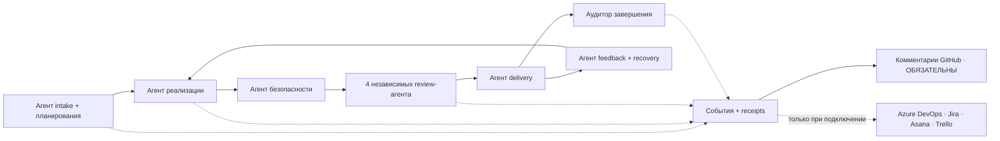
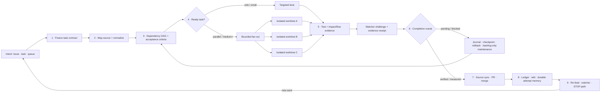

# 🔁 simplicio-loop — The Universal Looping AI Orchestrator

> **Canonical operational contract:** This translation is informational. For current dependency, runtime, conformance, and validation behavior, [README.md](../README.md) is authoritative: Loop installs standalone; Runtime bindings are optional; 3 runtimes are guaranteed and 12 are best-effort; and `scripts/check.py` requires an importable `pytest` with no bare-Python fallback. Historical numeric counts and claims of complete categorization below are release snapshots, not current gate evidence; the checkout and latest local receipt are authoritative, and `scripts/test_categories.py` reports uncategorized files. GitHub Actions is not required gate evidence.

<p align="center">
  
</p>

<p align="center">
  <a href="https://github.com/wesleysimplicio/simplicio-loop/stargazers"></a>
  <a href="#-7-навыков-и-5-ускорителей"></a>
  <a href="#-адаптеры-источников"></a>
  <a href="#-15-сред-выполнения-один-протокол"></a>
  <a href="#-44-точки-расширения"></a>
  <a href="#-экономия-токенов"></a>
  <a href="../LICENSE"></a>
</p>

<p align="center">
  <a href="#-tldr">TL;DR</a> ·
  <a href="#-7-навыков-и-5-ускорителей">7 навыков</a> ·
  <a href="#-адаптеры-источников">Адаптеры источников</a> ·
  <a href="#-15-сред-выполнения-один-протокол">15 сред выполнения</a> ·
  <a href="#-цикл">Цикл</a> ·
  <a href="#-экономия-токенов">Экономия токенов</a> ·
  <a href="#-экономия-токенов">Движок захвата</a> ·
  <a href="#-установка-и-использование">Установка</a>
</p>

<p align="center">
  <strong>🌍 Languages:</strong><br>
  <a href="../README.md">🇬🇧 English</a> |
  <a href="README.pt-BR.md">🇧🇷 Português</a> |
  <a href="README.es-ES.md">🇪🇸 Español</a> |
  <a href="README.fr-FR.md">🇫🇷 Français</a> |
  <a href="README.de-DE.md">🇩🇪 Deutsch</a> |
  <a href="README.it-IT.md">🇮🇹 Italiano</a> |
  <a href="README.ja-JP.md">🇯🇵 日本語</a> |
  <a href="README.ko-KR.md">🇰🇷 한국어</a> |
  <a href="README.zh-CN.md">🇨🇳 简体中文</a> |
  <a href="README.ru-RU.md">🇷🇺 Русский</a> |
  <a href="README.pl-PL.md">🇵🇱 Polski</a> |
  <a href="README.tr-TR.md">🇹🇷 Türkçe</a> |
  <a href="README.nl-NL.md">🇳🇱 Nederlands</a> |
  <a href="README.hi-IN.md">🇮🇳 हिन्दी</a> |
  <a href="README.ar-SA.md">🇸🇦 العربية</a>
</p>

---

<!-- visual-story:start -->
## 🚀 Новое поколение — операционная система для проверяемой работы агентов

**simplicio-loop давно вышел за рамки промпта, повторяемого до завершения.** Теперь он превращает намерение в зафиксированный контракт задачи, строит карту репозитория, планирует по зависимостям, распределяет выполнение по изолированным worktree, собирает структурированные подтверждения, независимо проверяет результат, безопасно откатывается, помнит каждую попытку и синхронизирует источник истины до самой поставки.

- **Сначала контракт** — критерии приёмки, зависимости, риски, состояние источника и оракул завершения явно задаются до выполнения.
- **Параллельно без повреждений** — готовые задачи выполняются в изолированных lane/worktree и сходятся через операционный ledger.
- **Сначала доказательство** — тесты, проверки impact/flow, challenge от watcher, delivery receipt и HBP evidence отклоняют ложные состояния done.
- **Память, меняющая поведение** — journal, stall detector, checkpoint и cross-agent wiki предотвращают зацикливание и делают handoff долговечным.

<p align="center">
  
</p>

<p align="center"><em>Fan-out с учётом зависимостей: изолированные worker работают параллельно, возвращают доказательства и сходятся в одну проверенную поставку.</em></p>

<p align="center">
  
</p>

<p align="center"><em>Каждый этап явный, ограниченный, наблюдаемый и обратимый.</em></p>

<p align="center">
  
</p>

<p align="center"><em>Доказательства и память встроены в выполнение, а не добавляются отчётом после него.</em></p>

Эта архитектура превращает цель в управляемую систему поставки: от одной сложной задачи до всего backlog, между session и runtime, с local-first operator и receipt, доступными для аудита человеком, CI или другим агентом.

<p align="center">
  
</p>
<!-- visual-story:end -->

<!-- stage-agents-roadmap:start -->
## 🤖 Дорожная карта — конкретный агент за каждым этапом

> **Статус:** планируемая архитектура из [#422](https://github.com/wesleysimplicio/simplicio-loop/issues/422)–[#436](https://github.com/wesleysimplicio/simplicio-loop/issues/436). Канонический lifecycle-комментарий GitHub уже существует; полный gate агентов этапов и обязательного reporting реализуется в [#433](https://github.com/wesleysimplicio/simplicio-loop/issues/433).

Intake/планирование, реализация, безопасность, delivery, recovery и финальный аудит получат по ответственному агенту. Review разветвляется на четыре независимых агента — безопасность/корректность, качество, воспроизведение runtime/E2E и blast radius — и только затем сходится.

<p align="center"></p>



**Политика:** для run, связанных с GitHub, комментарии GitHub обязательны, а `COMPLETE` ждёт удалённого подтверждения. Azure DevOps, Jira, Asana и Trello получают комментарии только после подтверждения подключения, аутентификации, прав и цели; `NOT_CONNECTED` — явный неблокирующий skip. Контракт и тесты: [#436](https://github.com/wesleysimplicio/simplicio-loop/issues/436).
<!-- stage-agents-roadmap:end -->

## 🆕 Что нового в v3.38.0 — релиз координации нескольких агентов

Этот релиз решает одну проблему, которая возникает только когда **несколько сессий агентов
работают над одним репозиторием одновременно**: как сессии узнать, что уже занято, что уже слито,
но не доделано, и чем занять простой вместо дублирования работы соседней сессии? Всё ниже
проверено на **живом, многосессионном состоянии этого самого репозитория**, а не на синтетике.

- **`scripts/coordinator.py` — ядро принятия решений.** По текущему состоянию GitHub (claim-
  комментарии в открытых issue + слитые PR) выдаёт одно детерминированное действие на issue: `OWN`
  (ничего не занято), `CONTINUE_OWN` (вы уже последний claimant), `DEFER_ACTIVE_CLAIM` (issue
  недавно занят другой сессией — не дублировать), `RECLAIM_STALE` (тот claim остыл, можно забирать)
  или `VERIFY_PARTIAL` (PR по этому issue уже слит, но issue всё ещё открыт — сначала проверить,
  что реально сделано). Также поднимает флаг `duplicate_risk`, если два сеанса claim'ят один issue
  почти одновременно. Пойман живьём в первый же день: две сессии независимо строили сборщик
  находок под одну и ту же задачу, но под разными именами файлов.
- **`scripts/pr_dod_review.py` — ревьюер для простоя.** Когда все открытые issue уже заняты,
  самый ценный ход сессии — не ждать, а проверить открытые PR по собственной планке репозитория:
  7-мерное Definition of Done (реализация, unit/integration/system/regression тесты, бенчмарк
  производительности, покрытие ≥85%) и замороженный чеклист критериев приёмки из issue. `check
  --post` публикует механический, построчный вердикт как комментарий к PR вместо одобрения
  «на глазок». Проверено на реальном, уже слитом PR «MVP slice»: корректно пометил **17 из 17**
  критериев приёмки родительского эпика как всё ещё нерешённые.
- **`scripts/finding_collector.py` — устойчивая, дедуплицированная память о дефектах** (issue
  #466, фаза 1). Одна запись `simplicio.finding/v1` на отдельный дефект, с отпечатком, чтобы одна
  и та же ошибка — увиденная любым агентом, в любом прогоне, в любое время — схлопывалась в одну
  запись со счётчиком повторений вместо дублирующего шума. Пока без вызовов GitHub — это следующая
  фаза. `scripts/evolution.py` и `scripts/workflow_topology.py` вышли как первые MVP-срезы
  сопутствующих эпиков Continuous Evolution (#467) и Adaptive Architecture (#468);
  `scripts/agent_replication.py` сделал то же для Elastic Replication (#469).
- **`references/multi-agent-coordination.md` + `references/background-verification.md`** — два
  новых соглашения, встроенных прямо в шаг triage `SKILL.md`: проверять владение через coordinator
  перед тем как трогать issue, ревьюить PR вместо простоя, когда всё занято, и запускать медленные
  проверки (тесты/`claims_audit.py`) в фоне, чтобы ход продолжал двигаться, а не смотрел на прогресс-бар.
- **Обязательная очистка после merge** (`scripts/worktree_cleanup.py`, #484) — worktree и ветка
  слитого PR теперь автоматически удаляются вместо накопления между сессиями.
- **Дополнения CLI-контракта (WI-471)** — подкоманда `preflight` и флаг `--json` у `status`, чтобы
  внешний supervisor мог механически проверить готовность перед запуском.
- **Две реальные регрессии, пойманные и исправленные прямо в `main`** в этом цикле — PR, тихо
  удаливший определение функции (сломав собственный selftest `loop_progress.py`), был слит один
  раз, а гонка при squash-merge затем повторно внесла тот же сломанный код в `main` второй раз. Обе
  найдены реальным запуском затронутого скрипта, а не доверием к зелёному описанию PR — именно
  ради этого и существуют `coordinator.py` и `pr_dod_review.py`.
- **Продолжение эпика Portable Stage Agents из v3.37.0** (#422–#436) — конкретный, независимо
  проверяемый агент за каждым этапом, набор conformance-тестов, доказывающий паритет контракта/
  receipt на всех 15 средах выполнения и необязательными нативными привязками `simplicio-runtime`
  с явным деградированным режимом при недоступности.
- **Инвентарь тестов измеряется, а не фиксируется.** Текущий checkout и последний локальный receipt
  gate являются источником истины для чисел; `scripts/test_categories.py` сообщает и о некатегоризированных файлах.

**Что это значит для вас на практике:** если вы запускаете `simplicio-loop` в нескольких сессиях
или на нескольких машинах против одного репозитория, теперь он активно защищает от двух реальных
провалов — двух агентов, тихо переделывающих одну и ту же работу, и «готового» PR, который слился,
но решил issue лишь частично. Раньше оба были невидимы; теперь оба видны механически, на каждом
triage-проходе. Полный список: [`CHANGELOG.md`](../CHANGELOG.md) и
[релиз v3.38.0](https://github.com/wesleysimplicio/simplicio-loop/releases/tag/v3.38.0).

## ⚡ TL;DR

**simplicio-loop** — это не зависящий от среды выполнения **супер-плагин**: один автономный
циклический оркестратор (вызывается как **`/simplicio-loop`**) плюс **пять навыков-сателлитов**, —
который превращает любую сильную LLM (Claude, Codex, Copilot, Gemini, Cursor, локальные модели) в
самоуправляемого воркера. Вы указываете ему на объём работы — *«закрой все открытые issue»*,
*«разгреби очередь CI»*, *«опустоши доску Jira»* — и он самостоятельно прогоняет весь жизненный цикл:

> **обнаружить → понять → решить → действовать → проверить → исправить → зафиксировать → повторить**

Он обнаруживает работу из любого источника (GitHub Issues, Jira, Azure DevOps, сессии agentsview и
другие), устраняет дубликаты, автоматически масштабирует флот агентов под вашу машину, реализует
каждый пункт через цикл качества, который **запускает код (а не просто компилирует его)**, открывает
PR, разрешает замечания CI/ревью, выполняет слияние и продолжает следить за новой работой **24/7** —
всё это за предохранительными воротами и жёстким аварийным выключателем расходов.

```text
/simplicio-loop finish all open issues
→ identity + pre-flight (auth, runtime, STOP path)
→ discover 50 issues · dedup · build dependency DAG
→ autoscale fleet = 14 · pipeline implement→review→merge
→ each item: read body+ACs → orient code → plan → edit → run → verify → PR
→ merge · close with evidence · rollback if main breaks
→ keep looping every ~2 min until the queue is dry (evidence-gated, never a false "done")
```

Три вещи делают его особенным: это **супер-плагин из сфокусированных навыков**, он прогоняет
**один и тот же протокол на 15 средах выполнения**, и делает всё это с **агрессивной, честной
экономией токенов**.

Навык устанавливается и **отдельно**: `simplicio-runtime` или другой обязательный нативный
компонент не нужен только для того, чтобы пользоваться `simplicio-loop`. Нативные привязки,
операторы, сервисы захвата и весь остальной стек Simplicio — опциональные ускорители поверх
базового набора навыков.

---

## 📘 Официальный реестр возможностей

Полный официальный перечень того, что поставляет `simplicio-loop` — каждая возможность ниже
**реальна, запускаема и протестирована** применимым локальным gate. Точные числа собранных,
запущенных и пропущенных тестов принадлежат последнему receipt gate, а не этому документу.
Каждая ведёт к своему подробному разделу и своему воркеру.

| Возможность | Что делает | Доказательство / воркер | Подробности |
|---|---|---|---|
| 🎬 **Видеодоказательство** (`video_evidence`) | Записывает **реальную сессию браузера** как движущееся доказательство того, что UI-изменение работает (Playwright, по умолчанию); рендерит **детерминированный MP4 с подписями** через [hyperframes](https://github.com/heygen-com/hyperframes) по явному запросу на пояснительное видео (`/simplicio-loop make a video of screen X`) | `scripts/video_evidence.py` · BLOCKED (никогда не фейковый pass) без нужного тулчейна | [§ Видеодоказательство](#-видеодоказательство--playwright-по-умолчанию-hyperframes-по-запросу) |
| 🧠 **Память о попытках + детектор застревания** | Устойчивый run-journal (`.orchestrator/loop/journal.jsonl`) + детектор застревания, чтобы цикл **менял стратегию вместо колебаний**; инкрементальная сортировка (`since`) читает только дельту каждый ход | `scripts/loop_journal.py` · `selftest` 13/13 | [§ Анти-колебание](#-память-о-попытках--детектор-застревания-анти-колебание) |
| 🔒 **Отказоустойчивые ворота действий** (`action_gate`) | Хук `PreToolUse`/git-pre-push, который **механически блокирует** force-push, переписывание истории, массовое удаление, разрушительный DDL, демонтаж инфраструктуры и коммиты/пуши с секретами — Шаг 5 сделан исполняемым, а не прозой | `hooks/action_gate.py` · `selftest` 15/15 | [§ Безопасность](#-безопасность-не-подлежит-обсуждению) |
| 🔬 **Локальная верификация** | Набор тестов (selftest'ы воркеров + **e2e драйвера цикла**, доказывающий выход с воротами по доказательствам) + **claims-audit** (упомянутые скрипты существуют · счётчики согласованы · `_bundle ≡ source`) — всё локально, **без платного CI** | `scripts/check.py` · `scripts/claims_audit.py` · `tests/` | [§ Тесты и локальные проверки](#-тесты-и-локальные-проверки-без-платного-ci) |
| ✅ **Честная экономия** | Строка экономии теперь **с воротами по доказательствам, а не обязательна** — число показывается только при измеренной квитанции (clamp/signatures/cache/`deterministic_edit`/ledger); никогда не выдумывается | контракт экономии токенов | [§ Экономия токенов](#-экономия-токенов) |
| 🤝 **Координатор нескольких агентов** (`coordinator.py`) | Решает `OWN` / `CONTINUE_OWN` / `DEFER_ACTIVE_CLAIM` / `RECLAIM_STALE` / `VERIFY_PARTIAL` для каждого issue по живым claim-комментариям + слитым PR, чтобы две сессии никогда не дублировали одну работу | `scripts/coordinator.py` · `selftest` 10/10 | [§ Что нового в v3.38.0](#-что-нового-в-v3380--релиз-координации-нескольких-агентов) |
| 🕵️ **Ревьюер PR по DoD/критериям приёмки** (`pr_dod_review`) | Когда все issue заняты, проверяет открытые PR по 7-мерному Definition of Done + собственному чеклисту критериев приёмки issue — механический вердикт, а не одобрение на глазок | `scripts/pr_dod_review.py` · `selftest` 13/13 | [§ Что нового в v3.38.0](#-что-нового-в-v3380--релиз-координации-нескольких-агентов) |
| 🐞 **Сборщик находок** (`finding_collector`) | Дедуплицированная, снабжённая отпечатком память о дефектах — одна и та же ошибка схлопывается в одну запись со счётчиком повторений, сколько бы агентов/прогонов её ни увидели | `scripts/finding_collector.py` · `selftest` 9/9 | [§ Что нового в v3.38.0](#-что-нового-в-v3380--релиз-координации-нескольких-агентов) |

Два **режима** цикла делают завершение явным: **converge** (одна жёсткая задача — завершается на
подтверждённом доказательствами `<promise>` или эскалации застревания) против **drain** (очередь —
завершается, когда повторный запрос к источнику остаётся пустым K раундов). Оба по-прежнему
Both modes are still governed by universal exits: promise+evidence, `max_iterations`, and STOP.

> Оценка цикла по этой линии работы: **7.5** (сильный дизайн, недоказанный) → **9** (память о
> попытках + анти-колебание) → **9.5** (воспроизводимое локальное доказательство) → **~10**
> (принудительная безопасность + полная семантика цикла). Инфраструктура верификации теперь ловит
> собственные регрессии проекта по мере его роста.

---

## 🧠 7 навыков и 5 ускорителей

Ядро оркестратора + шесть сателлитов + пять ускорителей/интеграций. Каждый сателлит **опционален** —
когда он загружен, оркестратор делегирует ему (богаче + дешевле); когда отсутствует — встроенный
протокол покрывает 100%. Ускорители **обнаруживаются автоматически** — присутствует = используется,
отсутствует = LLM-фолбэк.

| # | Возможность | Вбирает | Что он делает | Влияние на токены |
|---|---|---|---|---|
| 1 | 🔁 **simplicio-loop** | — | Единая публичная точка входа: ядро оркестратора + закалённый цикл за одной командой | Core + loop |
| 2 | ↩️ **simplicio-tasks** | legacy alias | Слой совместимости для старых установок и сохранённых промптов | Legacy alias |
| 3 | 🧱 **simplicio-orient** | [rtk](https://github.com/rtk-ai/rtk) + [caveman](https://github.com/JuliusBrussee/caveman) | Выполнение в первую очередь в терминале, каталог сокращения вывода, tee-кэш, чтение сигнатур | L0 детерминированный |
| 4 | 🔥 **simplicio-review** | [thermos](https://github.com/cursor/plugins/tree/main/thermos) | Параллельное состязательное ревью по разным рубрикам → дедуплицированный вердикт | Ворота качества |
| 5 | 🗜️ **simplicio-compress** | [caveman](https://github.com/JuliusBrussee/caveman) | Сжатие вывода + памяти, отказоустойчивый `transform_guard` | 40-60% меньше |
| 6 | 🎓 **simplicio-learn** | [teaching](https://github.com/cursor/plugins/tree/main/teaching) | Ретроспектива после прогона → устойчивые, дедуплицированные уроки в памяти | Умнее с каждым прогоном |
| 7 | 🧪 **simplicio-autoresearch** | Karpathy [autoresearch](https://github.com/balukosuri/Andrej-Karpathy-s-Autoresearch-As-a-Universal-Skill) + ECC `autoresearch-agent` | Эволюционный цикл mutate/eval/keep-revert: ограничения yool, git-изолированная ветка, анти-Goodhart оценка, receipt `savings-event` | Авто-оптимизация |
| 8 | 🧭 **Understand Anything** | [Egonex-AI](https://github.com/Egonex-AI/Understand-Anything) | Ориентация по графу знаний: семантический поиск, направляемые туры, граф зависимостей | **L0 ноль токенов** |
| 9 | 📊 **agentsview** | [kenn-io](https://github.com/kenn-io/agentsview) | Аналитика сессий, отслеживание расходов, обнаружение зависших сессий | **L1** только SQL |
| 10 | ⚡ **LMCache** | [LMCache](https://github.com/LMCache/LMCache) | KV-кэш между ходами цикла — снижение TTFT на 40-70% на локальных моделях | Время GPU ↓ |
| 11 | 🗜️ **Движок захвата Simplicio** | `engine/simplicio_engine.py` (нативный, только stdlib) | Прозрачный прокси захвата: перенаправляет реальному провайдеру, измеряет + детерминированно сжимает, пишет `proxy_savings.json` | **детерминированный** |
| 12 | 🎬 **video_evidence** | Playwright (по умолчанию) · [hyperframes](https://github.com/heygen-com/hyperframes) (по запросу) | Записывает **реальную сессию** как движущееся доказательство UI-изменения (Playwright); рендерит **детерминированный MP4 с подписями** через hyperframes, когда видео ЯВЛЯЕТСЯ результатом поставки | Производитель доказательств |

Каждый навык живёт в [`.claude/skills/`](../.claude/skills); у каждого ускорителя есть справочный
документ в `.claude/skills/simplicio-loop/references/` (производитель видео:
[`video-evidence.md`](../.claude/skills/simplicio-loop/references/video-evidence.md), воркер
[`scripts/video_evidence.py`](../scripts/video_evidence.py)).

---

## 📡 Адаптеры источников

Оркестратор обнаруживает работу из любого источника через подключаемые адаптеры. Каждый
предоставляет шесть глаголов: `list_ready`, `get_details`, `claim`, `update_status`,
`attach_evidence`, `close`.

| Источник | Адаптер | Назначение |
|---|---|---|
| GitHub Issues/PRs | `gh` CLI (нативно) | Основной источник рабочих элементов; канонические lifecycle-комментарии уже сегодня |
| Azure DevOps | `az boards` / коннектор хоста | Обнаружение через Azure Boards; комментарии этапов только после реальной проверки подключения |
| Jira | коннектор хоста | Обнаружение через Jira; комментарии этапов только при подключении |
| Asana | коннектор хоста | Обнаружение через Asana; комментарии этапов только при подключении |
| Trello | коннектор хоста | Обнаружение через Trello; комментарии этапов только при подключении |
| ClickUp / Linear / Notion | коннектор хоста | Обнаружение досок/проектов; без claim-комментария без сертифицированного адаптера |
| **сессии agentsview** | `scripts/agentsview_adapter.py` | Восстановление зависших сессий + наблюдаемость расходов |
| Локальные файлы / очередь CI | файловая система / CI API | Внутреннее отслеживание работы |

См. справочный документ каждого адаптера в `.claude/skills/simplicio-loop/references/`.

---

## 🌐 15 сред выполнения, один протокол — 3 гарантированные + 12 best-effort

Одно универсальное ядро навыка + один набор хуков управляют каждой средой выполнения. Адаптер
тонок: он сообщает среде *где загрузить навыки*, *как взвести цикл* и *как привязать нативную
скорость*. **Навык не называет ни одну среду выполнения; среда выполнения обнаруживает навык.**
Нативная привязка `simplicio-runtime` (MCP) необязательна на каждой среде: при отсутствии или
недоступности адаптер сообщает явный деградированный режим, а standalone-цикл остаётся доступным.
См. [`docs/MCP_SETUP.md`](../docs/MCP_SETUP.md).

### Уровень 1 — гарантированные (проверяются на каждом коммите)

| Среда выполнения | Загрузка навыка | Привод цикла | Нативная привязка (MCP) |
|---|---|---|---|
| **Claude Code** | `.claude/skills/` + plugin | хук `Stop` | ОБЯЗАТЕЛЬНА — `~/.claude.json` |
| **Codex** | `AGENTS.md` | самостоятельный темп | ОБЯЗАТЕЛЬНА — `~/.codex/config.toml` |
| **Cursor** | `.cursor-plugin/` | `stop`+`afterAgentResponse` | ОБЯЗАТЕЛЬНА — `.cursor/mcp.json` |

### Уровень 2 — best-effort (вклад приветствуется, без gate)

| Среда выполнения | Загрузка навыка | Привод цикла | Нативная привязка (MCP) |
|---|---|---|---|
| **VS Code (Copilot)** | `copilot-instructions.md` | tasks | ОБЯЗАТЕЛЬНА — `.vscode/mcp.json` |
| **Antigravity** | rules / `AGENTS.md` | самостоятельный темп | ОБЯЗАТЕЛЬНА — best-effort |
| **Kiro** | `.kiro/steering/` | specs | ОБЯЗАТЕЛЬНА — `.kiro/settings/mcp.json` |
| **OpenCode** | `AGENTS.md` | самостоятельный темп | ОБЯЗАТЕЛЬНА — `opencode.json` |
| **Gemini** (CLI/Code Assist) | `GEMINI.md` | самостоятельный темп | ОБЯЗАТЕЛЬНА — `.gemini/settings.json` (CLI) |
| **Kimi** | вшитые соглашения | самостоятельный темп | ОБЯЗАТЕЛЬНА — best-effort, нет проверенного клиента |
| **Qwen** (Code/CLI) | эквивалент `AGENTS.md` | самостоятельный темп | ОБЯЗАТЕЛЬНА — `.qwen/settings.json` (best-effort) |
| **DeepSeek** | вшитые соглашения | самостоятельный темп | ОБЯЗАТЕЛЬНА — нет первичного клиента, best-effort |
| **Aider** | `CONVENTIONS.md` | самостоятельный темп | ОБЯЗАТЕЛЬНА — нет MCP-клиента (LLM-фолбэк для выполнения) |
| **Simplicio Agent** *(ранее Hermes)* | нативная память | нативный цикл | ОБЯЗАТЕЛЬНА — **нативная** |
| **OpenClaw** | plugin SDK | нативный планировщик | ОБЯЗАТЕЛЬНА — **нативная** |
| **Orca** | через внутреннего агента + реестр навыков | внутренний хук / плановые автоматизации | ОБЯЗАТЕЛЬНА — конфиг реестра/внутреннего агента |

Обещание: **один и тот же протокол, те же ворота, та же безопасность на всех 15 — Уровень 1
проверяется механически, Уровень 2 — best-effort.** `orient_clamp.py` (экономия токенов) работает
на каждой среде выполнения без какой-либо настройки. См. [`adapters/MATRIX.md`](../adapters/MATRIX.md).

---

## 🗺️ Полный поток — от спроса до поставки

Каждый слой, на котором действует оркестратор, по порядку — от чтения спроса (issue, задачи,
назначения) до поставки слитой, подкреплённой доказательствами работы, а затем цикл 24/7 в
поисках новой.



**Координация нескольких агентов (новое в v3.38.0).** Прежде чем взять issue, `scripts/coordinator.py`
механически решает, не занят ли он уже соседней сессией, на основе живого состояния GitHub, а не
догадки. Когда все кандидаты в issue возвращаются как «занято», цикл не простаивает — вместо этого
он ревьюит открытые PR по DoD + критериям приёмки (`scripts/pr_dod_review.py`). Подробности:
[`references/multi-agent-coordination.md`](../.claude/skills/simplicio-loop/references/multi-agent-coordination.md).

---

## 🔁 Цикл

**Цикл с воротами по доказательствам** — это центральный механизм. Он повторно подаёт ту же цель
каждый ход, так что агент видит собственную прежнюю работу. Выход возможен ТОЛЬКО через:

1. **`<promise>` с воротами по доказательствам** — ход, испускающий обещание, ОБЯЗАН также нести
   конкретное доказательство (пройденный тест, слитый PR, повторный запрос закрытого элемента).
   Обещание без доказательств = игнорируется.
2. **Лимит `max_iterations`** — жёсткая предохранительная заглушка
3. **STOP/cancel path** — explicit STOP file or channel command stops unattended runs
4. **Сигнал STOP** — `.orchestrator/STOP` или команда канала

Между ходами LMCache (когда доступен) кэширует KV-состояние, так что повторная подача стоит
почти нулевого prefill.

### 🧠 Память о попытках + детектор застревания (анти-колебание)

Цикл повторной подачи, который ничего не помнит, колеблется — попробовать X, провалиться,
снова попробовать X — пока не сгорит лимит. simplicio-loop ведёт **устойчивый run-journal**
(`.orchestrator/loop/journal.jsonl`, только дозапись:
`iteration · action · hypothesis · gate · error-fingerprint`) и **детектор застревания**
([`scripts/loop_journal.py`](../scripts/loop_journal.py), детерминированный + без модели):

- **Отпечаток ошибки** — вывод упавших ворот сводится к стабильному хешу с нормализованными
  номерами строк, путями, hex/uuid, временными метками и длительностями, так что *одна и та же*
  ошибка распознаётся между ходами, даже когда побочный текст различается.
- **Застревание = K провалов подряд с одинаковым отпечатком** (по умолчанию K=3). Меняющийся
  отпечаток означает, что цикл движется (PROGRESS); один и тот же K раз означает, что он крутится
  вхолостую (STALLED).
- При STALLED цикл **не** повторно подаёт ту же цель — он называет **тупиковые действия**, которых
  следует избегать, затем **меняет стратегию** или **эскалирует к человеческим воротам** с отпечатком.
- `loop_journal.py resume` читается в начале каждого хода, так что свежий процесс продолжает работу
  без переоткрытия прежних попыток (настоящее возобновление) и никогда не повторяет известный тупик.

```bash
loop_journal.py resume                       # what was tried + dead-ends to avoid
loop_journal.py record --iteration N --action "…" --gate fail --gate-output test.log
loop_journal.py stall --k 3 --exit-code      # PROGRESS → re-feed · STALLED → switch/escalate
```

---

## 🎬 Видеодоказательство — Playwright по умолчанию, hyperframes по запросу

Цикл производит **демонстрационные видео** как доказательство того, что изменение работает — **два
движка**, одна точка расширения `video_evidence` (воркер
[`scripts/video_evidence.py`](../scripts/video_evidence.py), контракт
[`references/video-evidence.md`](../.claude/skills/simplicio-loop/references/video-evidence.md)):

1. **По умолчанию — обычный поток доказательств использует Playwright.** После UI-изменения
   `video_evidence` записывает **реальную сессию браузера**, управляющую экраном (нативное видео
   Playwright → `.webm`, → `.mp4` через FFmpeg) — сильнейшая квитанция «работает, а не просто
   компилируется» (Шаг 4b) и валидный подтверждённый доказательствами `<promise>`.

   ```bash
   python3 scripts/video_evidence.py verify --url http://localhost:3000/login \
       --name login-demo --expect "Sign in" --issue 42 [--upload --pr 42]
   ```

2. **По запросу — персональное пояснительное видео использует hyperframes.** Когда результатом
   поставки ЯВЛЯЕТСЯ видео («make an explainer video of screen X»), оркестратор рендерит
   **детерминированное слайд-шоу с подписями** из скриншотов `web_verify` с помощью
   [**hyperframes**](https://github.com/heygen-com/hyperframes) (от HeyGen — «тот же ввод, те же
   кадры, тот же вывод», CI-воспроизводимо, без API-ключей, локальный рендеринг через headless
   Chrome + FFmpeg).

   ```text
   /simplicio-loop make an explainer video of the system login screen
   → detect: video-creation request → web_verify captures the screens
   → video_evidence verify --engine hyperframes → deterministic MP4 → attached to the PR
   ```

Любой движок: видео, которое так и не записалось/отрендерилось, даёт **BLOCKED**, никогда фейковый
pass. Доказательство всегда — это **путь к файлу + булев вердикт** — никогда байты видео в контексте
(экономия токенов).

---

## 📊 Экономия токенов

| Техника | Экономия |
|---|---|
| `deterministic_edit` (L0) | 100% токенов правки (файл пишется механически, никогда не LLM) |
| Выполнение в первую очередь в терминале | Факты из shell, а не галлюцинация LLM |
| Каталог сокращения вывода | Лимиты по типу команды (`CAP_ERRORS=20`, `CAP_WARNINGS=10`, `CAP_LIST=20`) — `orient_clamp.py` |
| Кэш Tee+CCR при сбое | Никогда не перезапускай упавшую команду — читай кэшированный вывод |
| Чтение только сигнатур | `simplicio-cli signatures <file>` — файл в 870 строк → 65 строк (**93% экономии**), тела опущены |
| `simplicio-compress` | Лаконичная проза + одноразовая компактизация памяти |
| `orient_clamp.py` | Ограничение + tee на каждой shell-команде, без настройки |
| Нативный кэш ответов | повторный детерминированный (temp=0) запрос → выдаётся из кэша, минуя вызов LLM (**100% при попадании**) — `simplicio-cli cache`, включён по умолчанию (`SIMPLICIO_CACHE=0` для отключения) |
| Прокси захвата Simplicio + MCP | 60-95% меньше токенов на выводах инструментов через прозрачный демон сжатия |

Экономия засчитывается только при проверенно-корректном результате. Базовый уровень = самый дешёвый
разумный неоркестрированный путь к тому же результату. **Отчёт об экономии — с воротами по
доказательствам, а не обязателен:** цифра экономии показывается только тогда, когда ход
действительно запустил команду, производящую экономию, и число прослеживается до измеренной
квитанции (clamp tee, чтение сигнатур, попадание в кэш, `deterministic_edit`, `savings_ledger`).
Нет измеренной экономии → нет строки экономии; оркестратор никогда не выдумывает базовый уровень
или процент. См. `references/token-economy.md`.

### 🔎 Запуск `simplicio-loop`: экономия против измерения (по средам выполнения)

При вызове **`simplicio-loop`** происходят две разные вещи, и они ведут себя по-разному в зависимости от среды:

- **Экономия** — сжатие, ограничения вывода, чтение только сигнатур, `deterministic_edit` — применяется
  **каждый раз, когда навык запускается и загружает `simplicio-orient` / `simplicio-compress`, на любой среде.**
  Это поведение навыка плюс хуки (сильнее всего там, где хуки есть: `orient_clamp.py` авто-ограничивает на
  Claude и Cursor; в остальных местах это управляется инструкциями).
- **Измерение** — живые числа Token Monitor — учитывает только трафик, который течёт **через прокси захвата.**

| Среда выполнения | Экономия (навык) | Измерение (монитор) |
|---|---|---|
| **Simplicio Agent** | ✓ | ✓ **автоматически** — уже маршрутизировано через прокси (`base_url → :8788`) |
| **Claude** | ✓ (навык + хуки) | ✗ по умолчанию — Claude обращается к `api.anthropic.com` напрямую; измеряется только после маршрутизации (`simplicio-cli wrap claude`, или `ANTHROPIC_BASE_URL → http://127.0.0.1:8788`) |
| **Codex** | ✓ (навык) | ✗ по умолчанию — `simplicio-cli init codex` добавляет MCP-инструменты, но не маршрутизирует LLM-трафик; измеряется с `simplicio-cli wrap codex` или OpenAI base-url, указывающим на прокси |

Итак: **экономия происходит на каждой среде выполнения**; **монитор подсчитывает её автоматически на Simplicio Agent**,
а на Claude/Codex — после **одноразового шага маршрутизации** (`simplicio-cli wrap …` / base-url → `:8788`). Без
маршрутизации экономия всё равно применяется — монитор просто не подсчитает эти токены.
`scripts/simplicio-economy.sh wire` выполняет эту маршрутизацию для OpenAI-совместимых клиентов при установке.

### 📈 Simplicio Token Monitor

Живой, всегда включённый обзор экономии:

- **Веб-панель** — `http://127.0.0.1:9090` — график токенов в реальном времени, индикатор экономии, LLM/среды
  выполнения и **141/144 провайдеров (98%)**, которые мы перехватываем, плюс живой лог прокси.
- **Виджет в строке меню / трее** — сэкономленные токены в реальном времени в системном трее (macOS rumps · Windows/Linux pystray).
- **Один модуль** — `scripts/simplicio-economy.sh {status|up|wire}` поднимает прокси захвата + монитор +
  трей + детерминированный оператор `simplicio-dev-cli` и отчитывается обо всём стеке.

Установка регистрирует все три как сервисы автозапуска (macOS launchd · Linux systemd · Windows Startup) через
`scripts/setup_simplicio.sh` или кросс-платформенный `python3 scripts/install_services.py install`. После
установки монитор + захват работают **без вызова цикла** — см. `references/token-capture.md`.

### 🛠️ Движок захвата — один нативный модуль, каждая команда

[`engine/simplicio_engine.py`](../engine/simplicio_engine.py) — это нативный движок захвата Simplicio
(только stdlib, отказоустойчивый, без внешних зависимостей). Запускайте любую
команду через обёртку [`scripts/simplicio-engine`](../scripts/simplicio-engine) (например, `simplicio-engine doctor`):

| Команда | Что она делает |
|---|---|
| `proxy` | прозрачный прокси захвата — направляет каждую модель её **реальному** провайдеру, сжимает + измеряет + кэширует (без подмены модели) |
| `doctor` | доступность прокси + экономия за всё время |
| `cache` | нативный кэш ответов (`stats`/`clear`) — повторный детерминированный запрос выдаётся из кэша, минуя вызов LLM |
| `signatures` | вид файла-исходника только по сигнатурам (тела опущены, ~93% меньше токенов на чтение кода) |
| `semantic` | обратимое экстрактивное (semantic-lite) сжатие |
| `detect` | определение типа контента + умная маршрутизация по блокам |
| `rag` | поиск TF-IDF (или `--ml` embedding) по хранилищу памяти CCR |
| `memory` | хранилище CCR compress-cache-retrieve (`remember`/`recall`/`forget`/`list`/`stats`) |
| `mcp` | нативный stdio MCP-сервер (инструменты compress / retrieve / stats) |
| `init` / `wrap` | регистрация Simplicio в клиенте (Claude / Codex / Copilot / OpenClaw) · запуск клиента с маршрутизацией захвата |
| `report` / `audit` / `capture` / `evals` | отчёт об экономии · аудит дерева на возможность сжатия · сухой прогон запроса · ворота регрессии сжатия |

---

## 🏛️ Принципы дизайна (подробно)

Четыре механизма несут на себе мощь оркестрации:

| Принцип | Фокус | Где живёт |
|---|---|---|
| **DAG + конвейер** | параллелизм по зависимостям, поэтапно на каждый пункт | `references/orchestration.md` (Шаг 3 пул + конвейер) |
| **Изоляция worktree** | параллельные правки без порчи дерева, через merge-ворота | `references/orchestration.md` |
| **Состязательная проверка** | панель скептиков перед «поставлено» | `references/quality-safety-delivery.md` · навык `simplicio-review` |
| **Bounded loop cap** | anti-infinite-loop, evidence-gated exit | `references/standing-loop-247.md` · skill `simplicio-loop` |

---

## 🚀 Установка и использование

**Быстрый путь: установка только навыков.** Если нужен только пакет навыков `simplicio-loop`,
этого достаточно — **нативная зависимость от рантайма не требуется**:

```bash
pip install simplicio-loop
simplicio-loop install            # текущий проект
simplicio-loop install --global   # для всех проектов пользователя
```

Это ставит только навыки + хуки. Если ваш рантайм умеет привязывать нативные хелперы, они —
**опциональное ускорение**, а не обязательное условие.

**Полный путь: установщик репозитория.** Используйте его, когда нужен весь локальный стек
Simplicio (операторы, прокси захвата, дашборды, сервисы, привязка рантайма):

```bash
git clone https://github.com/wesleysimplicio/simplicio-loop
cd simplicio-loop

# install for your runtime (omit <runtime> to auto-detect)
bash scripts/install.sh <runtime> [--global] [--minimal]        # macOS / Linux
pwsh scripts/install.ps1 <runtime> [-Global]                    # Windows
# <runtime> ∈ claude codex vscode cursor antigravity kiro opencode gemini aider simplicio_agent openclaw
#            (hermes всё ещё принимается как устаревший псевдоним simplicio_agent)
```

Установщик репозитория **по умолчанию ставит полный стек**: пакет `simplicio-cli` (даёт
`simplicio-dev-cli` и транзитивно `simplicio-mapper`), полный Python-стек, **7 навыков + хуки**
с подключённым `Stop`-хуком цикла, и **всегда включённый прокси захвата** с Claude + Codex +
Simplicio Agent, маршрутизированными в фоне. Передайте **`--minimal`** для headless/CI, чтобы
пропустить тяжёлые зависимости и системные сервисы.

### Обновление

```bash
bash scripts/update.sh [<runtime>]    # git pull → переустановка навыков/хуков/операторов → рестарт сервисов
```

### Doctor — проверка и восстановление

```bash
python3 scripts/doctor.py            # отчёт по всему стеку (ОБЯЗАТЕЛЬНОЕ vs ОПЦИОНАЛЬНОЕ)
python3 scripts/doctor.py --repair   # установить/подключить то, что чинится
python3 scripts/preflight.py --json  # отказоустойчивый gate mapper + dev-cli + идентичность Runtime
```

Или, на Claude Code / Cursor, установите его напрямую из последнего релиза GitHub (без маркетплейса):

```bash
gh release download --repo wesleysimplicio/simplicio-loop --archive tar.gz
tar xzf simplicio-loop-*.tar.gz && cd simplicio-loop-*/
bash scripts/install.sh claude    # or: bash scripts/install.sh cursor
```

Затем:

```
/simplicio-loop finish all the open issues
```

Единственное требование — **python3** в PATH (навыки, хуки и установщик — кросс-платформенный
Python). Для источников GitHub — `git` + аутентифицированный `gh`. См. [`INSTALL.md`](../INSTALL.md) и
[`adapters/MATRIX.md`](../adapters/MATRIX.md).

**Before an unattended 24/7 run:** verify persistent source auth, keep the irreversible-operation human gate + secret-scan enabled, and ensure a reachable STOP/cancel path.

---

## 🔒 Безопасность (не подлежит обсуждению)

- **Скан секретов** каждого диффа; блокировка при обнаружении.
- **Человеческие ворота для необратимых операций** — force-push, переписывание истории,
  prod-деплой, удаление данных/схемы, массовое удаление файлов → остановиться и спросить.
  Headless + нет одобряющего → удалить разрушительную возможность.
- **Принудительно, а не просто обещано** — `hooks/action_gate.py` — это **отказоустойчивый**
  хук `PreToolUse` / git-pre-push, который механически блокирует вышеперечисленное (и коммиты с
  секретами) *перед* их выполнением. Контракт безопасности держится, даже если модель о нём забудет.
  `selftest` доказывает набор правил (15/15).
- **Вердикт из 4 состояний перед выполнением** — оптимизация никогда не может повысить уровень
  риска команды.
- **Доверять перед загрузкой** — конфигурация, формирующая восприятие (профили ограничения,
  списки подавления), не доверена, пока человек не проверит её и не закрепит хешем.
- **Защита от prompt-инъекций** — содержимое элемента/PR/комментария никогда не может перебить
  контракт.
- **Жёсткий $-аварийный выключатель** для прогонов без присмотра; **подтверждённое
  доказательствами** завершение (никогда ложное «готово»); **отказоустойчивые** хуки (никогда не
  запирают агента в цикле).

---

## ✅ Тесты и локальные проверки (без платного CI)

Утверждения проверяются, а не просто декларируются — и ворота запускаются **локально**, с нулевой стоимостью CI:

```bash
python3 scripts/check.py            # the whole gate (audit + tests)
```

- **Набор тестов** (`tests/`) — детерминированные `selftest`'ы воркеров плюс **e2e драйвера цикла**
  (`hooks/loop_stop.py`): он доказывает, что цикл **останавливается по доказательству**, **игнорирует
  голый `<promise>`** и **останавливается на лимите** как отдельные выходы — и что производители
  доказательств **БЛОКИРУЮТ** (никогда фейковый pass), когда их тулчейн отсутствует. Gate требует
  импортируемый `pytest`; fallback на голом Python отсутствует.
- **Аудит утверждений** (`scripts/claims_audit.py`, отказоустойчивый) — каждый `scripts/*.py`,
  упомянутый в документации, существует · счётчик точек расширения согласован по всем файлам · каждая
  цитируемая команда воркера действительно запускается · поставляемые навыки `simplicio_loop/_bundle/`
  **побайтово идентичны** исходнику.
- **Подключите его как git pre-push хук**, чтобы держать `main` честным бесплатно:
  ```bash
  printf '#!/bin/sh\npython3 scripts/check.py\n' > .git/hooks/pre-push && chmod +x .git/hooks/pre-push
  ```

`pip install "simplicio-loop[dev]"` устанавливает обязательную зависимость `pytest` для `scripts/check.py`.

---

## ⭐ История звёзд

[](https://star-history.com/#wesleysimplicio/simplicio-loop&Date)

---

## 📄 Лицензия

MIT

<!-- simplicio-loop:github-comment-coordination:v1 -->
## 🌐 Координация между runtime через комментарии GitHub

`simplicio-loop` можно запускать одновременно в Claude Code, Codex, Cursor, Gemini и Hermes. Запуск, связанный с issue GitHub, идемпотентно публикует в каноническом комментарии claim, план, прогресс, доказательства, PR и закрытие. Агенты на разных компьютерах координируются в одном треде GitHub без общего локального хранилища.

```powershell
pwsh scripts/install.ps1 claude -Global
pwsh scripts/install.ps1 codex -Global
pwsh scripts/install.ps1 cursor -Global
pwsh scripts/install.ps1 gemini -Global
pwsh scripts/install.ps1 hermes -Global   # устаревший псевдоним simplicio_agent
```

Локальные очереди, leases, worktrees, heartbeats и доказательства остаются активными; комментарии GitHub — общая проекция координации. Поток работает только с GitHub: Jira, Azure DevOps и другие trackers комментарии не получают. При недоступном GitHub loop работает локально и записывает ошибку, не выдумывая удалённое подтверждение. Используйте один `source_issue` и доступ GitHub для каждого runtime.
