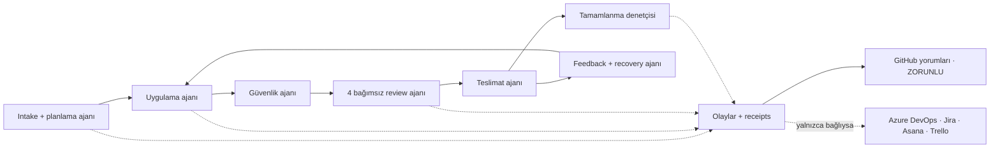
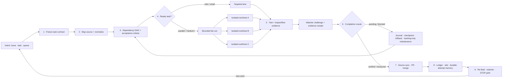

# 🔁 simplicio-loop — The Universal Looping AI Orchestrator

<p align="center">
  
</p>

<p align="center">
  <a href="https://github.com/wesleysimplicio/simplicio-loop/stargazers"></a>
  <a href="#-11-skill--hızlandırıcı"></a>
  <a href="#-kaynak-adaptörleri"></a>
  <a href="#-11-runtime-tek-protokol"></a>
  <a href="#-token-ekonomisi"></a>
  <a href="#-token-ekonomisi"></a>
  <a href="../LICENSE"></a>
</p>

<p align="center">
  <a href="#-tldr">TL;DR</a> ·
  <a href="#-11-skill--hızlandırıcı">11 Skill</a> ·
  <a href="#-kaynak-adaptörleri">Kaynak Adaptörleri</a> ·
  <a href="#-11-runtime-tek-protokol">11 Runtime</a> ·
  <a href="#-döngü">Döngü</a> ·
  <a href="#-token-ekonomisi">Token Ekonomisi</a> ·
  <a href="#-token-ekonomisi">Yakalama Motoru</a> ·
  <a href="#-kurulum--kullanım">Kurulum</a>
</p>

<p align="center">
  <strong>🌍 Languages:</strong><br>
  <a href="../README.md">🇬🇧 English</a> |
  <a href="README.pt-BR.md">🇧🇷 Português</a> |
  <a href="README.es-ES.md">🇪🇸 Español</a> |
  <a href="README.fr-FR.md">🇫🇷 Français</a> |
  <a href="README.de-DE.md">🇩🇪 Deutsch</a> |
  <a href="README.it-IT.md">🇮🇹 Italiano</a> |
  <a href="README.ja-JP.md">🇯🇵 日本語</a> |
  <a href="README.ko-KR.md">🇰🇷 한국어</a> |
  <a href="README.zh-CN.md">🇨🇳 简体中文</a> |
  <a href="README.ru-RU.md">🇷🇺 Русский</a> |
  <a href="README.pl-PL.md">🇵🇱 Polski</a> |
  <a href="README.tr-TR.md">🇹🇷 Türkçe</a> |
  <a href="README.nl-NL.md">🇳🇱 Nederlands</a> |
  <a href="README.hi-IN.md">🇮🇳 हिन्दी</a> |
  <a href="README.ar-SA.md">🇸🇦 العربية</a>
</p>

---

<!-- visual-story:start -->
## 🚀 Yeni nesil — doğrulanabilir ajan çalışmaları için bir işletim sistemi

**simplicio-loop, bitene kadar tekrarlanan bir prompt olmanın çok ötesine geçti.** Artık niyeti dondurulmuş bir görev sözleşmesine dönüştürüyor, depoyu haritalıyor, bağımlılıklara göre planlıyor, yürütmeyi yalıtılmış worktree’lere dağıtıyor, yapılandırılmış kanıtlar topluyor, bağımsız doğrulama ve güvenli rollback yapıyor, her denemeyi hatırlıyor ve teslimata kadar source of record ile eşitleniyor.

- **Önce sözleşme** — kabul kriterleri, bağımlılıklar, riskler, kaynak durumu ve tamamlanma oracle’ı yürütmeden önce açıktır.
- **Bozulmadan paralellik** — hazır görevler yalıtılmış lane/worktree’lerde çalışır ve operasyonel ledger üzerinden birleşir.
- **Tamamlanmadan önce kanıt** — testler, impact/flow kontrolleri, watcher challenge, delivery receipt ve HBP evidence sahte done durumlarını reddeder.
- **Davranışı değiştiren hafıza** — journal, stall detector, checkpoint ve cross-agent wiki salınımı önler, handoff’ları kalıcı kılar.

<p align="center">
  
</p>

<p align="center"><em>Bağımlılık duyarlı fan-out: yalıtılmış worker’lar paralel çalışır, kanıt döndürür ve tek bir doğrulanmış teslimatta birleşir.</em></p>

<p align="center">
  
</p>

<p align="center"><em>Her aşama açık, sınırlı, gözlemlenebilir ve geri alınabilirdir.</em></p>

<p align="center">
  
</p>

<p align="center"><em>Kanıt ve hafıza yürütme yolunun parçasıdır; sonradan yazılan bir rapor değildir.</em></p>

Bu mimari tek bir hedefi yönetilen teslimat sistemine dönüştürür: zor bir görevden tüm backlog’a, session ve runtime’lar arasında, local-first operator ve insan, CI ya da başka bir ajanın denetleyebileceği receipt’lerle.

<p align="center">
  
</p>
<!-- visual-story:end -->

<!-- stage-agents-roadmap:start -->
## 🤖 Yol haritası — her aşamanın arkasında somut bir ajan

> **Durum:** [#422](https://github.com/wesleysimplicio/simplicio-loop/issues/422)–[#436](https://github.com/wesleysimplicio/simplicio-loop/issues/436) içinde planlanan mimari. Kanonik GitHub lifecycle yorumu bugün mevcut; aşama ajanları ve zorunlu reporting için tam gate [#433](https://github.com/wesleysimplicio/simplicio-loop/issues/433) kapsamında uygulanıyor.

Intake/planlama, uygulama, güvenlik, teslimat, recovery ve son denetimin her birinde sorumlu bir ajan olacak. Review, birleşmeden önce dört bağımsız ajana ayrılır: güvenlik/doğruluk, kalite, runtime/E2E yeniden üretimi ve blast radius.

<p align="center"></p>



**Politika:** GitHub’a bağlı run’larda GitHub zorunludur ve `COMPLETE` uzak onayı bekler. Azure DevOps, Jira, Asana ve Trello yalnızca bağlantı, kimlik doğrulama, yetki ve hedef çözümleme kanıtlandıktan sonra yorum alır; `NOT_CONNECTED` açık ve engellemeyen bir skip’tir. Sözleşme ve testler: [#436](https://github.com/wesleysimplicio/simplicio-loop/issues/436).
<!-- stage-agents-roadmap:end -->

## ⚡ TL;DR

**simplicio-loop**, runtime'dan bağımsız bir **süper-eklentidir** — tek bir otonom döngülü
orkestratör (**`/simplicio-loop`** olarak çağrılır) artı **beş uydu skill** — ve güçlü herhangi
bir LLM'i (Claude, Codex, Copilot, Gemini, Cursor, yerel modeller) kendi kendini süren bir işçiye
dönüştürür. Onu bir iş yığınına yönlendirirsiniz — *"tüm açık issue'ları bitir"*, *"CI kuyruğunu
boşalt"*, *"Jira board'unu temizle"* — ve tüm yaşam döngüsünü kendi başına yürütür:

> **keşfet → anla → karar ver → uygula → doğrula → düzelt → kaydet → tekrarla**

İşi herhangi bir kaynaktan keşfeder (GitHub Issues, Jira, Azure DevOps, agentsview oturumları ve
dahası), yinelenenleri ayıklar, makinenize göre bir ajan filosunu otomatik ölçeklendirir, her bir
öğeyi **kodu (sadece derlemekle kalmayıp) çalıştıran** bir kalite döngüsüyle uygular, PR'lar açar,
CI/inceleme geri bildirimlerini çözer, birleştirir ve yeni iş için **7/24** izlemeyi sürdürür —
hepsi güvenlik kapılarının ve sıkı bir maliyet acil durdurma anahtarının arkasında.

```text
/simplicio-loop finish all open issues
→ identity + pre-flight (auth, runtime, STOP path)
→ discover 50 issues · dedup · build dependency DAG
→ autoscale fleet = 14 · pipeline implement→review→merge
→ each item: read body+ACs → orient code → plan → edit → run → verify → PR
→ merge · close with evidence · rollback if main breaks
→ keep looping every ~2 min until the queue is dry (evidence-gated, never a false "done")
```

Onu farklı kılan üç şey: **odaklanmış skill'lerden oluşan bir süper-eklenti** olması, **aynı
protokolü 11 runtime'da** çalıştırması ve tüm bunları **agresif, dürüst bir token ekonomisiyle**
yapmasıdır.

---

## 📘 Resmi yetenek kaydı

`simplicio-loop`'in sunduklarının eksiksiz, resmi listesi — aşağıdaki her yetenek **gerçek,
çalıştırılabilir ve test edilmiştir** (`python3 scripts/check.py`: claims-audit 4/4 + 28 test). Her
biri kendi derin bölümüne ve worker'ına bağlanır.

| Yetenek | Ne yapar | Kanıt / worker | Ayrıntılar |
|---|---|---|---|
| 🎬 **Video kanıtı** (`video_evidence`) | Bir UI değişikliğinin çalıştığına dair hareketli kanıt olarak **gerçek tarayıcı oturumunu** kaydeder (Playwright, varsayılan); açık bir açıklayıcı video isteği için ([hyperframes](https://github.com/heygen-com/hyperframes) ile) **deterministik, başlıklı bir MP4** render eder (`/simplicio-loop make a video of screen X`) | `scripts/video_evidence.py` · toolchain olmadan BLOCKED (asla sahte-geçiş) | [§ Video kanıtı](#-video-kanıtı--varsayılan-playwright-istek-üzerine-hyperframes) |
| 🧠 **Deneme belleği + takılma dedektörü** | Kalıcı bir koşu-günlüğü (`.orchestrator/loop/journal.jsonl`) + bir takılma dedektörü, böylece döngü **salınım yapmak yerine strateji değiştirir**; artımlı triaj (`since`) her turda yalnızca farkı okur | `scripts/loop_journal.py` · `selftest` 9/9 | [§ Anti-salınım](#-deneme-belleği--takılma-dedektörü-anti-salınım) |
| 🔒 **Fail-closed güvenlik kapısı** (`action_gate`) | force-push, geçmiş yeniden yazma, toplu-silme, yıkıcı DDL, altyapı sökme ve gizli-yüklü commit/push'ları **mekanik olarak engelleyen** bir `PreToolUse`/git-pre-push hook'u — Adım 5 düzyazı değil, çalıştırılabilir hale getirildi | `hooks/action_gate.py` · `selftest` 15/15 | [§ Güvenlik](#-güvenlik-pazarlığa-kapalı) |
| 🔬 **Yerel doğrulama** | Bir test paketi (worker selftest'leri + kanıt-kapılı çıkışı kanıtlayan bir **döngü sürücüsü e2e'si**) + bir **claims-audit** (referans verilen scriptler var · sayımlar tutarlı · `_bundle ≡ source`) — hepsi yerel, **ücretli CI yok** | `scripts/check.py` · `scripts/claims_audit.py` · `tests/` | [§ Testler & yerel kontroller](#-testler--yerel-kontroller-ücretli-ci-yok) |
| ✅ **Dürüst tasarruflar** | Tasarruf satırı artık **zorunlu değil, kanıt-kapılıdır** — bir sayı yalnızca ölçülmüş bir makbuzla (clamp/signatures/cache/`deterministic_edit`/ledger) gösterilir; asla uydurulmaz | token-ekonomisi sözleşmesi | [§ Token ekonomisi](#-token-ekonomisi) |

İki döngü **modu** sonlandırmayı açık kılar: **converge** (tek bir sert görev — kanıt-kapılı
`<promise>` veya bir takılma yükseltmesinde biter) vs **drain** (bir kuyruk — kaynak yeniden-sorgusu
K tur boş kaldığında biter). Her ikisi de yine evrensel çıkışlara uyar (promise+kanıt,
Both modes are still governed by universal exits: promise+evidence, `max_iterations`, and STOP.

> Bu iş hattındaki döngü puanlaması: **7.5** (güçlü tasarım, kanıtlanmamış) → **9** (deneme belleği +
> anti-salınım) → **9.5** (yeniden üretilebilir yerel kanıt) → **~10** (zorunlu güvenlik + eksiksiz
> döngü semantiği). Doğrulama altyapısı, proje büyüdükçe artık projenin kendi gerilemelerini de yakalar.

---

## 🧠 11 skill & hızlandırıcı

Orkestratör çekirdeği + beş uydu + beş hızlandırıcı/entegrasyon. Her uydu **isteğe bağlıdır** —
yüklendiğinde orkestratör ona devreder (daha zengin + daha ucuz); yokken dahili protokol işin
%100'ünü kapsar. Hızlandırıcılar **otomatik algılanır** — mevcut = kullanılır, yok = LLM yedeği.

| # | Yetenek | Özümsediği | Ne yapar | Token etkisi |
|---|---|---|---|---|
| 1 | 🔁 **simplicio-loop** | — | Unified public entrypoint: orchestrator core + hardened loop behind one command | Core + loop |
| 2 | ↩️ **simplicio-tasks** | legacy alias | Compatibility shim for older installs and saved prompts | Legacy alias |
| 3 | 🧱 **simplicio-orient** | [rtk](https://github.com/rtk-ai/rtk) + [caveman](https://github.com/JuliusBrussee/caveman) | Terminal-öncelikli yürütme, çıktı-azaltma kataloğu, tee-cache, imza-okuma | L0 deterministik |
| 4 | 🔥 **simplicio-review** | [thermos](https://github.com/cursor/plugins/tree/main/thermos) | Ayrı rubriklerde paralel çekişmeli inceleme → deduplike edilmiş karar | Kalite kapısı |
| 5 | 🗜️ **simplicio-compress** | [caveman](https://github.com/JuliusBrussee/caveman) | Çıktı + bellek sıkıştırması, fail-closed `transform_guard` | %40-60 daha az |
| 6 | 🎓 **simplicio-learn** | [teaching](https://github.com/cursor/plugins/tree/main/teaching) | Koşu-sonrası retrospektif → bellekte kalıcı, deduplike dersler | Her koşuda daha akıllı |
| 7 | 🧭 **Understand Anything** | [Egonex-AI](https://github.com/Egonex-AI/Understand-Anything) | Bilgi grafiği yönlendirme: semantik arama, rehberli turlar, bağımlılık grafiği | **L0 sıfır token** |
| 8 | 📊 **agentsview** | [kenn-io](https://github.com/kenn-io/agentsview) | Oturum analitiği, maliyet takibi, takılı-oturum keşfi | **L1** yalnızca SQL |
| 9 | ⚡ **LMCache** | [LMCache](https://github.com/LMCache/LMCache) | Döngü turları arasında KV cache — yerel modellerde %40-70 TTFT azalması | GPU süresi ↓ |
| 10 | 🗜️ **Simplicio yakalama motoru** | `engine/simplicio_engine.py` (yerel, yalnızca stdlib) | Şeffaf yakalama proxy'si: gerçek sağlayıcıya iletir, ölçer + deterministik olarak sıkıştırır, `proxy_savings.json` yazar | **deterministik** |
| 11 | 🎬 **video_evidence** | Playwright (varsayılan) · [hyperframes](https://github.com/heygen-com/hyperframes) (istek üzerine) | Bir UI değişikliğinin hareketli kanıtı olarak **gerçek oturumu** kaydeder (Playwright); video teslimatın KENDİSİ olduğunda hyperframes ile **deterministik, başlıklı bir MP4** açıklayıcı render eder | Kanıt üreticisi |

Her skill [`.claude/skills/`](../.claude/skills) altında yaşar; her hızlandırıcının
`.claude/skills/simplicio-loop/references/` altında bir referans dokümanı vardır (video üreticisi:
[`video-evidence.md`](../.claude/skills/simplicio-loop/references/video-evidence.md), worker
[`scripts/video_evidence.py`](../scripts/video_evidence.py)).

---

## 📡 Kaynak adaptörleri

Orkestratör, takılabilir adaptörler aracılığıyla işi herhangi bir kaynaktan keşfeder. Her biri altı
fiil sunar: `list_ready`, `get_details`, `claim`, `update_status`, `attach_evidence`, `close`.

| Kaynak | Adaptör | Amaç |
|---|---|---|
| GitHub Issues/PRs | `gh` CLI (yerel) | Birincil iş-öğesi kaynağı |
| Jira / Asana / ClickUp / Linear / Notion | host connector | Board/proje yönetimi |
| Trello / Azure DevOps | `az boards` adaptörü | Azure iş takibi |
| **agentsview oturumları** | `scripts/agentsview_adapter.py` | Takılı oturum kurtarma + maliyet gözlemlenebilirliği |
| Yerel dosyalar / CI kuyruğu | dosya sistemi / CI API | Dahili iş takibi |

Her adaptörün referans dokümanına `.claude/skills/simplicio-loop/references/` altında bakın.

---

## 🌐 11 runtime, tek protokol

Tek bir evrensel skill çekirdeği + tek bir hook seti her runtime'ı sürer. Bir adaptör incedir:
runtime'a *skill'leri nereye yükleyeceğini*, *döngüyü nasıl kuracağını* ve *yerel hızı nasıl
bağlayacağını* söyler. **Skill hiçbir runtime'ı adlandırmaz; runtime skill'i algılar.**

| Runtime | Skill yükleme | Döngü sürücüsü | Yerel bağlama |
|---|---|---|---|
| **Claude Code** | `.claude/skills/` + plugin | `Stop` hook'u | MCP |
| **Codex** | `AGENTS.md` | kendi temposunda | MCP / adaptör |
| **VS Code (Copilot)** | `copilot-instructions.md` | tasks | MCP |
| **Cursor** | `.cursor-plugin/` | `stop`+`afterAgentResponse` | MCP / rules |
| **Antigravity** | rules / `AGENTS.md` | kendi temposunda | MCP |
| **Kiro** | `.kiro/steering/` | specs | MCP |
| **OpenCode** | `AGENTS.md` | kendi temposunda | MCP |
| **Gemini** | `GEMINI.md` | kendi temposunda | MCP / adaptör |
| **Aider** | `CONVENTIONS.md` | kendi temposunda | — (LLM yedeği) |
| **Simplicio Agent** | yerel bellek | yerel döngü | **yerel** |
| **OpenClaw** | plugin SDK | yerel zamanlayıcı | **yerel** |

Söz: **aynı protokol, aynı kapılar, 11'inin hepsinde aynı güvenlik — yalnızca hız farklıdır.**
`orient_clamp.py` (token ekonomisi) sıfır bağlantıyla her runtime'da çalışır. Bkz.
[`adapters/MATRIX.md`](../adapters/MATRIX.md).

---

## 🗺️ Tüm akış — talepten teslimata

Orkestratörün üzerinde işlem yaptığı her katman, sırayla — talebi okumaktan (issue'lar, görevler,
atamalar) birleştirilmiş, kanıtlanmış işi teslim etmeye, ardından daha fazlası için 7/24 döngüye
kadar.



---

## 🔁 Döngü

**Kanıt-Kapılı Döngü** çekirdek mekanizmadır. Her turda aynı hedefi yeniden besler, böylece ajan
kendi önceki çalışmasını görür. Çıkış YALNIZCA şunlarla olur:

1. **Kanıt-kapılı `<promise>`** — sözü yayan tur, AYNI ZAMANDA somut kanıt taşımalıdır (geçen bir
   test, birleştirilmiş bir PR, kapatılmış-öğe yeniden sorgusu). Kanıtsız bir söz = yok sayılır.
2. **`max_iterations` tavanı** — sıkı güvenlik desteği
3. **STOP/cancel path** — explicit STOP file or channel command stops unattended runs
4. **STOP sinyali** — `.orchestrator/STOP` veya kanal komutu

Turlar arasında, LMCache (mevcut olduğunda) KV durumunu cache'ler, böylece yeniden besleme neredeyse
sıfır prefill maliyeti tutar.

### 🧠 Deneme belleği + takılma dedektörü (anti-salınım)

Hiçbir şey hatırlamayan bir yeniden-besleme döngüsü salınım yapar — X'i dene, başarısız ol, X'i
tekrar dene — tavan tükenene dek. simplicio-loop **kalıcı bir koşu-günlüğü** tutar
(`.orchestrator/loop/journal.jsonl`, yalnızca-ekleme: `iteration · action · hypothesis · gate ·
error-fingerprint`) ve bir **takılma dedektörü**
([`scripts/loop_journal.py`](../scripts/loop_journal.py), deterministik + modelden bağımsız):

- **Hata parmak izi** — başarısız kapı çıktısı, satır numaraları, yollar, hex/uuid'ler, zaman
  damgaları ve süreler normalize edilerek kararlı bir hash'e indirgenir, böylece *aynı* hata,
  arızi metin farklı olsa bile turlar arası tanınır.
- **Takılma = arka arkaya K özdeş-parmak-izi başarısızlığı** (varsayılan K=3). Değişen bir parmak
  izi döngünün hareket ettiği anlamına gelir (PROGRESS); aynısının K kez gelmesi döngünün boşa
  döndüğü anlamına gelir (STALLED).
- STALLED durumunda döngü aynı hedefi **yeniden beslemez** — kaçınılacak **çıkmaz eylemleri**
  adlandırır, ardından **strateji değiştirir** ya da parmak iziyle **insan kapısına yükseltir**.
- `loop_journal.py resume` her turun başında okunur, böylece taze bir süreç önceki denemeleri
  yeniden türetmeden devam eder (gerçek resume) ve bilinen bir çıkmazı asla yeniden denemez.

```bash
loop_journal.py resume                       # what was tried + dead-ends to avoid
loop_journal.py record --iteration N --action "…" --gate fail --gate-output test.log
loop_journal.py stall --k 3 --exit-code      # PROGRESS → re-feed · STALLED → switch/escalate
```

---

## 🎬 Video kanıtı — varsayılan Playwright, istek üzerine hyperframes

Döngü, bir değişikliğin çalıştığına dair kanıt olarak **gösterim videoları üretir** — **iki motor**,
tek bir `video_evidence` genişletme noktası (worker
[`scripts/video_evidence.py`](../scripts/video_evidence.py), sözleşme
[`references/video-evidence.md`](../.claude/skills/simplicio-loop/references/video-evidence.md)):

1. **Varsayılan — normal kanıt akışı Playwright kullanır.** Bir UI değişikliğinden sonra,
   `video_evidence` ekranı süren **gerçek tarayıcı oturumunu** kaydeder (Playwright yerel video →
   `.webm`, → FFmpeg ile `.mp4`) — "sadece derlenmiyor, çalışıyor" makbuzunun en güçlüsü (Adım 4b)
   ve geçerli bir kanıt-kapılı `<promise>`.

   ```bash
   python3 scripts/video_evidence.py verify --url http://localhost:3000/login \
       --name login-demo --expect "Sign in" --issue 42 [--upload --pr 42]
   ```

2. **İstek üzerine — kişiselleştirilmiş bir açıklayıcı hyperframes kullanır.** Teslimatın KENDİSİ
   bir video olduğunda ("X ekranının açıklayıcı videosunu yap"), orkestratör `web_verify` ekran
   görüntülerinden **deterministik, başlıklı bir slayt gösterisini**
   [**hyperframes**](https://github.com/heygen-com/hyperframes) ile render eder (HeyGen tarafından —
   "aynı girdi, aynı kareler, aynı çıktı", CI'da yeniden üretilebilir, API anahtarı yok, headless
   Chrome + FFmpeg ile yerel render).

   ```text
   /simplicio-loop make an explainer video of the system login screen
   → detect: video-creation request → web_verify captures the screens
   → video_evidence verify --engine hyperframes → deterministic MP4 → attached to the PR
   ```

Her iki motor da: hiç kaydedilmemiş/render edilmemiş bir video **BLOCKED** verir, asla sahte bir
geçiş değil. Kanıt her zaman bir **dosya yolu + boolean karardır** — asla bağlamda video bytes değil
(token ekonomisi).

---

## 📊 Token ekonomisi

| Teknik | Tasarruf |
|---|---|
| `deterministic_edit` (L0) | Düzenleme token'larının %100'ü (dosya mekanik olarak yazılır, asla LLM tarafından değil) |
| Terminal-öncelikli yürütme | Olgular LLM halüsinasyonundan değil, kabuktan |
| Çıktı-azaltma kataloğu | Komut türü başına tavanlar (`CAP_ERRORS=20`, `CAP_WARNINGS=10`, `CAP_LIST=20`) — `orient_clamp.py` |
| Hatada tee+CCR cache | Başarısız bir komutu asla yeniden çalıştırma — cache'lenmiş çıktıyı oku |
| Yalnızca-imza okumaları | `simplicio-cli signatures <file>` — 870 satırlık dosya → 65 satır (**%93 tasarruf**), gövdeler atlanmış |
| `simplicio-compress` | Öz düzyazı + tek seferlik bellek kompaksiyonu |
| `orient_clamp.py` | Her kabuk komutunda kırpma + tee, sıfır bağlantı |
| Yerel yanıt cache'i | tekrarlanan deterministik (temp=0) istek → cache'ten sunulur, LLM çağrısını atlar (**isabet halinde %100**) — `simplicio-cli cache`, varsayılan olarak açık (devre dışı bırakmak için `SIMPLICIO_CACHE=0`) |
| Simplicio yakalama proxy'si + MCP | Şeffaf bir sıkıştırma daemon'ı aracılığıyla araç çıktılarında %60-95 daha az token |

Tasarruflar yalnızca doğrulanmış-doğru bir sonuçta sayılır. Baz çizgi = aynı sonuca giden en ucuz
makul orkestrasyonsuz yol. **Tasarruf raporlaması zorunlu değil, kanıt-kapılıdır:** bir tasarruf
rakamı yalnızca bir tur gerçekten ekonomi-üreten bir komut çalıştırdığında ve sayı ölçülmüş bir
makbuza (clamp tee, signatures-read, cache isabeti, `deterministic_edit`, `savings_ledger`)
izlendiğinde gösterilir. Ölçülmüş ekonomi yok → tasarruf satırı yok; orkestratör asla bir baz çizgi
ya da yüzde uydurmaz. Bkz. `references/token-economy.md`.

### 🔎 `simplicio-loop` çalıştırmak: ekonomi vs ölçüm (runtime başına)

**`simplicio-loop`**'i çağırdığınızda iki farklı şey olur ve bunlar runtime başına farklı davranır:

- **Ekonomi** — sıkıştırma, çıktı kırpmaları, yalnızca-imza okumaları, `deterministic_edit` — skill
  her çalıştığında ve `simplicio-orient` / `simplicio-compress`'i yüklediğinde **herhangi bir
  runtime'da geçerlidir.** Bu, skill'in davranışı artı hook'lardır (hook'ların olduğu yerde en güçlü:
  `orient_clamp.py` Claude ve Cursor'da otomatik-kırpar; başka yerlerde talimat-güdümlüdür).
- **Ölçüm** — Token Monitor'ün canlı sayıları — yalnızca yakalama proxy'sinden **geçen** trafiği
  sayar.

| Runtime | Ekonomi (skill) | Ölçüm (monitör) |
|---|---|---|
| **Simplicio Agent** | ✓ | ✓ **otomatik** — zaten proxy üzerinden yönlendirilmiş (`base_url → :8788`) |
| **Claude** | ✓ (skill + hook'lar) | ✗ varsayılan olarak — Claude doğrudan `api.anthropic.com` ile konuşur; yalnızca yönlendirildiğinde ölçülür (`simplicio-cli wrap claude` ya da `ANTHROPIC_BASE_URL → http://127.0.0.1:8788`) |
| **Codex** | ✓ (skill) | ✗ varsayılan olarak — `simplicio-cli init codex` MCP araçlarını ekler ama LLM trafiğini yönlendirmez; `simplicio-cli wrap codex` ya da proxy'ye işaret eden bir OpenAI base-url ile ölçülür |

Yani: **tasarruflar her runtime'da gerçekleşir**; **monitör bunları Simplicio Agent'te otomatik olarak
toplar** ve Claude/Codex'te bir **tek-seferlik yönlendirme adımından** sonra (`simplicio-cli wrap …` /
base-url → `:8788`). Yönlendirme olmadan ekonomi yine de geçerlidir — monitör yalnızca o token'ları
saymaz. `scripts/simplicio-economy.sh wire`, kurulum sırasında OpenAI-uyumlu istemciler için bu
yönlendirmeyi yapar.

### 📈 Simplicio Token Monitor

Tasarrufların canlı, her zaman açık bir görünümü:

- **Web panosu** — `http://127.0.0.1:9090` — gerçek zamanlı token grafiği, tasarruf göstergesi,
  araya girdiğimiz LLM'ler/runtime'lar ve **141/144 sağlayıcı (%98)** ve canlı bir proxy günlüğü.
- **Menü-çubuğu / tepsi widget'ı** — sistem tepsisinde canlı kaydedilen token'lar (macOS rumps · Windows/Linux pystray).
- **Tek modül** — `scripts/simplicio-economy.sh {status|up|wire}` yakalama proxy'sini + monitörü +
  tepsiyi + `simplicio-dev-cli` deterministik operatörünü çalıştırır ve tüm yığını raporlar.

Kurulum, üçünü de otomatik-başlatma servisleri (macOS launchd · Linux systemd · Windows Startup)
olarak `scripts/setup_simplicio.sh` ya da platformlar-arası `python3 scripts/install_services.py install`
aracılığıyla kaydeder. Kurulumdan sonra monitör + yakalama **döngüyü çağırmadan** çalışır — bkz.
`references/token-capture.md`.

### 🛠️ Yakalama motoru — tek yerel modül, her komut

[`engine/simplicio_engine.py`](../engine/simplicio_engine.py) yerel Simplicio yakalama motorudur
(yalnızca stdlib, fail-open, harici bağımlılık yok). Herhangi bir komutu
[`scripts/simplicio-engine`](../scripts/simplicio-engine) sarmalayıcısı aracılığıyla çalıştırın
(ör. `simplicio-engine doctor`):

| Komut | Ne yapar |
|---|---|
| `proxy` | şeffaf yakalama proxy'si — her modeli **gerçek** sağlayıcısına yönlendirir, sıkıştırır + ölçer + cache'ler (model değişimi yok) |
| `doctor` | proxy erişilebilirliği + ömür boyu tasarruflar |
| `cache` | yerel yanıt cache'i (`stats`/`clear`) — tekrarlanan deterministik bir istek cache'ten sunulur, LLM çağrısını atlar |
| `signatures` | bir kaynak dosyanın yalnızca-imza görünümü (gövdeler atlanmış, kodu okumak için ~%93 daha az token) |
| `semantic` | tersine çevrilebilir çıkarımsal (semantic-lite) sıkıştırma |
| `detect` | içerik-türü algılama + blok başına akıllı yönlendirme |
| `rag` | CCR bellek deposu üzerinde TF-IDF (veya `--ml` gömme) erişimi |
| `memory` | CCR compress-cache-retrieve deposu (`remember`/`recall`/`forget`/`list`/`stats`) |
| `mcp` | yerel stdio MCP sunucusu (compress / retrieve / stats araçları) |
| `init` / `wrap` | Simplicio'yu bir istemciye kaydet (Claude / Codex / Copilot / OpenClaw) · bir istemciyi yakalama yönlendirmesiyle çalıştır |
| `report` / `audit` / `capture` / `evals` | tasarruf raporu · bir ağacı sıkıştırma fırsatı için denetle · bir isteği kuru-çalıştır · sıkıştırma regresyon kapısı |

---

## 🏛️ Tasarım sütunları (ayrıntılı)

Orkestrasyon gücünü dört mekanizma taşır:

| Sütun | Odak | Yaşadığı yer |
|---|---|---|
| **DAG + boru hattı** | bağımlılığa göre paralellik, öğe başına aşamalı | `references/orchestration.md` (Adım 3 havuz + boru hattı) |
| **Worktree yalıtımı** | ağacı bozmadan paralel düzenlemeler, birleştirme-kapılı | `references/orchestration.md` |
| **Çekişmeli doğrulama** | "teslim edildi"den önce bir şüpheciler paneli | `references/quality-safety-delivery.md` · skill `simplicio-review` |
| **Bounded loop cap** | anti-infinite-loop, evidence-gated exit | `references/standing-loop-247.md` · skill `simplicio-loop` |

---

## 🚀 Kurulum & kullanım

```bash
git clone https://github.com/wesleysimplicio/simplicio-loop
cd simplicio-loop

# install for your runtime (omit <runtime> to auto-detect)
bash scripts/install.sh <runtime> [--global]        # macOS / Linux
pwsh scripts/install.ps1 <runtime> [-Global]        # Windows
# <runtime> ∈ claude codex vscode cursor antigravity kiro opencode gemini aider simplicio_agent openclaw
```

Veya, Claude Code / Cursor üzerinde, onu doğrudan en son GitHub sürümünden kurun (marketplace yok):

```bash
gh release download --repo wesleysimplicio/simplicio-loop --archive tar.gz
tar xzf simplicio-loop-*.tar.gz && cd simplicio-loop-*/
bash scripts/install.sh claude    # or: bash scripts/install.sh cursor
```

Ardından:

```
/simplicio-loop finish all the open issues
```

Tek gereksinim, PATH'te **python3**'tür (skill'ler, hook'lar ve yükleyici platformlar-arası
Python'dur). GitHub kaynakları için `git` + kimliği doğrulanmış bir `gh`. Bkz.
[`INSTALL.md`](../INSTALL.md) ve [`adapters/MATRIX.md`](../adapters/MATRIX.md).

**Before an unattended 24/7 run:** verify persistent source auth, keep the irreversible-operation human gate + secret-scan enabled, and ensure a reachable STOP/cancel path.

---

## 🔒 Güvenlik (pazarlığa kapalı)

- Her diff'i **gizli-tara**; isabet halinde engelle.
- **Geri-alınamaz-işlem insan kapısı** — force-push, geçmiş yeniden yazma, prod dağıtımı,
  veri/şema silme, toplu-dosya silme → dur ve sor. Headless + onaylayan yok → yıkıcı yeteneği
  kaldır.
- **Sadece vaat değil, zorunlu** — `hooks/action_gate.py`, yukarıdakileri (ve gizli-yüklü
  commit'leri) çalışmadan *önce* mekanik olarak engelleyen bir **fail-closed** `PreToolUse` /
  git-pre-push hook'udur. Güvenlik sözleşmesi, model onu unutsa bile geçerli kalır. `selftest`
  kural setini kanıtlar (14/14).
- **4 durumlu yürütme-öncesi karar** — optimizasyon, bir komutun risk kademesini asla yükseltemez.
- **Yüklemeden-önce-güven** — algıyı şekillendiren yapılandırma (kırpma profilleri, bastırma
  listeleri), bir insan onu inceleyip hash ile sabitleyene dek güvenilmezdir.
- **Prompt-injection sertleştirme** — öğe/PR/yorum içeriği sözleşmeyi asla geçersiz kılamaz.
- Gözetimsiz koşular için **sıkı $ acil durdurma anahtarı**; **kanıt-kapılı** tamamlama (asla sahte
  "bitti"); **fail-open** hook'lar (ajanı bir döngüye asla hapsetmez).

---

## ✅ Testler & yerel kontroller (ücretli CI yok)

İddialar yalnızca öne sürülmez, doğrulanır — ve kapı **yerel** çalışır, sıfır CI maliyetiyle:

```bash
python3 scripts/check.py            # the whole gate (audit + tests)
```

- **Test paketi** (`tests/`) — worker'ların deterministik `selftest`'leri, artı bir **döngü
  sürücüsü e2e'si** (`hooks/loop_stop.py`): döngünün ayrı çıkışlar olarak **kanıtta durduğunu**,
  **çıplak bir `<promise>`'i yok saydığını** ve **tavanda durduğunu** kanıtlar — ve kanıt
  üreticilerinin, araç zincirleri yokken **BLOCK** ettiğini (asla sahte-geçiş değil). `pytest`
  altında *veya*, hiç pip olmadan, çıplak python3'te kendi kendine çalışır (`python3 tests/test_*.py`).
- **Claims audit** (`scripts/claims_audit.py`, fail-closed) — dokümanların referans verdiği her
  `scripts/*.py` var · genişletme noktası sayısı tüm dosyalarda uyuşuyor · her atıf yapılan worker
  komutu gerçekten çalışıyor · sevk edilen `simplicio_loop/_bundle/` skill'leri kaynakla
  **byte-özdeş**.
- **Onu bir git pre-push hook'u olarak bağlayın**, `main`'i ücretsiz dürüst tutmak için:
  ```bash
  printf '#!/bin/sh\npython3 scripts/check.py\n' > .git/hooks/pre-push && chmod +x .git/hooks/pre-push
  ```

`pip install "simplicio-loop[dev]"` daha güzel çıktı için pytest ekler; asla zorunlu değildir.

---

## 📄 Lisans

MIT

<!-- simplicio-loop:github-comment-coordination:v1 -->
## 🌐 Runtime’lar arasında GitHub yorumlarıyla koordinasyon

`simplicio-loop`, Claude Code, Codex, Cursor, Gemini ve Hermes içinde aynı anda çalışabilir. GitHub issue’suna bağlı bir run, kanonik yorumda claim, plan, ilerleme, kanıt, PR ve kapatma durumlarını idempotent biçimde yayınlar. Farklı makinelerdeki agent’lar ortak yerel dosya sistemi olmadan aynı GitHub başlığında koordinasyon kurabilir.

```powershell
pwsh scripts/install.ps1 claude -Global
pwsh scripts/install.ps1 codex -Global
pwsh scripts/install.ps1 cursor -Global
pwsh scripts/install.ps1 gemini -Global
pwsh scripts/install.ps1 hermes -Global   # simplicio_agent için eski takma ad
```

Yerel kuyruk, lease, worktree, heartbeat ve kanıtlar çalışmaya devam eder; GitHub yorumları ortak koordinasyon yansıtmasıdır. Akış yalnızca GitHub içindir; Jira, Azure DevOps ve diğer tracker’lara yorum gönderilmez. GitHub kullanılamazsa loop yerel çalışır ve hatayı kaydeder, uzak onay uydurmaz. Her runtime’a GitHub erişimi verin ve aynı `source_issue` kullanın.
