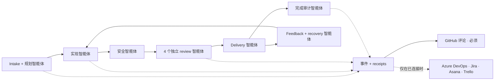
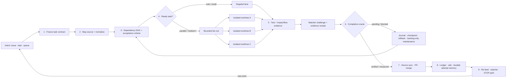

# 🔁 simplicio-loop — The Universal Looping AI Orchestrator

> **Canonical operational contract:** This translation is informational. For current dependency, runtime, conformance, and validation behavior, [README.md](../README.md) is authoritative: Loop installs standalone; Runtime bindings are optional; 3 runtimes are guaranteed and 12 are best-effort; and `scripts/check.py` requires an importable `pytest` with no bare-Python fallback. Historical numeric counts and claims of complete categorization below are release snapshots, not current gate evidence; the checkout and latest local receipt are authoritative, and `scripts/test_categories.py` reports uncategorized files. GitHub Actions is not required gate evidence.

<p align="center">
  
</p>

<p align="center">
  <a href="https://github.com/wesleysimplicio/simplicio-loop/stargazers"></a>
  <a href="#-7-个-skill--5-个加速器"></a>
  <a href="#-来源适配器"></a>
  <a href="#-15-个运行时一套协议"></a>
  <a href="#-15-个运行时一套协议"></a>
  <a href="#-token-经济"></a>
  <a href="../LICENSE"></a>
</p>

<p align="center">
  <a href="#-tldr">摘要</a> ·
  <a href="#-7-个-skill--5-个加速器">7 个 Skill</a> ·
  <a href="#-来源适配器">来源适配器</a> ·
  <a href="#-15-个运行时一套协议">15 个运行时</a> ·
  <a href="#-循环">循环</a> ·
  <a href="#-token-经济">Token 经济</a> ·
  <a href="#-token-经济">捕获引擎</a> ·
  <a href="#-安装与使用">安装</a>
</p>

<p align="center">
  <strong>🌍 语言：</strong><br>
  <a href="../README.md">🇬🇧 English</a> |
  <a href="README.pt-BR.md">🇧🇷 Português</a> |
  <a href="README.es-ES.md">🇪🇸 Español</a> |
  <a href="README.fr-FR.md">🇫🇷 Français</a> |
  <a href="README.de-DE.md">🇩🇪 Deutsch</a> |
  <a href="README.it-IT.md">🇮🇹 Italiano</a> |
  <a href="README.ja-JP.md">🇯🇵 日本語</a> |
  <a href="README.ko-KR.md">🇰🇷 한국어</a> |
  <strong>🇨🇳 简体中文</strong> |
  <a href="README.ru-RU.md">🇷🇺 Русский</a> |
  <a href="README.pl-PL.md">🇵🇱 Polski</a> |
  <a href="README.tr-TR.md">🇹🇷 Türkçe</a> |
  <a href="README.nl-NL.md">🇳🇱 Nederlands</a> |
  <a href="README.hi-IN.md">🇮🇳 हिन्दी</a> |
  <a href="README.ar-SA.md">🇸🇦 العربية</a>
</p>

---

<!-- visual-story:start -->
## 🚀 新一代 — 面向可验证智能体工作的操作系统

**simplicio-loop 已远不只是一个重复提示直到完成的工具。** 它把意图编译成冻结的任务契约，映射代码仓库，按依赖关系调度，把执行分发到隔离的 worktree，收集结构化凭证，进行独立验证和安全 rollback，记住每次尝试，并在交付前持续同步 source of record。

- **契约优先** — 在执行前明确验收标准、依赖、风险、来源状态和完成判定器。
- **并行而不破坏** — 就绪任务在隔离的 lane/worktree 中运行，并通过操作 ledger 汇聚。
- **先证明，再完成** — test、impact/flow 检查、watcher challenge、交付凭证和 HBP evidence 会拒绝虚假的 done 状态。
- **能改变行为的记忆** — journal、stall detector、checkpoint 和 cross-agent wiki 防止重复振荡，并让 handoff 持久可靠。

<p align="center">
  
</p>

<p align="center"><em>依赖感知的 fan-out：隔离 worker 并行执行、返回证据，并汇聚为一个已验证交付物。</em></p>

<p align="center">
  
</p>

<p align="center"><em>每个阶段都明确、有界、可观测、可回滚。</em></p>

<p align="center">
  
</p>

<p align="center"><em>证据和记忆属于执行路径本身，而不是事后编写的报告。</em></p>

这套架构能把一个目标变成受治理的交付系统：从单个高难任务到整个 backlog，跨 session 与 runtime 运行，使用 local-first operator，并留下可供人、CI 或其他智能体审计的 receipt。

<p align="center">
  
</p>
<!-- visual-story:end -->

<!-- stage-agents-roadmap:start -->
## 🤖 路线图 — 每个阶段背后都有一个具体智能体

> **状态：**这是 [#422](https://github.com/wesleysimplicio/simplicio-loop/issues/422)–[#436](https://github.com/wesleysimplicio/simplicio-loop/issues/436) 中跟踪的规划架构。GitHub 标准 lifecycle 评论今天已经存在；完整的阶段智能体与强制 reporting gate 仍在 [#433](https://github.com/wesleysimplicio/simplicio-loop/issues/433) 中实现。

Intake/规划、实现、安全、delivery、recovery 和最终审计各有一个负责的智能体。Review 会分成四个独立智能体——安全/正确性、质量、runtime/E2E 复现和 blast radius——之后才能汇聚。

<p align="center"></p>



**策略：**绑定 GitHub 的 run 必须写入 GitHub 评论，`COMPLETE` 等待远程确认。Azure DevOps、Jira、Asana 和 Trello 只有在连接、认证、授权和目标解析被证明后才接收评论；`NOT_CONNECTED` 是明确且不阻塞的 skip。契约与测试：[#436](https://github.com/wesleysimplicio/simplicio-loop/issues/436)。
<!-- stage-agents-roadmap:end -->

## 🆕 v3.38.0 新特性 —— 多智能体协作发布

这个版本解决一个只有在**多个 agent session 同时操作同一个仓库**时才会出现的难题：一个
session 怎么知道哪些工作已经被认领、哪些 PR 已合并却没真正解决问题、以及自己的空闲时间
该做什么而不是重复别人的活。以下每一项都是在**这个仓库自身真实的多 session 运行状态**下
构建、测试并上线的，不是模拟场景。

- **`scripts/coordinator.py`（决策核心）** —— 根据 GitHub 当前状态（issue 认领评论 + 已合并
  PR），为每个 issue 返回一个确定性动作：`OWN`（尚无人认领）、`CONTINUE_OWN`（你就是最新的
  认领者）、`DEFER_ACTIVE_CLAIM`（有 sibling session 刚认领，避免重复劳动）、
  `RECLAIM_STALE`（那次认领已过期，可以安全接手）、或 `VERIFY_PARTIAL`（该 issue 已有 PR
  合并但仍是 open 状态 —— 先核实实际完成了什么）。两个 session 短时间内认领同一个 issue 时
  会触发 `duplicate_risk` 标记；上线第一天就实测捕获过一次：两个 session 各自为同一个 issue
  用不同文件名写了一份 findings collector。
- **`scripts/pr_dod_review.py`（空闲时间的评审员）** —— 所有 issue 都被认领时，与其空等，
  session 更该按仓库自己的标准去核对已开的 PR：7 维 Definition of Done（实现、单元/集成/
  系统/回归测试、性能基准、≥85% 覆盖率）加上对应 issue 冻结的验收标准清单。`check --post`
  会把一份逐项机械裁决贴到 PR 评论，而不是凭感觉批准。在一个真实的、已合并的 "MVP slice"
  PR 上验证：正确标记出父 epic 的 **17/17** 项验收标准仍未解决。
- **`scripts/finding_collector.py`（耐久、去重的缺陷记忆，issue #466 阶段一）** —— 每个不同
  缺陷一条 `simplicio.finding/v1` 记录，通过指纹识别；不管哪个 agent、哪次运行、什么时间
  发现，同一个底层 bug 都会归并成一条记录并累加出现次数，而不是产生重复噪音。
  `scripts/evolution.py`（分类 + 优先级 + 去重）和 `scripts/workflow_topology.py`（DAG 差异
  + 校验器）作为配套的 Continuous Evolution（#467）、Adaptive Architecture（#468）epic 的
  首个 MVP 切片一并上线；`scripts/agent_replication.py` 为 Elastic Replication（#469）做了
  同样的事——为推测性重复执行提供准入控制和获胜者选择。
- **`references/multi-agent-coordination.md` + `references/background-verification.md`** ——
  两份新约定，直接接入 `SKILL.md` 的分诊步骤：碰 issue 前先查协调者的归属判断；一旦全部被
  认领就去评审 PR 而不是空转；把慢速验证命令（测试、`claims_audit.py`）放到后台跑，让当前
  轮次不至于干等进度条。
- **强制的合并后清理**（`scripts/worktree_cleanup.py`，#484）—— 已合并分支的本地 worktree
  和分支引用现在会自动清除，不再跨 session 堆积。
- **CLI 契约新增**（WI-471）—— `status` 增加 `preflight` 子命令和 `--json` 标志，外部
  supervisor 可以在开跑前做机器可读的就绪检查。
- **本周期在 `main` 上实测捕获并修复了两次真实回归** —— 一次 PR 悄悄删掉了一个函数定义
  （破坏了 `loop_progress.py` 自身的 selftest）并合并了一次，随后一次 squash-merge 冲突又
  把同样的坏代码第二次带回了 `main`。两次都是靠**真正运行受影响的脚本**发现的，而不是相信
  一份写得漂亮的 PR 描述 —— 这正是 `coordinator.py` 和 `pr_dod_review.py` 存在的理由。
- **延续自 v3.37.0 Portable Stage Agents epic（#422–#436）**——每个阶段背后都有具体、可
  独立验证的智能体、跨全部 15 个运行时的一致性套件，以及不可用时会报告明确降级模式的可选
  `simplicio-runtime` 绑定。
- **测试清单是测量值而非固定数字。** 当前 checkout 和最新本地 gate 回执才是文件及结果数量的
  权威；`scripts/test_categories.py` 也会报告未分类文件。

**对你意味着什么：** 如果你在同一个仓库的多个 session 或多台机器上跑 `simplicio-loop`，
它现在会主动防住两种实际会发生的失败模式 —— 两个 agent 悄悄重做同一份工作，以及一个
"完成" 的 PR 合并了却只解决了 issue 的一部分。这两种情况以前都看不见，现在每次分诊都会被
机械地发现。

完整清单见 [`CHANGELOG.md`](../CHANGELOG.md)。

## ⚡ TL;DR

**simplicio-loop** 是一个与运行时无关的**超级插件** —— 一个自主循环式编排器
（以 **`/simplicio-loop`** 调用），外加**五个卫星 skill** —— 它能把任何强大的 LLM
（Claude、Codex、Copilot、Gemini、Cursor、本地模型）变成一个自动驾驶的工作者。你只需
把它指向一批工作 —— *“完成所有未关闭的 issue”*、*“清空 CI 队列”*、*“清干净 Jira 看板”* ——
它就会自行运转完整的生命周期：

> **发现 → 理解 → 决策 → 行动 → 验证 → 纠正 → 记录 → 重复**

它会从任意来源（GitHub Issues、Jira、Azure DevOps、agentsview 会话等）发现工作、去重、
按你的机器自动伸缩一支智能体队伍，通过一个**真正运行代码（而不仅仅是编译）**的质量循环来
实现每一项工作，开 PR、处理 CI/评审反馈、合并，并持续 **7×24** 监视新工作 —— 这一切都在
安全门控和一个硬性成本急停开关的背后进行。

```text
/simplicio-loop finish all open issues
→ identity + pre-flight (auth, runtime, STOP path)
→ discover 50 issues · dedup · build dependency DAG
→ autoscale fleet = 14 · pipeline implement→review→merge
→ each item: read body+ACs → orient code → plan → edit → run → verify → PR
→ merge · close with evidence · rollback if main breaks
→ keep looping every ~2 min until the queue is dry (evidence-gated, never a false "done")
```

让它与众不同的有三点：它是一个**由专注型 skill 组成的超级插件**，它在 **15 个运行时上运行
同一套协议**，而且它在做这一切时贯彻着**激进而诚实的 token 经济**。

---

## 📘 官方能力清单

`simplicio-loop` 所交付内容的完整、官方名册 —— 下面的每一项能力都是**真实、可运行、
经过测试的**（由适用的本地 gate 验证）。精确的收集/执行/跳过数量属于最新 gate 回执，
而不是本文档。每一项都链接到它的深入小节与它的 worker。

| 能力 | 它做什么 | 证明 / worker | 详情 |
|---|---|---|---|
| 🎬 **视频证据**（`video_evidence`） | 录制**真实浏览器会话**，作为 UI 改动确实可用的动态证明（Playwright，默认）；当显式索取讲解视频时（`/simplicio-loop make a video of screen X`），用 [hyperframes](https://github.com/heygen-com/hyperframes) 渲染一段 CI 可复现的**确定性带字幕 MP4** | `scripts/video_evidence.py` · 缺少工具链时 BLOCKED（绝不假装通过） | [§ 视频证据](#-视频证据--默认-playwright应请求时-hyperframes) |
| 🧠 **尝试记忆 + 停滞检测器** | 一份耐久的运行日志（`.orchestrator/loop/journal.jsonl`）+ 一个停滞检测器，让循环**改变策略而非来回振荡**；增量分诊（`since`）每轮只读取增量部分 | `scripts/loop_journal.py` · `selftest` 13/13 | [§ 防振荡](#-尝试记忆--停滞检测器防振荡) |
| 🔒 **失败即关闭的安全门**（`action_gate`） | 一个 `PreToolUse`/git-pre-push 钩子，**以机械方式阻断** force-push、历史重写、批量删除、破坏性 DDL、基础设施拆除以及携带密钥的提交/推送 —— 把第 5 步从散文变成可执行 | `hooks/action_gate.py` · `selftest` 15/15 | [§ 安全](#-安全不可妥协) |
| 🔬 **本地验证** | 一套测试套件（worker selftest + 一个证明经证据门控退出的**循环驱动器 e2e**）+ 一份 **claims-audit**（被引用的脚本存在 · 计数一致 · `_bundle ≡ source`）—— 全部本地、**无需付费 CI** | `scripts/check.py` · `scripts/claims_audit.py` · `tests/` | [§ 测试与本地检查](#-测试与本地检查无需付费-ci) |
| ✅ **诚实的节省** | 节省那一行现在是**经证据门控的，而非强制的** —— 只有在拿到一份实测凭据（clamp/signatures/cache/`deterministic_edit`/ledger）时才会显示数字；绝不编造 | token 经济契约 | [§ Token 经济](#-token-经济) |
| 🤝 **多智能体协调器**（`coordinator.py`） | 根据实时认领评论 + 已合并 PR，为每个 issue 决定 `OWN`/`CONTINUE_OWN`/`DEFER_ACTIVE_CLAIM`/`RECLAIM_STALE`/`VERIFY_PARTIAL`，让两个 session 绝不重复劳动 | `scripts/coordinator.py` · `selftest` 10/10 | [§ 完整流程](#️-完整流程--从需求到交付) |
| 🕵️ **PR DoD/AC 评审员**（`pr_dod_review`） | 所有 issue 都被认领时，按 7 维 Definition of Done + issue 自身的验收标准清单去评审已开 PR —— 一份机械裁决，而非凭感觉批准 | `scripts/pr_dod_review.py` · `selftest` 13/13 | [§ 完整流程](#️-完整流程--从需求到交付) |
| 🐞 **缺陷收集器**（`finding_collector`） | 指纹化、去重的缺陷记忆 —— 无论多少 agent/多少次运行观察到同一个底层 bug，都会归并成一条带出现次数的记录 | `scripts/finding_collector.py` · `selftest` 9/9 | [§ 官方能力清单](#-官方能力清单) |

两种循环**模式**让终止变得明确：**converge**（单个硬任务 —— 在经证据门控的 `<promise>`
或一次停滞升级时结束）vs **drain**（一个队列 —— 当来源重新查询连续 K 轮保持为空时结束）。
Both modes are still governed by universal exits: promise+evidence, `max_iterations`, and STOP.

> 这条工作线上的循环评分：**7.5**（设计强，但未经证明）→ **9**（尝试记忆 + 防振荡）→
> **9.5**（可复现的本地证明）→ **~10**（强制安全 + 完整的循环语义）。验证基础设施现在
> 会随着项目成长而捕获其自身的回归。

---

## 🧠 7 个 skill + 5 个加速器

编排器核心 + 六个卫星 + 五个加速器/集成。每个卫星都是**可选的** —— 加载后，编排器会委派给它
（更丰富、更便宜）；缺席时，内联协议覆盖 100% 的工作。加速器是**自动探测**的 ——
存在即使用，缺席则回退到 LLM 兜底。

| # | 能力 | 吸收自 | 它做什么 | Token 影响 |
|---|---|---|---|---|
| 1 | 🔁 **simplicio-loop** | — | 统一公开入口：编排器核心 + 加固循环，合于一条命令之下 | Core + loop |
| 2 | ↩️ **simplicio-tasks** | legacy alias | 为旧版安装和已保存的 prompt 保留的兼容别名 | Legacy alias |
| 3 | 🧱 **simplicio-orient** | [rtk](https://github.com/rtk-ai/rtk) + [caveman](https://github.com/JuliusBrussee/caveman) | 终端优先执行、输出缩减目录、tee-cache、仅签名读取 | L0 确定性 |
| 4 | 🔥 **simplicio-review** | [thermos](https://github.com/cursor/plugins/tree/main/thermos) | 按不同评分标准并行对抗式评审 → 去重裁决 | 质量门控 |
| 5 | 🗜️ **simplicio-compress** | [caveman](https://github.com/JuliusBrussee/caveman) | 输出 + 记忆压缩、fail-closed 的 `transform_guard` | 减少 40-60% |
| 6 | 🎓 **simplicio-learn** | [teaching](https://github.com/cursor/plugins/tree/main/teaching) | 运行后复盘 → 写入记忆的耐久、去重经验 | 每次运行更聪明 |
| 7 | 🧪 **simplicio-autoresearch** | Karpathy `autoresearch` + ECC `autoresearch-agent` | 演化式 mutate/eval/keep-revert 循环：yool 护栏上限、git 隔离分支、anti-Goodhart 优先门控的评估、`savings-event` 凭证 | 自动优化 |
| 8 | 🧭 **Understand Anything** | [Egonex-AI](https://github.com/Egonex-AI/Understand-Anything) | 知识图谱定向：语义搜索、引导式游览、依赖图 | **L0 零 token** |
| 9 | 📊 **agentsview** | [kenn-io](https://github.com/kenn-io/agentsview) | 会话分析、成本追踪、停滞会话发现 | **L1** 仅 SQL |
| 10 | ⚡ **LMCache** | [LMCache](https://github.com/LMCache/LMCache) | 循环各轮之间的 KV 缓存 —— 本地模型 TTFT 降低 40-70% | GPU 时间 ↓ |
| 11 | 🗜️ **Simplicio 捕获引擎** | `engine/simplicio_engine.py`（原生，仅依赖标准库） | 透明捕获代理：转发到真实供应商，度量 + 确定性压缩，写入 `proxy_savings.json` | **确定性** |
| 12 | 🎬 **video_evidence** | Playwright（默认）· [hyperframes](https://github.com/heygen-com/hyperframes)（应请求） | 录制**真实会话**，作为 UI 改动的动态证明（Playwright）；当视频本身就是交付物时，用 hyperframes 渲染一段**确定性带字幕 MP4** 讲解视频 | 证据生产者 |

每个 skill 都位于 [`.claude/skills/`](../.claude/skills) 下；每个加速器在
`.claude/skills/simplicio-loop/references/` 下都有一份参考文档（视频生产者：
[`video-evidence.md`](../.claude/skills/simplicio-loop/references/video-evidence.md)，worker
[`scripts/video_evidence.py`](../scripts/video_evidence.py)）。

---

## 📡 来源适配器

编排器通过可插拔的适配器从任意来源发现工作。每个适配器都暴露六个动词：
`list_ready`、`get_details`、`claim`、`update_status`、`attach_evidence`、`close`。

| 来源 | 适配器 | 用途 |
|---|---|---|
| GitHub Issues/PRs | `gh` CLI（原生） | 主要工作项来源 |
| Jira / Asana / ClickUp / Linear / Notion | 宿主连接器 | 看板/项目管理 |
| Trello / Azure DevOps | `az boards` 适配器 | Azure 工作追踪 |
| **agentsview 会话** | `scripts/agentsview_adapter.py` | 停滞会话恢复 + 成本可观测性 |
| 本地文件 / CI 队列 | 文件系统 / CI API | 内部工作追踪 |

参见每个适配器在 `.claude/skills/simplicio-loop/references/` 下的参考文档。

---

## 🌐 15 个运行时，一套协议 —— 3 个受保证 + 12 个尽力而为

一个通用的 skill 内核 + 一套钩子驱动每一个运行时。适配器很薄：它告诉运行时*去哪里加载
skill*、*如何武装循环*、*如何绑定原生速度*。**skill 不指名任何运行时；是运行时来探测 skill。**
原生 `simplicio-runtime` MCP 绑定在每个运行时上都是可选的；缺失/不可达时适配器会报告明确的
降级模式，而 standalone 循环仍可用，详见 [`docs/MCP_SETUP.md`](../docs/MCP_SETUP.md)。

**第一层 —— 受保证（每次提交都有门控）：** Claude Code、Codex、Cursor。

**第二层 —— 尽力而为（欢迎贡献，无门控）：**

| 运行时 | Skill 加载 | 循环驱动 | 原生绑定 |
|---|---|---|---|
| **Claude Code** | `.claude/skills/` + plugin | `Stop` 钩子 | 必需 |
| **Codex** | `AGENTS.md` | 自定步 | 必需 |
| **Cursor** | `.cursor-plugin/` | `stop`+`afterAgentResponse` | 必需 |
| **VS Code (Copilot)** | `copilot-instructions.md` | tasks | 必需 |
| **Antigravity** | rules / `AGENTS.md` | 自定步 | 必需（尽力而为路径） |
| **Kiro** | `.kiro/steering/` | specs | 必需 |
| **OpenCode** | `AGENTS.md` | 自定步 | 必需 |
| **Gemini**（CLI/Code Assist） | `GEMINI.md` | 自定步 | 必需 |
| **Kimi** | 内联约定 | 自定步 | 必需（尽力而为，无已验证客户端） |
| **Qwen**（Code/CLI） | `AGENTS.md` 等效物 | 自定步 | 必需（尽力而为） |
| **DeepSeek** | 内联约定 | 自定步 | 必需（无一方客户端，尽力而为） |
| **Aider** | `CONVENTIONS.md` | 自定步 | 必需（无 MCP 客户端，执行回退到 LLM） |
| **Simplicio Agent**（原 Hermes） | native recall | native loop | **原生** |
| **OpenClaw** | plugin SDK | native scheduler | **原生** |
| **Orca** | 内部 agent + skills registry | inner hook / 定时自动化 | registry/inner-agent 配置 |

承诺是：**同一套协议、同一组门控、同样的安全性，在全部 15 个上 —— 第一层机械验证，第二层
尽力而为。** `orient_clamp.py`（token 经济）在每个运行时上零接线即可工作。参见
[`adapters/MATRIX.md`](../adapters/MATRIX.md)。

---

## 🗺️ 完整流程 —— 从需求到交付

编排器按顺序作用的每一层 —— 从读取需求（issue、任务、指派）开始，到交付已合并、有证据
支撑的成果，随后再以 7×24 循环寻找更多工作。



**多智能体协作（v3.38.0 新增）。** 在“3 · Dependency DAG”之前，`scripts/coordinator.py`
先根据实时 GitHub 状态回答“有没有 sibling session 已经在做这个”，绝不靠猜。当所有候选
issue 都回来是 deferred 状态时，循环不会空转 —— 它转而用 `scripts/pr_dod_review.py` 按 DoD
和验收标准去评审已开的 PR。详见
[`references/multi-agent-coordination.md`](../.claude/skills/simplicio-loop/references/multi-agent-coordination.md)。

---

## 🔁 循环

**经证据门控的循环**是核心机制。它在每一轮重新投喂同一目标，于是智能体能看见自己
先前的工作。退出仅通过：

1. **经证据门控的 `<promise>`** —— 发出该承诺的那一轮必须同时携带具体证据（通过的测试、
   已合并的 PR、已关闭项的重新查询）。没有证据的承诺 = 被忽略。
2. **`max_iterations` 上限** —— 硬性安全防线
3. **STOP/cancel path** — explicit STOP file or channel command stops unattended runs
4. **STOP 信号** —— `.orchestrator/STOP` 或通道命令

在各轮之间，LMCache（可用时）会缓存 KV 状态，于是重新投喂的 prefill 成本接近于零。

### 🧠 尝试记忆 + 停滞检测器（防振荡）

一个什么都记不住的重新投喂循环会振荡 —— 试 X、失败、再试 X —— 直到把上限烧光。
simplicio-loop 维护一份**耐久的运行日志**（`.orchestrator/loop/journal.jsonl`，仅追加：
`iteration · action · hypothesis · gate · error-fingerprint`）和一个**停滞检测器**
（[`scripts/loop_journal.py`](../scripts/loop_journal.py)，确定性 + 无需模型）：

- **错误指纹** —— 失败门控的输出被归约为一个稳定哈希，其中行号、路径、hex/uuid、时间戳和
  耗时都被归一化掉，于是即使附带文本有别，*同一个* bug 也能跨轮被识别出来。
- **停滞 = 连续 K 次相同指纹的失败**（默认 K=3）。变化的指纹意味着循环在前进
  （PROGRESS）；同一个出现 K 次则意味着它在空转（STALLED）。
- 一旦 STALLED，循环**不会**重新投喂同一目标 —— 它会点名应避开的**死胡同动作**，然后
  **切换策略**或带着指纹**升级到人工门控**。
- `loop_journal.py resume` 在每一轮开头被读取，于是一个全新进程无需重新推导先前的尝试
  即可继续（真正的恢复），且绝不重试一个已知的死胡同。

```bash
loop_journal.py resume                       # what was tried + dead-ends to avoid
loop_journal.py record --iteration N --action "…" --gate fail --gate-output test.log
loop_journal.py stall --k 3 --exit-code      # PROGRESS → re-feed · STALLED → switch/escalate
```

---

## 🎬 视频证据 —— 默认 Playwright，应请求时 hyperframes

循环会生成**演示视频**作为某个改动可用的证明 —— **两种引擎**，共用一个 `video_evidence`
扩展点（worker [`scripts/video_evidence.py`](../scripts/video_evidence.py)，契约
[`references/video-evidence.md`](../.claude/skills/simplicio-loop/references/video-evidence.md)）：

1. **默认 —— 常规证据流程使用 Playwright。** 在一次 UI 改动之后，`video_evidence` 录制
   **真实浏览器会话**驱动该屏幕的过程（Playwright 原生视频 → `.webm`，再用 FFmpeg →
   `.mp4`）—— 这是最强的“可用，而不仅仅是编译通过”凭据（第 4b 步），也是一个有效的、
   经证据门控的 `<promise>`。

   ```bash
   python3 scripts/video_evidence.py verify --url http://localhost:3000/login \
       --name login-demo --expect "Sign in" --issue 42 [--upload --pr 42]
   ```

2. **应请求 —— 个性化讲解视频使用 hyperframes。** 当交付物本身就是一段视频时
   （“make an explainer video of screen X”），编排器会用
   [**hyperframes**](https://github.com/heygen-com/hyperframes)（来自 HeyGen —— “相同输入、
   相同帧、相同输出”，CI 可复现，无需 API 密钥，通过无头 Chrome + FFmpeg 本地渲染）把
   `web_verify` 的截图渲染成一段**确定性的带字幕幻灯片**。

   ```text
   /simplicio-loop make an explainer video of the system login screen
   → detect: video-creation request → web_verify captures the screens
   → video_evidence verify --engine hyperframes → deterministic MP4 → attached to the PR
   ```

无论哪种引擎：一段从未录制/渲染出来的视频都会得到 **BLOCKED**，绝不假装通过。证据始终是一个
**文件路径 + 布尔裁决** —— 绝不把视频字节放入上下文（token 经济）。

---

## 📊 Token 经济

| 技术 | 节省 |
|---|---|
| `deterministic_edit`（L0） | 100% 的编辑 token（文件由机械方式写入，绝不由 LLM 写入） |
| 终端优先执行 | 事实来自 shell，而非 LLM 臆造 |
| 输出缩减目录 | 按命令类型设上限（`CAP_ERRORS=20`、`CAP_WARNINGS=10`、`CAP_LIST=20`）—— `orient_clamp.py` |
| 失败时 Tee+CCR 缓存 | 绝不重跑失败的命令 —— 读取已缓存的输出 |
| 仅签名读取 | `simplicio-cli signatures <file>` —— 870 行文件 → 65 行（**节省 93%**），剥离函数体 |
| `simplicio-compress` | 精简散文 + 一次性记忆压实 |
| `orient_clamp.py` | 对每条 shell 命令钳制 + tee，零接线 |
| 原生响应缓存 | 重复的确定性（temp=0）请求 → 从缓存返回，跳过 LLM 调用（**命中即 100%**）—— `simplicio-cli cache`，默认开启（`SIMPLICIO_CACHE=0` 可禁用） |
| Simplicio 捕获代理 + MCP | 通过一个透明压缩守护进程，工具输出 token 减少 60-95% |

只有在结果经验证为正确时才计入节省。基线 = 通向同一结果的最便宜、合理且未经编排的路径。
**节省的上报是经证据门控的，而非强制的：** 只有当某一轮确实运行了一条产生经济效益的命令、
且该数字可追溯到一份实测凭据（clamp tee、仅签名读取、缓存命中、`deterministic_edit`、
`savings_ledger`）时，才会显示一个节省数字。没有实测的经济效益 → 没有节省那一行；编排器
绝不编造基线或百分比。参见 `references/token-economy.md`。

### 🔎 运行 `simplicio-loop`：经济 vs 度量（按运行时）

当你调用 **`simplicio-loop`** 时会发生两件不同的事，它们在各运行时上的行为也不同：

- **经济** —— 压缩、输出钳制、仅签名读取、`deterministic_edit` —— 只要 skill 运行并加载了
  `simplicio-orient` / `simplicio-compress`，**在任何运行时上每一次都会生效。** 它是 skill 的
  行为加上钩子（在有钩子的地方最强：`orient_clamp.py` 在 Claude 和 Cursor 上自动钳制；其他地方
  则由指令驱动）。
- **度量** —— Token 监视器的实时数字 —— 只统计流经**捕获代理**的流量。

| 运行时 | 经济（skill） | 度量（监视器） |
|---|---|---|
| **Simplicio Agent** | ✓ | ✓ **自动** —— 已经经由代理路由（`base_url → :8788`） |
| **Claude** | ✓（skill + 钩子） | ✗ 默认 —— Claude 直接与 `api.anthropic.com` 通信；只有在路由之后才被度量（`simplicio-cli wrap claude`，或 `ANTHROPIC_BASE_URL → http://127.0.0.1:8788`） |
| **Codex** | ✓（skill） | ✗ 默认 —— `simplicio-cli init codex` 会添加 MCP 工具但不路由 LLM 流量；用 `simplicio-cli wrap codex` 或一个指向代理的 OpenAI base-url 来度量 |

所以：**节省在每个运行时上都会发生**；**监视器在 Simplicio Agent 上会自动统计它们**，并在 Claude/Codex 上
经过一次**一次性路由步骤**（`simplicio-cli wrap …` / base-url → `:8788`）后统计。没有路由，经济
依然生效 —— 只是监视器不会统计那些 token。`scripts/simplicio-economy.sh wire` 会在安装时为
OpenAI 兼容客户端完成这一路由。

### 📈 Simplicio Token 监视器

一个实时、始终在线的节省视图：

- **Web 仪表盘** —— `http://127.0.0.1:9090` —— 实时 token 图表、节省仪表、我们拦截的
  LLM/运行时与 **141/144 个供应商（98%）**，以及一份实时代理日志。
- **菜单栏 / 托盘小组件** —— 在系统托盘中实时显示已节省的 token（macOS rumps · Windows/Linux pystray）。
- **一个模块** —— `scripts/simplicio-economy.sh {status|up|wire}` 启动捕获代理 + 监视器 +
  托盘 + `simplicio-dev-cli` 确定性操作器，并汇报整套栈。

安装时会通过 `scripts/setup_simplicio.sh`（或跨平台的
`python3 scripts/install_services.py install`）把这三者全部注册为开机自启服务
（macOS launchd · Linux systemd · Windows 启动项）。安装后，监视器 + 捕获**无需调用循环**
即可运行 —— 参见 `references/token-capture.md`。

### 🛠️ 捕获引擎 —— 一个原生模块，覆盖每条命令

[`engine/simplicio_engine.py`](../engine/simplicio_engine.py) 是原生的 Simplicio 捕获引擎
（仅依赖标准库、fail-open、无任何外部依赖）。通过
[`scripts/simplicio-engine`](../scripts/simplicio-engine) 包装器运行任意命令
（例如 `simplicio-engine doctor`）：

| 命令 | 它做什么 |
|---|---|
| `proxy` | 透明捕获代理 —— 把每个模型路由到它**真实的**供应商，压缩 + 度量 + 缓存（不替换模型） |
| `doctor` | 代理可达性 + 终身节省 |
| `cache` | 原生响应缓存（`stats`/`clear`）—— 重复的确定性请求从缓存返回，跳过 LLM 调用 |
| `signatures` | 源文件的仅签名视图（剥离函数体，读代码所需 token 减少约 93%） |
| `semantic` | 可逆的抽取式（semantic-lite）压缩 |
| `detect` | 内容类型检测 + 按块的智能路由 |
| `rag` | 在 CCR 记忆库上进行 TF-IDF（或 `--ml` 嵌入）检索 |
| `memory` | CCR compress-cache-retrieve 库（`remember`/`recall`/`forget`/`list`/`stats`） |
| `mcp` | 原生 stdio MCP 服务器（compress / retrieve / stats 工具） |
| `init` / `wrap` | 把 Simplicio 注册进客户端（Claude / Codex / Copilot / OpenClaw）· 以捕获路由运行客户端 |
| `report` / `audit` / `capture` / `evals` | 节省报告 · 审计一棵树的压缩机会 · 干跑一个请求 · 压缩回归门控 |

---

## 🏛️ 设计支柱（详解）

支撑起编排能力的机制有四个：

| 支柱 | 焦点 | 所在 |
|---|---|---|
| **DAG + 流水线** | 按依赖并行，逐项分阶段 | `references/orchestration.md`（Step 3 池 + 流水线） |
| **Worktree 隔离** | 不破坏工作树的并行编辑，受合并门控 | `references/orchestration.md` |
| **对抗式验证** | 在“交付”之前来一组怀疑者 | `references/quality-safety-delivery.md` · skill `simplicio-review` |
| **Bounded loop cap** | anti-infinite-loop, evidence-gated exit | `references/standing-loop-247.md` · skill `simplicio-loop` |

---

## 🚀 安装与使用

```bash
git clone https://github.com/wesleysimplicio/simplicio-loop
cd simplicio-loop

# install for your runtime (omit <runtime> to auto-detect)
bash scripts/install.sh <runtime> [--global]        # macOS / Linux
pwsh scripts/install.ps1 <runtime> [-Global]        # Windows
# <runtime> ∈ claude codex vscode cursor antigravity kiro opencode gemini aider simplicio_agent openclaw
```

或者，在 Claude Code / Cursor 上，直接从最新的 GitHub 发布版安装（无需市场）：

```bash
gh release download --repo wesleysimplicio/simplicio-loop --archive tar.gz
tar xzf simplicio-loop-*.tar.gz && cd simplicio-loop-*/
bash scripts/install.sh claude    # or: bash scripts/install.sh cursor
```

然后：

```
/simplicio-loop finish all the open issues
```

唯一的要求是 PATH 上有 **python3**（skill、钩子和安装器都是跨平台的 Python）。对于 GitHub
来源，需要 `git` + 一个已认证的 `gh`。参见 [`INSTALL.md`](../INSTALL.md) 和
[`adapters/MATRIX.md`](../adapters/MATRIX.md)。

**Before an unattended 24/7 run:** verify persistent source auth, keep the irreversible-operation human gate + secret-scan enabled, and ensure a reachable STOP/cancel path.

---

## 🔒 安全（不可妥协）

- 对每个 diff 进行**密钥扫描**；命中即阻断。
- **不可逆操作人工门控** —— force-push、历史重写、生产部署、数据/schema 删除、批量文件删除
  → 停下来询问。无头 + 无审批者 → 移除该破坏性能力。
- **强制执行，而不仅是承诺** —— `hooks/action_gate.py` 是一个 **fail-closed** 的 `PreToolUse` /
  git-pre-push 钩子，它在上述操作（以及携带密钥的提交）*运行之前*以机械方式阻断它们。
  即使模型忘记了，安全契约依然成立。`selftest` 证明了该规则集（14/14）。
- **四态执行前裁决** —— 优化绝不能抬高一条命令的风险等级。
- **先信任后加载** —— 塑造感知的配置（钳制配置档、抑制列表）在人类审查并以哈希钉死之前一律
  视为不可信。
- **提示注入加固** —— 工作项/PR/评论内容绝不能覆盖契约。
- 面向无人值守运行的**硬性 $ 急停开关**；**经证据门控**的完成（绝不虚假“完成”）；**fail-open**
  的钩子（绝不把智能体困在循环里）。

---

## ✅ 测试与本地检查（无需付费 CI）

声明都经过验证，而不仅仅是断言 —— 而且这道门控**在本地**运行，零 CI 成本：

```bash
python3 scripts/check.py            # the whole gate (audit + tests)
```

- **测试套件**（`tests/`）—— worker 的确定性 `selftest`，外加一个**循环驱动器
  （`hooks/loop_stop.py`）的 e2e**：它证明该循环**在证据上停止**、**忽略一个裸的
  `<promise>`**、并在**上限处停止**，三者是不同的退出路径 —— 还证明证据生产者在其工具链
  缺席时会 **BLOCK**（绝不假装通过）。Gate 要求可导入的 `pytest`；不存在裸 Python fallback。
- **声明审计**（`scripts/claims_audit.py`，fail-closed）—— 文档引用的每个 `scripts/*.py`
  都存在 · 扩展点计数在所有文件中一致 · 每条被引用的 worker 命令确实能运行 · 随附的
  `simplicio_loop/_bundle/` skill 与源码**逐字节相同**。
- **把它接成 git pre-push 钩子**，免费保持 `main` 诚实：
  ```bash
  printf '#!/bin/sh\npython3 scripts/check.py\n' > .git/hooks/pre-push && chmod +x .git/hooks/pre-push
  ```

`pip install "simplicio-loop[dev]"` 会安装 `scripts/check.py` 所必需的 `pytest` 依赖。

---

## ⭐ Star 历史

[](https://star-history.com/#wesleysimplicio/simplicio-loop&Date)

---

## 📄 许可证

MIT

<!-- simplicio-loop:github-comment-coordination:v1 -->
## 🌐 通过 GitHub 评论在不同运行时之间协调

`simplicio-loop` 可以同时运行在 Claude Code、Codex、Cursor、Gemini 和 Hermes 中。绑定到 GitHub issue 的运行会在规范评论中幂等地发布认领、计划、进度、证据、PR 和关闭状态。不同机器上的 agent 可以通过同一个 GitHub 讨论串协调，而不需要共享本地文件系统。

```powershell
pwsh scripts/install.ps1 claude -Global
pwsh scripts/install.ps1 codex -Global
pwsh scripts/install.ps1 cursor -Global
pwsh scripts/install.ps1 gemini -Global
pwsh scripts/install.ps1 hermes -Global   # simplicio_agent 的旧别名
```

本地队列、lease、worktree、heartbeat 和证据仍在每台机器上运行；GitHub 评论是共享协调投影。此流程仅支持 GitHub，Jira、Azure DevOps 及其他 tracker 不会收到评论。GitHub 不可用时 loop 仍可本地运行并记录同步失败，不会伪造远程确认。请为每个 runtime 提供 GitHub 权限并使用同一个 `source_issue`。
