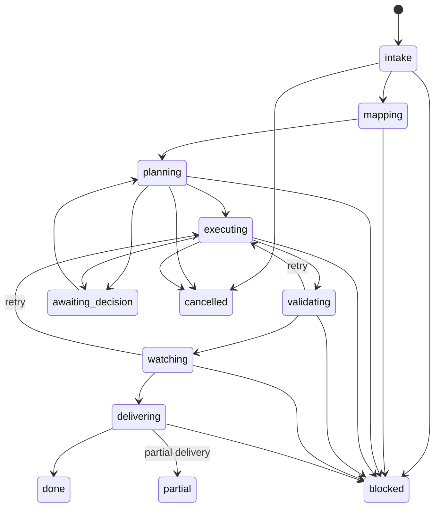

# Loop phase/event contract

`simplicio_loop.phase_events` is the transport-neutral contract for the Loop →
Runtime → Execution Board flow (`simplicio.loop-event/v1`). The Loop emits a
typed transition; Runtime derives the board state. The Loop never writes a
cosmetic board column.

## Envelope

Every event carries `run_id`, `work_item_id`, `sequence`, `event_id`, `actor`,
`cause`, `causation_id`, `reason_code`, `from_phase`, `to_phase`, and the
contract version. `attempt_id` is included for work performed by an agent. A
consumer can validate and replay the same envelope from a local JSONL journal,
a remote Runtime, or an imported offline buffer.

```json
{"schema":"simplicio.loop-event/v1","contract_version":"1","event_id":"e-2","sequence":2,"run_id":"run-1","work_item_id":"wi-1","attempt_id":"attempt-1","actor":"claude@host-b","cause":"e-1","causation_id":"e-1","reason_code":"mapping_complete","from_phase":"mapping","to_phase":"planning","board_state":"planned","payload":{}}
```

## State machine



`reconcile_events()` sorts by sequence, accepts exact duplicate event IDs, and
rejects conflicting duplicates or sequence gaps. That makes offline replay
idempotent without guessing through a crash or provider handoff.

```python
from simplicio_loop.phase_events import build_phase_event, reconcile_events

first = build_phase_event(
    run_id="run-1", work_item_id="wi-1", actor="codex@host-a", cause="operator",
    sequence=1, event_id="e-1", from_phase=None, to_phase="intake",
)
second = build_phase_event(
    run_id="run-1", work_item_id="wi-1", actor="claude@host-b", cause="e-1",
    sequence=2, event_id="e-2", from_phase="intake", to_phase="mapping",
)
events = reconcile_events([second, first, first])
```

The canonical implementation and tests are `simplicio_loop/phase_events.py` and
`tests/test_phase_events.py`.

## GitHub lifecycle projection (#285)

When a run is bound to a GitHub source issue (`run state.source_issue = {"owner",
"repo", "issue"}`), the runner's
per-event hook `simplicio_loop.runner._sync_github_lifecycle()` projects each emitted
phase event, by default, onto the **single canonical GitHub lifecycle comment** of that issue (the
`simplicio-loop:lifecycle-status:v1` marker, rendered by
`simplicio_loop.github_lifecycle.render_lifecycle_comment` / `publish_lifecycle_state`).
This coordination-comment flow is GitHub-only; set
`SIMPLICIO_LOOP_GITHUB_LIFECYCLE_SYNC=0` only for an intentional offline/legacy run.

The projection is a translation table, not a second source of truth: the GitHub
issue/comment is re-read before and after every write, and a publish is only
reported `verified` when the observed comment body hash matches the rendered body
(see `publish_lifecycle_state`). Mapping is done by
`github_lifecycle.lifecycle_state_for_phase_event(kind)` over these keys:

| phase-event `kind` | canonical lifecycle state |
|---|---|
| `intake` | `DISCOVERED` |
| `worker_claimed` | `CLAIMED` |
| `planning` / `mapping` | `PLANNED` |
| `executing` | `IN_PROGRESS` |
| `validating` / `watching` / `watcher_challenge` | `VERIFYING` |
| `blocked` | `BLOCKED` |
| `awaiting_decision` | `AWAITING_DECISION` |
| `delivering` | `PR_OPEN` |

Event kinds with no entry (`done`, `partial`, terminal) return `None` and are not
auto-projected — the authoritative, fail-closed close is `github_lifecycle.close_source_issue`,
invoked explicitly at completion time, never from this per-event hook.

**Discipline.** The hook is best-effort and fail-open: any failure (missing `gh`,
network error, transport error, import error) is appended to
`lifecycle-sync-errors.jsonl` under the run directory and swallowed — this sync
never aborts or fails the run. The close path is separate and fail-closed: if the
source closes but the final comment update can't be confirmed, `close_source_issue`
returns `CLOSE_PENDING_RECONCILIATION` and the run-dir lifecycle receipt
(`github_lifecycle.persist_lifecycle_receipt`) is what gates `oracle.evaluate_completion`
from declaring `COMPLETE` until reconciliation. This keeps the loop's event contract
(above) transport-neutral while the GitHub projection remains an optional, recoverable
side-effect, exactly as the issue's "Lease é autoridade; comentário é projeção"
principle requires.
