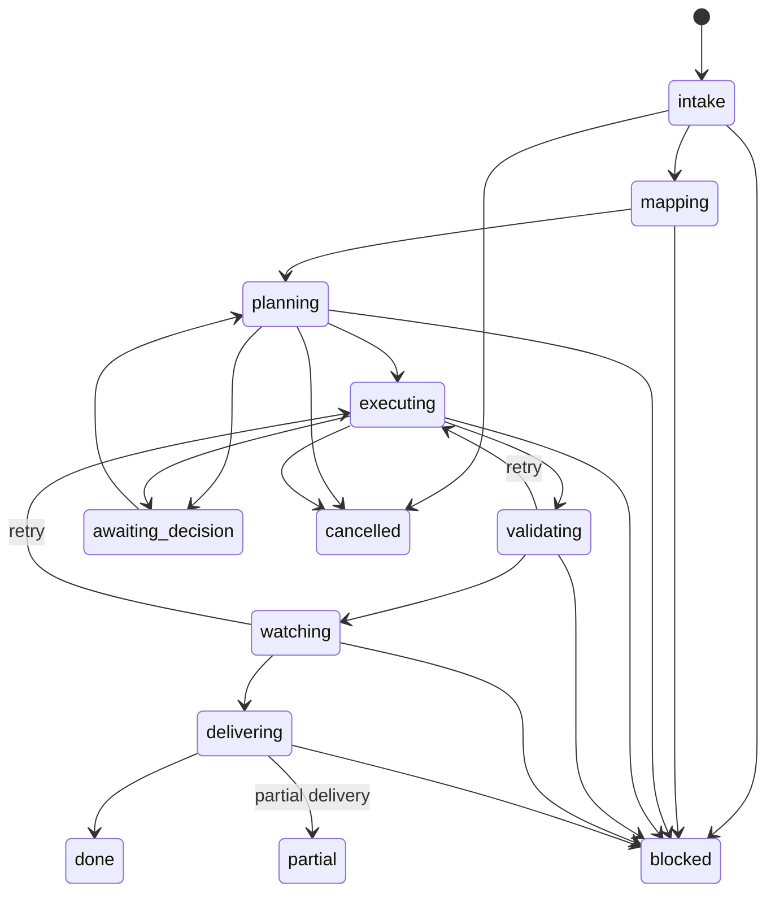

# Loop phase/event contract

`simplicio_loop.phase_events` is the transport-neutral contract for the Loop →
Runtime → Execution Board flow (`simplicio.loop-event/v1`). The Loop emits a
typed transition; Runtime derives the board state. The Loop never writes a
cosmetic board column.

## Envelope

Every event carries `run_id`, `work_item_id`, `sequence`, `event_id`, `actor`,
`cause`, `causation_id`, `reason_code`, `from_phase`, `to_phase`, and the
contract version. `attempt_id` is included for work performed by an agent. A
consumer can validate and replay the same envelope from a local JSONL journal,
a remote Runtime, or an imported offline buffer.

```json
{"schema":"simplicio.loop-event/v1","contract_version":"1","event_id":"e-2","sequence":2,"run_id":"run-1","work_item_id":"wi-1","attempt_id":"attempt-1","actor":"claude@host-b","cause":"e-1","causation_id":"e-1","reason_code":"mapping_complete","from_phase":"mapping","to_phase":"planning","board_state":"planned","payload":{}}
```

## State machine



`reconcile_events()` sorts by sequence, accepts exact duplicate event IDs, and
rejects conflicting duplicates or sequence gaps. That makes offline replay
idempotent without guessing through a crash or provider handoff.

```python
from simplicio_loop.phase_events import build_phase_event, reconcile_events

first = build_phase_event(
    run_id="run-1", work_item_id="wi-1", actor="codex@host-a", cause="operator",
    sequence=1, event_id="e-1", from_phase=None, to_phase="intake",
)
second = build_phase_event(
    run_id="run-1", work_item_id="wi-1", actor="claude@host-b", cause="e-1",
    sequence=2, event_id="e-2", from_phase="intake", to_phase="mapping",
)
events = reconcile_events([second, first, first])
```

The canonical implementation and tests are `simplicio_loop/phase_events.py` and
`tests/test_phase_events.py`.
